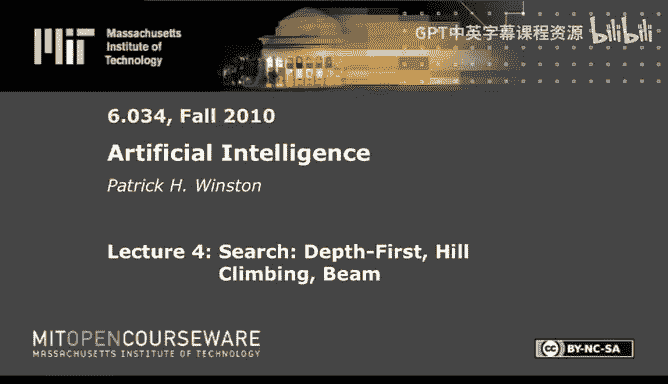
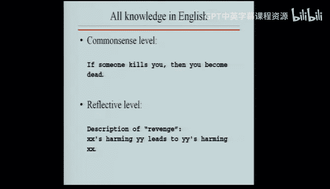
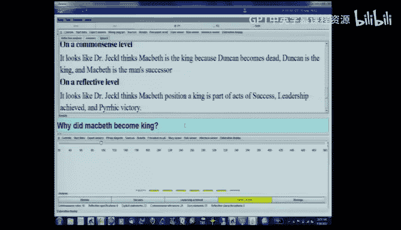

# 4：搜索算法（深度优先、爬山法、束搜索）🔍




在本节课中，我们将要学习几种基础的搜索算法。搜索不仅是关于地图路径规划，更是一种关于**选择**的通用问题解决模型。我们将从最简单的“英国博物馆算法”开始，逐步介绍深度优先搜索、广度优先搜索，以及引入了启发式信息的爬山法和束搜索。最后，我们将看到一个搜索算法在人文领域文本分析中的应用实例。

## 概述：搜索与选择

搜索不等同于地图。搜索是关于**选择**的。我们使用地图问题来阐述搜索算法，是因为它直观易懂，但搜索的核心思想适用于任何需要做出系列决策的场景。

## 英国博物馆算法 🏛️

英国博物馆算法是一种暴力搜索方法。其核心思想是枚举从起点到终点的**所有可能路径**，不做任何智能选择。

以下是该算法在图搜索中的步骤：
1.  从起点S开始。
2.  系统地扩展每一条路径，避免路径形成环路（即不访问已存在于当前路径中的节点）。
3.  持续扩展，直到生成所有可能的路径。

例如，从S出发，可能的路径有：S->A->B->C->E, S->A->D->G, S->B->A->D->G, S->B->C->E。这种方法保证找到所有路径，但效率极低。

## 深度优先搜索 🌲

深度优先搜索的策略是**沿着一条路径尽可能深入**，直到无法继续，再回溯到最近的分岔点尝试其他选择。

其算法流程可以概括如下：
1.  初始化一个待探索的路径队列 `Q`，起始路径为 `[S]`。
2.  检查队列`Q`的第一条路径是否到达目标。如果是，则搜索成功。
3.  如果不是，则**扩展**这条路径（即探索从其终点出发的所有可能新节点，形成新路径）。
4.  将这些新路径**添加到队列`Q`的前端**。
5.  重复步骤2。

**关键机制：回溯**
当一条路径走到死胡同时，算法需要**回溯**到上一个决策点，选择另一条未探索的分支。在实现中，这通过从队列前端移除死路径，并处理队列中的下一条路径来实现。

**可选优化：扩展列表**
为了避免重复探索同一节点，可以维护一个“扩展列表”，记录哪些节点已经被作为某条路径的终点扩展过。如果当前路径的终点已在列表中，则跳过扩展。这能显著提升效率。

深度优先搜索的队列操作代码如下（伪代码）：
```python
# 深度优先搜索：新路径加入队列前端
new_paths = extend(current_path)
Q = new_paths + Q[1:]  # 将新路径放在剩余队列之前
```

## 广度优先搜索 🌊

广度优先搜索的策略是**逐层探索**所有可能路径，先探索所有从起点出发一步可达的节点，再探索两步可达的节点，依此类推。

其算法流程与深度优先搜索类似，关键区别在于新路径的加入位置：
1.  初始化队列 `Q` 为 `[[S]]`。
2.  检查队列`Q`的第一条路径是否到达目标。
3.  如果不是，则扩展这条路径。
4.  将这些新路径**添加到队列`Q`的末端**。
5.  重复步骤2。

广度优先搜索的队列操作代码如下（伪代码）：
```python
# 广度优先搜索：新路径加入队列末端
new_paths = extend(current_path)
Q = Q[1:] + new_paths  # 将新路径放在剩余队列之后
```

## 爬山法 🧗

爬山法是对深度优先搜索的改进，它引入了**启发式信息**（例如，当前节点到目标节点的直线距离）。其核心思想是：在每一步扩展时，**优先选择看起来最接近目标的节点**。

算法步骤如下：
1.  从起点开始。
2.  在可扩展的节点中，选择**启发式评估值最优**（如距离目标最近）的节点进行扩展。
3.  如果多个节点评估值相同，则按既定规则（如字母顺序）打破平局。
4.  重复步骤2，直到找到目标或无法继续。

爬山法通常能更快找到解，但它可能陷入**局部最优**。例如，在山地地形中，它可能爬上一个矮山坡就停止，而错过了后面更高的山峰。

## 束搜索 📏

束搜索是对广度优先搜索的改进。它同样使用启发式信息，但策略不同：在每一层扩展时，**只保留固定数量（束宽）的最佳路径**，舍弃其他。

算法步骤如下：
1.  像广度优先搜索一样，逐层扩展路径。
2.  在每一层扩展完成后，根据启发式评估值（如路径终点到目标的距离）对所有新路径进行排序。
3.  **仅保留评估值最好的前 `k` 条路径**（`k` 为束宽），丢弃其余。
4.  用这 `k` 条路径作为下一层扩展的基础。
5.  重复直到找到目标。

束搜索通过限制搜索宽度，在保证一定启发式引导的同时，控制了内存使用和计算量。

## 搜索算法对比 📊

以下是本节课介绍的几种搜索算法的特性总结：

*   **英国博物馆算法**：无启发式信息，需回溯，不使用扩展列表（因为需找全部路径）。
*   **深度优先搜索**：无启发式信息，需回溯，建议使用扩展列表。
*   **广度优先搜索**：无启发式信息，无需回溯，建议使用扩展列表。
*   **爬山法**：**使用启发式信息**，需回溯，建议使用扩展列表。
*   **束搜索**：**使用启发式信息**，无需回溯，建议使用扩展列表（在筛选后）。


## 搜索的应用：超越地图 🧠



搜索不仅是路径规划工具，更是通用的推理模型。例如，在自然语言处理和认知建模中，搜索可以用于在知识网络中寻找概念之间的关联。

一个实例是“Genesis”系统对莎士比亚戏剧《麦克白》的分析。系统将故事和常识构建成一个“精化图”网络。当被问及“为什么麦克德夫杀了麦克白？”时，系统：
1.  在常识层面，通过局部图搜索找到直接原因（麦克白杀了麦克德夫的家人）。
2.  在反思层面，通过**搜索**特定的高阶模式（如“复仇”），发现整个事件符合“复仇”的模板，从而给出更深层的解释：“这是复仇行为的一部分”。

这展示了搜索算法如何帮助机器理解复杂叙事中的因果关系和主题。

## 总结




本节课我们一起学习了多种搜索算法。我们从最基础的英国博物馆算法和深度/广度优先搜索开始，理解了它们通过**队列操作顺序**（前端 vs 末端）来实现不同的搜索策略。接着，我们看到了如何通过引入**启发式信息**（如到目标的距离）来引导搜索，从而得到更高效的爬山法和束搜索。最后，我们认识到搜索是一个关于**选择**的通用范式，其应用远不止于地图，还能用于语言理解和认知建模，是人工智能中连接问题与解决方案的核心工具之一。