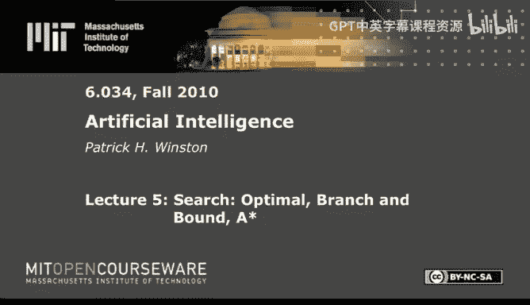
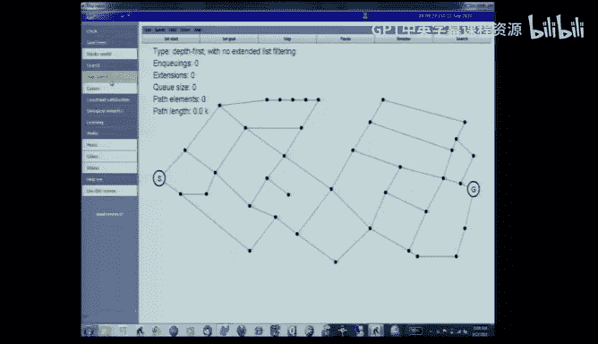
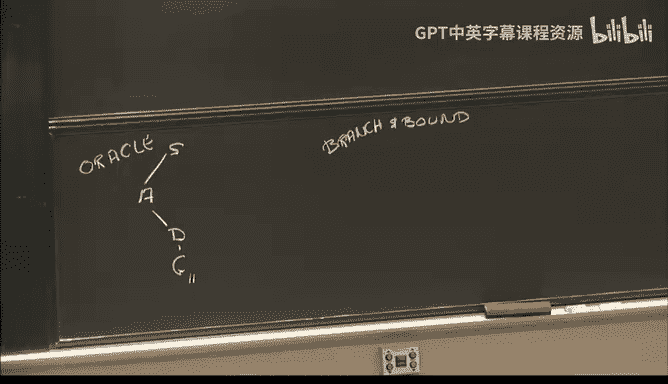
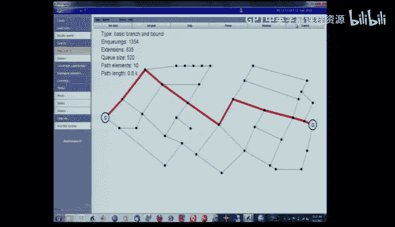
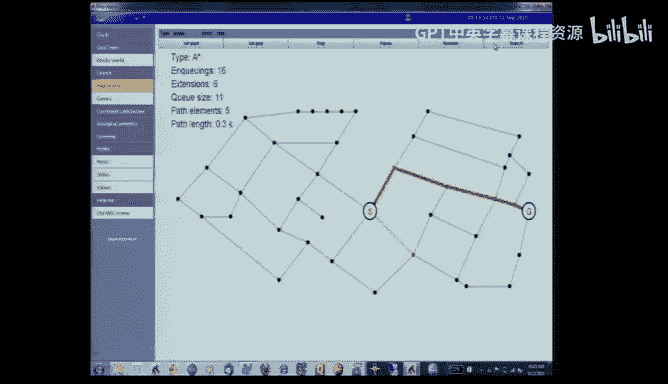

# 5：最优搜索、分支定界与A*算法 🧭




在本节课中，我们将学习如何找到两点之间的**最短路径**，而不仅仅是任意一条路径。我们将从基础的分支定界算法开始，逐步引入扩展列表和启发式估计，最终构建出强大且高效的A*搜索算法。

## 概述：从“好路径”到“最优路径”



上一节我们讨论了启发式搜索，它帮助我们快速找到一条通往目标的“好”路径。然而，在许多实际应用中，例如路线规划或资源调度，我们需要的不仅仅是“好”，而是**最优**——即总成本最低的路径。本节我们将探讨如何系统地找到这样的最短路径。

## 1. 分支定界算法：基础思想

分支定界算法的核心思想非常简单：**始终扩展当前累计路径成本最短的路径**，直到找到目标。然后，我们需要验证是否所有其他可能的路径成本都高于已找到的路径。



让我们通过一个简单的课堂示例来理解这个过程。假设我们已知从起点S到目标G的最短路径是 **S -> A -> D -> G**，总成本为11。为了验证这个答案，我们需要检查所有其他可能的路径，确保它们的成本都不低于11。

以下是验证步骤：
1.  从起点S开始，有两条路径：S->A（成本3）和S->B（成本5）。
2.  扩展成本最短的路径（S->A），得到S->A->B（成本7）和S->A->D（成本6）。
3.  现在，所有待扩展路径的成本为：S->B（5）， S->A->B（7）， S->A->D（6）。扩展最短的S->B，得到S->B->A（成本9）和S->B->C（成本9）。
4.  继续扩展当前最短的路径S->A->D（成本6），它直接到达目标G，总成本为6+5=11。
5.  找到目标后，我们仍需检查其他未扩展的路径（如S->A->B， S->B->A等），确保它们的累计成本（或加上剩余估计成本后）都大于等于11。如果所有路径都满足此条件，则验证成功。

这个过程的关键在于，一旦某条路径的累计成本已经**等于或超过**已知最短路径的成本，那么继续扩展这条路径就是徒劳的，因为成本只会增加。这被称为 **“死马原则”** ——一旦发现某条路不可能成为最优解，就立即放弃它。

## 2. 优化一：引入扩展列表

在基础的分支定界中，我们可能会重复探索同一个节点多次，这造成了大量浪费。例如，从不同路径到达节点B，我们可能会多次扩展它。

**扩展列表** 的引入就是为了解决这个问题。其规则是：**如果一个节点已经被一条成本更低的路径访问并扩展过，那么后续到达该节点的、成本更高的路径就无需再次扩展**。

以下是其工作原理：
*   我们维护一个列表，记录已经**被扩展过**的节点。
*   当一条新路径到达某个节点时，检查该节点是否已在扩展列表中。
*   如果在，并且新路径的累计成本**不低于**之前扩展该节点时的路径成本，则放弃扩展这条新路径。




在之前的课堂示例中，使用扩展列表后，我们避免了从S->A->B和S->B->A两条路径重复扩展节点A和B，显著减少了计算量。在更复杂的剑桥地图示例中，扩展列表将扩展次数从 **835次** 大幅降低到 **38次**，效率提升惊人。

**核心公式**： 判断是否扩展路径 `P` 到达节点 `N`
```
if N not in 扩展列表：
    扩展路径 P
    将 N 加入扩展列表
else if 路径P的累计成本 < 扩展列表中记录的成本：
    扩展路径 P
    更新扩展列表中节点 N 的成本
else：
    放弃扩展路径 P
```

## 3. 优化二：引入可采纳启发式

仅靠累计成本（`g(n)`）来指导搜索有时仍然低效，因为它是一种“目光短浅”的策略，没有考虑节点到目标的潜在成本。

**可采纳启发式** 提供了对节点到目标剩余距离的估计（`h(n)`）。所谓“可采纳”，是指这个估计值 **永远不会高估** 从该节点到目标的实际成本。在路径规划中，直线距离（欧几里得距离）就是一个典型的可采纳启发式。

A*算法正是结合了这两者。它使用一个评估函数 `f(n) = g(n) + h(n)` 来排序待扩展的路径，其中：
*   **`g(n)`**：从起点到节点 `n` 的实际路径成本。
*   **`h(n)`**：从节点 `n` 到目标的启发式估计成本（必须可采纳）。

算法总是优先扩展 `f(n)` 值最小的路径。`h(n)` 的引入将搜索方向有效地“拉向”目标。

在课堂示例中，使用可采纳启发式（直线距离）后，搜索的扩展次数为70次，虽然不如单独使用扩展列表（38次）高效，但相比原始分支定界（835次）已是巨大改进。

## 4. 强强联合：A* 搜索算法

既然扩展列表和可采纳启发式各有优势，最明智的做法就是将两者结合。**A* 算法** 正是 **分支定界 + 扩展列表 + 可采纳启发式** 的集大成者。

其算法流程可以总结如下：

1.  **初始化**：将起点路径放入优先队列 `Q`，其 `f` 值为 `g(起点)=0` + `h(起点)`。
2.  **循环**：
    a. 如果 `Q` 为空，搜索失败。
    b. 从 `Q` 中取出 `f` 值最小的路径 `P`。
    c. 如果 `P` 到达目标节点，则成功返回该路径。
    d. 否则，扩展路径 `P`，得到其后继节点。
    e. 对于每个后继节点生成的新路径，计算其 `g` 值和 `f` 值。
    f. 应用扩展列表规则：如果该节点未被扩展，或新路径的 `g` 值更低，则将该新路径加入 `Q`。
    g. 根据 `f` 值重新排序 `Q`（通常使用优先队列实现，无需完全排序）。
3.  **结束**。

在剑桥地图的测试中，A* 算法仅用了 **27次** 扩展就找到了最短路径，性能超越了任一单独优化策略。

**核心代码框架**：
```python
def A_star_search(start, goal, heuristic):
    open_set = PriorityQueue() # 按 f(n) 排序的优先队列
    open_set.put(start, 0)
    came_from = {} # 记录路径
    g_score = {start: 0} # g(n)
    f_score = {start: heuristic(start, goal)} # f(n)

    while not open_set.empty():
        current = open_set.get()

        if current == goal:
            return reconstruct_path(came_from, current)

        for neighbor in get_neighbors(current):
            tentative_g_score = g_score[current] + distance(current, neighbor)

            if neighbor not in g_score or tentative_g_score < g_score[neighbor]:
                # 这条路径到邻居更好
                came_from[neighbor] = current
                g_score[neighbor] = tentative_g_score
                f_score[neighbor] = g_score[neighbor] + heuristic(neighbor, goal)
                if neighbor not in open_set:
                    open_set.put(neighbor, f_score[neighbor])

    return None # 搜索失败
```

## 5. 重要补充：从可采纳性到一致性



可采纳启发式在大多数情况下（尤其是基于几何地图的问题）能保证A*找到最优解。然而，在更一般的图搜索问题中，仅满足可采纳性可能不够，还需要一个更强的条件：**一致性**（或称单调性）。

**一致性** 要求对于图中任意相邻的节点 `x` 和 `y`，启发函数满足以下三角不等式：
```
|h(x) - h(y)| ≤ d(x, y)
```
其中 `d(x, y)` 是节点 `x` 到 `y` 的实际成本。这意味着启发式估计值沿着路径的变化不会超过实际的步进成本。

**为什么需要一致性？**
考虑一个非几何图的特例：假设从S到A的启发值 `h(A)=100`，而到相邻节点B的 `h(B)=0`，它们之间的实际距离 `d(A,B)=2`。这满足可采纳性（100 < 实际距离101），但违反了一致性（|100-0|=100 > 2）。在这种情况下，A*算法可能会错误地优先扩展某个路径，并因为扩展列表的阻挡而错过真正的最优路径。

**结论**：
*   在**基于地图**的路径规划中，直线距离作为启发函数既是可采纳的，也是一致的。
*   在**更一般的图搜索问题**中，为了确保A*算法正确工作，我们应尽可能使用一致的启发函数。一致性是可采纳性的一个子集，所有一致的启发函数都是可采纳的，但反之则不一定。

## 总结

本节课我们一起深入探索了最优路径搜索的世界。我们从最基础的分支定界法出发，理解了通过持续扩展最短路径来逼近最优解的思想。接着，我们引入了两大关键优化技术：

1.  **扩展列表**：通过避免重复扩展同一节点，极大提升了搜索效率。
2.  **可采纳启发式**：通过估计剩余成本，将搜索方向智能地引向目标，进一步减少了搜索空间。

将二者结合，便得到了强大而高效的 **A*搜索算法**。最后，我们还探讨了为保证A*在通用图上的正确性，启发函数所需满足的更强条件——**一致性**。


掌握这些算法，你便理解了现代路径规划（如地图导航）的核心原理，并拥有了解决一类广泛优化问题的强大工具集。