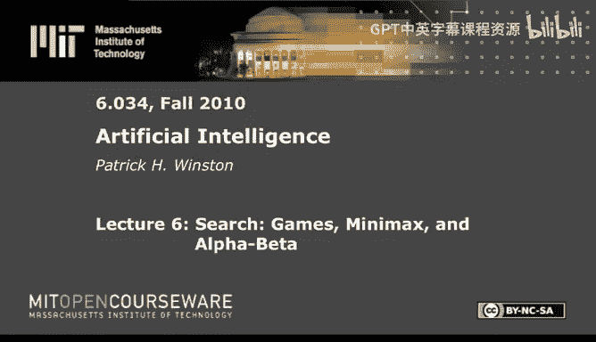
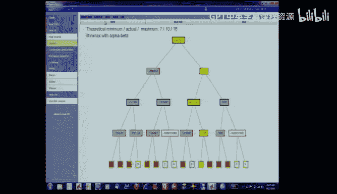

# 6：博弈、极小化极大算法与Alpha-Beta剪枝 🎮

在本节课中，我们将学习计算机如何下棋，特别是如何通过搜索和评估来做出决策。我们将从简单的思路开始，逐步深入到经典的极小化极大算法及其优化版本Alpha-Beta剪枝，并探讨如何通过渐进深化等技术来应对复杂的博弈树。

---

## 概述：计算机如何下棋？

计算机下棋有多种可能的思路。第一种是像人类一样分析棋盘，评估兵形结构、王的安全性和是否适合王车易位等，但这种方法目前尚无法实现。第二种是使用“如果-那么”规则，根据当前局面直接选择走法，但这种方法难以构建强大的棋手程序。第三种是向前看一步，评估所有可能走法后的局面，并选择对自己最有利的那个。然而，最基础的方法是使用“大英博物馆算法”，即暴力搜索所有可能的走法直到终局，但这在象棋中因搜索空间巨大而不可行。因此，我们需要更智能的搜索策略。

---

## 博弈树与基本概念

在讨论具体算法前，我们需要理解几个基本概念。博弈过程可以表示为一棵树。

*   **分支因子**：在树的每一层，需要考虑的选择数量。在示例中，分支因子 B = 3。
*   **深度**：树的层数。在示例中，深度 D = 2。
*   **叶节点**：树底部的终端局面。叶节点的总数是 B 的 D 次方（B^D）。

对于国际象棋，分支因子平均约为14，一盘棋的深度可达100层。这意味着叶节点数量约为10^120，这是一个天文数字，即使动用整个宇宙的原子进行计算也无法在有限时间内完成。因此，暴力搜索不可行。

---

## 核心算法：极小化极大算法

既然无法搜索整棵树，我们只能搜索到一定深度，然后对叶节点局面进行静态评估，并将评估值向上传递。这就是极小化极大算法的核心思想。

我们假设有两个玩家：
*   **极大化玩家**：希望走向评估值最大的局面。
*   **极小化玩家**：希望走向评估值最小的局面。

**算法步骤如下**：
1.  从当前局面（根节点）开始，搜索到指定的深度。
2.  对深度处的所有叶节点进行静态评估，得到一个数值分数（从极大化玩家的视角）。
3.  从叶节点开始，逐层向上回溯：
    *   在极小化玩家行动的层，节点值等于其所有子节点值中的**最小值**。
    *   在极大化玩家行动的层，节点值等于其所有子节点值中的**最大值**。
4.  回溯到根节点后，根节点的值就代表了从当前局面出发，在双方都最优应对下的预期结果。极大化玩家选择能走向这个值的走法。

**静态评估函数**通常基于棋盘特征（如子力、王的安全度），并通过一个函数（常为线性加权和）计算出一个总分。
`静态值 = C1 * F1 + C2 * F2 + ... + Cn * Fn`
其中，F是特征，C是权重。

---

## 优化策略：Alpha-Beta 剪枝 ✂️

极小化极大算法仍然需要评估大量节点。Alpha-Beta剪枝是在其基础上的一种优化，可以“剪掉”许多无需评估的分支，而不影响最终结果。

其核心思想是：在搜索过程中，维护两个值：
*   **Alpha**：极大化玩家当前保证能获得的最好分数（下界）。
*   **Beta**：极小化玩家当前保证能获得的最好分数（上界，即对极大化玩家而言的最坏情况）。

在搜索过程中，如果发现某个节点的评估值已经表明它不会被父节点选择（例如，对极大化玩家来说，一个分支的分数已经低于已知的另一个更好选择），那么该节点的其余子节点就无需再评估。这就是“剪枝”。

**剪枝的类型**：
*   **浅层剪枝**：发生在相邻层之间的剪枝。
*   **深层剪枝**：发生在非相邻层之间的剪枝，可以剪掉更大范围的分支。

在最优排序情况下，Alpha-Beta剪枝能将需要评估的节点数从大约 B^D 减少到大约 B^(D/2)。这意味着在相同时间内，搜索深度可以翻倍，这是业余棋手与世界冠军水平的差距。

---

## 实用技术：渐进深化与随时算法 ⏱️

在实际对弈中，时间有限，我们无法预知在固定时间内能搜索到多深。渐进深化技术解决了这个问题。

**渐进深化的思路**：
1.  先完成一次浅层搜索（例如深度为1），得到一个“保险”的走法。
2.  在剩余时间内，进行更深一层（深度为2）的搜索。
3.  如果时间还有剩余，就继续加深搜索深度。
4.  一旦时间用完，立即返回当前已完成的、最深一层搜索得到的最佳走法。

这种方法保证了程序在任何时刻都有一个可用的走法，并且随着时间推移，走法质量通常会提高。这类算法被称为**随时算法**。

此外，在渐进深化过程中，前一层搜索得到的节点估值可以用来对下一层搜索的子节点进行排序，将可能更优的节点优先搜索，这能进一步提高Alpha-Beta剪枝的效率。

---

## 现实应用：从理论到“深蓝”

像“深蓝”这样的顶级象棋程序，其核心正是**极小化极大算法 + Alpha-Beta剪枝 + 渐进深化**。除此之外，“深蓝”还结合了：
*   **海量并行计算**：每秒进行数亿次静态评估。
*   **开局库和残局库**：使用预先存储的专家知识。
*   **非均匀搜索**：根据局面的动态性（例如是否可能捉后）调整不同分支的搜索深度，而不是固定深度。

---

## 总结与思考

本节课我们一起学习了计算机博弈的核心思想。我们了解到，通过**极小化极大算法**可以模拟双方最优对抗下的决策；通过**Alpha-Beta剪枝**可以大幅减少不必要的计算；通过**渐进深化**可以保证在有限时间内总能给出一个可行的解。

然而，需要思考的是，这种基于暴力计算和搜索的智能（“推土机式智能”）与人类棋手的智能（基于模式识别和知识理解）是不同的。人类大师依赖经验和直觉，而“深蓝”则依靠强大的算力弥补了在理解上的不足。两者都是智能的表现形式，但路径截然不同。理解这种差异，对于全面认识人工智能的范畴至关重要。