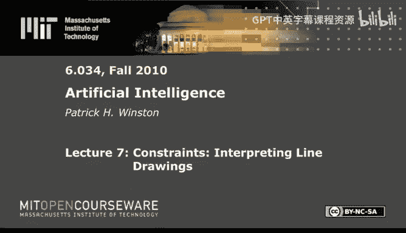
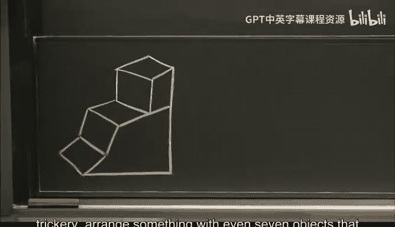
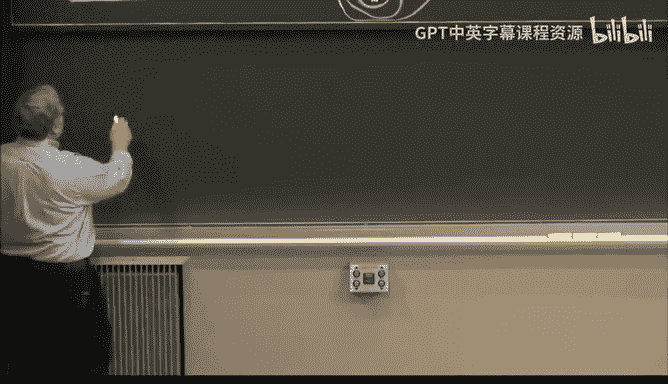
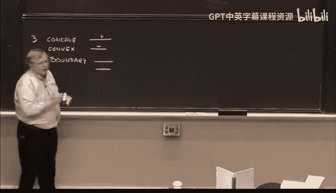
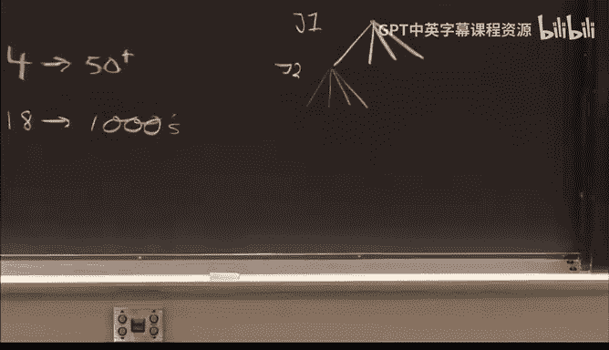
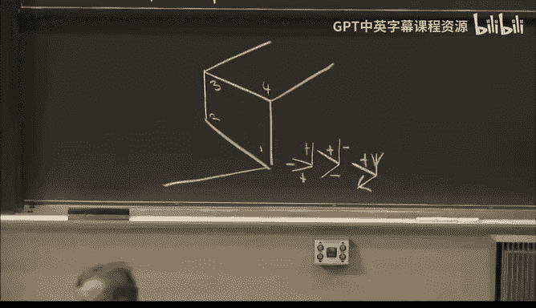
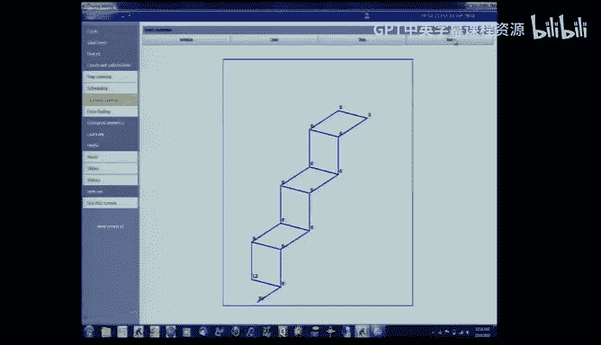

# 7：约束——解读线条画 🧩




在本节课中，我们将学习如何利用约束来解读线条画，理解三维物体的二维投影。我们将从早期研究者的探索故事开始，逐步了解约束满足问题在这一领域的应用和发展。

## 概述



本节课的核心是理解如何通过分析二维线条画中的线条连接方式（即“交汇点”），来推断其背后三维物体的可能结构。我们将看到，通过引入物理世界的约束（如所有顶点由三个平面构成），可以极大地缩小可能的解释范围，甚至能快速判断一幅画是否可能对应一个真实的三维物体。

---

## 从实验到理论：古兹曼的探索

许多人工智能问题始于解决一个具体的、实际的任务。在本例中，这个任务是让计算机“看懂”简单的积木线条画。

马文·明斯基的研究生阿道夫·古兹曼承担了一个暑期项目，后来发展成了他的博士论文：编写一个程序，观察一幅线条画并确定其中有多少个物体。



例如，观察下图，大多数人会立刻认为其中有两个物体，尽管从深层意义上讲它是模糊的。


古兹曼经过大量研究后提出，可以通过分析线条交汇处的类型来获取“证据”。他主要关注两种交汇点：
*   **箭头型交汇点**：暗示箭杆两侧的面属于同一物体。
*   **叉型交汇点**：暗示成对的三对面属于同一物体。



他为线条画中的面之间添加了这些所谓的“链接”作为证据。然后，他尝试了不同的规则来利用这些链接：
1.  **单链接理论**：只要有一个链接就认为面属于同一物体。这过于宽松，会导致将整个画面判定为一个物体。
2.  **双链接理论**：必须有两个链接才认为面属于同一物体。这又过于保守，会导致一些面被孤立。
3.  **迭代双链接理论**：先根据双链接形成“超区域”，再合并那些由两个或更多链接连接的超区域。这个方法效果更好，但仍不完美。

古兹曼的工作是启发式的、基于实验的。在他的博士答辩中，明斯基认为这是杰出的工作，而大卫·霍夫曼（赫夫曼编码的发明者）则认为它特设性太强，缺乏坚实的理论基础。

---

## 霍夫曼的数学化：引入物理约束

霍夫曼认为，需要从物理世界的知识出发，建立一个更严谨的理论。他决定在一个简化的、可用数学处理的世界中工作。

他做出了三个关键假设：
1.  **一般位置**：观察视角是轻微的扰动不会改变交汇点基本类型的（即没有罕见巧合的视角）。
2.  **三面体世界**：所有空间中的顶点都由三个平面相交而成。
3.  **四种线条标签**：基于物理属性，每条线被赋予四种标签之一：
    *   **凸线 (+)**：两个可见面的外角小于180度。
    *   **凹线 (-)**：两个可见面的内角小于180度。
    *   **边界线 (→ 或 ←)**：物体的边界，箭头方向遵循“沿箭头行走，物体在右侧”的数学约定。

基于这些假设，特别是“三面体”和“三个面”的约束，霍夫曼能够**穷举所有可能的交汇点标签组合**。他发现，在这个世界中，只存在 **18种** 合法的交汇点标签配置（6种L型、5种叉型、4种T型、3种箭头型）。

这是一个极其强大的约束。任何线条画，如果其交汇点上的标签配置不在这18种之内，那么它**不可能**对应于一个由三面体顶点构成的物体。

### 应用示例：判断“本垒板”是否可构造

让我们用霍夫曼的方法分析一个“本垒板”形状的线条画。

1.  假设物体悬浮在空中，因此所有外围线条都是边界线，我们立即标上箭头。
2.  查看边缘的箭头型交汇点。根据目录，如果一个箭头型交汇点的两个倒钩是边界线，那么其箭杆**必须**是凸线 (+)。因此，我们可以标记所有相关箭杆为 `+`。
3.  一条线的标签在其整个长度上必须一致。因此，这些 `+` 标签会传播到内部的叉型交汇点上。
4.  观察内部的叉型交汇点，它已有两条线标记为 `+`。查阅目录，一个叉型交汇点若有两条线是 `+`，则第三条线也**必须**是 `+`。
5.  现在，我们遇到一个L型交汇点，其两条线都被标记为 `+`。**然而，在我们的18种合法配置中，不存在两条线都是 `+` 的L型交汇点。**

**结论**：这幅“本垒板”线条画无法用一个由三面体顶点构成的物体来实现。这展示了霍夫曼方法的力量：它是一个高效的**必要非充分条件**检验。如果检验失败，则物体不可能存在；如果检验通过，则物体可能存在（但还需其他检验）。

---

## 沃尔茨的算法：处理复杂世界与约束传播

霍夫曼解决了简化世界的问题，但现实世界包含阴影、裂缝和非三面体顶点。另一位研究生大卫·沃尔茨决心解决这个更一般的问题。

为此，他将线条标签从4种扩展到50多种，以编码光照、裂缝等信息。这导致合法交汇点配置从18种激增到数千种。试图用简单的深度优先搜索来为包含数十个交汇点的场景寻找一致标签，其搜索空间是指数级的，在实践上不可能完成。

沃尔茨的关键贡献在于发明了 **“约束传播”** 算法。该算法不是盲目搜索所有组合，而是通过局部约束的交互来逐步消除不可能的选择。



### 约束传播算法示例

我们用霍夫曼的标签集来演示沃尔茨算法的核心思想。

假设我们有以下局部线条画（外围是观察窗口的边界）：




算法步骤如下：
1.  **初始化**：为第一个交汇点列出所有可能的标签配置（例如，对于某个交汇点类型，可能有3种）。
2.  **传播**：移动到相邻的第二个交汇点，列出其所有可能配置（例如，6种）。
3.  **约束检查**：检查第二个交汇点的每种可能配置，是否与第一个交汇点当前可能配置中共享的线条标签**相容**。不相容的配置被立即剔除（例如，6种中被剔除4种）。
4.  **反向传播**：第二个交汇点可能性的减少，反过来可能限制第一个交汇点的可能性。继续检查并剔除。
5.  **迭代**：将这种约束检查传播到所有相邻的交汇点。每次一个交汇点的可能性集合缩小，都会触发对其邻居的重新检查。
6.  **结果**：这个过程会像波浪一样传播出去。最终可能产生两种结果：
    *   **所有交汇点都只剩下一种标签配置**：找到唯一解释。
    *   **某个交汇点的所有可能性被剔除**：该线条画在给定约束下无解。
    *   **传播停止后，某些交汇点仍有多种可能**：线条画存在多种（模糊）解释。

通过这种方式，沃尔茨的算法能够高效处理极其复杂的约束网络，避免了组合爆炸。他的工作将古兹曼的实际问题、霍夫曼的理论约束和高效的约束传播算法结合了起来。

---

## 总结

本节课我们一起学习了约束满足在线条画解读中的应用历程：
1.  **古兹曼** 从实际问题（识别积木数量）出发，提出了基于交汇点类型的启发式链接方法，但缺乏理论深度。
2.  **霍夫曼** 引入了严格的物理世界假设（三面体顶点、四种线标签），建立了数学理论，并穷举了所有合法交汇点配置（18种），提供了判断线条画“不可能性”的强大工具。其核心是 **`合法交汇点目录`** 这一约束。
3.  **沃尔茨** 为了处理更真实的复杂世界，大幅增加了标签和交汇点类型。他发明了 **`约束传播算法`**，通过局部相容性检查的迭代传播来高效求解，避免了深度优先搜索的组合爆炸，完美融合了前两者的优点。

这个案例展示了人工智能中一个典型的发展模式：从具体的启发式方法，到抽象的理论建模和约束定义，再到设计出能有效利用这些约束的通用算法（如约束传播）。这种思想不仅用于视觉解读，下一讲我们将看到它如何应用于地图着色、调度等完全不同的领域。




**核心公式/代码概念**：
*   **约束满足问题 (CSP)**：由变量（如交汇点）、值域（如可能的标签配置）和约束（如共享线条必须标签一致）定义。
*   **约束传播 (Constraint Propagation)**：算法核心，伪代码逻辑如下：
    ```python
    while 有变量的值域发生变化：
        for 每个变量 X：
            for 每个与 X 存在约束的邻居变量 Y：
                检查 X 值域中的每个值 x：
                    if 不存在 Y 值域中的某个值 y 能满足 (X=x, Y=y) 的约束：
                        从 X 的值域中移除 x
    ```
    这个过程也称为 **AC-3 (弧相容-3)** 算法。