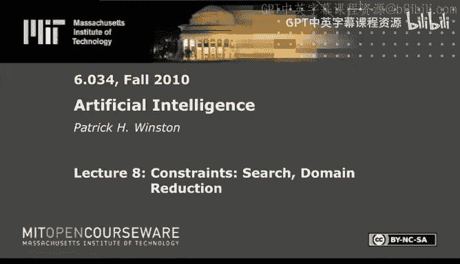
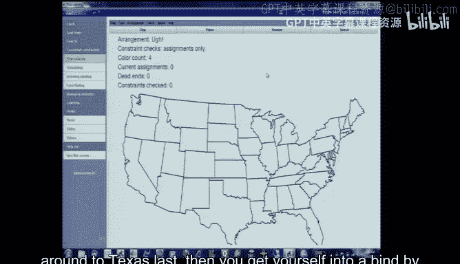
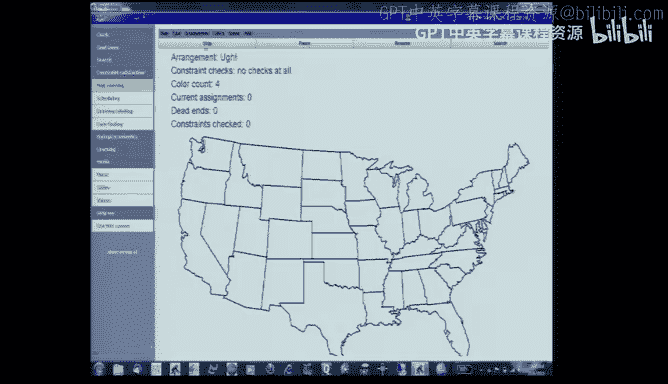

# 8：约束、搜索与域缩减 🧩




在本节课中，我们将学习如何解决约束满足问题，特别是地图着色和资源调度问题。我们将探讨深度优先搜索的局限性，并引入域缩减算法来更高效地处理约束。

---



## 问题引入：地图着色的挑战

上一节我们介绍了搜索的基本概念。本节中我们来看看一个经典问题：地图着色。目标是为地图上的每个区域分配一种颜色，并确保相邻区域颜色不同。

如果尝试为美国地图着色，使用简单的深度优先搜索会非常耗时。例如，如果先为亚利桑那、俄克拉荷马、阿肯色和路易斯安那州分配颜色，最后才处理德克萨斯州，可能会发现德克萨斯州已无可用颜色。这个问题在第四次选择时就已存在，但直到第48次选择才会被发现，导致搜索树异常庞大，计算时间可能长达数千年甚至更久。

---

## 核心概念与词汇

为了清晰地描述算法，我们需要定义一些核心概念。

*   **变量 (Variable, V)**：需要被赋值的对象，例如地图上的每个州。
*   **值 (Value)**：可以分配给变量的内容，例如颜色（红、绿、蓝、黄）。
*   **域 (Domain, D)**：一个变量所有可能取值的集合。
*   **约束 (Constraint, C)**：对变量取值组合的限制。在地图着色中，约束是：相邻的两个变量（州）不能取相同的值（颜色）。

用公式表示，一个约束 `C(Xi, Xj)` 表示变量 `Xi` 和 `Xj` 的取值必须满足特定关系（例如，`Xi ≠ Xj`）。

---

## 域缩减算法


仅靠深度优先搜索或简单的约束传播都不足以高效解决问题。我们需要结合两者，这就是域缩减算法的核心思想。

算法的直觉是：在深度优先搜索进行赋值的过程中，实时检查当前赋值对其余未赋值变量域的影响。如果某个变量的域被缩减为空集，则说明之前的某个选择导致了矛盾，必须回溯。

以下是算法的伪代码描述：

```python
对于深度优先搜索中的每一次赋值：
    对于每一个被考虑的变量 V_i：
        对于 V_i 的域 D_i 中的每一个值 x_i：
            对于连接 V_i 和另一个变量 V_j 的每一个约束 C：
                如果 不存在一个值 x_j 属于 V_j 的域 D_j，使得约束 C(x_i, x_j) 得到满足：
                    那么将值 x_i 从变量 V_i 的域 D_i 中移除
        如果变量 V_i 的域 D_i 变为空集：
            则触发回溯
```

**关键点**：“被考虑的变量”范围不同，会导致算法效率的巨大差异。



---


## 算法策略比较

以下是不同“考虑”策略的对比：

*   **策略1：不检查任何约束**
    *   结果：无效，会生成大量违反相邻约束的解。

*   **策略2：仅检查当前赋值**
    *   结果：对于美国地图问题，仍可能陷入类似“德克萨斯困境”的搜索，耗时极长。

*   **策略3：检查当前赋值变量的邻居**
    *   结果：比策略2好，能解决“德克萨斯困境”，但对于其他复杂州（如密苏里州）仍会遇到死胡同，效率一般。

*   **策略4：传播至域被缩减为单值的变量**
    *   结果：效果显著提升。当一个变量的域被缩减到只剩一个值时，继续检查这个变量的邻居。这引发了链式反应，能提前发现更多矛盾。

*   **策略5：传播至域发生任何缩减的变量**
    *   结果：与策略4效果相近，但有时检查的约束数量更多，因为传播范围更广。

实践表明，**策略4（传播至域被缩减为单值的变量）** 通常在效率上表现最佳。

---

## 变量排序的“肮脏小秘密”

除了传播策略，变量被赋值的顺序也至关重要。

*   **最少约束变量优先**：先给边界少的州（如缅因州）着色。直觉上这能让待办列表快速缩小，但在地图着色中，这可能导致像德克萨斯州这样高度约束的变量留到最后，引发灾难性回溯。
*   **最多约束变量优先**：先给边界多的州（如密苏里州）着色。这通常更有效，因为尽早处理最棘手的部分可以避免后续的大规模回溯。

实验证明，**最多约束变量优先**与域缩减算法结合，能极大提升搜索效率。

---

## 实际应用：航班调度问题

域缩减算法不仅用于地图着色，还能解决资源分配问题，例如航班调度。

**问题描述**：Jet Green航空公司有一些航班时刻，需要分配飞机（资源）。约束包括：同一架飞机不能同时执行两个航班（时间冲突），并且必须满足最短地面准备时间。

**与地图着色的类比**：
*   **变量**：每个航班。
*   **值**：每架飞机。
*   **约束**：航班之间不能有时间重叠（类似于相邻州颜色不能相同）。

通过将问题建模为约束满足问题，并应用域缩减算法和最多约束变量优先策略，可以高效地找到可行的飞机分配方案，或确定所需的最少飞机数量。

**确定最少资源数的技巧**：使用“过与不及”的二分搜索法。
1.  尝试一个明显过大的资源数（如10架飞机），求解会很快成功。
2.  尝试一个明显不足的资源数（如1架飞机），求解会很快失败。
3.  在成功和失败的边界之间进行搜索（如尝试5架、4架、3架），可以快速将答案锁定在一个很小的范围内，即使精确求解需要时间，也能快速给出一个近似范围。

---

## 总结


本节课中我们一起学习了约束满足问题的核心解法。我们认识到单纯深度优先搜索的不足，并引入了**域缩减算法**，该算法通过在搜索过程中实时修剪变量的值域来避免无效搜索。我们还探讨了提升算法效率的两个关键策略：**优先处理最多约束的变量**，以及将约束**传播至域被缩减为单值的变量**。最后，我们看到了该算法在地图着色和航班调度等实际问题中的强大应用。掌握这些技巧，你就能更聪明地解决许多复杂的规划和分配问题。