# 9：约束与视觉物体识别 👁️

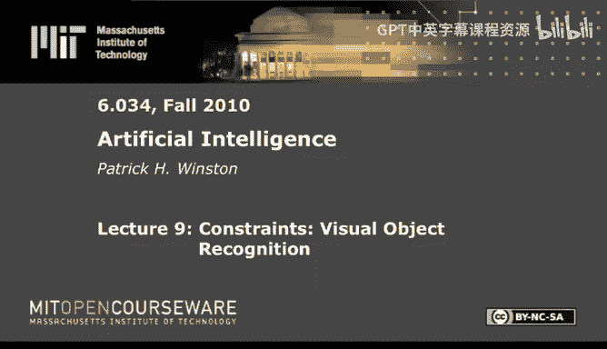

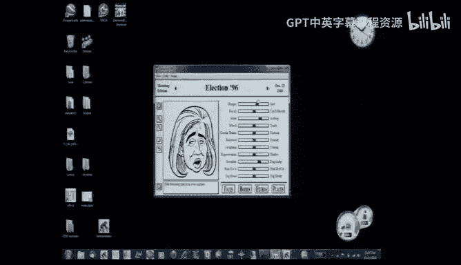

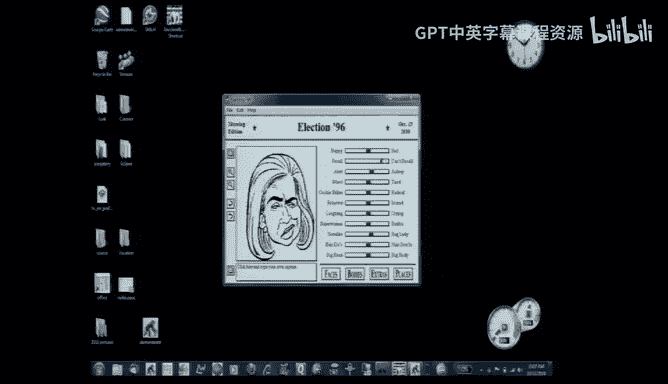

在本节课中，我们将要学习视觉物体识别的核心思想，特别是基于约束的识别方法。我们将回顾该领域的发展历程，从早期的理论模型到更现代的基于相关性的方法，并探讨这些方法如何帮助我们理解人脸识别等复杂任务。

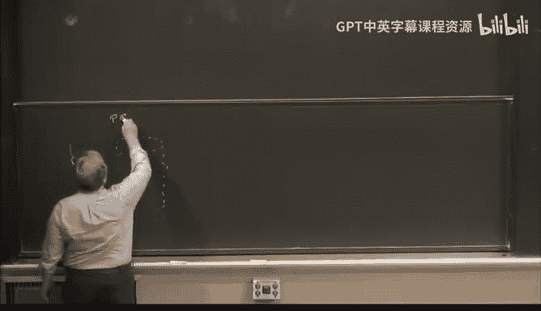

## 从边缘到识别：马尔的理论 📐

上一节我们介绍了视觉识别的基本挑战。本节中，我们来看看大卫·马尔提出的经典理论。马尔认为，视觉识别需要经过一系列的表征转换。

他的理论包含三个关键步骤：
1.  **原始草图**：从摄像机输入中提取边缘，形成基于边缘的物体描述。
2.  **2.5维草图**：在原始草图上添加表面法向量，描述物体表面的三维朝向。
3.  **广义柱体**：将2.5维草图转换为由轴和沿轴变化的截面函数（如圆形）描述的“广义柱体”。例如，一个酒瓶可以描述为一个沿轴半径变化的圆形截面。

**公式示例**：一个广义柱体可以描述为 `截面形状(沿轴距离)`。

这个理论基于一个核心思想：识别需要通过多步表征转换来完成。然而，尽管这是一个伟大的构想，但在实践中却难以实现。生成的广义柱体描述过于粗糙，无法区分细节（例如不同品牌的汽车），因此该理论未能成功应用。

## 对齐理论：从对应点重建 🔄

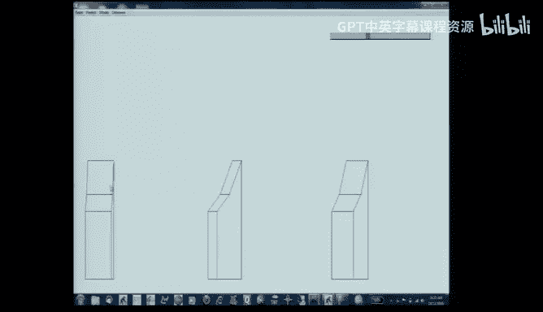

在马尔理论提出约15年后，识别理论迎来了新的发展，其中最著名的是西蒙·乌尔曼提出的对齐理论。这个理论基于一个在机械工程中常见但在视觉识别中显得新奇的想法。

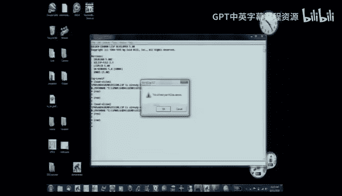

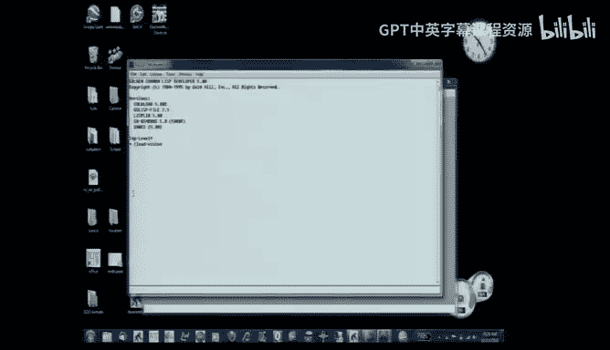

对齐理论的核心是：对于一个物体，如果你拥有它的三张不同角度的图片（在正射投影条件下），你就可以重建出该物体的任何其他视角。这里的限制是，你需要能看到物体上相同的对应点。

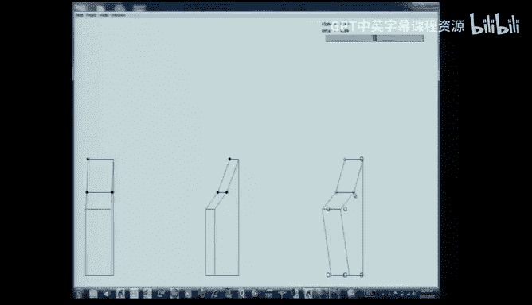

以下是该理论如何用于识别的步骤说明：

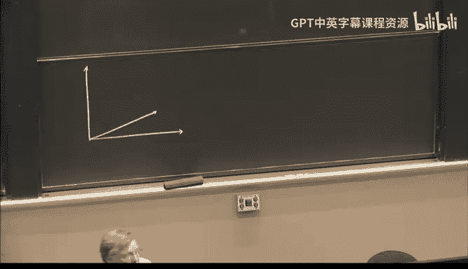

1.  **建立方程**：假设我们有物体的三张已知图片（A, B, C）和一张未知图片（U）。我们在所有四张图片上选取一组相同的对应点。
2.  **线性关系**：在正射投影下，未知图片上某点的坐标（例如x坐标）可以表示为三张已知图片上对应点坐标的线性组合，加上一个常数项。
    **公式**：`x_U = α * x_A + β * x_B + γ * x_C + τ`
3.  **求解参数**：选取至少四个对应点，建立方程组，可以求解出唯一的参数组 `(α, β, γ, τ)`。这些参数对于该物体的所有点都是相同的。
4.  **预测与验证**：使用求得的参数，可以预测未知图片上其他对应点的位置。如果预测位置与实际位置高度吻合，那么未知图片就很可能描绘的是同一个物体。

这个方法的优势在于它基于物体局部特征（点）的几何约束。但它也有局限：对于自然物体（如人脸），精确找到对应点非常困难，一个点的对应错误就可能导致整个识别失败。

## 相关性理论与“金发姑娘”原则 🎭

由于对齐理论在自然物体识别上的局限性，乌尔曼等人又提出了基于相关性的方法。这种方法不再专注于孤立的点，而是考虑图像区域的整体匹配。

最初的朴素想法是使用整张人脸图片作为模板，在场景中进行滑动相关匹配。但这并不可行，因为很难找到完全相同的脸（例如，用乔治·华盛顿的肖像找不到其他人的脸）。

于是，识别策略演变为寻找“中间尺度”的特征。这就是“金发姑娘”原则：特征不能太大（如整张脸，太特异），也不能太小（如单个眼睛，太常见）。我们需要不大不小的特征，例如“两只眼睛加一个鼻子”的组合。

以下是基于相关性进行匹配的核心思想：

1.  **相关性计算**：将一个特征模板（如眼睛-鼻子组合）在目标图像上滑动，在每个位置计算模板与图像局部区域的相关性（即点积和）。
2.  **最大化响应**：寻找相关性最大的位置，该位置很可能就是特征所在之处。
    **公式（简化一维）**：`argmax_T ∫ f(x) * g(x - T) dx`，其中 `f` 是模板，`g` 是图像，`T` 是偏移量。
3.  **抗噪性**：即使图像中存在大量噪声，只要模板特征具有足够的区分度，相关性峰值仍然会出现在正确的位置。

这种方法在实践中表现出强大的鲁棒性，能够从嘈杂的背景中准确地定位出目标人脸或面部特征。

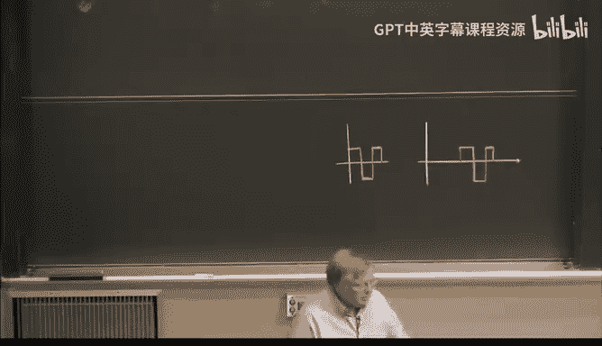

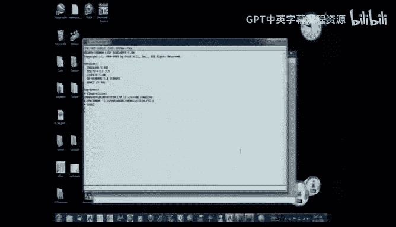

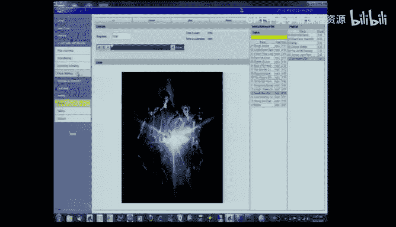

## 未解决的挑战与故事的力量 📖

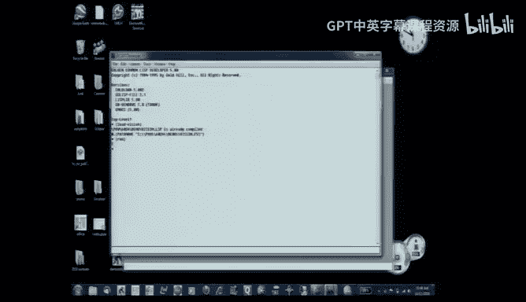

尽管相关性方法取得了成功，但视觉识别领域仍存在许多未解决的挑战。例如，我们如何从侧面识别一个人？这可能需要对对齐理论中的变换进行建模，或者需要从多个视角学习同一个人的图像。

更根本的挑战在于，当前的识别方法大多专注于“是什么”，而更困难的可能是理解“在发生什么”——即视觉事件识别。例如，识别“喝”、“扔”、“抓”等动作，这对现有系统来说极为困难。

这引出了一个深刻的观点：人类的视觉识别可能不仅仅依赖于底层的图像特征匹配，还依赖于我们强大的“讲故事”能力。我们看到一只猫在喝水，不仅是因为我们识别出了猫和水的视觉特征，更是因为我们理解了“动物口渴-寻找水源-液体流入口中”这一叙事。这种高层次的解释为看似不同的视觉场景赋予了相同的意义标签。

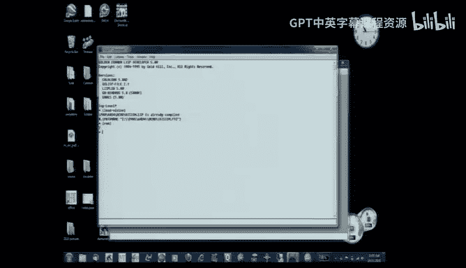

## 总结 🎯

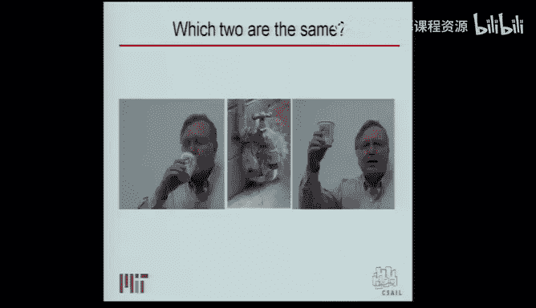

本节课中我们一起学习了视觉物体识别的主要理论脉络。我们从马尔基于边缘和转换的经典理论出发，看到了它在实践中的困难。接着，我们探讨了对齐理论，它利用几何约束和对应点来识别物体，但对自然物体效果有限。然后，我们介绍了基于相关性的方法和“金发姑娘”原则，该方法通过匹配中间尺度的特征在噪声中实现鲁棒识别。最后，我们认识到当前系统在理解动态场景和动作方面仍面临巨大挑战，而人类的识别能力可能深深植根于我们构建叙事和解释世界的能力之中。视觉识别之路漫长，每一步进展都帮助我们更接近理解“看见”的本质。