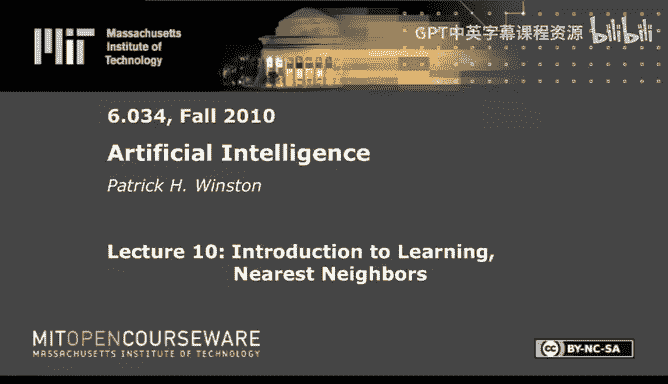
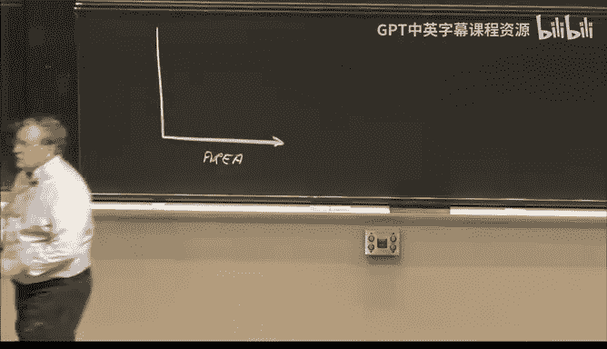
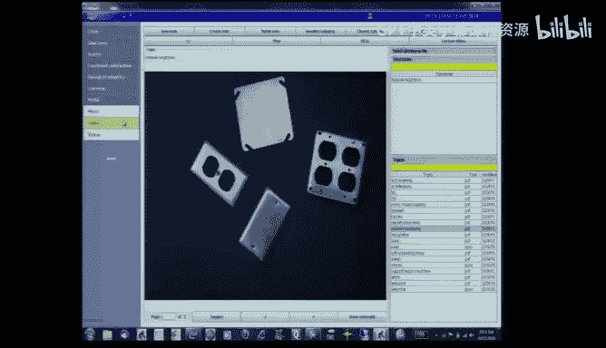
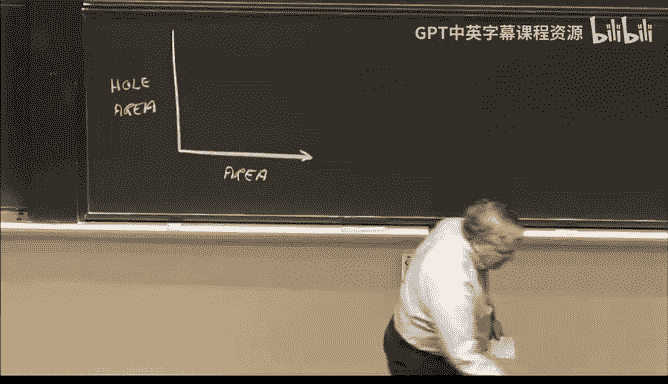
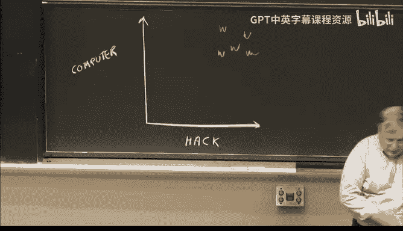
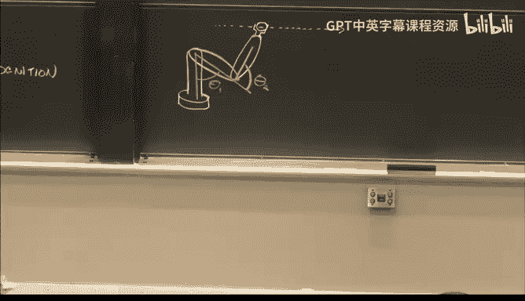
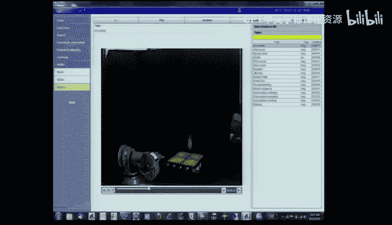
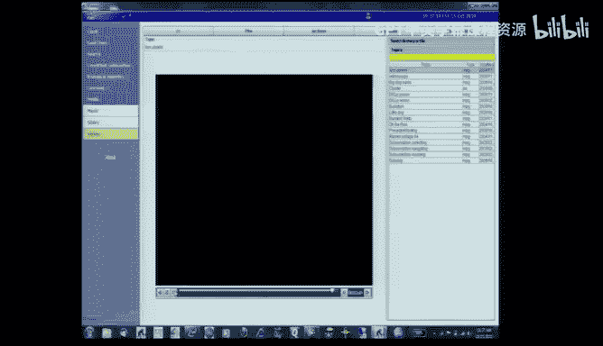
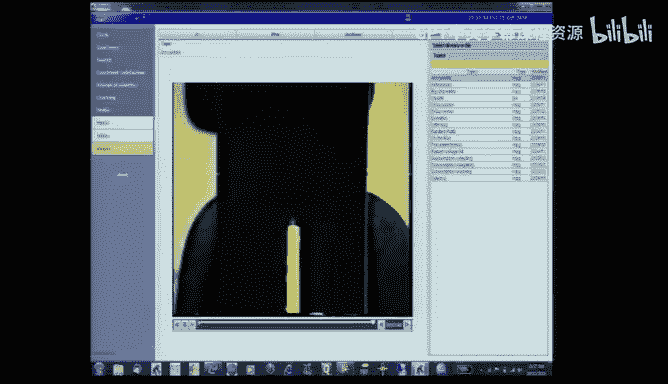
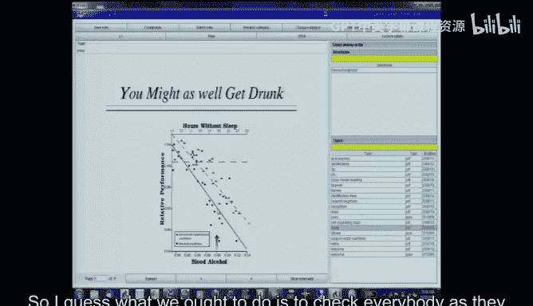

# 10：学习导论与最近邻算法 🧠




在本节课中，我们将要学习机器学习的基本概念，并重点介绍一种简单而强大的方法——最近邻学习。我们将探讨其工作原理、应用实例以及需要注意的问题。

---

## 学习的两大分支 🌳

上一节我们介绍了课程的整体框架，本节中我们来看看学习的两大主要类型。

学习可以分为两大类：
1.  **基于规律的学习**：计算机擅长此类学习，它像推土机处理砂石一样处理信息。我们将讨论最近邻算法、神经网络和提升法。
2.  **基于约束的学习**：这更接近人类的学习方式，例如一次性学习和基于解释的学习。我们将在后续课程中探讨。

今天，我们将专注于基于规律学习路径下的**最近邻学习**。





---



## 最近邻学习：核心思想与流程 🎯

最近邻学习的基本思想是：如果某个事物在某些方面与已知事物相似，那么它在其他方面也可能相似。

其通用流程如下：
1.  **特征检测**：通过某种机制生成一个特征向量。
2.  **比较匹配**：将该特征向量与知识库中已知的可能性向量进行比较。
3.  **识别决策**：通过找到最接近的匹配项，来确定对象的类别或属性。

我们可以用以下伪代码描述其核心：

```python
# 假设 knowledge_base 是已知样本（特征向量+标签）的列表
# new_sample 是待分类的新样本特征向量
def nearest_neighbor_classify(new_sample, knowledge_base):
    closest_sample = None
    min_distance = float('inf')
    for sample in knowledge_base:
        # 计算新样本与知识库中每个样本的距离（如欧氏距离）
        distance = calculate_distance(new_sample, sample.features)
        if distance < min_distance:
            min_distance = distance
            closest_sample = sample
    # 返回最近邻样本的标签作为预测结果
    return closest_sample.label
```

---

## 应用实例演示 🔌

以下是最近邻思想在不同领域的应用。



### 实例一：电气盖板分类

假设机器人需要分类传送带上的电气盖板。

**操作步骤如下：**
1.  我们选择两个特征进行测量：**总面积**（包括孔洞）和**孔洞面积**。
2.  将不同类型的盖板（如空白盖板、多插座盖板）测量值绘制在二维特征空间中。
3.  当一个新盖板到来时，测量其特征值，并在特征空间中找到距离它最近的已知盖板类型。
4.  通过计算到所有已知“理想”点的距离，或预先划分**决策边界**，可以快速判定其类别。

### 实例二：文章相关性检索

如何从杂志文章库中查找与特定问题相关的文章？



**解决方案如下：**
1.  统计库中每篇文章的特定词汇（如“计算机”、“黑客”）出现次数，构成特征向量。
2.  将查询问题也转化为同样的特征向量。
3.  直接比较欧氏距离可能因文章长度差异导致偏差。一个更好的方法是计算向量夹角的余弦值（即余弦相似度）。
4.  余弦相似度公式能有效衡量方向的一致性，其计算公式为：

    **cos(θ) = (A·B) / (||A|| * ||B||)**

    其中 `A·B` 是向量的点积，`||A||` 和 `||B||` 是向量的模长。

### 实例三：机器人手臂控制

控制机械臂沿轨迹运动涉及复杂的动力学方程，且对摩擦、形变等实际因素敏感。

**最近邻的替代方案如下：**
1.  **训练阶段（“童年期”）**：让手臂自由随机运动，并持续记录每一时刻的状态（关节角度、角速度、角加速度）以及此时施加的电机扭矩，存入一个大表。
2.  **执行阶段**：将目标轨迹分割成小段。对于每一小段的目标状态，在表中查找与之最接近的历史记录。
3.  **输出控制**：直接采用该历史记录对应的电机扭矩作为控制输出。通过反复练习，表中数据越来越丰富，控制也越来越精准。







---

## 潜在问题与注意事项 ⚠️

尽管最近邻方法简单有效，但在应用时需要注意以下几个问题。

**问题一：特征尺度不均衡**
如果不同特征维度的数据分布范围差异巨大（例如，X轴范围0-1，Y轴范围0-1000），距离计算会被大范围的特征主导。
*   **解决方案**：对数据进行归一化，例如使用Z-score标准化，使每个特征的方差为1。

**问题二：无关特征干扰**
如果答案实际上并不依赖于某个特征，但该特征仍然被计入距离计算，就会引入噪声，导致分类错误。
*   **解决方案**：需要进行特征选择，剔除不相关的特征。

**问题三：数据与问题无关**
如果收集的数据本身与要解决的问题没有因果关系，那么任何学习方法都无法奏效。这就像“试图不用面粉做蛋糕”。

---

## 学习的另一面：睡眠与问题解决 💤

之前我们提到了基于约束的人类式学习，这类学习往往与问题解决紧密相关。而问题解决能力深受睡眠影响。

研究表明：
*   **睡眠剥夺会严重损害认知能力**。例如，士兵在持续36小时无眠后，虽感觉良好，但实际已无法进行正确计算。
*   **睡眠债会累积**。长期每天少睡1-2小时，可在数周内导致表现下降25%。
*   **24小时不睡的影响**，相当于法律规定的醉酒水平，会严重影响考试等关键任务的表现。
*   **咖啡因和小睡**有一定帮助，但无法替代充足的睡眠。

因此，保证充足睡眠对于有效学习和复杂问题解决至关重要。

---

## 课程总结 📚



本节课中我们一起学习了：
1.  **学习的两大分支**：基于规律的“推土机式”学习和基于约束的“人类式”学习。
2.  **最近邻学习的核心思想**：“相似之物在其他方面也相似”，并通过计算距离（或相似度）在特征空间中找到最接近的已知样本进行预测或分类。
3.  **最近邻的多种应用**：从物体分类、信息检索到复杂的机器人运动控制，展示了其简单而强大的通用性。
4.  **应用中的关键问题**：需要注意特征归一化、无关特征剔除，并确保所用数据与问题本身相关。
5.  **睡眠的重要性**：作为向人类式学习过渡的桥梁，我们探讨了睡眠剥夺如何严重削弱我们进行有效学习和问题解决的能力。


最后，关于课堂开始的“狗如何看待无糖饮料”谜题，答案在于动物缺乏构建叙事的能力，容易将**相关性**（喝无糖饮料的人往往超重）误认为**因果关系**，而人类可以通过解释理解背后的真实原因（为了控制体重而选择无糖饮料）。这提醒我们在分析数据时要警惕混淆相关与因果。