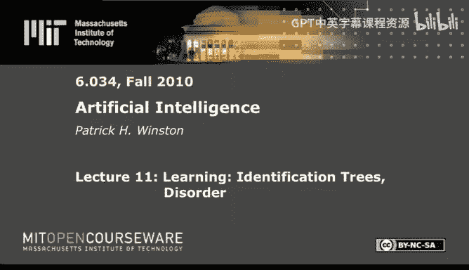
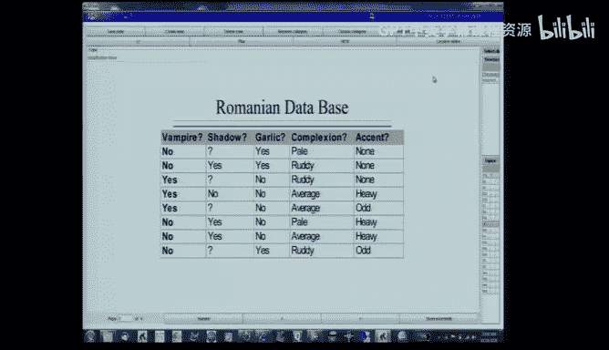
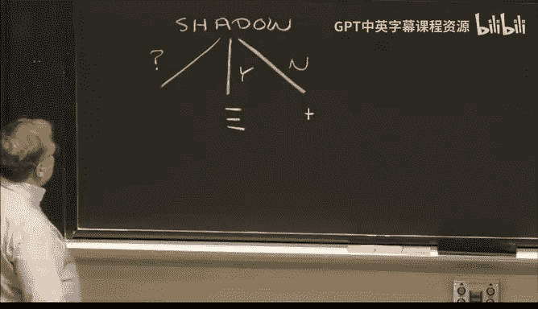
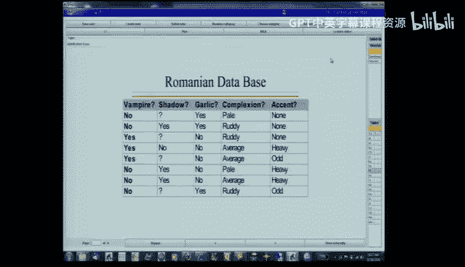
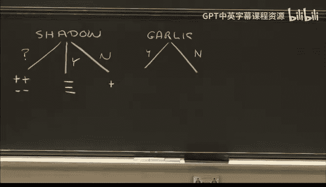
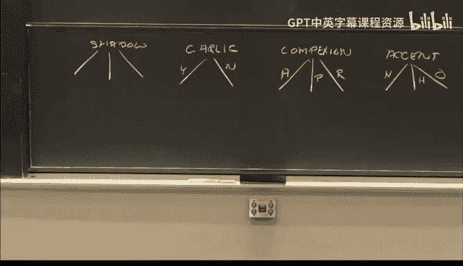
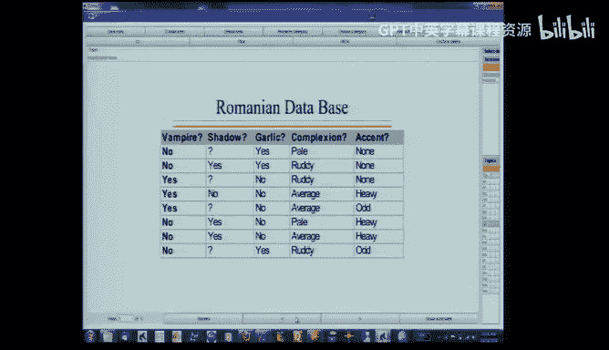

# 11：学习识别树与信息熵 🧠🌳




在本节课中，我们将学习如何利用数据构建一个识别机制，以区分吸血鬼和普通人。我们将重点介绍**识别树**的构建方法，这是一种通过一系列测试来分类样本的树形结构。与之前学习的神经网络和最近邻方法不同，识别树特别适合处理**符号型数据**，并能考虑测试的**成本**与**效率**。

---

## 识别树简介

上一节我们提到了处理符号型数据的需求。本节中，我们来看看什么是识别树。

识别树是一种树形结构，其中每个内部节点代表一个**测试**，每个分支代表一个测试结果，而每个叶节点则代表一个**分类结论**（例如，是吸血鬼或不是）。我们的目标是构建一棵尽可能**小**且**高效**的树，因为更简单的树不仅测试成本更低，而且根据**奥卡姆剃刀原理**，往往也是更好的解释模型。

构建一棵好树的关键在于，选择那些能最有效地将数据划分为**同质子集**（即所有样本都属于同一类别）的测试。

---

## 一个简单的例子：识别吸血鬼 🧛





为了理解这个过程，我们使用一个包含8个样本的小型数据集。每个样本有四个特征（测试）：
1.  **是否投下阴影** (Shadow): 是 (Yes) / 否 (No) / 未知 (?)
2.  **是否吃大蒜** (Garlic): 是 (Yes) / 否 (No)
3.  **肤色** (Complexion): 平均 (Average) / 苍白 (Pale) / 红润 (Ruddy)
4.  **口音** (Accent): 正常 (Normal) / 浓重 (Heavy) / 奇怪 (Odd)





目标是根据这些特征判断一个人是否是吸血鬼 (+ 表示是，- 表示不是)。

### 第一步：评估单个测试

我们需要评估每个测试在划分数据时的效果。理想情况下，一个测试能立即将数据完全分开（所有吸血鬼在一组，所有普通人在另一组），但通常没有这么完美的测试。

以下是每个测试将样本划分后的结果示意图（为简洁，仅描述分组情况）：

*   **阴影测试**：产生三组。`No`组（1个样本）全是吸血鬼（同质）。`Yes`组（3个样本）全是普通人（同质）。`?`组（4个样本）混合了吸血鬼和普通人（异质）。
*   **大蒜测试**：产生两组。`Yes`组（3个样本）全是普通人（同质）。`No`组（5个样本）混合了吸血鬼和普通人（异质）。
*   **肤色测试**：产生三组。所有组都是混合的（异质）。
*   **口音测试**：产生三组。所有组都是混合的（异质）。


一个直观（但过于简单）的评估方法是：**计算被放入同质集合的样本数量**。
*   阴影测试得分：`1 (No组) + 3 (Yes组) = 4`
*   大蒜测试得分：`3 (Yes组) = 3`
*   肤色测试得分：`2 (Pale组，但实际是混合的，此处假设为2) ≈ 2`
*   口音测试得分：`0`

根据这个简单标准，**阴影测试**似乎是最佳选择。



---

## 处理大型数据集：需要衡量“混乱度”

然而，对于大型数据集，可能没有任何测试能一开始就产生同质子集，上述简单方法会失效。我们需要一个更通用的方法来量化一个集合的**混乱程度**。

我们转向**信息论**寻求帮助。对于一个包含 `P` 个正例（如吸血鬼）和 `N` 个负例（如普通人）的集合，其混乱度 `D`（即**熵**）定义为：

```
D = - (P/(P+N)) * log₂(P/(P+N)) - (N/(P+N)) * log₂(N/(P+N))
```

这个公式的性质是：
*   当集合完全同质（全是正例或全是负例）时，`D = 0`。
*   当正负例各占一半时，`D = 1`（达到最大值）。
*   曲线呈倒U形，在中间部分混乱度较高。

---

## 计算测试的整体质量

一个测试会产生多个子集（每个分支一个）。我们需要从这些子集的混乱度，计算出这个测试的**整体质量**。

我们不能简单地将子集的混乱度相加，因为分支的重要性不同（样本多的分支更重要）。因此，我们计算**加权平均混乱度**：

```
测试质量 Q = Σ (该分支样本数 / 总样本数) * 该分支子集的混乱度 D
```

**`Q` 的值越小，说明该测试产生的子集整体上越有序，该测试越好。**

让我们用熵公式重新计算吸血鬼例子中各个测试的质量：
*   **阴影测试**：`Q_shadow ≈ 0.5`
*   **大蒜测试**：`Q_garlic ≈ 0.95`
*   **肤色测试**：`Q_complexion ≈ 0.7`
*   **口音测试**：`Q_accent ≈ 0.6`

结果确认：**阴影测试（Q=0.5）** 是最佳首选项。

---

## 递归构建识别树

选择了根节点测试（阴影测试）后，我们对那些尚未被完全分类的分支（本例中是 `Shadow=?` 的分支，包含4个混合样本）**重复上述过程**。

我们只在剩余样本上评估剩下的测试（大蒜、肤色、口音）。计算它们的加权混乱度：
*   在大蒜测试下，`?` 分支的样本被完美分开（`Yes`组全是普通人，`No`组全是吸血鬼），其 `Q ≈ 0.5`。
*   其他测试的 `Q` 值更高。

因此，我们选择**大蒜测试**作为该分支的下一个测试。最终，我们得到一棵完整的识别树：

1.  首先进行**阴影测试**：
    *   如果 `Shadow=No` -> **是吸血鬼 (+)**。
    *   如果 `Shadow=Yes` -> **不是吸血鬼 (-)**。
    *   如果 `Shadow=?` -> 进行**大蒜测试**：
        *   如果 `Garlic=Yes` -> **不是吸血鬼 (-)**。
        *   如果 `Garlic=No` -> **是吸血鬼 (+)**。

---

## 扩展到数值型数据与规则提取

### 处理数值型数据
对于像“体温”这样的数值特征，我们可以通过引入**阈值**将其转化为二元测试（例如，“体温 > 100.5°F?”）。计算机会尝试多个可能的阈值（例如，在所有相邻数据点的中点），选择能产生最小加权混乱度 `Q` 的那个阈值。

### 将树转化为规则
识别树可以很容易地转化为一系列 `IF-THEN` 规则（每条从根到叶的路径就是一条规则）。例如，从我们的树中可以提取出规则：“IF `Shadow=?` AND `Garlic=No` THEN `Vampire=+`”。

有时，这些规则可以进一步**简化**。通过分析数据，我们可能发现某些条件在规则中是冗余的，可以移除，从而得到更简洁、更易于理解的决策集。

---

## 总结

本节课中，我们一起学习了**识别树**的构建方法。核心步骤包括：
1.  **定义问题**：使用符号或数值特征对样本进行分类。
2.  **衡量混乱度**：借用信息论的**熵**公式 `D = -p log₂(p) - (1-p) log₂(1-p)` 来量化一个集合的不纯度。
3.  **选择最佳测试**：计算每个测试的**加权平均混乱度** `Q`，选择 `Q` 值最小的测试作为节点。
4.  **递归构建**：对每个未纯化的分支重复步骤2-3，直到所有叶节点都是同质集合或满足停止条件。
5.  **应用与扩展**：识别树可用于数值数据（通过设置阈值），并可转化为简化的规则集，在实践中被广泛应用。




这种方法的核心直觉是：**寻找能最有效“净化”数据的测试，以构建出尽可能简单、高效的决策模型。**