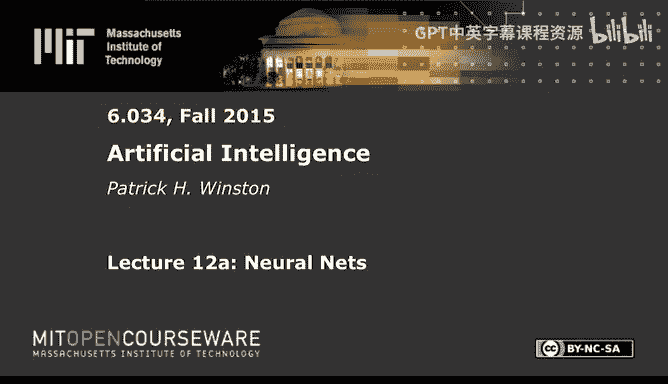
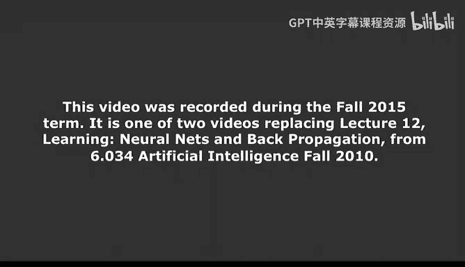
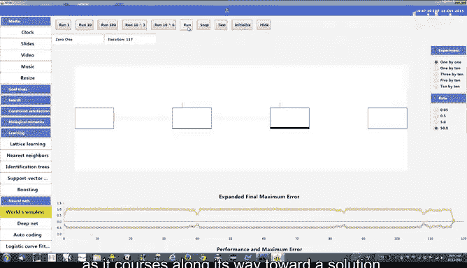

# 12：神经网络 🧠

## 概述

在本节课中，我们将学习神经网络的基本概念、工作原理以及如何训练它们。我们将从神经元的生物学基础出发，构建其数学模型，并探讨如何通过梯度下降等方法来优化网络性能。课程还将介绍神经网络发展历程中的关键突破，以及为何它在现代人工智能中变得如此重要。

---

## 神经网络的生物学灵感

我们首先从大脑中的神经元获取灵感。大脑中约有10^11个神经元，它们通过复杂的连接进行信息处理。

一个典型的神经元包含以下几个部分：
*   **细胞体**：包含细胞核。
*   **轴突**：一条较长的纤维，负责将信号传递出去。
*   **树突**：高度分支的结构，负责接收来自其他神经元的信号。

神经元之间通过**突触**连接。当一个神经元被充分刺激时，会产生一个电脉冲（动作电位）沿轴突传递，随后进入一段**不应期**。信号通过突触间隙，由神经递质从一个神经元的轴突末端传递到下一个神经元的树突。

---

## 神经元的数学模型

为了模拟神经元，我们建立了一个简化的数学模型。以下是建模的核心组件：

1.  **二进制输入**：神经元接收来自其他神经元的输入，这些输入被建模为二进制值（0或1），记作 \( x_1, x_2, ..., x_n \)。
2.  **突触权重**：每个输入 \( x_i \) 都乘以一个权重 \( w_i \)，模拟突触连接的强度。权重值可正可负，代表兴奋性或抑制性连接。
3.  **累加器**：将所有加权输入求和，模拟树突对信号的累积效应。求和公式为：\(\sum_{i} w_i x_i\)。
4.  **阈值函数**：如果加权和超过某个阈值 \( T \)，则神经元“激活”，输出1；否则输出0。这模拟了神经元的“全或无”特性。

这个模型捕捉了神经元的三个关键特性：全或无响应、输入的累积效应以及可调节的突触权重。然而，它也忽略了许多生物学细节，如不应期、轴突分叉和时间模式的影响。

---

## 从神经元到网络

单个神经元的功能有限。我们的大脑由海量神经元互连而成。同样，我们可以将许多人工神经元连接起来，形成一个**神经网络**。

我们可以将整个网络视为一个函数 \( F \)。它接收一个输入向量 \( \mathbf{X} \)，在内部经过权重 \( \mathbf{W} \) 和阈值 \( \mathbf{T} \) 的处理，最终产生一个输出向量 \( \mathbf{Z} \)：
\[
\mathbf{Z} = F(\mathbf{X}, \mathbf{W}, \mathbf{T})
\]
训练神经网络的目标，就是调整权重 \( \mathbf{W} \) 和阈值 \( \mathbf{T} \)，使得网络的输出 \( \mathbf{Z} \) 尽可能接近我们期望的输出 \( \mathbf{D} \)。因此，神经网络本质上是一个**函数逼近器**。

---

## 性能评估与优化挑战

为了衡量网络的表现，我们需要定义一个**性能函数** \( P \)。一个直观的想法是计算期望输出 \( \mathbf{D} \) 与实际输出 \( \mathbf{Z} \) 之间的误差大小。为了使优化过程更顺畅（即寻找性能最大值），我们通常采用以下形式的性能函数：
\[
P = -\frac{1}{2} (D - Z)^2
\]
当 \( Z = D \) 时，性能 \( P \) 达到最大值0。我们的目标就是通过调整权重和阈值来最大化 \( P \)。

一种朴素的优化方法是**爬山法**：在所有权重维度上尝试微小变动，选择能使性能提升的方向。然而，对于拥有数百万参数（如Hinton的6000万参数网络）的现代网络，这种方法在计算上是不可行的，因为需要尝试的方向数量随参数数量指数级增长。

---

## 梯度下降与数学障碍

更高效的方法是使用**梯度下降**（或梯度上升）。我们计算性能函数 \( P \) 相对于每个权重 \( w_i \) 的**偏导数** \(\frac{\partial P}{\partial w_i}\)。这些偏导数组成的向量（梯度）指明了性能增长最陡峭的方向。然后，我们沿着梯度方向更新权重：
\[
\Delta \mathbf{W} = \eta \cdot \nabla P
\]
其中 \( \eta \) 是**学习率**，决定了每次更新的步长。

然而，直接应用梯度下降存在两个数学障碍：
1.  **阈值处理不便**：阈值 \( T \) 作为额外参数增加了复杂性。
2.  **函数不连续**：我们之前使用的阶跃阈值函数是不可导的，而梯度下降要求函数连续可导。

---

## 反向传播算法的关键技巧

1974年，Paul Werbos提出了解决这些障碍的方法，这构成了现代神经网络训练算法——**反向传播**——的基础。以下是两个关键技巧：

**技巧一：消除阈值参数**
我们为神经元添加一个额外的固定输入 \( x_0 = -1 \)，并赋予其一个权重 \( w_0 \)。如果我们令 \( w_0 = T \)，那么原先的“加权和是否大于阈值 \( T \)”的判断，就等价于“新的加权和（包含 \( w_0 * (-1) \)）是否大于0”。这样，阈值被吸收进了权重中，我们只需处理权重。

**技巧二：使用可导的激活函数**
将不可导的阶跃函数替换为平滑的、可导的**S型函数（Sigmoid）**。一个常用的Sigmoid函数是：
\[
f(\alpha) = \frac{1}{1 + e^{-\alpha}}
\]
其中 \( \alpha \) 是神经元的输入（加权和）。这个函数是连续可导的，并且其导数有一个非常简洁的形式：
\[
\frac{df}{d\alpha} = f(\alpha) \cdot (1 - f(\alpha))
\]
这个性质在后续求导计算中带来了极大的便利。

---

## 世界最简单的神经网络示例

让我们通过一个仅有两个权重的超简单网络来演示训练过程。该网络结构如下：
1.  输入 \( x \) 乘以权重 \( w_1 \)，得到 \( p_1 \)。
2.  \( p_1 \) 通过Sigmoid函数，得到中间输出 \( y \)。
3.  \( y \) 乘以权重 \( w_2 \)，得到 \( p_2 \)。
4.  \( p_2 \) 再次通过Sigmoid函数，得到最终输出 \( z \)。
5.  性能函数为 \( P = -\frac{1}{2}(d - z)^2 \)，其中 \( d \) 是期望输出。

为了使用梯度下降更新权重 \( w_1 \) 和 \( w_2 \)，我们需要计算偏导数 \( \frac{\partial P}{\partial w_2} \) 和 \( \frac{\partial P}{\partial w_1} \)。这里需要运用**链式法则**。

对于 \( w_2 \)：
\[
\frac{\partial P}{\partial w_2} = \frac{\partial P}{\partial z} \cdot \frac{\partial z}{\partial p_2} \cdot \frac{\partial p_2}{\partial w_2}
\]
*   \( \frac{\partial P}{\partial z} = (d - z) \) （因为 \( P = -\frac{1}{2}(d-z)^2 \)）
*   \( \frac{\partial z}{\partial p_2} = z \cdot (1 - z) \) （Sigmoid函数的导数性质）
*   \( \frac{\partial p_2}{\partial w_2} = y \) （因为 \( p_2 = y \cdot w_2 \)）

对于 \( w_1 \)，链更长：
\[
\frac{\partial P}{\partial w_1} = \frac{\partial P}{\partial z} \cdot \frac{\partial z}{\partial p_2} \cdot \frac{\partial p_2}{\partial y} \cdot \frac{\partial y}{\partial p_1} \cdot \frac{\partial p_1}{\partial w_1}
\]
*   前两项 \( \frac{\partial P}{\partial z} \cdot \frac{\partial z}{\partial p_2} \) 在计算 \( w_2 \) 时已经算过。
*   \( \frac{\partial p_2}{\partial y} = w_2 \)
*   \( \frac{\partial y}{\partial p_1} = y \cdot (1 - y) \)
*   \( \frac{\partial p_1}{\partial w_1} = x \)

通过这种计算，我们可以更新权重，使网络输出逼近期望值。学习率 \( \eta \) 的选择至关重要：太小则训练过慢，太大则可能越过最优点导致震荡。

---

## 扩展到多层网络与反向传播的精髓

当网络层数增加、结构变复杂（例如加入跨层连接）时，计算所有参数的梯度看起来会因路径爆炸而变得异常复杂。然而，**反向传播算法的精妙之处在于计算的重用**。

观察上面计算 \( \frac{\partial P}{\partial w_1} \) 和 \( \frac{\partial P}{\partial w_2} \) 的公式，你会发现一个规律：在计算更靠前层（如 \( w_1 \)）的梯度时，需要用到后一层（如计算 \( w_2 \) 梯度时）已经计算过的中间结果（例如 \( \frac{\partial P}{\partial z} \cdot \frac{\partial z}{\partial p_2} \)）。

核心思想是：网络中任何参数对最终性能的影响，都必须通过其后续层的激活值来传递。因此，我们可以从输出层开始，**反向**计算误差对每一层输入的导数（即“误差信号”），并将这个信号向前一层传播。每一层在接收到来自后层的误差信号后，可以轻松地计算出本层权重的梯度。

这种方法避免了重复计算，使得计算量不再随网络深度指数增长，而是大致与网络的**宽度**（每层神经元数）的平方和**深度**（层数）呈线性关系。正是这个“重用计算”的原则，使得训练深层神经网络成为可能。

---

## 总结

本节课我们一起学习了神经网络的基础知识。我们从生物神经元的结构和功能出发，建立了其简化的数学模型。我们了解到，神经网络的核心是通过调整权重来逼近目标函数。为了高效训练网络，我们引入了梯度下降法，并通过两个关键技巧（吸收阈值、使用Sigmoid激活函数）克服了数学障碍。最后，我们探讨了反向传播算法的核心思想——通过从后向前传播误差并重用中间计算结果，高效地计算出网络中所有参数的梯度，从而使得训练大规模深层神经网络变得可行。这些简单却强大的思想，在沉寂多年后，最终推动了现代深度学习革命的爆发。