# 13：深度神经网络 🧠

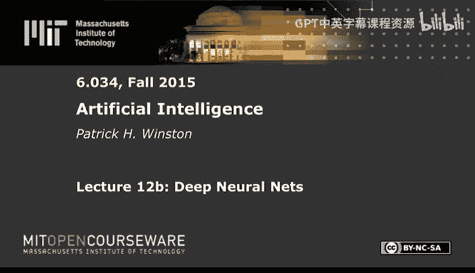

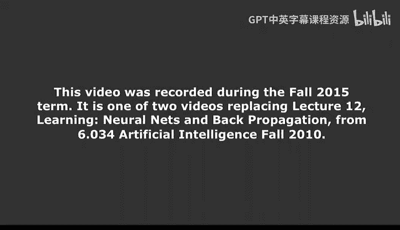

在本节课中，我们将学习深度神经网络的核心概念。我们将从只有两个参数的小型网络开始，逐步探讨如何构建和处理包含数千万参数的复杂网络。课程将涵盖反向传播的计算优化、卷积与池化操作、自编码器原理以及输出层的概率化处理（Softmax）等关键主题。

---

## 回顾：反向传播的计算优化

上一节我们介绍了小型神经网络中权重更新的计算公式。本节中，我们来看看这些计算背后的核心思想。

在类似下图的神经网络中，性能（基于输出）要影响后方权重的改变，必须通过有限数量的中间输出变量（如 y1）进行传递。虽然网络中的路径数量可能呈指数级增长，但实际的影响方式是有限的。


计算性能 `P` 对权重 `W` 的偏导数时，我们使用链式法则进行展开。例如，对于权重 `W1` 和 `W3` 的偏导数公式如下：

```
∂P/∂W1 = (∂P/∂y1) * (∂y1/∂h1) * (∂h1/∂W1) + (∂P/∂y1) * (∂y1/∂h2) * (∂h2/∂W1)
∂P/∂W3 = (∂P/∂y1) * (∂y1/∂h1) * (∂h1/∂W3) + ...
```

观察这些公式可以发现，计算中存在大量冗余。例如，在计算 `∂P/∂W1` 和 `∂P/∂W3` 时，开头的部分 `(∂P/∂y1)` 是相同的。更重要的是，公式内部的某些中间计算结果（例如 `∂y1/∂h1`）在计算下游权重更新时已经被计算过，并且可以被上游权重的计算复用。

因此，核心优化思想是：**已计算的结果无需重复计算**。这使得整个计算过程的复杂度与网络深度呈线性关系，而非指数关系。

---

## 神经元与点积运算

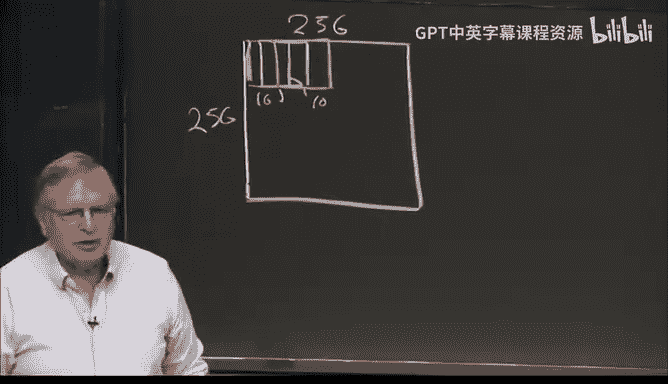

在深入讨论深度网络之前，我们再看一下单个神经元的结构。

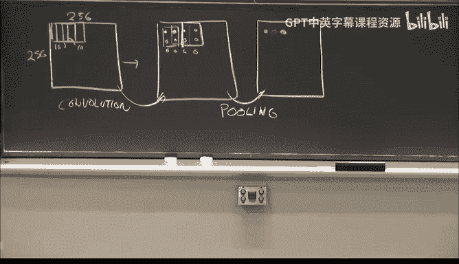

一个神经元接收多个输入 `x`，每个输入乘以对应的权重 `w`，然后在一个求和单元中相加，最后通过一个非线性函数（如Sigmoid）输出。其计算可以表示为：

**公式：** `z = σ(∑ (w_i * x_i) + b)` 或 **向量形式：** `z = σ(w·x + b)`

这里的 `∑ (w_i * x_i)` 正是**点积**运算。这表明，如果神经网络以类似方式工作，那么我们大脑中可能也在进行着基本的点积运算。

---

## 深度网络：卷积与池化 🏔️

现在，让我们进入今天讨论的核心：深度网络。一个典型的深度网络结构复杂，但其基础构件是可重复的。

以下是深度网络中两个关键操作：

### 卷积操作

卷积操作旨在从原始数据（如图像）中提取局部特征。

*   我们使用一个小的神经元“滤波器”或“核”（例如10x10大小），在输入图像（例如256x256）上滑动。
*   滤波器每滑动到一个位置，就计算该局部区域与滤波器权重的点积（并通过非线性激活），产生一个输出值。
*   这个输出值对应图像中的一个特定位置。滑动覆盖整个图像后，我们就得到了一个“特征图”。


### 池化操作

池化操作旨在对特征图进行下采样，减少数据量并增加特征的平移不变性。

*   在卷积得到的特征图上，我们再次在局部邻域（例如2x2区域）内滑动一个窗口。
*   对于每个窗口，我们取其中的最大值（Max Pooling）或平均值。
*   这个值构成一个新的、更小的特征图。


在实际网络中，我们会使用大量（例如100个）不同的卷积核，每个核提取不同类型的特征。所有核得到的特征图经过池化后，会被展平并输入到后续的全连接神经网络层中，最终通过输出层得到分类结果。

与过去参数少、样本少的小型网络相比，现代深度网络拥有海量参数（如6000万）和训练样本，并利用巨大的计算力实现了令人惊叹的函数逼近能力。

---

## 自编码器：无监督的特征学习

深度网络训练中的一个重要思想是**自编码器**。它的目的是让网络学习数据本身的压缩表示。

自编码器的结构通常如下：
*   **输入层**：接收原始数据。
*   **隐藏层（编码层）**：神经元数量远少于输入层，形成一个“瓶颈”。
*   **输出层**：神经元数量与输入层相同，旨在重建输入。

其训练目标是：**让输出值尽可能接近输入值**。网络被迫将输入信息压缩通过狭窄的隐藏层，然后再重建出来。为了成功做到这一点，隐藏层必须学习到输入数据中最具代表性的特征或一般规律。

**示例演示：识别动物阴影**
假设我们通过动物投射的阴影高度来识别猎豹、斑马和长颈鹿。我们构建一个自编码器，输入是阴影高度，输出目标是重建同样的阴影高度。在训练后，网络虽然不知道动物类别，但其隐藏层已经学习到了“矮”、“中”、“高”这些阴影高度的一般概念，尽管这种“概念”以一种我们难以直观理解的编码形式存在。

自编码器的训练可以逐层进行。训练好一层后，可以固定其权重，将其输出作为下一层自编码器的输入，如此层层堆叠，最终在顶层使用有标签的数据进行微调，完成分类任务。

---

## 输出层：从Sigmoid到Softmax概率

网络的最后一层负责输出最终的分类结果。我们通常使用Sigmoid函数作为神经元的激活函数。对于一个输出神经元，其输出 `z` 可以表示为：

**公式：** `z = 1 / (1 + e^-(w·x - T))`

其中 `w` 是权重，`T` 是阈值。调整 `T` 可以左右移动Sigmoid曲线，调整 `w` 可以改变曲线的陡峭程度。

我们可以将输出值 `z` 解释为“输入属于某个类别”的**概率**。训练的目标就是调整参数 `w` 和 `T`，使得对于所有训练样本，观察到这些样本数据的**联合概率最大化**。例如，正样本应落在Sigmoid曲线的高概率区域，负样本应落在低概率区域。

**演示说明**
通过调整Sigmoid曲线的形状，可以最大化观察到给定正负样本集合的概率。这直观地展示了输出层参数学习的本质。

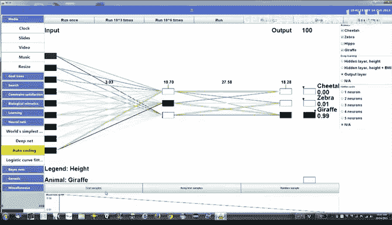

然而，当存在多个类别（如1000类）时，我们会有多个输出神经元，每个输出一个值。为了将其转化为所有类别上的概率分布，我们使用 **Softmax** 函数：

**公式：** `P(class_i) = e^(z_i) / ∑_j e^(z_j)`

Softmax将所有输出值归一化，使得每个输出都可以被解释为该类别的概率，并且所有类别的概率之和为1。这正是我们在图像分类结果中看到的“Top-5”概率列表背后的原理。

---

## 组合策略与Dropout技术

我们可以将自编码器学到的特征表示与Softmax分类器结合起来：
1.  首先，用无标签数据以自编码器方式预训练网络隐藏层。
2.  然后，移除自编码器的输出重建层，保留输入到隐藏层的权重。
3.  最后，添加一个新的Softmax输出层，并用有标签数据仅训练这个输出层（通常也会微调前面几层）。这种方法往往能取得良好效果。

深度网络训练中的一个常见问题是陷入局部最优。**Dropout** 是一种有效的正则化技术：
*   在每次训练迭代中，随机“丢弃”（临时移除）网络中的一部分神经元。
*   每次迭代丢弃的神经元集合都不同。
*   这可以防止神经元之间产生复杂的协同适应，迫使网络学习更鲁棒的特征，从而有助于避免陷入局部最优，相当于将尖锐的局部极值“平滑”成了鞍点。

**演示说明**
实验表明，宽而深的网络更容易训练。如果一开始就使用一个非常窄的网络（每层只有2个神经元），它很容易陷入局部最优而无法学习。而一个较宽的网络则能成功训练。即使在训练后逐步剪枝（模拟Dropout的极端情况），宽网络也能快速找到新的解决方案，这说明了宽度对于逃离局部最优的重要性。

---

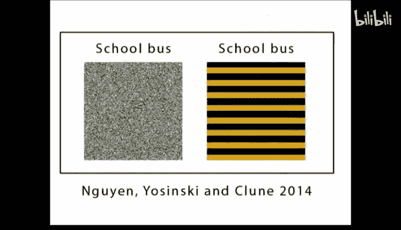

## 深度网络的特性与局限 🧐

深度神经网络是工程上的奇迹，取得了巨大成功，但它们“看”世界的方式与人类不同。


*   **对抗性样本**：对图像进行人眼难以察觉的微小改动，就可能导致网络以高置信度做出完全错误的分类。这表明网络依赖于我们不易理解的局部特征组合。
*   **关注纹理而非形状**：一些研究发现，网络可能更关注图像的局部纹理模式，而非全局形状结构。
*   **“脑补”现象**：通过技术手段，可以找到一些在人类看来是抽象纹理或毫无意义的图案，但网络却以高置信度将其识别为具体物体（如“杠铃”、“蟋蟀”）。这说明网络决策所依赖的特征与人类的语义理解相去甚远。

**结论**：深度神经网络是强大的模式识别和函数逼近工具，但它们的工作机制是黑盒的，其内部表示难以解释。它们执行的是复杂的统计关联，而非人类意义上的“理解”或“感知”。

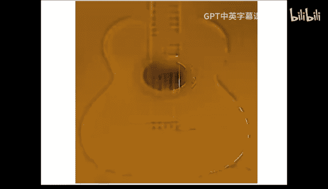

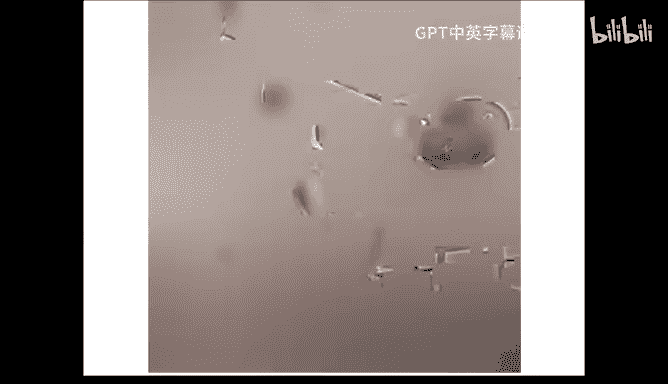

---

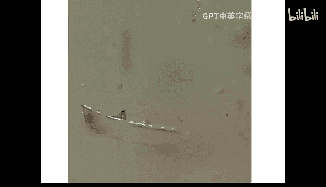

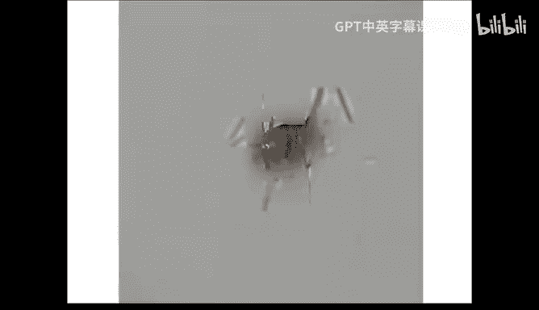

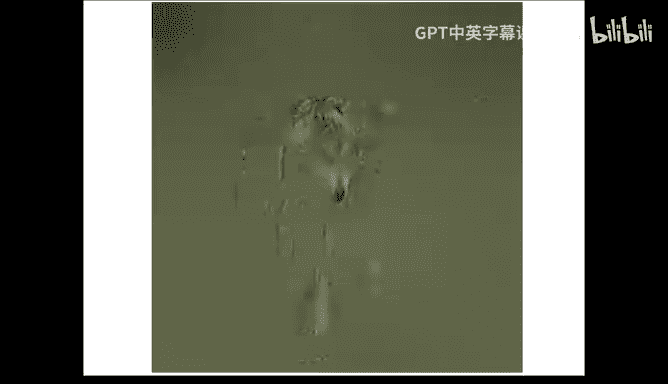

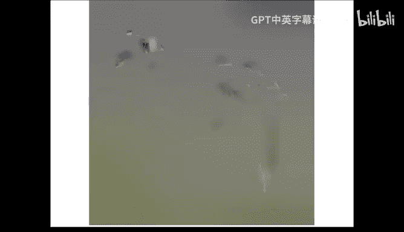

本节课中我们一起学习了深度神经网络的核心构件：计算高效的反向传播、卷积与池化操作、用于特征学习的自编码器、输出层的概率化解释（Softmax）以及防止过拟合的Dropout技术。我们也探讨了深度网络令人惊叹的能力及其与人类认知方式的根本差异。理解这些基础概念，是进入现代人工智能实践的重要一步。