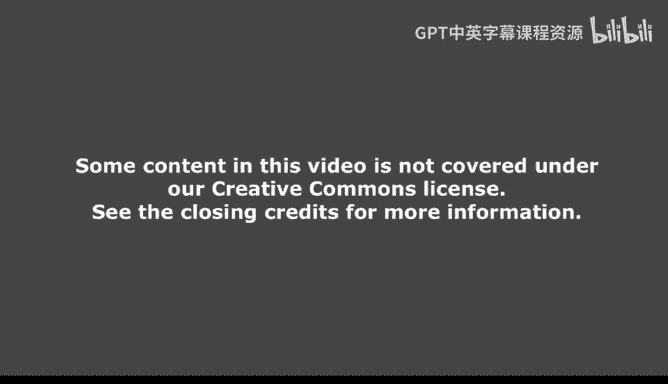
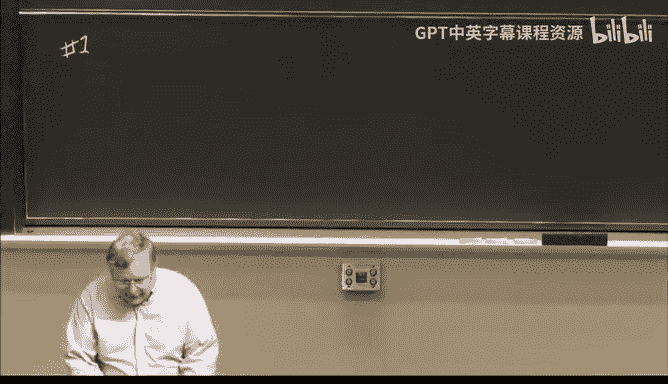
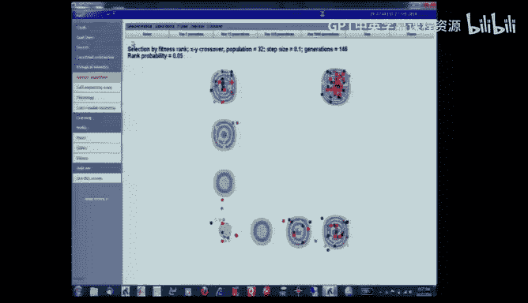
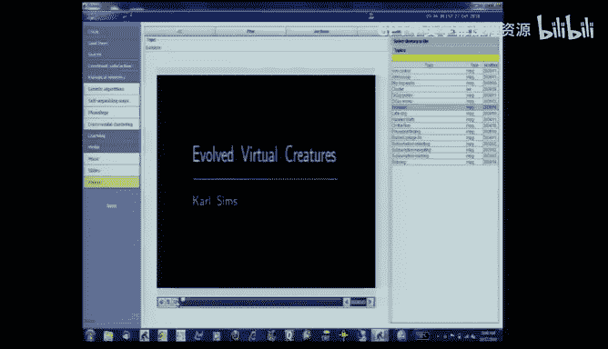

# 14：遗传算法 🧬

在本节课中，我们将学习一种受生物学启发的优化算法——遗传算法。我们将探讨其基本概念、工作原理、实现细节，并通过实例了解其应用与局限性。

---

## 概述

遗传算法是一种模仿自然选择和遗传机制的搜索与优化算法。它通过模拟生物进化过程中的选择、交叉和变异等操作，在解空间中寻找问题的最优解。本节课我们将从生物学基础出发，逐步构建一个完整的遗传算法模型。

---

## 生物学基础：有性生殖 🧬

上一节我们介绍了遗传算法的灵感来源。本节中，我们来看看其背后的生物学原理——有性生殖的过程。

一个细胞包含细胞核，细胞核内有来自父母的染色体。在普通的有丝分裂中，染色体会复制，然后平均分配到两个子细胞中。

但在有性生殖中，过程更为复杂。父母的染色体会缠绕、断裂并重组。因此，产生的生殖细胞中的染色体不再是纯粹的“粉色”或“蓝色”，而是混合体。这些细胞进一步分裂，最终形成包含重组后染色体的配子。当两个配子结合时，便形成了一个新的个体。

需要指出的是，重组发生在祖父母辈的染色体上，而非父母的染色体。这个过程充满了随机性，为后续的算法模拟提供了“选择”和“干预”的空间。

这一切都始于染色体。在计算机科学中，我们通常用二进制字符串来模拟染色体。

---

## 遗传算法基本流程 🔄

理解了生物学基础后，我们来看看如何将其转化为算法。遗传算法的核心流程是一个循环，包含以下关键步骤：

以下是算法的主要步骤：

1.  **初始化种群**：随机生成一组初始的“染色体”（例如二进制字符串）。
2.  **变异**：以一定概率随机改变染色体上的某些位（如0变1，1变0）。这模拟了复制错误或外界干扰。
3.  **交叉**：选择两个“亲代”染色体，交换它们的一部分，生成新的“子代”染色体。这模拟了有性生殖中的重组。
4.  **基因型到表现型映射**：将染色体（基因型）解码为具体的个体（表现型），例如一个参数组合、一个程序或一个设计方案。
5.  **适应度评估**：根据预设的目标函数，计算每个个体的适应度（一个数值，越高越好）。
6.  **选择**：根据适应度，以一定的概率选择个体进入下一代种群。适应度高的个体被选中的概率更大。
7.  **循环**：将选出的个体作为新的种群，回到步骤2，开始下一代演化。

在整个流程中，设计者需要在每个环节做出大量选择，例如变异率、交叉方式、适应度计算方法和选择策略等。

---

## 适应度到选择概率的映射 📊

选择步骤是将适应度转化为生存概率的关键。本节中我们来看看几种不同的映射方法。

### 方法一：比例选择

最直接的方法是将个体的适应度占总适应度的比例作为其被选中的概率。

**公式**：
`P(i) = fitness(i) / Σ(fitness)`

其中，`P(i)` 是个体 `i` 被选中的概率，`fitness(i)` 是其适应度。这种方法简单，但要求适应度必须为非负数，且其绝对数值的大小会影响概率分布。

### 方法二：排序选择

比例选择依赖于适应度的具体数值，这可能不够稳定。排序选择则只关注个体在种群中的相对排名。

**工作原理**：
适应度最高的个体有固定概率 `P_c` 被选中。如果它未被选中，则适应度第二高的个体有 `(1 - P_c) * P_c` 的概率被选中，依此类推。排名第 `k` 的个体被选中的概率为：

**公式**：
`P(k) = (1 - P_c)^(k-1) * P_c`

这种方法消除了适应度绝对值的影响，更关注个体间的相对优劣。

### 方法三：兼顾适应度与多样性

前两种方法可能导致种群过早收敛于局部最优解。为了解决这个问题，可以在选择时同时考虑个体的适应度排名和其与已入选个体的“差异度”排名。

**工作原理**：
1.  计算每个候选个体的适应度排名。
2.  计算每个候选个体与当前已入选下一代的所有个体之间的差异度（例如，基因型之间的汉明距离或表现型之间的欧氏距离），并得到差异度排名。
3.  综合这两个排名（例如，求加权和或使用帕累托前沿思想），优先选择那些既优秀又与众不同的个体。

这种方法有助于维持种群的多样性，避免早熟收敛，从而更有可能找到全局最优解。

---

## 实例演示：寻找函数最优值 📈

理论需要实践检验。本节我们将通过一个可视化实例，观察遗传算法如何在一个多峰函数空间中寻找最大值。

我们定义了一个二维函数作为适应度地形，目标是找到函数的最大值点（位于右上角）。算法开始时，种群中只有一个位于左下角的红点。

*   **染色体表示**：`(x, y)` 坐标对。
*   **变异操作**：随机微调 `x` 或 `y` 的值。
*   **交叉操作**：交换两个染色体的 `x` 或 `y` 值。

**运行观察**：
*   仅使用变异时，算法像爬山法一样，容易陷入局部最大值。
*   加入交叉操作后，情况有所改善，但面对复杂地形（如存在“鸿沟”的地形）时仍可能失败。
*   **增大步长（变异幅度）** 类似于“模拟退火”中的升温过程，能帮助个体跳出局部最优。
*   最终，**结合了适应度排名和多样性排名的选择机制**，能最有效地维持种群探索能力，成功跨越障碍，找到全局最优解。

这个例子说明，调整选择策略（如引入多样性保护）对于算法性能至关重要。

---

## 实际应用与思考 💡

遗传算法在哪些领域有用武之地？我们又该如何客观评价其效果？

### 应用场景

遗传算法适用于解空间庞大、没有直接梯度信息的问题。以下是一些例子：

1.  **计划与调度**：将计划步骤编码为染色体，通过交叉组合不同计划的前后部分，可能产生更优的新计划。
2.  **规则生成**：例如，曾有一个项目使用遗传算法演化预测赛马结果的专家系统规则，通过变异和交叉生成新的“如果-那么”规则。
3.  **虚拟生物演化**：卡尔·西姆斯（Karl Sims）的经典工作展示了如何用遗传算法演化出能游泳、行走、跳跃甚至竞争食物的虚拟生物。其染色体编码了生物体的形态、关节结构和控制逻辑。

### 关键思考：功劳归于谁？

观看虚拟生物演化的演示令人印象深刻，但我们必须冷静思考：成功的功劳主要归于何处？

1.  **解空间的丰富性**：许多问题（如虚拟生物形态设计）的解空间本身包含大量可行甚至优秀的解，几乎任何搜索方法都可能有所发现。
2.  **程序员的智慧**：遗传算法包含大量可调参数（变异率、交叉方式、选择策略、编码方案等）。算法的成功极大程度上依赖于设计者巧妙地设置和调整这些“旋钮”。
3.  **算法本身**：虽然遗传算法提供了并行的、基于种群的搜索框架，但其核心思想（模仿简化版的进化）本身并不“智能”。其效力是前两者结合的产物。

因此，当看到一个成功的遗传算法应用时，更应关注其问题空间的特性以及设计者融入的领域知识，而非将功劳全部归于算法本身。

---

## 总结 🎯

本节课我们一起学习了遗传算法。我们从生物有性生殖的基础知识出发，逐步构建了遗传算法的完整流程，包括种群初始化、变异、交叉、适应度评估和选择。我们重点探讨了三种将适应度映射为选择概率的方法，特别是引入多样性保护的重要性。通过一个寻找函数最优值的实例，我们直观看到了不同策略的效果。最后，我们探讨了遗传算法的实际应用案例，并强调了在评估其成功时，应理性分析功劳的归属——这通常更多地在于丰富的问题空间和精心的算法设计，而非算法概念的简单性。

遗传算法是一个强大的优化工具，但其有效应用离不开对问题的深刻理解和对算法细节的精心打磨。