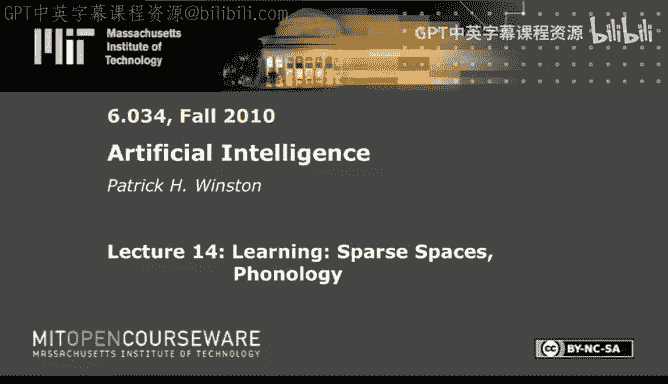
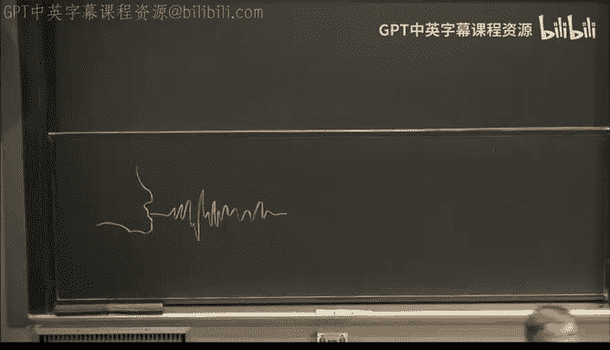
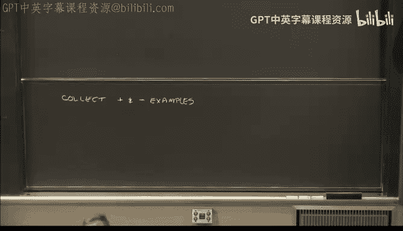
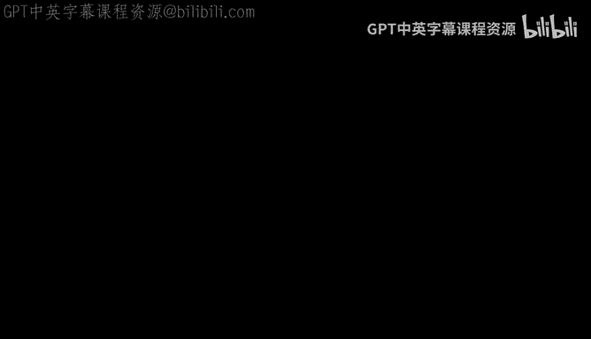

# 15：学习稀疏空间与音系学 📚🎵




在本节课中，我们将探讨学习领域的一些“奇迹”，特别是人类如何在不自知的情况下掌握复杂的语言规则。我们将聚焦于一个具体问题：英语中名词复数的发音规则（例如，为何“cats”以清辅音/s/结尾，而“dogs”以浊辅音/z/结尾）。通过研究Sussman和Yip的工作，我们将了解如何从工程学角度模拟这种学习过程，并深入探讨“稀疏空间”和“恰当表征”等核心概念。

---

## 从问题出发，而非机制 🔍

上一节我们回顾了神经网络和遗传算法等受生物学启发的学习方法。本节中，我们来看看一种不同的思路：**从待解决的具体问题出发，而非执着于某种特定的机制**。

Sussman和Yip的研究始于一个观察：人类（包括非母语者）能无意识地、准确地掌握英语名词复数的发音规则。例如：
*   “cat”的复数是“cats”，结尾是清辅音 /s/。
*   “dog”的复数是“dogs”，结尾是浊辅音 /z/。



学习者从未被明确教授这条规则，却能正确运用。如何让机器也学会这样的规则？这就是他们面临的工程问题。

---

## 音系学基础：区别性特征矩阵 🧬

为了解决这个问题，研究者首先学习了音系学的科学基础，特别是Morris Halle的**区别性特征理论**。

核心思想是：每个音素（语音的最小单位）可以由一组约14个**二元区别性特征**来描述。例如：
*   **浊音性**：发音时声带是否振动。
*   **延续性**：发音时声道是否有阻碍。
*   **刺耳性**：发音时是否用舌头形成气流喷射。

一个单词可以表示为一个**区别性特征矩阵**。矩阵的**列**代表时间序列上的各个音素，**行**代表各个区别性特征。

例如，单词“apples”可以部分表示为：
| 音素 | a | p | l |
| :--- | :--- | :--- | :--- |
| **音节性** | + | - | - |
| **浊音性** | + | - | + |
| **延续性** | + | - | + |
| **刺耳性** | - | - | - |

理论上，14个二元特征可以组合出约2^14=16,000种可能的音素，但任何语言的实际音素都远少于这个数（英语约40个），这表明语音空间是**高度稀疏的**。

---

## 一个用于发音的约束传播机器 ⚙️

基于区别性特征，Sussman和Yip设计了一个概念性的机器，用于解释和产生语音。这个机器的核心是**可逆的约束传播器**。

机器的主要组件包括：
1.  **视觉/概念输入**：感知外部世界（如“两个苹果”）。
2.  **概念寄存器**：存储如`[名词]`、`[复数]`等概念。
3.  **词汇库**：存储单词及其对应的区别性特征矩阵。
4.  **发音缓冲区**：存放待输出的音素序列。
5.  **约束（传播器）**：核心组件，例如“复数约束”。它连接着`[复数]`寄存器、缓冲区中单词的最后一个音素，以及一个表示复数词尾（如/z/）的端口。**关键**在于，信息可以在这些连接中**双向流动**。

**机器工作流程（从概念到发音）**：
1.  视觉系统输入“两个苹果”的概念。
2.  信息流入`[复数]`寄存器和“apple”词条。
3.  “apple”词条将其区别性特征矩阵写入缓冲区（a, p, l）。
4.  随着时间的推移，缓冲区内容左移。
5.  当`[复数]`寄存器为真，且缓冲区中倒数第二个音素（如`l`，它是浊音）满足条件时，“复数约束”被激活。
6.  约束将浊音词尾`/z/`写入缓冲区的末尾位置。
7.  最终，“apples”的音素序列被送出，转化为声音。

由于约束是双向的，这个过程也可以反向运行（从听到的语音推断出概念），这模仿了人类的语言理解过程。

**所有音系规则都体现为这样的约束**。但最大的问题是：**机器如何自动学会这些约束规则？**

---

## 学习算法：从种子泛化 🌱

学习需要正例和反例。以复数规则为例：
*   **正例**：以清辅音/s/结尾的复数，如“cats”。
*   **反例**：以浊辅音/z/结尾的复数，如“dogs”。

以下是学习算法的核心步骤：

1.  **选择种子**：选取一个正例作为起始点（如“cats”的特征矩阵）。
2.  **泛化模式**：将种子转化为一个“模式”，然后开始将其中的某些特征值替换为“不关心”（用`*`表示）。泛化的目的是让这个模式能匹配更多**正例**。
3.  **定向搜索**：采用**束搜索**。泛化顺序有策略：**距离目标位置（复数词尾）越近的音素，其特征越重要，因此越晚被泛化**。通常从最左边的音素开始泛化。
4.  **停止条件**：当泛化到模式**即将覆盖一个反例**时，立即停止。此时得到的模式，就是学到的规则。



**算法核心逻辑**：
```python
seed = select_positive_example()
pattern = create_pattern_from(seed)
while pattern does not cover any negative example:
    generalize_one_feature(pattern) # 按照距离策略泛化一个特征
return pattern # 这就是学到的规则
```

通过这个算法，系统可以从例子中自动归纳出如下的音系规则：
*   如果单词**最后一个音素是清辅音、非刺耳音**，则复数加清辅音`/s/`（如cats）。
*   如果单词**最后一个音素是浊辅音**，则复数加浊辅音`/z/`（如dogs）。
*   如果单词**最后一个音素是刺耳音**（如/s/, /z/, /ʃ/），则复数加`/ɪz/`（如beaches）。

这些规则与语言学教科书中的描述一致。

---

## 为何有效？稀疏空间的魔力 ✨

上一节我们介绍了学习算法，本节中我们来看看它为何能成功。Sussman和Yip认为，关键在于**高维稀疏空间**的特性。

*   **易于线性分离**：在高维空间中，即使数据点在低维投影上混杂，也更容易找到一个超平面（决策边界）将其完美分开。语音特征空间有14维，而实际音素只占据其中极少的点（稀疏），这使得寻找分离规则变得简单。
*   **保证区分度**：另一种观点是，如果音素随机散布在高维空间中，根据中心极限定理，它们彼此间的距离会大致相等，这保证了音素之间有良好的区分度，便于感知和学习。

然而，对实际英语音素的分析显示，元音之间的特征差异较小，更容易混淆；而辅音则更容易区分。这说明了实际语言系统在利用稀疏空间时，也考虑了感知和发音的约束。

---

## 方法论启示：马尔式问题求解法 🧠

Sussman和Yip的工作是遵循David Marr提出的问题求解范式的优秀案例。Marr认为，智能系统研究应遵循以下步骤：


1.  **明确计算问题**（What）：要解决什么问题？（例如：学习音系规则。）
2.  **设计表征**（How）：选择什么信息表征？（例如：区别性特征矩阵。）
3.  **确定算法**（How）：用什么算法处理表征？（例如：基于束搜索的泛化算法。）
4.  **实现机制**（How）：如何在物理/生物系统上实现？（例如：约束传播网络。）
5.  **实验验证**。

**关键启示是反对“机制迷恋”**：不要先迷恋某种机制（如神经网络），然后试图用它解决所有问题。而应该**从问题本身出发，寻找或设计最合适的表征和算法**。好的表征应具备：
*   **显性化关键信息**：让对解决问题至关重要的信息变得明显（如区别性特征）。
*   **暴露约束**：使得问题中的内在约束易于被算法利用。
*   **局部性**：允许通过观察局部信息来理解或推导整体解决方案。

---

## 总结 📝

本节课中我们一起学习了：
1.  **从问题出发**的重要性，以英语复数发音规则的学习为例。
2.  音系学的**区别性特征**理论，它将语音表示为高维稀疏空间中的点。
3.  Sussman和Yip设计的**约束传播机器**，展示了音系规则如何被表示和运用。
4.  一种**从种子泛化的学习算法**，它能够从正反例中自动归纳出正确的音系规则。
5.  高维**稀疏空间**的特性如何使得这类学习成为可能。
6.  David Marr的**问题求解范式**为我们提供了进行AI研究的科学方法论，强调**恰当的表征**是成功的关键。




这项研究展示了如何将严谨的工程思维与对人类认知奥秘的探索相结合，是人工智能与认知科学交叉领域的经典范例。