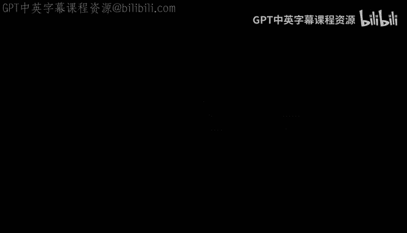
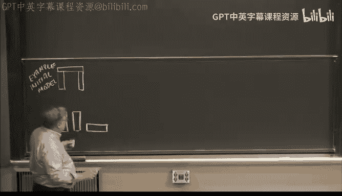
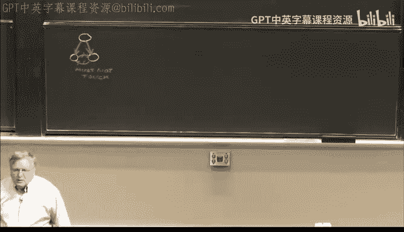
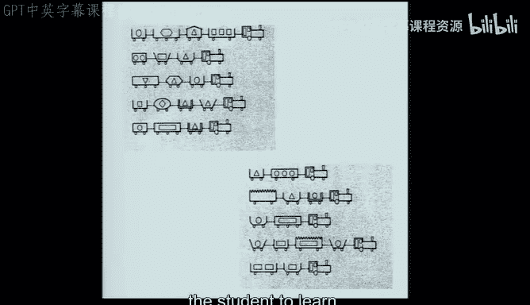
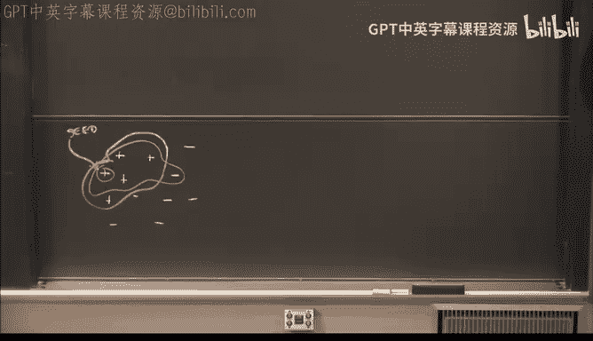
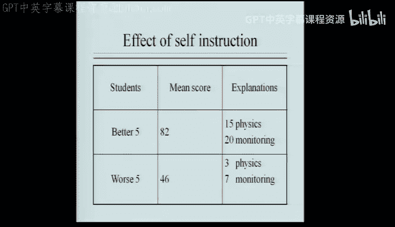
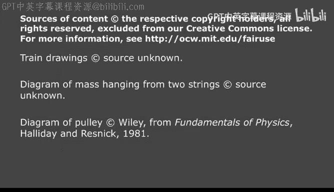
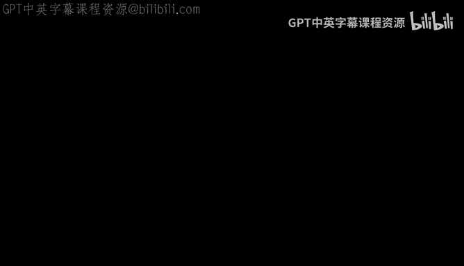

# 16：学习、近似反例与适宜条件 🧠

在本节课中，我们将学习一种独特的学习方法，它能让机器像人类一样，仅通过少量甚至单个例子就学到明确的知识。这与需要海量数据的传统学习方法截然不同。我们还将探讨如何有效地组织和表达思想，使其更具影响力。

---

## 从单个例子中学习：拱门案例 🏛️

上一节我们讨论了良好表示的重要性。本节中，我们来看看如何通过精心挑选的例子进行高效学习。

假设你是一个火星人，不知道什么是“拱门”。我首先向你展示一个拱门的例子。

这是一个初始模型。它的符号化描述可能是一个由两个支撑物和一个顶部横梁组成的结构，支撑关系是关键。

### 学习第一步：发现必要条件

接着，我展示一个**近似反例**。它看起来很像拱门，但有一个关键区别。

这个结构不是拱门。比较它与初始模型的描述，唯一的区别是底部的支撑关系消失了。由此，我们可以立即学到：**支撑关系是拱门的必要条件**。我们将模型中的“支撑”关系升级为“必须支撑”关系。

**核心概念：** 通过比较正例（拱门）和近似反例（非拱门但相似），识别出缺失的**关键特征**，从而进行**特化**学习。

### 学习第二步：发现禁止条件

现在，展示另一个近似反例。

这个结构也不是拱门。与当前模型比较，唯一的区别是两个支撑物之间出现了“接触”关系。由此我们学到：**支撑物之间禁止接触**。我们在模型中增加“禁止接触”关系。

### 学习第三步：泛化无关特征

然后，我展示另一个**正例**，它与初始模型几乎一样，只是顶部被涂成了红色。

这仍然是拱门。比较发现，唯一区别是颜色。我们因此学到：**顶部的颜色不是关键**。我们将颜色要求从“必须是白色”泛化为“可以是白色或红色”。如果后续看到蓝色顶部也是拱门，我们可以进一步泛化为“颜色无关紧要”。

### 学习第四步：在概念层次中泛化

最后，展示一个顶部是楔形砖而非长方形砖的拱门。

这仍然是拱门。我们学到：**顶部的具体形状可以变化**。如果我们的知识表示中有概念层次（例如，“砖块”和“楔形”都属于“积木”类），我们可以将模型泛化为“顶部是一个积木”。

通过仅仅几个步骤，我们就学到了关于拱门的多个明确规则，包括必要条件、禁止条件以及哪些特征可以泛化。

---

## 学习中的启发式方法 🔧

上述过程使用了一系列具体的启发式方法来修改模型。以下是它们的名称和作用：

*   **要求链接启发式**：将某个关系标记为**必须存在**（从正例与近似反例的差异中学到，属于**特化**）。
*   **禁止链接启发式**：将某个关系标记为**禁止存在**（从正例与近似反例的差异中学到，属于**特化**）。
*   **扩展集合启发式**：扩大某个属性的可选值集合（例如，颜色从{白}扩展到{白，红}，属于**泛化**）。
*   **丢弃链接启发式**：完全忽略某个属性（例如，颜色无关，属于**泛化**）。
*   **攀爬树启发式**：在概念层次结构中向上移动一层（例如，从“砖块”上升到“积木”，属于**泛化**）。

**规律总结：**
*   **近似反例** 总是导致 **特化**（增加约束）。
*   **扩展的正例** 总是导致 **泛化**（放宽约束）。

---

## 批量学习：火车分类问题 🚂

现在，我们看看如何将这些启发式方法用于批量学习。假设有以下两组火车图片，需要找出区分上排和下排火车的描述。

以下是程序可能的工作流程：

1.  **选择种子**：从上排（正例）中随机选择一个作为初始描述。
2.  **启发式搜索**：应用各种启发式方法（泛化或特化）来修改当前描述，目标是让新描述能覆盖更多正例，同时排除更多反例（下排火车）。
3.  **束搜索控制复杂度**：由于可能修改很多，使用**束搜索**只保留几个最有希望的候选描述，避免组合爆炸。
4.  **迭代优化**：重复步骤2和3，直到找到一个能完美区分所有正例和反例的描述。

这种方法（如Mikalski的AQ算法）曾成功用于诊断大豆疾病，其生成的规则甚至优于植物病理学教科书。

---

## 适宜条件与教学艺术 🧑‍🏫

高效学习不仅取决于学习算法，还依赖于教学环境。**适宜条件**描述了教师和学生之间为了有效学习而应满足的“契约”。

### 教师需要了解学生

*   **学生的知识状态**：教师应了解学生的“知识前沿”。学生犯的错误如果源于已知知识点的疏忽，只需提醒；如果源于未接触的前沿知识，则可以借此“教学时刻”推动其知识边界扩展。
*   **学生的学习方式**：学生的信息处理能力有限（如人类的工作记忆有限）。教师需要据此组织教学序列，一次呈现适量信息。例如，对人类更适合“拱门”式的渐进示例教学，而对计算机则适合批量处理。

### 学生需要理解教师

*   **信任**：学生必须相信教师传授的是正确知识。
*   **理解教学风格**：学生需要调整自己以适应教师的风格（如照本宣科型 vs. 思想传递型），以最大化学习效果。

---

## 如何变得更聪明：自我解释的力量 💡

研究表明，“对自己说话”（即自我解释）能显著提升学习效果。

一项关于物理问题解决的研究发现：
*   成绩**较好**的学生在解题过程中平均进行了**35次**自我解释。
*   成绩**较差**的学生平均只进行了**10次**自我解释。
*   自我解释不仅包括物理知识的复述（如“我应该画个受力图”），也包括对解题过程的监控（如“我卡住了”）。

**启示**：像机器学习程序一样，主动为所学内容构建内部描述和解释，通过对比、提问和总结来深化理解，这能有效提升你的学习能力。

---

## 如何包装你的思想：成名的五个要素 ⭐

为了让你的想法产生更大影响（无论是申请教职、寻求投资还是出版书籍），可以借鉴“拱门学习”研究广为人知的五个特点：

1.  **符号**：一个易于记忆的视觉标志。例如，“拱门”本身。
2.  **口号**：一个简短有力的口头标签。例如，“**通过近似反例进行单次学习**”。
3.  **惊喜**：挑战普遍认知的意外发现。例如，机器竟能从**单个例子**中学到明确知识，而非需要海量数据。
4.  **突出点**：一个特别引人注目、易于传播的核心思想。例如，“**近似反例**”这个概念。
5.  **故事**：将思想嵌入一个叙事框架中。人们天生喜欢并容易记住故事。

审视你的演示或论文，如果包含了这五个要素，它将更容易被记住、讨论和传播。

---

## 总结 📚

本节课我们一起学习了一种强大而高效的学习范式：
1.  通过**正例**与**近似反例**的对比，机器可以进行**单次学习**，快速掌握概念的核心约束（必要条件、禁止条件）和可变特征（泛化）。
2.  学习过程运用了**特化**和**泛化**两类启发式方法。
3.  有效的学习依赖于师生间的**适宜条件**，包括对彼此状态和能力的理解。
4.  **自我解释**是提升人类学习效率的关键策略。
5.  精心**包装思想**（符号、口号、惊喜、突出点、故事）能极大地增加其影响力和传播力。

这不仅是一门关于人工智能的课，也是一门关于如何有效思考、学习和表达的课。