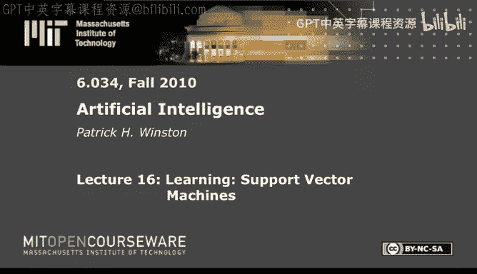
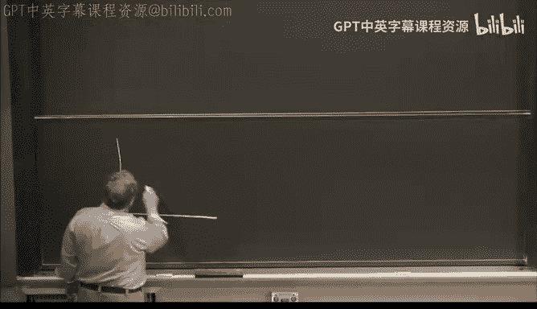
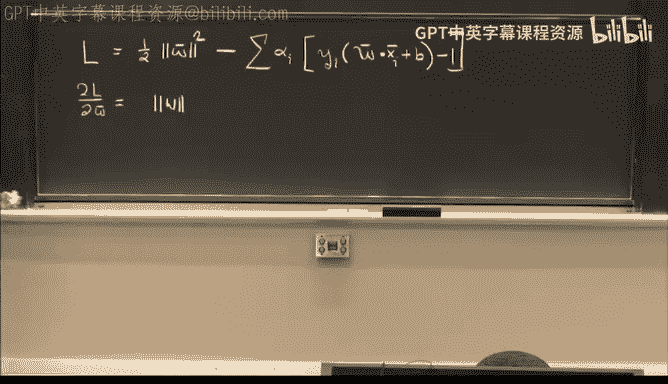
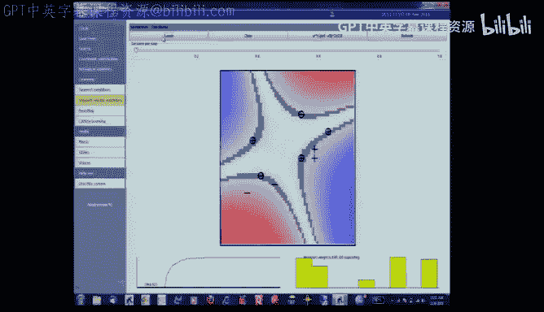
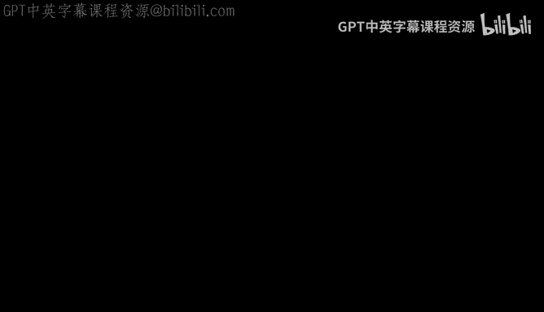

#  17：支持向量机 📈

在本节课中，我们将要学习一种非常强大且优雅的机器学习算法——支持向量机。我们将从最基础的决策边界概念出发，逐步推导出支持向量机的核心思想，并理解它为何如此有效。

---

## 从决策边界说起

上一节我们讨论了如何通过学习概念来划分空间。现在，我们回到起点，思考如何用决策边界来划分空间。

我们可以用神经网络、最近邻法或ID3决策树来绘制决策边界，这些都是简单且经常有效的方法。然而，今天我们将探讨一个非常精妙但实现简单的想法——支持向量机，这是每个机器学习实践者工具箱中必备的工具。

支持向量机由弗拉基米尔·瓦普尼克提出。它的核心思想是：当我们有一些正样本和一些负样本时，我们想画一条直线（或超平面）来分隔它们。但问题是，应该画哪条直线？

*   这条线好吗？可能不太好。
*   这条线呢？它虽然分隔了样本，但离负样本太近了。

也许我们应该画一条像这样的线，目标是构建一条**最宽的“街道”**来分隔正负样本。这就是所谓的“最宽街道”法。

---

## 构建决策规则

首先，我们思考如何利用这条决策边界来制定规则。

假设我们有一个向量 **W**，它垂直于街道的中线（即垂直于“路缘”）。我们还有一个指向某个未知点 **U** 的向量。我们想知道这个未知点是在街道的右侧还是左侧。

我们可以将向量 **U** 投影到垂直于街道的向量 **W** 上。投影的长度（或与之成比例的值）越大，点离中线越远，也就越可能位于街道的“正确”一侧（即正样本侧）。

因此，我们可以制定规则：如果 **W · U**（点积）大于等于某个常数 **C**，则判定为正样本。为方便起见，我们通常将其重写为：

**决策规则： W · U + B ≥ 0**

这里，**B** 是一个常数（实际上 **C = -B**）。问题在于，我们既不知道 **B** 该取何值，也不知道 **W** 具体是哪个（只知道它垂直于街道中线，但长度任意）。目前约束还不够。

---

## 施加约束条件

接下来，我们需要施加额外的约束，以便能计算出具体的 **B** 和 **W**。

我们要求对于**正样本**，决策函数的值至少为 1；对于**负样本**，决策函数的值至多为 -1。这样，所有样本的决策函数值在 -1 和 +1 之间，形成了一个间隔。

为了数学上的便利，我们引入一个新变量 **yᵢ**：
*   **yᵢ = +1** 对于正样本
*   **yᵢ = -1** 对于负样本

利用 **yᵢ**，我们可以将上述两个约束统一成一个简洁的表达式：

**约束条件： yᵢ (W · xᵢ + B) ≥ 1**

对于所有样本 **i** 都成立。对于那些恰好落在“路缘”（即街道边界）上的样本，这个表达式将等于 1。

---

## 计算街道的宽度

我们的目标是让这条街道尽可能宽。那么，街道的宽度是多少呢？

设 **x₊** 是一个正样本边界点（在路缘上），**x₋** 是一个负样本边界点。那么宽度方向上的向量是 **x₊ - x₋**。街道的实际宽度是这个向量在垂直于街道的单位向量方向上的投影。

由于 **W** 是垂直于街道的向量，单位向量是 **W / ||W||**（**W** 的模长）。因此，街道宽度为：

**宽度 = (x₊ - x₋) · (W / ||W||)**

利用我们之前为路缘点设定的约束条件（**yᵢ (W · xᵢ + B) = 1**），我们可以推导出：

**宽度 = 2 / ||W||**

这是一个关键结论。为了最大化街道宽度，我们需要最大化 **2 / ||W||**，这等价于最小化 **||W||**。为了后续数学处理的方便，我们通常最小化 **½ ||W||²**。

---

## 引入拉格朗日乘子

现在，我们面临一个优化问题：在约束条件 **yᵢ (W · xᵢ + B) ≥ 1** 下，最小化 **½ ||W||²**。

这是一个带约束的优化问题，我们可以使用拉格朗日乘子法。我们构造拉格朗日函数 **L**：

**L = ½ ||W||² - Σ αᵢ [ yᵢ (W · xᵢ + B) - 1 ]**

其中，**αᵢ** 是拉格朗日乘子（**αᵢ ≥ 0**）。接下来，我们分别对 **W** 和 **B** 求偏导数，并令其为零。

1.  **对 W 求偏导：**
    **∂L/∂W = W - Σ αᵢ yᵢ xᵢ = 0**
    这意味着：
    **W = Σ αᵢ yᵢ xᵢ**
    这个结果非常重要！它表明最优的权重向量 **W** 是训练样本的**线性组合**。

2.  **对 B 求偏导：**
    **∂L/∂B = - Σ αᵢ yᵢ = 0**
    这意味着：
    **Σ αᵢ yᵢ = 0**

---

## 对偶形式与核函数

将 **W = Σ αᵢ yᵢ xᵢ** 代回拉格朗日函数，经过一系列代数运算（此处省略详细推导），我们可以得到原问题的对偶形式：最大化以下函数：

**Lₐ = Σ αᵢ - ½ Σ Σ αᵢ αⱼ yᵢ yⱼ (xᵢ · xⱼ)**

约束条件是：**αᵢ ≥ 0** 且 **Σ αᵢ yᵢ = 0**。

同样，最终的决策规则也可以只用样本点积来表示：

**决策规则： Σ αᵢ yᵢ (xᵢ · U) + B ≥ 0**

观察这两个关键公式，我们发现一个美妙的事实：无论是优化过程还是最终的决策规则，都**只依赖于样本之间的点积 (xᵢ · xⱼ)** 以及样本与未知向量之间的点积 **(xᵢ · U)**。

这引出了支持向量机最强大的思想之一——**核技巧**。如果数据在当前空间中线性不可分，我们可以通过一个函数 **Φ** 将其映射到一个更高维（甚至无限维）的特征空间，在那里数据可能变得线性可分。

关键在于，我们不需要知道映射 **Φ** 的具体形式，也不需要在高维空间中直接计算。我们只需要知道在原始空间中计算的某个函数 **K(x, z)**，它恰好等于映射后空间中的点积 **Φ(x) · Φ(z)**。这个函数 **K** 就叫做**核函数**。

以下是一些常用的核函数：
*   **线性核：** `K(u, v) = u · v`
*   **多项式核：** `K(u, v) = (u · v + 1)^n`
*   **径向基函数（RBF）核/高斯核：** `K(u, v) = exp(-||u - v||² / (2σ²))`

---

## 演示与历史

让我们看一些例子。对于线性可分的数据，支持向量机能找到最优分隔线。即使数据不是线性可分的，通过使用合适的核函数（如多项式核或RBF核），我们也能在变换后的空间中有效地将其分离。

支持向量机的历史也很有趣。其核心思想早在20世纪60年代就由瓦普尼克在其博士论文中提出，但由于缺乏计算资源，沉寂了近30年。直到90年代，随着计算能力的提升和在诸如手写数字识别等任务上的成功应用（尤其是核技巧的复兴），支持向量机才一举成为机器学习的主流方法之一。

---

## 总结

本节课中我们一起学习了支持向量机。我们从寻找最宽分隔街道的直观概念出发，逐步推导出其数学形式。关键点包括：
1.  用约束条件 **yᵢ (W · xᵢ + B) ≥ 1** 来定义间隔。
2.  通过最小化 **½ ||W||²** 来最大化间隔。
3.  使用拉格朗日乘子法得到解 **W = Σ αᵢ yᵢ xᵢ**，表明解是样本的线性组合。
4.  最终优化和决策都只依赖于样本间的**点积**。
5.  通过引入**核函数**，我们可以隐式地将数据映射到高维空间，解决非线性问题，而无需直接计算高维映射。

支持向量机提供了一种凸优化方法，能保证找到全局最优解，并且通过核函数具备了强大的非线性处理能力，是机器学习中一个里程碑式的算法。