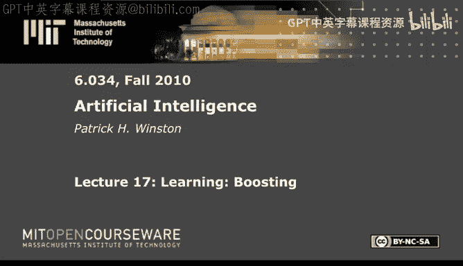
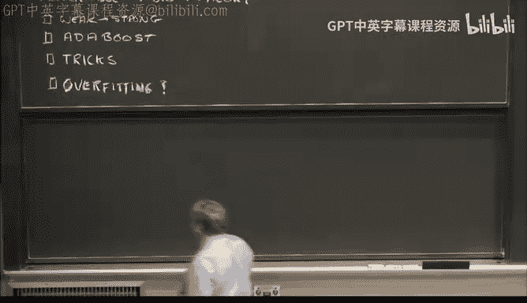
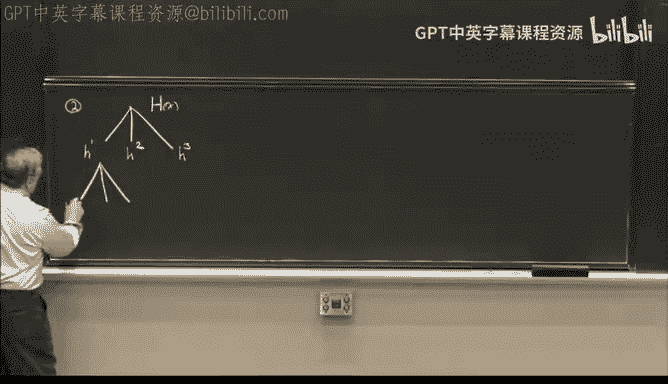
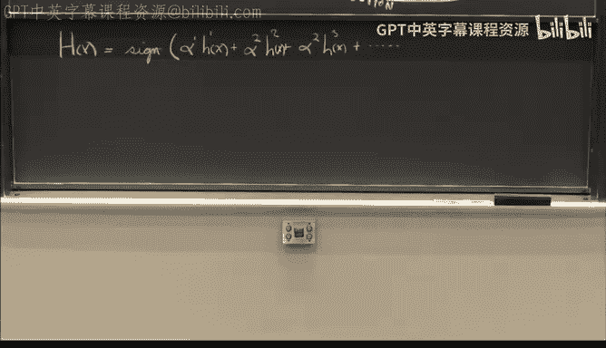
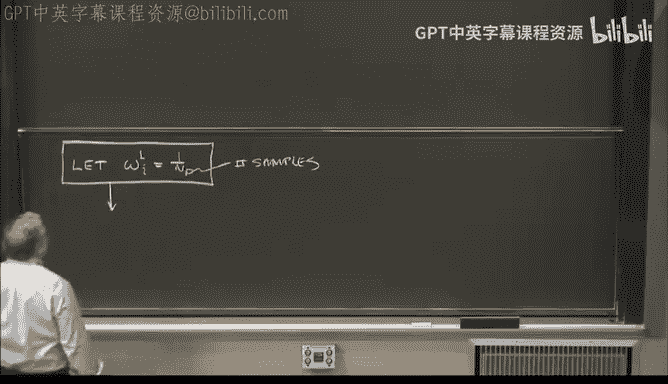
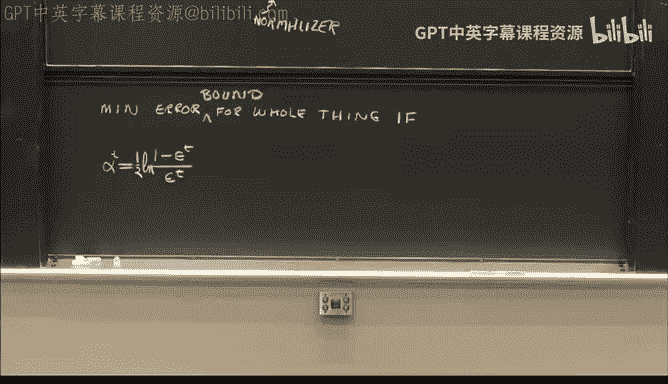
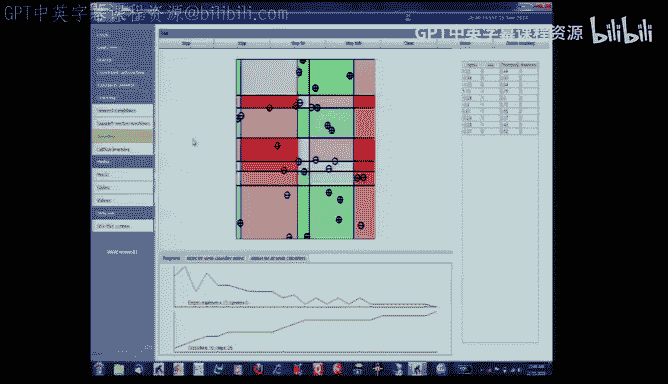
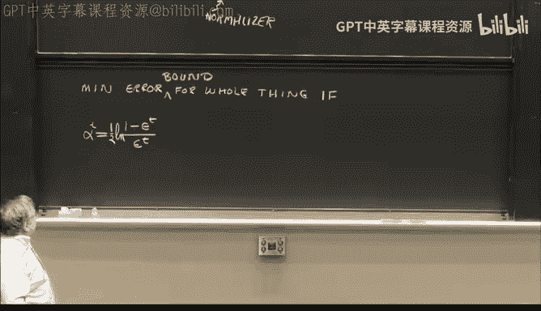
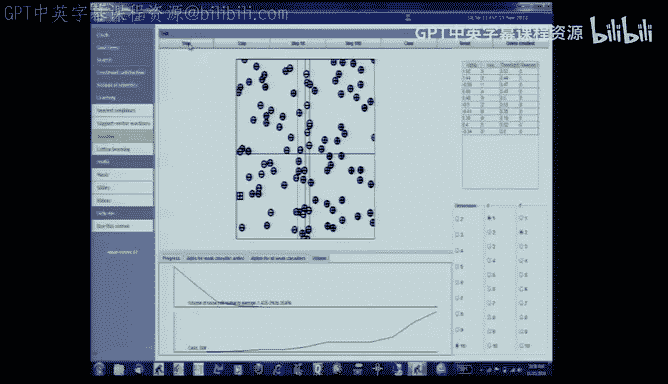
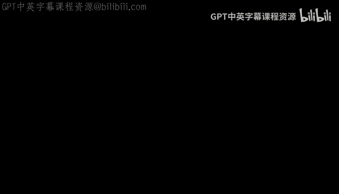

# 18：集成学习与提升法（Boosting）🚀

在本节课中，我们将要学习一种极其强大的机器学习方法——提升法（Boosting）。我们将探讨如何通过组合多个较弱的分类器来构建一个强大的分类器，并理解其背后的核心思想与数学原理。

---

## 概述

我们已经讨论了多种学习方法，包括经典的最近邻和决策树，以及受生物学启发的神经网络和遗传算法。这些方法各有其适用场景和局限性。现在，我们将转向理论家们提出的一些非常卓越的思想。提升法就是其中之一，它通过组合多个弱分类器来形成一个强分类器，是任何学习机制库中必不可少的工具。

---

## 核心思想：群体智慧

到目前为止，我们主要讨论的是使用单一方法解决问题。现在，我们将探讨一个群体是否能比其中的个体更聪明。具体来说，我们将专注于**二元分类**问题，例如判断我手中拿的是粉笔还是手榴弹，或者杯子里是咖啡还是茶。

我们假设有一组可用的分类器，每个分类器 `H` 输出 `+1` 或 `-1`。例如，如果是咖啡则输出 `+1`，是茶则输出 `-1`。通常，现实世界不会给我们完美的分类器，其错误率可能在0到1之间。我们期望错误率尽可能低，但如果一个分类器只比随机猜测（抛硬币）好一点，我们称之为**弱分类器**。关键问题是：能否通过组合多个这样的弱分类器，让它们投票，从而得到一个**强分类器**？

---

## 构建组合分类器

我们可以构建一个大的分类器 `H`，它作用于样本 `x`，其输出取决于各个弱分类器输出的加权和。例如，考虑三个弱分类器 `H1(x)`, `H2(x)`, `H3(x)`。我们将它们相加，然后取结果的符号：

`H(x) = sign( H1(x) + H2(x) + H3(x) )`

这意味着只要三个分类器中有两个是正确的，最终结果就是正确的。我们可以将每个分类器的错误区域想象成样本空间中的不同区域。如果这些错误区域没有大面积重叠，那么投票机制就能持续给出正确答案。然而，如果错误区域重叠严重，投票结果可能比单个分类器更差。这可以作为一个有趣的测验问题。

---

## 提升法算法框架

提升法的核心思想是迭代地构建这个组合分类器。我们不是一次性选择所有分类器，而是逐步添加，并在每一步调整对样本的关注度（权重）。以下是算法的主要步骤：

1.  **初始化权重**：对于所有 `n` 个样本，初始权重设为 `1/n`，即 `W_i^1 = 1/n`。
2.  **迭代训练**：对于每一轮 `t = 1, 2, ...`：
    *   **选择弱分类器**：根据当前的样本权重分布，从候选分类器集合中选择一个错误率最低的弱分类器 `h_t`。
    *   **计算分类器权重**：根据 `h_t` 的错误率 `ε_t`，计算其在该轮组合中的重要性权重 `α_t`。公式为：
        `α_t = (1/2) * ln( (1 - ε_t) / ε_t )`
    *   **更新样本权重**：增加被 `h_t` 错误分类的样本的权重，减少正确分类样本的权重。更新公式为：
        `W_i^{t+1} = (W_i^t / Z_t) * exp( -α_t * y_i * h_t(x_i) )`
        其中 `y_i` 是样本 `i` 的真实标签（+1或-1），`Z_t` 是一个归一化因子，确保所有权重之和为1。
3.  **形成最终分类器**：经过 `T` 轮迭代后，最终的强分类器是所有弱分类器的加权投票结果：
    `H(x) = sign( Σ_{t=1}^{T} α_t * h_t(x) )`

这个算法确保最终分类器的错误率有一个指数级下降的上界，从而保证收敛。

---

## 关键技巧与简化

上述公式看起来复杂，但有两个“救命稻草”可以极大简化计算：

**救命稻草一（权重更新简化）**：
在每一轮更新后，**所有被当前弱分类器正确分类的样本的新权重之和，恰好等于所有被错误分类的样本的新权重之和，且都等于 1/2**。这意味着更新权重时，你不需要计算复杂的对数和指数。你只需要：
*   将所有正确分类的样本的旧权重缩放，使其总和为 1/2。
*   将所有错误分类的样本的旧权重缩放，使其总和也为 1/2。
这样就完成了权重更新，无需计算 `α_t` 或 `Z_t`。

**救命稻草二（减少候选分类器）**：
当我们使用决策树桩（在单个特征上进行一次划分的决策树）作为弱分类器时，需要考虑的划分点数量远少于样本数。实际上，只有那些位于被**错误分类**的样本之间的划分点才是有效的候选。这大大减少了需要评估的候选分类器数量。

---

## 关于过拟合的讨论

许多机器学习方法（如支持向量机、神经网络、决策树）容易过拟合训练数据。但有趣的是，提升法在实践中表现出很强的抗过拟合能力。一个可能的解释是，提升法（特别是使用决策树桩时）会紧密地围绕错误点构建决策边界，以至于为这些错误点“保留”的体积非常小，从而没有给无关的噪声留下空间，避免了过拟合。

---

## 总结

本节课我们一起学习了集成学习中的提升法。我们了解到：
*   提升法通过组合多个弱分类器的投票来构建一个强分类器。
*   其核心是迭代过程：在每一轮中，根据当前样本权重选择最佳弱分类器，计算其权重，然后更新样本权重以更关注之前分错的样本。
*   我们发现了两个关键的简化技巧，使得算法实现变得非常高效。
*   提升法是一种通用且强大的方法，可以与任何类型的基分类器结合使用，并且在实践中对过拟合具有较好的鲁棒性。

提升法是机器学习工具箱中一个真正强大且实用的工具，理解其原理对于掌握现代学习技术至关重要。