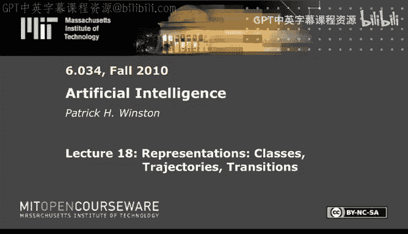
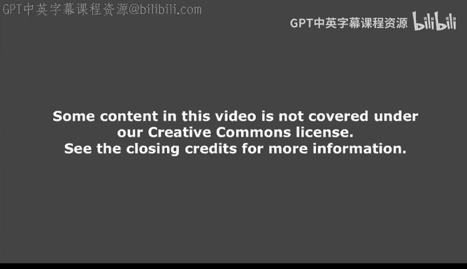
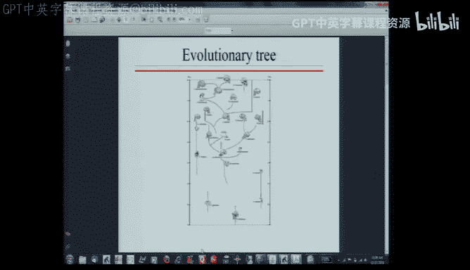
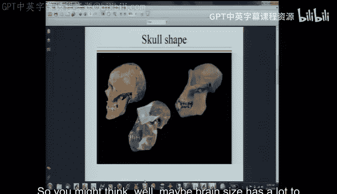
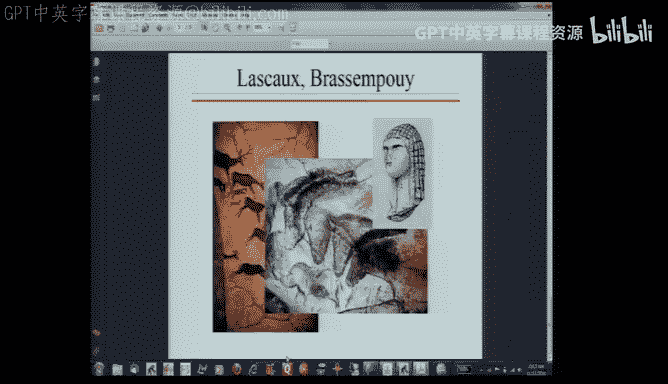
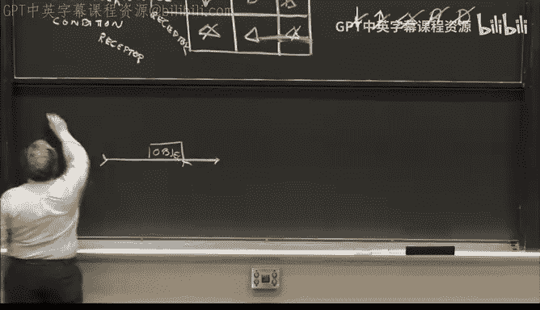
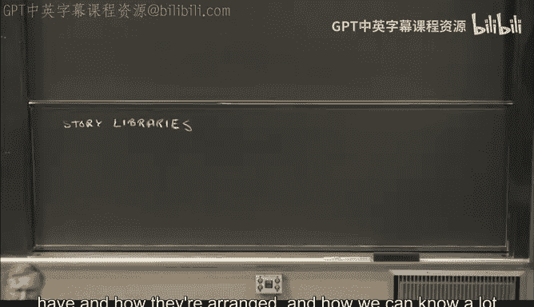
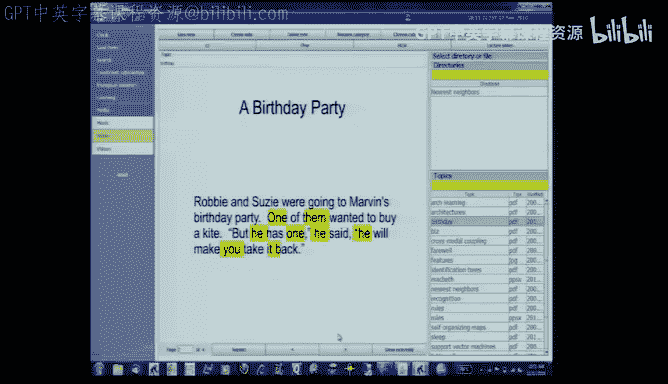
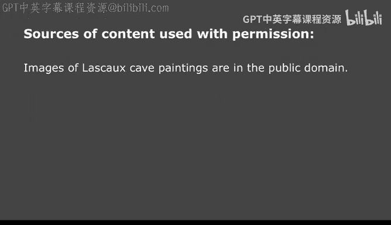

# 19：心智表征——类别、轨迹与转换 🧠

在本节课中，我们将探讨人类智能的本质，特别是我们如何通过内在语言来组织和理解世界。我们将学习几种核心的心智表征方式，包括**类别**、**转换**和**轨迹**，并了解它们如何帮助我们构建故事和理解复杂概念。

---

我们可能会思考人类智能的本质。回顾过去几周讨论的智能形式，例如支持向量机和提升算法，它们虽然能完成非常智能的任务，但这些系统本身并不“知道”自己在做什么。它们缺乏对自身行为的理解，因此无法为我们提供关于人类智能本质的深刻洞见。毕竟，人类是目前已知最智能的存在，我们希望建立一个关于人类智能的模型。

我们可以从多个角度探讨这个问题。首先，让我们从**进化**的视角来看。一些科学家（包括我本人）认为，人类的家族树大致如此。虽然这张图太小看不清细节，但关键点在于：人类存在的时间并不长，大约只有20万年，而恐龙在6000万年前就已灭绝。在进化的一瞬间，人类似乎就接管了世界。

观察这个家族树，一个显著特征是**脑容量在不断增加**。

左边是我们，右边是黑猩猩。黑猩猩的头部主要是嘴，大脑并不多。下图是大约400万年前某种南方古猿的重建图。这表明，我们在拥有发达大脑之前很久就已经开始直立行走了。因此，我们可能会认为脑容量与此有很大关系，事实也确实如此。

我们可以绘制祖先脑容量随时间变化的图表。刚才展示的图片大约来自300万年前。在右上角，不仅有我们智人，还有尼安德特人，他们的大脑可能比我们的还稍大一些。所以，关键并不仅仅是脑容量。

这是尼安德特人的样子（左边）。与我们（右边）相比，存在一些明显差异：他们头部更大，胸腔呈圆锥形，骨盆宽大。人们喜欢推测他们的移动方式，但有一点是明确的：他们成就有限。他们能制造石器，但数万年间他们的石器工具变化不大。在某个事件发生之前，我们智人的情况也大致如此。

这个事件可能发生在非洲南部的一个小群体中，也许不到1000人。证据主要来自DNA研究，结合概率假设和蒙特卡洛模拟。在关于人类如何遍布世界的各种假说中，可能性最高的情景是：非洲南部的一群智人获得了其他群体所没有的某种能力，并迅速占据了主导地位，走出非洲，在极短的时间内完成了这一切。

“这一切”指的是什么？例如，这两幅来自拉斯科、约2.5万年前的壁画。古人类学家普遍认为，这明确证明了当时的人类（我们智人）已经具备了**符号思维**。那个用猛犸象牙雕刻的女性头像（同样来自2.5万年前）也显然是符号性的。人们制作了大量珠宝并进行自我装饰，而尼安德特人似乎从未这样做过。

这种珠宝制作行为似乎可以追溯到更早，可能在7万年前的非洲南部，人们就开始穿孔贝壳并将其用作项链。显然，**某种事情发生了**。撰写相关著作的古人类学家们除了说我们似乎变得“符号化”了之外，也不太清楚如何描述它。并且，这似乎与**语言**有关。

如果你问诺姆·乔姆斯基，他会说（我尽量精确地引用）：他认为这是一种将两个概念结合起来形成第三个概念，而不干扰原始概念，且**没有限制**的能力。每一部分都很重要。“没有限制”这一点将我们与那些可能具备一点点此能力的物种区分开来。我们可以毫无限制地做到这一点。

这是一位语言学家的观点，他大量谈论语言中的“合并”操作和组合子（虽然他们不用“组合子”这个计算机科学术语）。无论它是什么，似乎都发生在那个时期。它并非随着脑容量缓慢增长而发生，而是**突然出现**的。它是大脑增长到足够大后所**启用**的一种能力，但这种能力本身并非推动进化的直接动力。

我相信，无论这种能力是什么，它使得人类能够**讲述和理解故事**，这正是我们与其他灵长类动物的区别所在。这种符号能力，无论其本质如何，实现了叙事和理解，而**所有教育都基于此，这也是我们物种特殊的原因**。

因此，我们今天要讨论的内容，可以看作是上述假说的一种具体实例化，一种思考方式。我们将探讨语言学家所说的“内在语言”——不是我们用于交流的语言，而是我们用于**思考**的语言。它与交流语言密切相关，但可能不完全相同。你们中许多人是双语者。克里斯蒂娜是双语者。克里斯，你是否有过这样的经历：记得某人跟你说过某事，但不记得他们用的是哪种语言？没有？那么你呢，索？如果你有过这种经历……我明白了。你通常不记得，这是一种常见现象。你记得有人说过话，对话有内容，但如果对话者与你说同一种语言，而你身处另一个语言环境，你常常不记得对话是用哪种语言进行的。对吧，朱娜？你记得类似的事情，不确定？她说，有时你不会混淆，因为你总是用特定的语言与特定的人交谈。但许多人报告说，他们有过不记得某事是用哪种语言表达的体验。

那么，我们需要一种内在语言。也许我们可以从一些看似熟悉的东西开始。我们有一个物体，它被其他一些物体支撑着。这些是支撑关系。这是我们称之为**语义网络**的一个例子。它是一个网络，有节点和链接，并且具有意义，“语义”一词即来源于此。

或者，我们可能有另一个这样的例子。有麦克白，有邓肯。麦克白谋杀了邓肯。我们还知道，这导致了“杀死”的发生。最终，邓肯具有一个属性，即“死亡”的属性。这是另一个记录莎士比亚《麦克白》情节中事件的语义网络。

现在，我们可以稍作修饰，引入另外几个概念。首先，我们已经有了**组合子**（那些连接节点的链接的学名）。其次，我们有机会连接链接本身。例如，“谋杀”暗含“杀死”，而“杀死”使我们得出结论：受害者死了。这样，我们就把链接本身当作**对象**来处理，使其成为其他链接的主语或宾语。我们称这个过程为**具体化**。

在人工智能的早期工作中，语义网络无处不在。但是，如果你有一个覆盖整面墙的大网络，你需要某种方式来聚焦其中的某些部分。马文·明斯基为这个想法注入了大量技术内容，并创建了“框架”的概念（也称为“框架”或“模板”）。例如，针对这个谋杀动作，可以有一个谋杀框架，它有一个“施事者”和一个“受害者”。施事者是麦克白，受害者是邓肯。这是在现有基础上添加的一种**局部化**层。

稍后我还会在这个列表中加入“序列”。这个概念在很长一段时间里（在某种意义上至今仍是）停留于此，因为一旦你有了组合子和具体化，你就拥有了几乎通用的东西，可以用它做任何事。但问题在于，它有点像底层的比特层面，类似于汇编代码。它缺乏足够的组织概念来帮助你达到下一个成就水平。

这里还有一个小问题值得提及，那就是**寄生语义**的问题。当我们看那样的图表并说“哦，麦克白谋杀了邓肯，这意味着邓肯是受害者”时，我们知道其中必有动机（也许麦克白想当国王），我们知道所有这些。我们倾向于将这种“知道”投射到机器中。如果你要玩手机，请离开。如果我们把意义投射进去，那是我们的理解，不是机器的理解。因此，大部分意义可以说是“寄生”的——我们是寄生物，将意义投射到那个东西里。将图表放入某种机器形式并不意味着机器知道任何东西。它可能能够推断出一些事情，但它的理解并非基于与物理世界的任何接触。所以我们必须非常担心这个问题。哲学家们会就此打住，去写几本关于这个主题的书。但我们不是哲学家，所以只是提及这个问题，然后继续前进。

因此，我们需要使用语义网络的概念，并必须自问：内在语言的哪些元素最终最有用？它可能非常复杂，但以下是第一个有用的概念：**分类**。

我们知道很多东西，例如，我们知道钢琴，知道工具，知道“Mac”。但我们在不同层次上了解这些事物。当我说“我在想一个工具”时，你能很好地想象出我在说什么吗？答案是否定的，因为“工具”这个概念非常模糊，你很难形成具体的图像。另一方面，如果我说“我在想一个Mac”，这就很有趣了，因为这里存在词汇歧义。你不知道我指的是苹果公司的Mac电脑，还是苹果这种水果。所以这里存在至少两个层面的歧义。

让我们再充实一下。如果我知道我在谈论“钢琴”，你可以形成一幅图像。这似乎是一个更详细的层次，你可以进行“幻觉”（即心理想象）。在更高层次上，你只有“乐器”这个概念。我可以通过写下“锤子”来让你思考一个工具。如果我说“Mac”，我会让你想到苹果（水果）。在这里，我也可以更具体。我可以添加一点细节的细化，说我在想“这个”。你知道这是什么吗？这不是普通的锤子，它是**圆头锤**。在某些圈子里，它被称为“女士锤”，我不知道为什么。它是做什么用的？大多数人买它主要是因为它小巧轻便。但实际上，它是用于金属加工的，用于将一块金属板敲打成烟灰缸之类的东西，或者用于铆接，它是金属工人的锤子。你可能以前不知道这个，但现在至少你有了一个词来挂载这个知识：圆头锤。

所以我们这里有各种层次，从非常具体到非常一般。我们甚至可以为钢琴指定一个更具体的层次，比如“贝森朵夫”钢琴。为什么贝森朵夫特别？我的意思是，它就像鲍德温钢琴一样，有很多钢琴类型。除非你弹钢琴，而且可能除非你是认真的钢琴演奏者，否则你不知道贝森朵夫有什么特别。阿里尔，你知道吗？啊，这个什么包……它底部有一些额外的琴键。大多数人都不知道这一点，除非他们精通钢琴。一些专业钢琴演奏者在面对贝森朵夫钢琴时，甚至需要有人盖住那些额外的琴键，因为它们会干扰他们的周边视觉，导致误触，因为他们不习惯底部有那些额外的琴键。

所以，关于贝森朵夫有这么一个小细节。你可以构建一种图表，从非常一般，到某种基本层次，再到具体层次。在人类知识中，这种图表往往看起来是这样的：这里是“工具”，这里是“锤子”，这里是“圆头锤”。那个出现巨大跳跃的层次，就是从一般到基本层次的过渡。这个基本层次很可能存在，因为它是我们挂载大量知识的层次。我们对钢琴了解很多，所有这些知识似乎都挂载在“钢琴”这个词上，这赋予我们对这个概念的控制力。

所以，这是我们的内在语言元素的第一个例子：将事物组装成**层次结构**的能力，并将关于这些对象的知识挂载在该层次结构的元素上。

但是，既然你有了层次结构中的元素来讨论，你如何讨论它们呢？为了说明，我想考虑这样一种可能性：你正在思考一辆汽车撞向一堵墙。

所以，你需要思考诸如汽车的速度、到墙的距离以及汽车的状况等事物。你还需要考虑碰撞前、碰撞中和碰撞后这三个时间段。你可能想思考如何在这三个时间段内讨论这些对象。

我们可以用**变化的词汇**来做这件事。我们这样做是因为我们相信，人类的大部分思维都是关于“变化引起变化”的思考。这与我们作为工程师所学到的相悖。因为在工程学中，我们学习**状态**。一旦你知道了一个系统的状态，你就知道了预测未来所需的一切。但问题是，在我们的头脑中，思考世界上的一切（包括月相）信息量太大了。所以，我们的思维大多依赖于“变化导致变化”这个理念。这就是为什么我们有一套变化的词汇。

因此，在碰撞前阶段，汽车的速度**没有变化**（有一个表示“无变化”的小符号：无Δ）。到墙的距离**正在减少**。汽车的状况**没有变化**。然后，汽车撞上了墙。所以，汽车的速度**消失**了。到墙的距离**消失**了。汽车的状况将**剧烈变化**。最后，碰撞结束后，汽车的速度**不出现**（即保持为零）。到墙的距离**不变化**。汽车的状况也**不变化**。

这暗示了一种变化的词汇及其用法。这将是我们构建内在语言可能方式的第二个要素。

所以，这是一个特定的概念：**分类**。这是**转换**。在任何声称理解故事的系统里，都会高度重视这种转换的概念。我认为，这个词汇表必须包含：减少、增加、变化、出现和消失。所以，在这样的图表中，你可以有10种情况。我列出了5种，因为对于每一种，都有一个“非”的变体。因此，一个包含10个项目的词汇表，对于帮助你描述正在变化或进行转换的事物大有帮助。我们的词汇表中有很多这样的词，我们在词汇中大量使用它们，它们似乎与视觉紧密相连：我们的朋友**出现**了，猫**消失**了，速度**增加**了。

这是用这类元素对一次碰撞的描述。现在我问你：相机是如何工作的？我可以说，相机之所以工作，是因为一个光子撞击一个光感受器。当我说“一个光子撞向一个光感受器”时，我为什么这么说？这有什么帮助？我这么说，并且它有帮助，是因为它具有**相同的变化模式**。当你谈论汽车撞墙时，你已经知道它是如何工作的。光子的速度、光子到感受器的距离、感受器的状况。像这样的类比，正是我们一直在思考的核心。

无论如何，这是第二种表征。第一种是**类别**，第二种是**转换**。现在，你准备好学习第三种了：**轨迹**。

研究句子的语言学家经常谈论我们许多话语中似乎存在的基本模式。我们很多话语是关于物体沿着**轨迹**移动的。所以我们可以谈论一个**轨迹框架**。

一个轨迹框架将包含以下元素：一个物体沿着一条轨迹移动，最终到达一个目的地。它可能从一个源头出发。它可能由某种施事者安排。施事者可能借助某种工具使运动发生。可能有一个协助者在这里帮忙（共同施事者）。此外，还可能有一个受益者（因该动作而受益的人）。有时，运动由一种交通工具安排。所以这里有很多“槽位”，类似于描述动作的框架中的槽位，其中许多涉及沿轨迹的运动。

在语言中，我们倾向于以某种方式修饰这些元素，具体取决于语言。在某些语言中，通过句子中的位置来声明；在英语中，通常通过介词来帮助确定对象在轨迹场景中的特定角色。例如，如果我说“我和一个朋友一起烤蛋糕”，“和”这个介词表示共同施事者。如果我说“我为朋友烤蛋糕”，朋友是受益者。如果我说“我用烤箱烤蛋糕”，烤箱是工具。物体可能移动到目的地，从源头出发。如果我说“我乘火车去纽约”，我加上了“乘”。如果施事者不在主语位置，我会说类似“哦，所有工作都是由一个学生完成的”。所以，这些介词倾向于帮助我们锁定特定对象在整个框架中的实际角色。

这是第三种表征。这还有一种变体，其中没有实际的轨迹，这种情况下我们称之为**角色框架**。因为即使没有轨迹，你仍然可以有诸如工具、共同施事者和受益者之类的事物。

现在我们已经有了三种表征。你可能会问，它们有什么用？如今你可以确定它们的用处，因为很容易去检查已有的语料库，看看其中有多少比例的句子涉及分类、转换或轨迹。其中最著名的是所谓的《华尔街日报》语料库，包含5万个句子，取自某个时间段。句法语言学家大量使用这个语料库。我们也用它做了一点研究，看看这些句子中轨迹和转换的比例或密度是多少。

我必须说得更仔细一点，因为研究发现：在100个句子中，你会发现大约25个转换或轨迹。所以它们的表征非常密集。它们通常非常抽象，例如“价格上涨”、“经济去到某个地方”。但仍然有表示转换或轨迹的词语。

当然，一旦你有了所有这些，你就会开始有将它们组合起来的欲望。所以接下来我们需要讨论的是**故事序列**。

一个故事序列可以是一个单句。我想用我最喜欢的例子之一来说明。看这个句子（我选择了性别中性的名字，所以没有性别麻烦）。帕特安慰了克里斯。你能想象发生了什么吗？可能不是一个非常清晰的图像。你知道帕特做了某事，但不知道具体是什么。然而，当帕特安慰克里斯时，你可以构建一个看起来像**角色框架**的东西。因为它的角色框架会有一个施事者（帕特），一个动作（我们放一个问号，因为我们没有清晰的图像），以及一个对象（克里斯）。哦，你知道那是什么。对象。我们还能说点别的吗？是的，我们可能还能说点别的。当你看到“帕特安慰克里斯”时，还会想到一些别的东西：有一种结果。这个结果是一个**转换框架**。这个转换框架涉及一个对象（克里斯），克里斯有一种情绪，这种情绪很可能**改善了**（上升了）。你还有别的想法吗？我猜，可以类比……某种东西给了克里斯。所以有点像“帕特将安慰给了克里斯”，在这种情况下，克里斯是目的地。这正进入一个非常有趣的领域，关于能否以另一种方式思考它，将其视为某物沿着轨迹移动——安慰在移动，即使不是从帕特那里，至少是到克里斯那里。

这是一个非常重要的观察，因为它表明，**以多种方式、多种表征来思考事物可能是有用的**。马文·明斯基有一句精彩的启发式格言：“如果你只能以一种方式思考某件事，当你陷入困境时，你将无计可施。”所以，多重表征意味着你有多种方式来收集世界的规律性并加以整合，从而让你更聪明。

是的，你可以那样做，那将是对我现在所做工作的补充。但让我继续我现在的工作。我做了什么？我有一个角色框架和一个转换框架，转换框架是角色框架中“结果”槽位的目标。

现在我们可以稍微修改一下。也许我们想说“恐吓”而不是“安慰”。那会如何改变事情？我们仍然不知道帕特具体做了什么，所以动作仍然是未知的。施事者和对象相同。但这里的结果大概是情绪**下降**了。

仅凭目前所得到的，我们已经可以回答很多问题。顺便说一下，一旦我们以这些术语理解了句子，我们就可以问：谁做了这件事？是关于什么的？答案是帕特。帕特做了什么？安慰/恐吓。他对谁做的？总是对象，是克里斯。结果是什么？克里斯感觉更好/更糟。所以，这些表征已经为我们提供了问答能力，构成了对句子的理解。

然而，我们还不够具体。所以我们的下一步是将同一个句子引向更具体的方向。就是这样：“帕特亲吻了克里斯”。现在你开始明白发生了什么。你可以形成心理图像，可以进行“幻觉”。这种幻觉也将是一种框架，但这次是一个**轨迹框架**。对象可能是帕特的嘴唇，目的地可能是克里斯的嘴唇。我不知道，对吗？这取决于。这取决于你们是否都形成了关于这里发生了什么的情景。它会根据克里斯是帕特的女朋友、女儿，还是克里斯是青蛙而帕特是王子（我猜新闻故事通常是这样）而有所不同。

所以，不知何故，我们头脑中有各种各样的“库”，当我们看到“亲吻”这样的词时，帮助我们形成心理图像。

最后一个例子，只是为了展示多样性