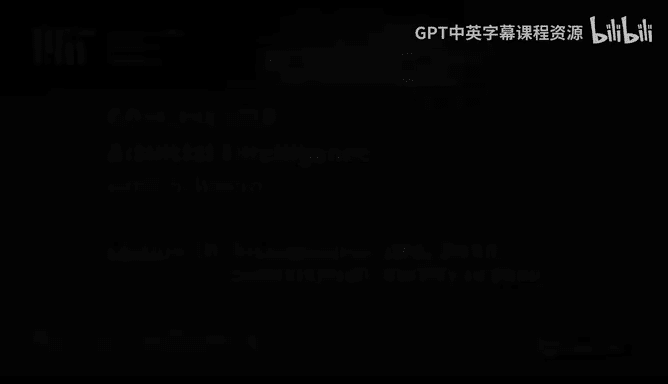
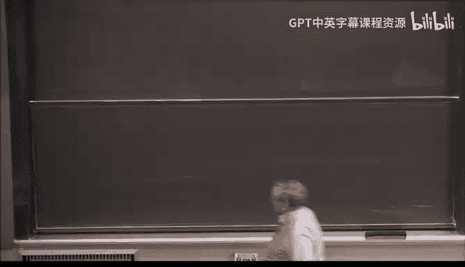
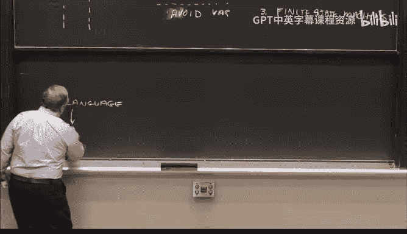
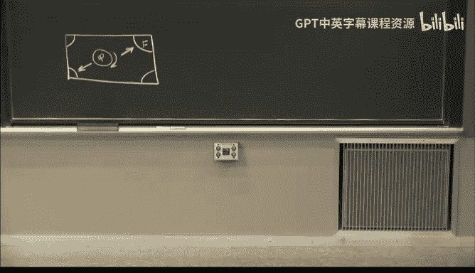
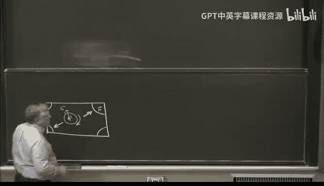
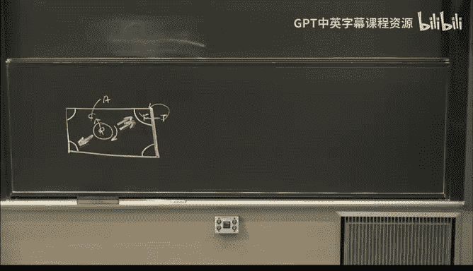

# 20：GPS, SOAR, 包容架构与心智社会 🧠

在本节课中，我们将探讨如何将人工智能的各种“原料”——如表示和方法——组合成完整的智能系统架构。我们将回顾几种历史上和当代重要的架构思想，理解它们的设计哲学、核心假设以及应用场景。

上一节我们讨论了人工智能的表示和方法，本节中我们来看看如何将它们系统地组织起来，形成不同的智能架构。

---

## 通用问题求解器 (GPS) 🧩

GPS是人工智能早期的一个重要架构思想，由卡内基梅隆大学的Newell和Simon提出。其核心思想非常直接：通过**手段-目的分析**来解决问题。

你从一个**当前状态**（称为 S）出发，希望达到一个**目标状态**（称为 G）。方法是测量当前状态与目标状态之间的**符号差异**（称为 D）。根据这个差异 D，你选择一个能减少该差异的**操作符** O，从而进入一个**中间状态** I。然后，你再次测量中间状态 I 与目标状态 G 之间的差异，选择新的操作符，如此递归进行。

这个过程可以用以下抽象流程表示：
**当前状态 S -> 差异 D -> 操作符 O -> 中间状态 I -> ... -> 目标状态 G**

让我们用一个“回家”的例子来具体化这个过程：
1.  **当前状态**：在MIT。
2.  **目标状态**：在家。
3.  **差异 D1**：距离遥远。
4.  **操作符 O1**：乘坐飞机（适用于减少远距离差异）。
5.  **新问题**：无法在教室直接登机，需要先到机场。
6.  **差异 D2**：从MIT到机场的距离。
7.  **操作符 O2**：乘坐地铁（适用于减少中距离差异）。
8.  **新问题**：无法在教室直接上地铁。
9.  **差异 D3**：从教室到地铁站的距离。
10. **操作符 O3**：步行（适用于减少短距离差异）。

通过递归地应用这种“识别差异-选择操作”的循环，GPS试图规划出一条从起点到终点的路径。

GPS的局限性在于，识别所有可能的“差异”和与之对应的“操作符”需要大量先验知识，并且需要由人类预先定义。这使其通用性受到限制。

---

## SOAR 架构 🏗️

作为GPS思想的演进，Newell等人提出了更复杂的SOAR架构。SOAR是一个基于规则的符号系统，其设计深受认知心理学影响。

以下是SOAR架构的主要组成部分：

1.  **长时记忆与短时记忆**：架构包含长时记忆和短时记忆。处理主要在短时记忆中进行，知识（断言和规则）在长短时记忆间穿梭。
2.  **产生式系统**：长时记忆中存储着大量的“断言”和“产生式规则”（即“如果-那么”规则）。整个系统是一个庞大的基于规则的系统。
3.  **偏好系统**：当多条规则同时被激活时，一个复杂的子系统负责决定执行哪一条规则。
4.  **问题空间**：SOAR将解决问题视为在某个“问题空间”中进行搜索，就像在“回家”例子中搜索地点空间一样。
5.  **通用子目标**：每当系统不知道下一步该做什么时，这个“困境”本身就会成为一个新的子目标，并拥有自己的问题空间和搜索过程。这实现了层次化的目标分解。

SOAR架构的核心假设是**符号系统假说**，即智能的本质是符号操作。它侧重于**问题解决**，并试图通过模拟人类的认知结构（如记忆）来实现智能。

---

## 包容架构 (Subsumption Architecture) 🤖

与上述“深思熟虑”的符号架构不同，MIT的Rodney Brooks提出了反应式的**包容架构**。他观察到，传统分层的“感知-规划-行动”机器人笨重且脆弱，改进一个模块常会破坏整个系统。

包容架构采用了截然不同的组织原则：

1.  **分层的行为**：系统由多个并行的“行为层”构成，每一层都是一个完整的感知-行动回路。底层处理更基本、更紧急的任务（如“避障”），高层处理更复杂的目标（如“探索”）。
2.  **高层可以抑制底层**：高层行为可以通过“抑制”或“覆盖”信号来调制底层行为，从而实现更复杂的目标，而无需直接修改底层代码。
3.  **无中心表示/模型**：系统不维护一个内部的世界模型。它**直接利用世界作为其自身的模型**，通过传感器实时感知并做出反应。
4.  **简单机制**：每一层通常由有限状态机等简单计算机制实现。

这种架构的灵感部分来源于大脑的进化结构（古老的脑干负责反射，新皮层负责高级功能）。它的核心假设是**包容假说**：先让机器达到昆虫的智能水平，更高级的智能会自然涌现。

Brooks的实验室基于此架构建造了著名的机器人“Herbert”，它能在大楼里漫游并收集可乐罐。这一成果直接影响了后来成功的Roomba扫地机器人。

---

## 心智社会与分层思维 🎭

Marvin Minsky在《心智社会》和《情感机器》中提出了另一种视角。他认为智能不是单一的过程，而是由许多“智能体”组成的社会，并且思维发生在多个不同的层次上。

以下是一个故事片段，说明了思维的多个层次：
> “听到声音，她转过头（本能反应层）。看到一辆车驶来，她意识到危险（习得反应层）。她决定冲刺过马路（深思熟虑层）。事后，她反思自己冲动的决定（反思思维层）。她还担心迟到会让朋友不高兴（社会性反思层/自我意识层）。”

Minsky的架构强调：
*   **多层思维**：从本能反应到自我意识，思维是分层进行的。
*   **常识的重要性**：实现这些层次思维的基础是拥有大量人类常识。这催生了像“开放心智常识”这样的项目，旨在从互联网中收集常识知识。
*   **共同工作的小型程序**：心智由许多专门化的小程序（“智能体”）组成，它们通过协作与竞争产生智能行为。

---

## 创世纪架构与语言的核心作用 🗣️

另一种架构思想将**语言**置于智能的中心，这就是“创世纪架构”。它基于**强故事假说**：人类智能的本质在于讲述和理解故事的能力，这是我们大约五万年前“认知革命”中获得的关键优势。

该架构认为语言有两个核心作用：
1.  **引导感知与行动**：语言可以指挥我们的感知系统（如“看前排谁穿了牛仔裤？”）和运动系统。
2.  **描述事件与建构故事**：语言使我们能够描述事件，进而建构和理解故事，最终承载和传递文化（从家庭微观文化到国家宏观文化）。

关键证据来自心理学实验：在“矩形房间找玩具”的实验中，成年人能利用“蓝色墙壁”这一语言标签精确定位，而幼儿和老鼠则不能。但如果让成年人同时进行“双任务”（如边听边复述），其语言处理器被“堵塞”，他们的表现就会退化到幼儿水平。这证明语言是整合不同信息、进行复杂空间推理的关键媒介。

本节课中我们一起学习了四种重要的人工智能架构思想：专注于手段-目的分析的GPS、基于符号和问题空间的SOAR、强调反应与行为分层的包容架构，以及关注多层思维的心智社会和以语言为核心的创世纪架构。每种架构都基于不同的核心假说，并为我们理解与构建智能提供了独特的视角和工具。理解这些架构的差异与联系，是思考如何组装一个智能系统的第一步。