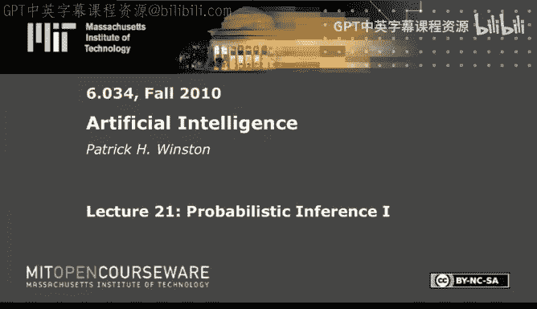
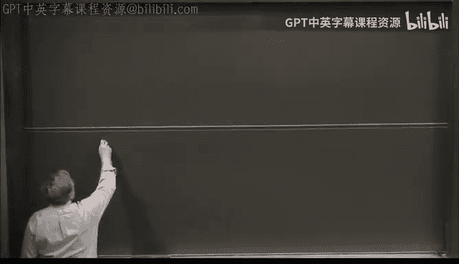
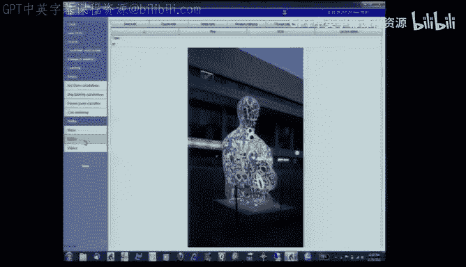
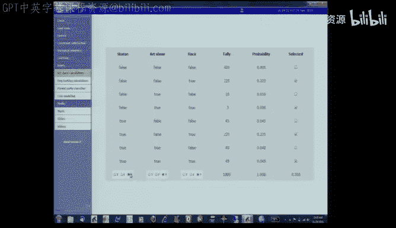
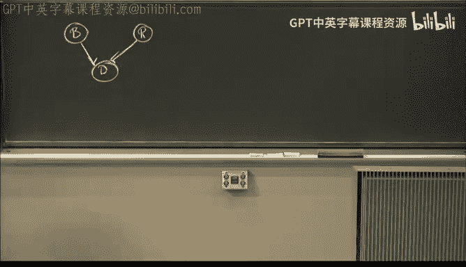
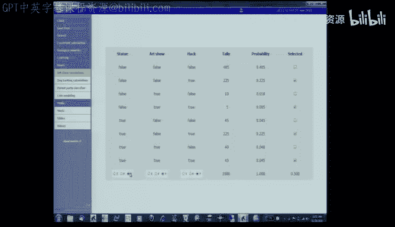
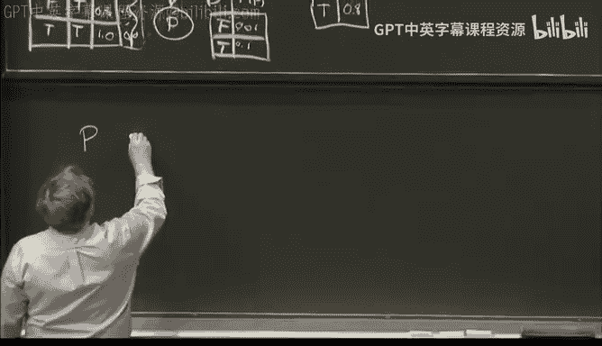
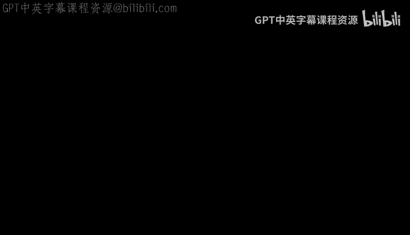

# 21：概率推断 I 🧮

在本节课中，我们将学习概率论在人工智能中的基本应用。我们将从最基础的联合概率表开始，探讨其强大功能与局限性，并最终引入一种更高效的工具——信念网络，来应对现实世界中的复杂概率推理问题。

---

## 联合概率表：基础与挑战

我们从一个简单的场景开始：某天早上，我在校园里看到了一座雕像。它出现的原因可能有三种：一次黑客恶作剧、一场艺术展，或者两者皆有。为了理清思路，我构建了一个联合概率表。

以下是所有可能情况的组合：

*   雕像出现 (S)
*   黑客恶作剧 (H)
*   艺术展 (A)

这个表格有 2³ = 8 行，涵盖了所有真假组合。通过长期观察（例如记录1000天的情况），我可以统计每种组合出现的频率，进而计算出每种情况的概率。例如，`P(雕像出现)` 就是所有“雕像为真”的行其概率之和。

有了这个联合概率表，我就可以进行各种概率推断，例如：
*   **计算边缘概率**：`P(艺术展) = 0.1`
*   **计算条件概率**：`P(黑客 | 雕像) ≈ 0.781`。这意味着在已知有雕像的情况下，它是黑客所为的概率。
*   **观察解释效应**：当我进一步知道有艺术展时，`P(黑客 | 雕像, 艺术展)` 的概率会下降。因为艺术展的出现为雕像提供了另一个解释，从而降低了黑客恶作剧的可能性。

**核心公式**：条件概率的定义为 `P(A|B) = P(A ∧ B) / P(B)`。

然而，这种方法存在一个根本性问题：**状态空间爆炸**。每增加一个二元变量，表格的行数就会翻倍。对于n个变量，需要处理 2ⁿ 行。当变量数量达到10个时，就需要处理1024行；100个变量时，行数将是一个天文数字。我们既无法通过测量获得所有数据，也难以凭主观猜测填充如此庞大的表格。

---

## 概率论公理与直观理解

在寻找解决方案之前，我们先回顾概率论的基础。概率论建立在三条公理之上：

1.  任何事件A的概率都在0和1之间：`0 ≤ P(A) ≤ 1`。
2.  必然事件的概率为1：`P(True) = 1`；不可能事件的概率为0：`P(False) = 0`。
3.  事件A或B发生的概率为：`P(A ∨ B) = P(A) + P(B) - P(A ∧ B)`。

我们可以用韦恩图来直观理解这些公理。将整个矩形视为所有可能世界，事件A和B是其中的区域。`P(A)` 就是A区域的面积占整个矩形面积的比例。公理3的公式正是为了在计算“A或B”的面积时，避免重叠部分被重复计算。

---

## 关键概念：条件概率与独立性

接下来是两个核心定义。

**条件概率**：在已知事件B发生的情况下，事件A发生的概率定义为 `P(A|B) = P(A ∧ B) / P(B)`。在韦恩图中，这相当于将我们的视野限制在B区域内，然后看A区域占B区域的比例。

**独立性**：如果事件A的发生与否完全不受事件B的影响，则称A与B独立。数学定义为 `P(A|B) = P(A)`。在韦恩图中，这意味着A区域占B区域的比例，等于A区域占整个矩形的比例。

**条件独立性**：这是一个更微妙但至关重要的概念。如果已知某个事件Z发生时，事件A的发生与否不再受事件B的影响，则称**在给定Z的条件下，A与B条件独立**。定义为 `P(A|B, Z) = P(A|Z)`。这意味着，一旦我们进入了Z所描述的那个“子世界”，B的信息对于判断A就没有额外价值了。

---

## 链式法则：分解联合概率

链式法则允许我们将一个复杂的联合概率分解为一系列条件概率的乘积。对于多个变量 `X₁, X₂, ..., Xₙ`，有：

`P(X₁, X₂, ..., Xₙ) = ∏ P(Xᵢ | X₁, ..., Xᵢ₋₁)`

这个公式从最后一个变量开始，每个变量的概率都依赖于它之前的所有变量。虽然这个分解本身没有减少参数数量，但它为我们重新组织依赖关系提供了框架。

---

## 信念网络：高效的建模工具 🕸️

现在，我们回到最初的挑战：如何避免庞大的联合概率表？答案就是**信念网络**（也称贝叶斯网络）。

我们用一个新例子来说明：邻居的狗叫了。原因可能是来了盗贼(B)，或者来了浣熊(R)。狗叫(D)可能导致我们报警(P)。浣熊还可能会打翻垃圾桶(T)。这里有5个变量，完整联合概率表需要 2⁵ = 32 个参数。

然而，我们可以根据**因果关系**来构建一个网络：
1.  盗贼(B)和浣熊(R)是独立发生的，它们没有父节点。
2.  狗叫(D)由盗贼和浣熊直接导致，因此B和R是D的父节点。
3.  报警(P)只取决于狗是否叫，因此D是P的父节点。
4.  垃圾桶翻倒(T)只取决于浣熊是否来，因此R是T的父节点。

网络图如下：`B → D ← R`， `D → P`， `R → T`。

信念网络的核心假设是：**每个节点在给定其父节点的条件下，独立于所有非后代节点**。例如：
*   已知狗叫(D)时，报警(P)的概率与B、R、T都无关。
*   已知盗贼(B)和浣熊(R)时，狗叫(D)的概率与垃圾桶(T)无关。

基于这个网络，我们只需要指定少量概率：
*   `P(B) = 0.1` （盗贼出现的先验概率）
*   `P(R) = 0.5` （浣熊出现的先验概率）
*   `P(D | B, R)` 的4种组合（狗叫的条件概率表）
*   `P(P | D)` 的2种组合（报警的条件概率表）
*   `P(T | R)` 的2种组合（垃圾桶翻倒的条件概率表）

总共只需要 **10个参数**，而不是32个！我们可以利用链式法则和条件独立性，用这10个参数计算出完整的32行联合概率表中的任何一项。例如：
`P(P, D, B, T, R) = P(P|D) * P(D|B,R) * P(B) * P(T|R) * P(R)`
公式中每一项都可以直接从我们定义的少量参数中获得。

---

## 总结

本节课我们一起学习了概率推断的基础。我们从直观的联合概率表出发，认识到其在变量增多时面临的组合爆炸问题。接着，我们回顾了概率论的公理、条件概率和独立性概念。最后，我们引入了**信念网络**这一强大工具，它利用变量间的条件独立性（通常源于因果关系），将指数级增长的参数需求降为线性或多项式级增长，从而使对复杂系统的概率建模与推断变得可行。在接下来的课程中，我们将进一步探讨信念网络的推理算法及其节省的计算量规模。