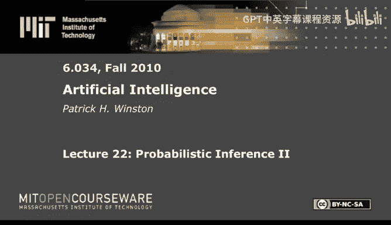
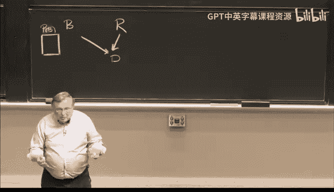

# 22：概率推断 II 🧠




在本节课中，我们将学习如何利用贝叶斯网络进行概率推断，并探索如何从数据中“发现”网络结构本身。我们将从复习贝叶斯网络的基本原理开始，逐步深入到朴素贝叶斯分类，并最终了解如何通过搜索来发现最能解释数据的网络结构。

---

## 复习：从联合概率表到贝叶斯网络 📊

上一节我们介绍了使用庞大的联合概率表来描述多个变量关系的局限性。本节中，我们来看看如何用更紧凑的贝叶斯网络来替代它。

贝叶斯网络是一种用有向无环图表示变量间依赖关系的模型。图中的每个节点代表一个随机变量，边表示依赖关系。网络结构蕴含了一个关键假设：**任何变量在给定其父节点的条件下，都独立于它的任何非后代节点**。

这意味着，要计算网络中所有变量的联合概率，我们无需庞大的联合表。我们可以利用概率的链式法则，并借助网络的独立性假设来简化计算。

对于一个变量序列，如果我们能确保在列表中，任何变量都不出现在其后代变量的左边，那么联合概率可以分解为一系列条件概率的乘积。例如，对于变量C, D, B, T, R的一个特定排序，联合概率 `P(C, D, B, T, R)` 可以写作：
```
P(C, D, B, T, R) = P(C|D,B,T,R) * P(D|B,T,R) * P(B|T,R) * P(T|R) * P(R)
```
接着，利用网络的独立性假设（例如，C只依赖于其父节点D），我们可以划掉许多条件项，最终得到：
```
P(C, D, B, T, R) = P(C|D) * P(D|B,R) * P(B) * P(T|R) * P(R)
```
这样，我们只需要知道每个节点在其父节点条件下的概率（条件概率表，CPT），以及根节点的先验概率，就能计算出任何联合概率。

---



## 学习网络参数：从数据到概率表 📈

既然网络由一系列条件概率表定义，那么如何获得这些概率呢？我们可以通过数据来学习。

具体方法是：收集大量数据样本（例如，通过观察或实验），然后根据样本中变量取值的组合，在相应的条件概率表中进行计数。

以下是更新计数表的基本步骤：
1.  为网络中的每个条件概率表添加两列：一列记录符合父节点条件的总样本数，另一列记录在那些样本中当前节点为“真”的样本数。
2.  对于每一个到来的数据样本，检查其中各个变量的取值。
3.  根据样本中父节点的取值组合，找到条件概率表中对应的行。
4.  在该行的“总计数”栏加1。
5.  如果当前节点在该样本中的取值为“真”，则在该行的“真计数”栏也加1。
6.  最终，用“真计数”除以“总计数”，即可得到该条件下节点为“真”的概率估计。

通过大量数据，这些计数值会趋近于真实的概率。这个过程本质上是用数据“训练”或“填充”了我们的贝叶斯网络模型。

---

## 逆向使用网络：从概率到数据生成 🔄

一旦我们有了一个参数完备的贝叶斯网络，我们不仅可以进行推断，还可以用它来**生成新的数据样本**。这个过程是参数学习过程的逆过程。

具体步骤如下：
1.  **从根节点开始**：按照拓扑顺序（从上到下）处理节点。对于没有父节点的根节点，根据其先验概率分布（例如 `P(B)`）进行随机抽样，决定它的取值（例如，通过抛掷一个有偏硬币）。
2.  **处理子节点**：当一个节点的所有父节点取值都已确定后，我们就可以根据该节点对应的条件概率表（CPT）中，与当前父节点取值匹配的那一行概率，来决定该节点的取值。
3.  **重复**：继续按顺序处理所有节点，每个节点都基于其已确定的父节点状态进行抽样。
4.  **得到样本**：当所有节点都被赋予一个值时，我们就得到了一个符合该贝叶斯网络概率分布的数据样本。

通过这种方式，我们可以用模型模拟出现实世界的数据生成过程。


---

## 模型选择：哪个网络更可能是正确的？🤔

面对同一组变量，可能存在多个不同的网络结构（例如，对变量间的依赖关系有不同的假设）。我们如何判断哪个网络更符合观测到的数据呢？这时，我们可以使用**朴素贝叶斯分类**的思想，但这次不是对数据分类，而是对**模型**进行分类。

其核心是贝叶斯公式：
```
P(Model | Data) ∝ P(Data | Model) * P(Model)
```
这里：
*   `P(Model | Data)` 是给定数据后，模型为真的后验概率，这是我们想求的。
*   `P(Data | Model)` 是似然度，即在某个模型下，观测到当前数据的概率。对于一个参数确定的贝叶斯网络，这个概率是可以计算的（例如，将每个数据样本的联合概率乘起来）。
*   `P(Model)` 是模型的先验概率，我们可以假设所有模型等可能，或者赋予简单模型更高的先验概率。


我们比较不同模型时，分母 `P(Data)` 是相同的，因此只需比较分子 `P(Data | Model) * P(Model)`。数值最大的模型，就是当前数据支持下最可能的模型。

---

## 朴素贝叶斯分类器：一个简单而强大的工具 🛠️

上一节我们讨论了模型选择，其数学基础正是贝叶斯定理。本节中我们来看看如何直接应用这个定理来解决经典的分类问题，即**朴素贝叶斯分类器**。

我们从贝叶斯定理出发：
```
P(Class | Evidence) = P(Evidence | Class) * P(Class) / P(Evidence)
```
在分类任务中：
*   `Class` 是我们想预测的类别（例如，疾病类型、硬币类型）。
*   `Evidence` 是我们观察到的证据或特征（例如，症状、抛硬币结果）。

如果我们有多个候选类别，要找出最可能的那个，由于分母 `P(Evidence)` 对所有类别相同，我们只需比较分子：
```
P(Class_i | Evidence) ∝ P(Evidence | Class_i) * P(Class_i)
```
现在，假设证据由多个独立的部分构成（例如，多个症状、多次抛硬币结果），并且在给定类别的条件下，这些证据相互独立（这就是“朴素”的假设）。那么联合似然度可以分解：
```
P(E1, E2, ..., En | Class_i) = P(E1|Class_i) * P(E2|Class_i) * ... * P(En|Class_i)
```
因此，分类决策规则就是计算每个类别 `i` 的以下分值，并选择分值最高的类别：
```
Score(Class_i) = P(Class_i) * Π P(E_j | Class_i)
```
在实践中，由于连乘可能导致数值下溢，我们通常计算对数和：
```
Log-Score(Class_i) = log(P(Class_i)) + Σ log(P(E_j | Class_i))
```

**一个简单例子**：假设有两枚硬币，一枚均匀（正面概率0.5），一枚有偏（正面概率0.8）。随机选一枚并抛掷数次。根据观测到的正反面序列，我们可以用上述公式不断更新两枚硬币的后验概率，从而判断最可能用的是哪一枚。

---

## 结构发现：在众多可能网络中搜索最佳者 🗺️

当变量数量增多时，所有可能的网络结构数量会爆炸式增长。我们无法枚举所有模型进行比较。这时，就需要借助**搜索算法**。

基本思路如下：
1.  **从一个初始网络开始**：可以是空网络、随机网络或基于先验知识构建的网络。
2.  **定义评分函数**：通常使用数据在给定模型下的对数似然（或考虑模型复杂度的BIC等准则），即 `log P(Data | Model)`。
3.  **迭代改进**：
    *   对当前网络进行局部修改，例如增加、删除或反转一条边（确保不形成环）。
    *   计算修改后新网络的评分。
    *   如果新评分更高，则接受这次修改；否则，可能以一定概率接受（模拟退火思想），或直接拒绝。
4.  **应对局部最优**：由于搜索空间庞大且崎岖，算法容易陷入局部最优。常见的策略是定期进行“随机重启”，即完全随机化网络结构，然后重新开始搜索，并始终保留历史上找到的最佳网络。
5.  **终止**：当评分在多次迭代中不再显著提高，或达到计算资源限制时，停止搜索。最终得到的网络就是数据所支持的最优（或近似最优）结构。

通过这种方式，我们可以从数据中自动“发现”变量之间潜在的关系结构。

---

## 应用场景与核心思想 💡

概率推断和贝叶斯方法在诸多领域都有广泛应用：


*   **医疗诊断**：根据症状（证据）推断最可能的疾病（类别）。
*   **垃圾邮件过滤**：根据邮件中的词汇（证据）判断邮件类别（垃圾/非垃圾）。
*   **故障诊断**：根据系统表现出的异常信号（证据）定位根本原因（故障组件）。
*   **认知状态评估**：根据测验题目回答情况（证据）评估知识掌握程度（类别）。
*   **模式发现**：在文本、故事或社会行为数据中，发现反复出现的、有意义的依赖关系模式（即网络结构）。

**本节课的核心思想可以总结为两点：**
1.  **贝叶斯推断是处理不确定性的正确框架**：当信息不全、存在噪声或需要融合先验知识时，贝叶斯方法提供了一种从证据反向推演原因的严谨数学工具。
2.  **从参数学习到结构发现**：我们不仅可以用数据来填充已知模型的参数，还可以通过搜索让数据告诉我们变量间最可能的结构关系本身，这是机器学习中非常强大的概念。

---


本节课中，我们一起学习了如何利用贝叶斯网络进行高效的联合概率计算，如何从数据中学习网络参数以及生成新数据，并深入探讨了基于贝叶斯定理的模型选择与分类方法。最后，我们了解了如何通过搜索算法从数据中自动发现网络结构，并看到了这些技术在诊断、过滤、评估等多种场景下的强大应用。概率推断为我们处理现实世界中的不确定性提供了一套系统而有力的工具。