# 23：模型合并、跨模态耦合与未来展望 🧠

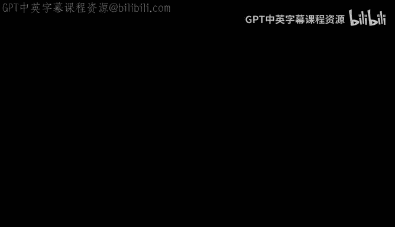

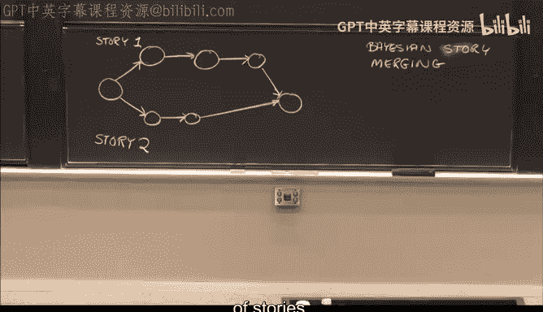

在本节课中，我们将总结《人工智能》课程的核心内容，重点探讨模型合并与跨模态耦合这两个高级概念，并对整个课程进行回顾与展望。

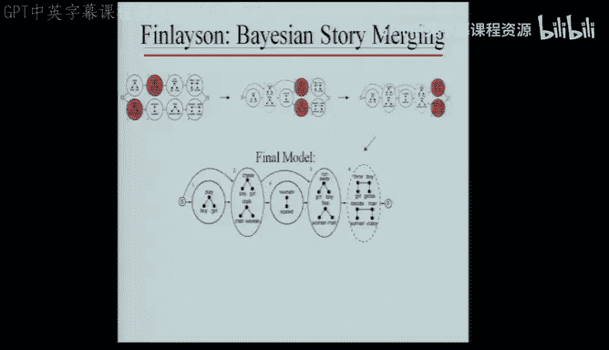

## 模型合并：从故事中发现结构 🧩

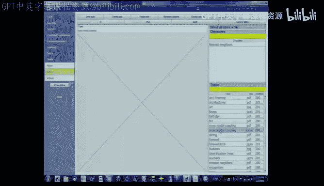

上一节我们介绍了贝叶斯方法在结构发现中的应用。本节中，我们来看看如何将这一思想进一步延伸，在看似无结构的数据中发现潜在的模式。

想象你有几个故事，其中的圆圈代表故事中的事件。你希望从这些故事中提取出一个能描述整个故事集合的有限状态图。

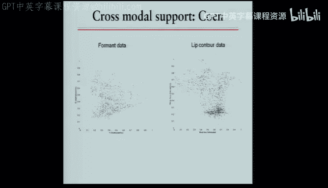

以下是模型合并的基本步骤：
1.  首先，分析故事中的事件，识别出相似的事件。
2.  例如，你可能会发现事件A与事件B非常相似，事件C与事件D也非常相似。
3.  基于这种相似性，你可以推测，或许存在一种更紧凑的方式来表征故事内容。
4.  通过合并相似节点（如“聊天”与“交谈”、“奔跑”与“逃离”），你可以构建出一个更简单、概率更高的故事图。

这个过程就是**贝叶斯故事合并**。它允许系统从原始故事数据中自动推导出更抽象、更紧凑的表示结构，甚至能发现如“复仇”这样的高级概念。

## 跨模态耦合：利用多感官信息学习 🎵👄

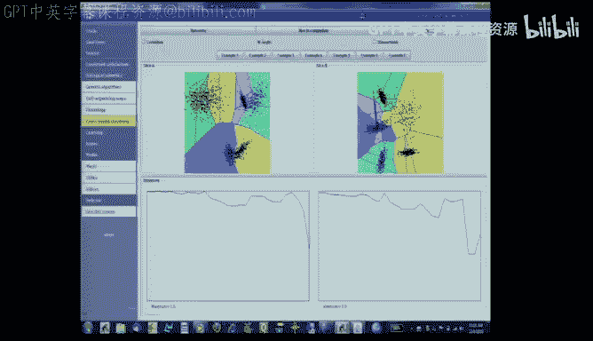

有时，我们并非一无所知。当我们拥有先验知识或多模态数据时，可以进行更高效的学习。跨模态耦合探讨如何利用不同感官信息（模态）之间的对应关系，来同时厘清每个模态的内在结构。

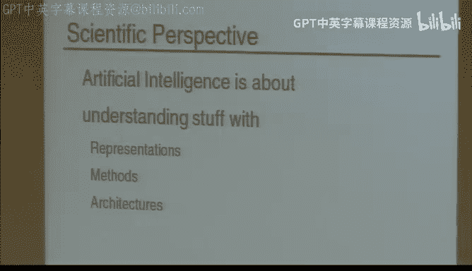

以斑胸草雀学习鸣唱为例。雄雀通过聆听父辈的歌声来学习求偶曲。一个仅使用跨模态耦合（而非概率方法）的程序，成功学习并生成了非常相似的鸣唱。这表明，通过关联发声时的喉部动作（一种模态）与产生的声音（另一种模态），系统可以有效地学习。

在人类学习中，我们同样通过关联嘴唇形状（视觉模态）与发出的元音声音（听觉模态）来掌握语言，尽管我们从未接触过标注好的数据。

以下是跨模态聚类的工作原理：
1.  系统接收成对的跨模态数据（如声音频谱和对应的嘴唇轮廓）。
2.  它观察一个模态中的数据点如何映射到另一个模态。
3.  如果两个数据点在**投影模式**上相似（例如，它们的映射向量方向一致），那么它们就可以被合并。
4.  通过迭代这个过程，系统能在两个模态上同时建立起有意义的聚类结构。

这种方法展示了发现规律的可能性，而无需过度依赖贝叶斯概率。它快速、直接，很可能与人类智能中处理未标注数据的方式密切相关。

## 核心回顾与人工智能方法论 📚

现在，让我们回顾一下整个课程的核心思想与方法论。

人工智能可以从工程学或科学两个视角来看待。两者都涉及**表示、方法和体系结构**。从科学视角理解智能，能为构建更复杂的应用奠定坚实基础。

人工智能应用的核心价值通常不在于取代人类，而在于创造新的能力和收入，实现**人机协作**，让双方各展所长。

人工智能领域区别于其他研究智能的学科，在于我们拥有描述过程的语言（编程）、构建详细模型的能力、进行受控实验的优势，以及评估任务所需知识量上限的方法。

进行人工智能研究（乃至一般科学研究）的正确方法是**以问题为中心**，而非执着于特定工具。大卫·马尔倡导的方法论是：从理解你试图计算什么开始，然后引入能暴露约束和规律的**表示方法**，接着设计**算法**，最后通过**实现与实验**来验证。

## 期末安排与后续学习建议 📝

关于期末考试：
*   考试将涵盖课程四个主要部分，以及一个包含所有其他内容的综合部分。
*   考试为开卷，但禁止使用电脑。请自备计时器。
*   虽然可能用不到，但可以携带计算器以缓解焦虑。

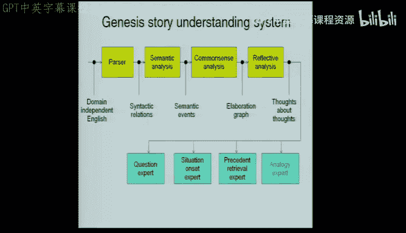

如果你对本课程感兴趣，可以考虑后续学习：
*   **马文·明斯基的《心智社会》**：体验大师的即兴思考。
*   **罗伯特·伯威克的语言理解课程**：语言是理解智能的核心。
*   **杰拉尔德·萨斯曼的大规模符号系统课程**：学习构建复杂系统。
*   **“人类智能企业”课程**：探讨沟通、表达与包装思想的核心技能。

此外，每年一次的“如何演讲”讲座也值得参与，它浓缩了有效沟通的精髓。

## 研究演示：Genesis 系统与强故事假说 🤖

我们的研究小组正在构建一个名为 **Genesis** 的系统，旨在探索“强故事假说”——即故事是我们人类区别于其他生物的关键。

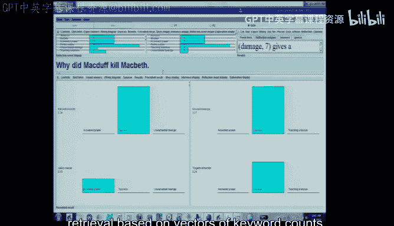

该系统能够阅读故事（如《麦克白》的情节摘要），并将其转化为内部表示，从而进行多层次的推理。系统可以模拟具有不同背景或文化视角的“角色”（如“杰基尔博士”与“海德先生”）来理解同一故事，并回答深层次问题。

基于这种多视角理解能力，系统可以实现许多功能：角色间谈判、跨领域教学、灾难预警，以及基于高级概念（而非关键词）的信息检索。

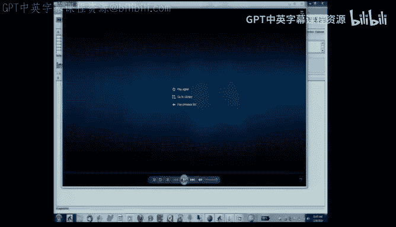

这项研究正尝试将语言系统与感知系统连接起来，探索语言如何与我们对世界的感知相耦合，这是理解智能本质的关键。

## 人工智能的宏大问题与未来 🚀

人工智能已经成为计算机科学工具箱中的标准组件。其最有力的思想往往很简单：**搜索、推理、学习、架构**。伟大的思想通常是简洁的，不应将复杂性与价值混淆。

关于人工智能是否可能的哲学争论（如“中文房间”思想实验）常常忽略了**运行中的程序**作为一个随时间演化、持续贡献知识的**过程**所蕴含的魔力。

最大的问题或许不在于人类是否过于聪明以致其智能无法被复制或超越，而在于我们是否足够聪明来实现它。这需要一定的雄心，其结果尚未可知。

## 总结与致谢 👏

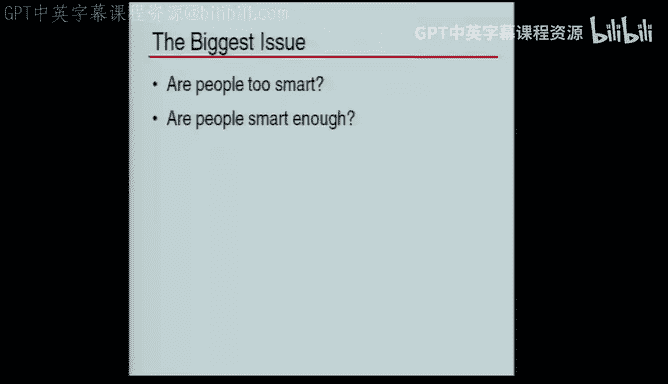

本节课中，我们一起学习了：
1.  **模型合并**：如何利用贝叶斯方法从数据中发现并合并结构，形成更紧凑、更高概率的表示。
2.  **跨模态耦合**：如何利用不同感官信息流之间的对应关系，高效地学习并厘清每个模态的结构。
3.  **课程核心方法论**：以问题为中心，通过表示、算法、实现与实验的循环来推进人工智能研究。
4.  **研究前沿展望**：了解了 Genesis 系统如何探索故事理解、多视角推理及人机智能的本质。

最后，衷心感谢课程教学团队的所有成员——教授、助教和工作人员——他们的专业精神与辛勤付出是这门课程成功的关键。祝大家在期末考试中取得好成绩，并享受一个愉快的假期！

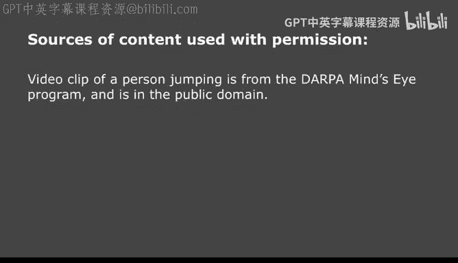

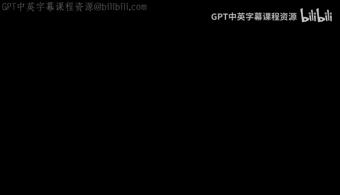

**课程结束，愿大家从此过上幸福快乐的生活。**