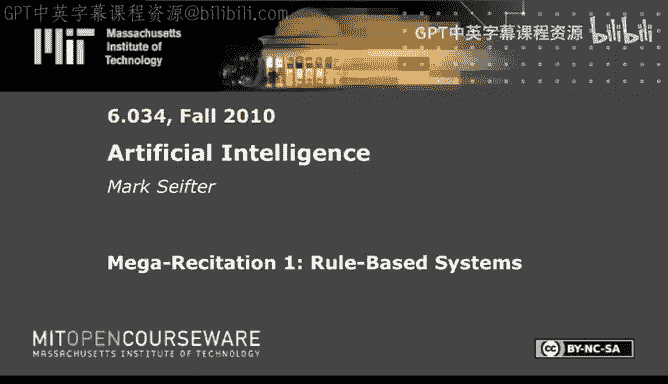
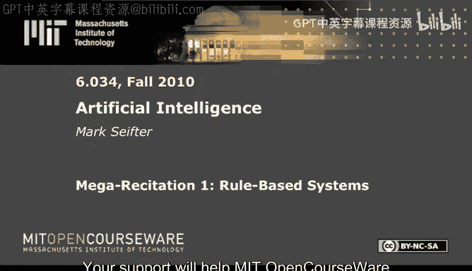
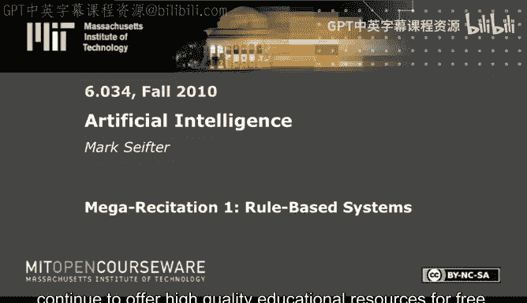

# 24：基于规则的系统 🧠

在本节课中，我们将学习基于规则的系统，特别是**前向链接**和**后向链接**这两种推理方法。我们将通过一个具体的例子，逐步解析如何手动执行这些算法，并指出常见的陷阱和技巧。

---

## 概述

我们将使用一个以《哈利·波特》为背景的示例，其中包含一系列规则和初始断言。我们的目标是：
1.  理解规则和断言的结构。
2.  使用**后向链接**来证明一个特定目标。
3.  使用**前向链接**从已知事实推导出新的事实。
4.  识别并避免在应用这些算法时常见的错误。

---

## 规则与断言

首先，我们定义系统中的规则和初始事实。规则使用变量（如 `?x`）来表示任意个体。

### 规则列表

以下是六个规则，用于描述哈利·波特世界中的逻辑关系：

*   **P0:** 如果 `?x` 有野心 且 `?x` 是哑炮，那么 `?x` 有一个糟糕的学期。
*   **P1:** 如果 `?x` 住在格兰芬多塔楼，那么 `?x` 是主角。
*   **P2:** 如果 `?x` 住在斯莱特林地下室，那么 `?x` 是反派 且 `?x` 有野心。
*   **P3:** 如果 (`?x` 是主角 或 `?x` 是反派) 且 `?x` 有野心，那么 `?x` 学习很努力。
*   **P4:** 如果 `?x` 学习很努力 且 `?x` 是主角，那么 `?x` 成为赫敏的朋友。
*   **P5:** 如果 `?x` 与 `?y` 接吻，且 `?x` 住在格兰芬多塔楼，且 `?y` 住在斯莱特林地下室，那么 `?x` 有一个糟糕的学期。

### 初始断言

我们开始时已知以下四个事实：

*   **A0:** 米里森住在斯莱特林地下室。
*   **A1:** 米里森有野心。
*   **A2:** 西莫住在格兰芬多塔楼。
*   **A3:** 西莫与米里森接吻。

---

## 后向链接 🔙

后向链接是一种目标驱动的推理方法。我们从一个假设（目标）开始，尝试在知识库（断言和规则）中找到支持它的证据。

### 算法要点

在开始解题前，记住后向链接器的行为准则：
1.  对于当前目标，**首先**检查它是否直接存在于断言列表中。
2.  如果不存在，则查找**结论部分**与该目标匹配的规则。
3.  后向链接器**不会**向断言列表中添加新事实。
4.  如果多条规则或断言都能匹配，按以下顺序打破平局：
    *   优先使用编号更小的规则（如 P0 优先于 P1）。
    *   如果同一条规则可通过不同断言匹配，则优先使用编号更小的断言。

### 执行过程

我们的目标是证明：**米里森成为赫敏的朋友**。

我们以深度优先的方式构建目标树。以下是推理步骤：

1.  **目标：** 米里森成为赫敏的朋友。
    *   检查断言：无直接匹配。
    *   查找规则：**P4** 的结论匹配。要使用 P4，必须证明其前提：`米里森学习很努力` **且** `米里森是主角`。我们将这两个子目标加入树中，形成一个“与”节点。

2.  **探索左子目标：** 米里森学习很努力。
    *   检查断言：无直接匹配。
    *   查找规则：**P3** 的结论匹配。要使用 P3，必须证明其前提：`(米里森是主角 或 米里森是反派)` **且** `米里森有野心`。我们加入一个“与”节点，其左子节点是一个“或”节点。

3.  **深度优先探索：** 我们先处理“或”节点的左分支。
    *   **子目标：** 米里森是主角。
        *   检查断言：无直接匹配。
        *   查找规则：**P1** 的结论匹配。要使用 P1，必须证明：`米里森住在格兰芬多塔楼`。
        *   **子子目标：** 米里森住在格兰芬多塔楼。
            *   检查断言：A2 说西莫住在那里，但米里森没有。不匹配。
            *   查找规则：没有规则的结论能证明某人住在某个地方（前提中才有）。**证明失败**。在此节点标记 **X**。

4.  **回溯到“或”节点：** 由于“或”节点只需一个分支为真，我们尝试右分支。
    *   **子目标：** 米里森是反派。
        *   检查断言：无直接匹配。
        *   查找规则：**P2** 的结论匹配。要使用 P2，必须证明：`米里森住在斯莱特林地下室`。
        *   **子子目标：** 米里森住在斯莱特林地下室。
            *   检查断言：**A0 直接匹配！** 证明成功。

5.  **向上回溯到“与”节点：** 现在需要证明“与”节点的右子目标。
    *   **子目标：** 米里森有野心。
        *   检查断言：**A1 直接匹配！** 证明成功。
    *   至此，整个“与”节点（来自 P3）证明成功，意味着 `米里森学习很努力` 得证。

6.  **向上回溯到最初的“与”节点（来自 P4）：** 现在需要证明其右子目标。
    *   **子目标：** 米里森是主角。（注意：我们之前从 P3 的“或”节点中尝试过并失败了，但后向链接器不缓存失败结果，会重新尝试）。
        *   检查断言：无直接匹配。
        *   查找规则：再次使用 **P1**。
        *   **子子目标：** 米里森住在格兰芬多塔楼。
            *   检查断言：仍然不匹配。
            *   查找规则：仍然没有。**证明失败**。
    *   由于“与”节点的一个分支失败，整个 P4 的证明**失败**。

**结论：** 通过后向链接，我们无法证明“米里森成为赫敏的朋友”。

### 关键陷阱

*   **变量绑定：** 应用规则时，必须用当前目标中的具体个体（如“米里森”）替换规则中的变量（`?x`）。
*   **深度优先搜索：** 必须严格按照深度优先顺序探索目标树，在回溯前穷尽一个分支的所有可能性。
*   **检查断言优先：** 在每个新目标节点，首先检查断言列表，而不是直接寻找规则。
*   **不添加断言：** 后向链接只验证目标，不扩展知识库。

---

## 前向链接 🔜

前向链接是一种数据驱动的推理方法。我们从已知断言开始，反复应用规则，将新推导出的事实添加到知识库中，直到没有新事实产生或达到目标。

### 算法要点

1.  扫描所有规则，找出那些**前提**能被当前断言列表满足的规则。
2.  在可触发的规则中，选择编号最小的规则执行（触发）。
3.  如果同一条规则可通过多组断言触发，则优先使用编号最小的那组断言。
4.  执行规则，将其**结论**中尚未在断言列表中的部分添加进去。
5.  重复此过程。如果一条规则的执行不会给断言列表带来任何**新**内容（即所有结论都已存在），则视为“无效规则”，跳过它，触发下一条可用的规则。

### 执行过程

我们从初始断言 A0-A3 开始。

**第一轮触发：**
*   可匹配的规则：P1（西莫住格兰芬多）、P2（米里森住斯莱特林）、P5（西莫吻米里森）。
*   编号最小的规则是 **P1**。触发 P1，绑定 `?x` 为西莫。
*   **新断言 A4:** 西莫是主角。

**第二轮触发：**
*   当前可匹配规则：P1（仍可匹配，但添加“西莫是主角”无效）、P2、P5。
*   P1 现在是无效规则（结论已存在）。触发下一个编号最小的有效规则 **P2**，绑定 `?x` 为米里森。
*   P2 的结论是：米里森是反派 且 米里森有野心。
*   “米里森有野心”已在 A1 中，只添加新部分。
*   **新断言 A5:** 米里森是反派。

**第三轮触发：**
*   当前可匹配规则：P1（无效）、P2（无效）、P3（米里森是反派且有野心）、P5。
*   触发编号最小的有效规则 **P3**，绑定 `?x` 为米里森。
*   **新断言 A6:** 米里森学习很努力。

**第四轮触发：**
*   当前可匹配规则：P1（无效）、P2（无效）、P3（无效）、P5。
*   触发唯一有效的规则 **P5**，绑定 `?x` 为西莫，`?y` 为米里森。
*   **新断言 A7:** 西莫有一个糟糕的学期。

**第五轮触发：**
*   检查所有规则，没有规则能基于当前断言（A0-A7）产生**新**的断言。
*   **过程停止。**

**最终断言列表：** A0, A1, A2, A3, A4 (西莫是主角), A5 (米里森是反派), A6 (米里森学习很努力), A7 (西莫有一个糟糕的学期)。

### 关键陷阱

*   **无效规则：** 必须检查规则的结论是否全部已存在于断言列表中。如果是，则跳过该规则，即使其前提被匹配。
*   **触发顺序：** 严格按照规则编号和断言编号的顺序决定触发哪条规则以及使用哪个变量绑定。
*   **部分添加结论：** 如果规则的多个结论中有些是新的，有些是旧的，只添加新的部分。

---

## 总结

本节课我们一起学习了基于规则系统中的两种核心推理算法：

1.  **后向链接：** 从目标出发，反向寻找支持证据。关键在于深度优先构建目标树、优先检查断言、以及正确绑定规则变量。
2.  **前向链接：** 从已知事实出发，正向推导出新事实。关键在于遵循规则/断言的触发顺序、识别并跳过无效规则、以及管理断言列表的更新。

通过手动演练这些算法，我们不仅理解了它们的工作原理，也熟悉了在考试中解决此类问题所需的细致步骤和常见避坑指南。记住始终优先检查断言，注意变量绑定，并严格遵守平局打破规则。