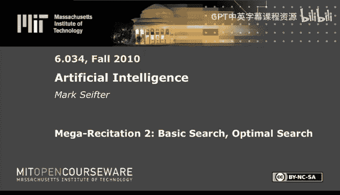
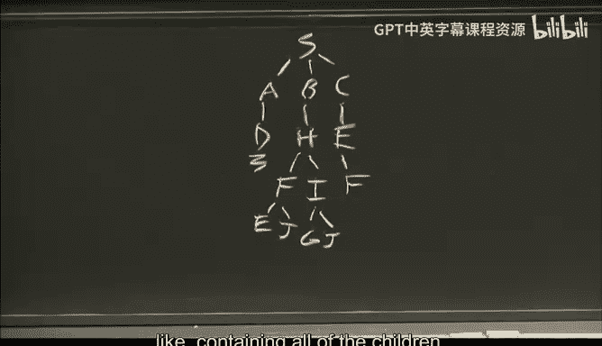
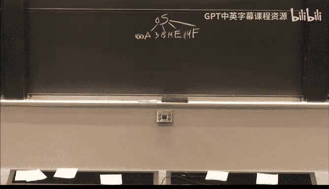

# 25：基础搜索与最优搜索 🧠

在本节课中，我们将学习两种基础搜索算法——深度优先搜索和广度优先搜索，以及两种最优搜索算法——分支定界搜索和A*搜索。我们将通过一个“邪恶霸主寻找新堡垒”的趣味问题，来理解这些算法在实际图搜索中的应用、区别以及各自的特性。

***

## 课程概述 📋

本节课内容基于MIT 6.034课程2008年第一次测验中的一道搜索问题。问题是：邪恶霸主马克·维达（Mark Vader）想从他的当前堡垒（起点S）出发，找到一个满足所有理想属性的目标堡垒（终点G）。他只能在属性恰好相差一个的堡垒之间移动，从而形成了一个图结构。我们将使用不同的搜索算法来帮他找到路径。

***

## 深度优先搜索 🔍

深度优先搜索（DFS）是一种沿着分支深入到底，再回溯探索其他路径的算法。

### 核心概念与规则
在开始搜索前，我们需要明确几个关键规则：
1.  **词典序（Lexicographic Order）**：当出现多个选择时，按照节点名称的字母顺序（如字典排序）来决定优先探索哪一个。在本课程中，我们约定基于路径末端的最新节点进行排序。
2.  **禁止自环（No Biting Your Own Tail）**：搜索算法足够“聪明”，能避免在同一条路径中重复访问同一个节点。一旦发现，该路径会被立即丢弃。

### 搜索过程演示
我们以起点 **S** 开始构建搜索树。

以下是深度优先搜索的探索步骤：

1.  从 **S** 出发，可到达 **A**, **B**, **C**。根据词典序，首先选择 **A**。
2.  从 **A** 出发，只能到达 **D**。
3.  **D** 是死胡同，没有后续节点。此时发生一次**回溯**，回到 **A**。
4.  **A** 没有其他子节点，再次**回溯**到 **S**。
5.  在 **S** 处，选择下一个节点 **B**。
6.  从 **B** 出发，到达 **H**。
7.  从 **H** 出发，可到达 **F**, **I**。根据词典序，选择 **F**。
8.  从 **F** 出发，可到达 **E**, **J**。根据词典序，选择 **E**。
9.  从 **E** 出发，可到达 **C**。
10. **C** 是死胡同，**回溯**到 **E**。
11. **E** 没有其他未探索子节点，**回溯**到 **F**。
12. 在 **F** 处，选择下一个节点 **J**。
13. 从 **J** 出发，到达 **I**。
14. 从 **I** 出发，到达目标节点 **G**。搜索成功。

**最终找到的路径是：S -> B -> H -> F -> J -> I -> G**

**注意**：在深度优先搜索中，每次遇到死胡同并返回父节点尝试其他分支时，计为一次“回溯”。在上述过程中，我们总共回溯了4次。

***

## 广度优先搜索 🌊

上一节我们介绍了深度优先搜索，它专注于一条路径深入。本节我们来看看广度优先搜索（BFS），它采取的是“广撒网”的策略，逐层探索所有邻居。

广度优先搜索会先探索起点的所有直接邻居，然后再探索这些邻居的邻居，以此类推，确保找到的路径是跳数最少的。

### 搜索过程演示
我们同样从起点 **S** 开始。

以下是广度优先搜索的探索步骤（按层展开）：

1.  第一层：扩展 **S**，得到子节点 **A**, **B**, **C**。将它们按顺序加入队列。
2.  第二层：按顺序扩展 **A**, **B**, **C**。
    *   扩展 **A**：得到子节点 **D**。
    *   扩展 **B**：得到子节点 **H**。
    *   扩展 **C**：得到子节点 **E**。
3.  第三层：按顺序扩展 **D**, **H**, **E**。
    *   扩展 **D**：无子节点（死胡同）。
    *   扩展 **H**：得到子节点 **F**, **I**。
    *   扩展 **E**：得到子节点 **F**（注意，**F** 会被再次发现，但算法此时不知道）。
4.  第四层：按顺序扩展 **F**（来自H）, **I**（来自H）, **F**（来自E）。
    *   扩展第一个 **F**：得到子节点 **E**, **J**。
    *   扩展 **I**：得到子节点 **G**, **J**。当发现路径 **S->B->H->I->G** 时，搜索立即成功。

**最终找到的最短跳数路径是：S -> B -> H -> I -> G**

**关键点**：
*   BFS 保证找到的路径是跳数最少的。
*   在BFS中，“回溯”的概念不明显，因为算法是同时探索所有方向。
*   词典序仅在为每个节点的子节点排序时起作用，不影响队列中不同路径之间的探索顺序。

***

## 分支定界搜索 ⚖️

前面我们学习了能找到路径的DFS和BFS，但它们不一定能找到“最优”路径（例如总代价最低）。本节我们来看看分支定界搜索，它是一种用于寻找最优路径的算法。

分支定界搜索的核心思想是：始终扩展当前已知的、从起点到该节点**路径实际总代价最小**的路径。它通过一个优先队列（通常按路径代价排序）来实现。

### 问题设定与算法规则
现在，马克想找到从一个平行宇宙（起点S）到目标宇宙（G）能量消耗最少的路径。图中边上的数字代表移动所需的能量（代价）。节点括号内的数字是**启发值**，但分支定界搜索**不使用**它们。

算法额外使用了**扩展列表**，记录所有已经扩展过的节点，避免重复扩展。当多条路径代价相同时，按词典序决定优先扩展哪一条。

### 搜索过程演示
我们记录节点被加入**扩展列表**的顺序。

以下是分支定界搜索的步骤：

1.  初始路径：**S** (代价0)。扩展 **S**，得到子路径 **S-A**(100), **S-B**(3), **S-E**(14), **S-F**(4)。
2.  当前代价最小的路径是 **S-B**(3)。扩展 **B**，得到子路径 **S-B-D**(3+4=7)。
3.  当前代价最小的路径是 **S-F**(4)。扩展 **F**，得到子路径 **S-F-H**(4+16=20)。
4.  当前代价最小的路径是 **S-B-D**(7)。扩展 **D**，得到子路径 **S-B-D-I**(7+50=57)。
5.  当前代价最小的路径是 **S-E**(14)。扩展 **E**，得到子路径 **S-E-H**(14+16=30)。
6.  当前代价最小的路径是 **S-F-H**(20)。扩展 **H**，得到子路径 **S-F-H-I**(20+30=50)。
7.  当前代价最小的路径是 **S-E-H**(30)。但节点 **H** 已在扩展列表中，因此这条路径被丢弃。
8.  当前代价最小的路径是 **S-F-H-I**(50)。扩展 **I**，得到子路径 **S-F-H-I-G**(50+10=60)。
9.  路径 **S-F-H-I-G** 到达目标 **G**，且其代价60小于等于队列中任何其他路径的代价。搜索结束。

**扩展列表顺序为：S, B, F, D, E, H, I**
**找到的最优路径是：S -> F -> H -> I -> G，总代价为60**

***

## A* 搜索 ⭐

分支定界搜索虽然能找到最优解，但可能探索很多不必要的方向。本节我们来看看A*搜索，它通过引入**启发式函数**来引导搜索，有望更快地找到目标。

A* 搜索是分支定界搜索的增强版。它在评估一条路径的优先级时，不仅考虑从起点到当前节点的实际代价 `g(n)`，还加上一个从当前节点到目标节点的启发式估计代价 `h(n)`。即优先级由 `f(n) = g(n) + h(n)` 决定。

### 问题设定与算法规则
使用同一个宇宙跳跃图。现在，括号内的启发值 `h(n)` 表示从节点 `n` 到目标 `G` 的估计代价。A* 搜索将使用这些值，并同样采用扩展列表。

### 搜索过程演示
我们再次记录节点被加入扩展列表的顺序。

以下是A*搜索的步骤（计算 `f(n) = g(n) + h(n)`）：

1.  初始路径：**S** (f=0+50=50)。扩展 **S**，得到：
    *   S-A: f = 100+60 = 160
    *   S-B: f = 3+50 = 53
    *   S-E: f = 14+56 = 70
    *   S-F: f = 4+50 = 54
2.  当前 `f` 值最小的路径是 **S-B**(53)。扩展 **B**，得到：
    *   S-B-D: f = (3+4) + 50 = 57
3.  当前 `f` 值最小的路径是 **S-F**(54)。扩展 **F**，得到：
    *   S-F-H: f = (4+16) + 39 = 59
4.  当前 `f` 值最小的路径是 **S-B-D**(57)。扩展 **D**，得到：
    *   S-B-D-I: f = (3+4+50) + 0 = 57
5.  当前 `f` 值最小的路径是 **S-B-D-I**(57)。扩展 **I**，得到：
    *   S-B-D-I-C: f = 57 + 70 = 127
    *   S-B-D-I-G: f = 57 + 10 = 67
    *   S-B-D-I-H: f = 57 + 30 = 87
6.  当前 `f` 值最小的路径是 **S-F-H**(59)。扩展 **H**，得到：
    *   S-F-H-I: f = (4+16+30) + 0 = 50 （但 **I** 已在扩展列表中，丢弃）
    *   S-F-H-E: f = (4+16+16) + 56 = 92
7.  当前 `f` 值最小的路径是 **S-B-D-I-G**(67)。该路径已到达目标 **G**，且其 `f` 值67小于等于队列中其他路径的 `f` 值。搜索结束。

**扩展列表顺序为：S, B, F, D, I, H**
**A* 找到的路径是：S -> B -> D -> I -> G，总实际代价为 3+4+50+10 = 67**

**注意**：这个结果（代价67）比之前分支定界搜索找到的路径（代价60）**更差**！这说明A*搜索**没有找到真正的最优解**。

***

## 启发函数的可采纳性与一致性 🧮

为什么使用了启发函数的A*搜索，反而没有找到最优解呢？这与启发函数的两个重要性质有关。

### 可采纳性 (Admissibility)
启发函数 `h(n)` 是**可采纳的**，如果对于所有节点 `n`，`h(n)` 都**从不高于**从 `n` 到目标 `G` 的实际最短代价 `h*(n)`。即：
`h(n) <= h*(n)`
可采纳性保证A*搜索（在不使用扩展列表时）一定能找到最优解。

### 一致性 (Consistency)
一致性是比可采纳性更强的要求。启发函数 `h(n)` 是**一致的**（或称单调的），如果对于图中任意相邻的节点 `n` 和其后继节点 `n’`，满足三角不等式：
`h(n) <= cost(n, n') + h(n')`
其中 `cost(n, n')` 是从 `n` 到 `n’` 的边代价。一致性保证A*搜索在**使用扩展列表时**也能找到最优解，并且每个节点只需扩展一次。

### 问题分析
在我们这个例子中，启发函数 `h(n)` 是**可采纳的**（所有估计值都小于等于实际代价），但**不是一致的**。例如，检查节点 **I** (h=0) 和其邻居 **H** (h=39)，它们之间的边代价是30。那么：
`h(I) = 0`
`cost(I, H) + h(H) = 30 + 39 = 69`
不满足 `0 <= 30 + 39` 这个不等式吗？实际上满足（0 <= 69）。不一致性可能发生在其他地方，或者更关键的是，**当启发函数不一致时，A*搜索配合扩展列表可能会错误地剪枝掉某些通往最优解的路径**，就像本例中发生的情况一样。分支定界搜索可以看作A*搜索中所有 `h(n) = 0` 的特例，而 `h(n)=0` 是一致的，因此它使用扩展列表是安全的。

**记忆技巧**：如果不确定可采纳性要求是高估还是低估，可以想：分支定界搜索（总是找到最优解）相当于 `h(n) = 0`，这是一个**低估**。因此，可采纳的启发函数要求是**低估或恰好等于**真实代价。

***

## 总结 🎯

本节课中我们一起学习了四种重要的搜索算法：
1.  **深度优先搜索（DFS）**：快速深入，可能找不到最短路径，需要回溯。
2.  **广度优先搜索（BFS）**：逐层展开，保证找到跳数最少的路径。
3.  **分支定界搜索**：始终扩展当前路径代价最小的节点，用于寻找总代价最优的路径，配合扩展列表可提高效率。
4.  **A* 搜索**：在分支定界基础上加入启发函数 `f(n)=g(n)+h(n)`，旨在更快导向目标。其最优解保证依赖于启发函数的性质：
    *   **可采纳性** 保证能找到最优解（无扩展列表时）。
    *   **一致性** 保证在使用扩展列表时也能找到最优解，且效率更高。

通过“邪恶堡垒”和“宇宙跳跃”这两个例子，我们实践了这些算法的步骤，并理解了它们之间的区别与联系，以及启发函数在引导搜索中的重要作用和潜在陷阱。