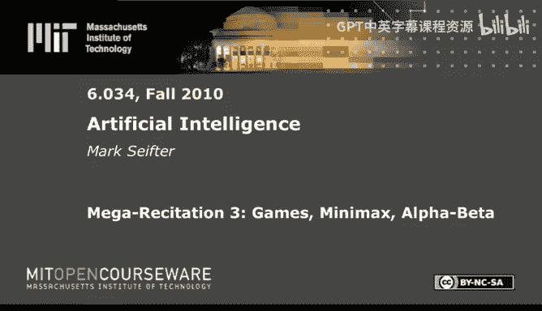
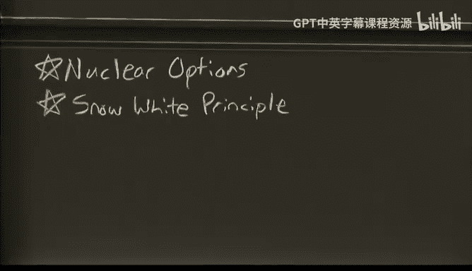
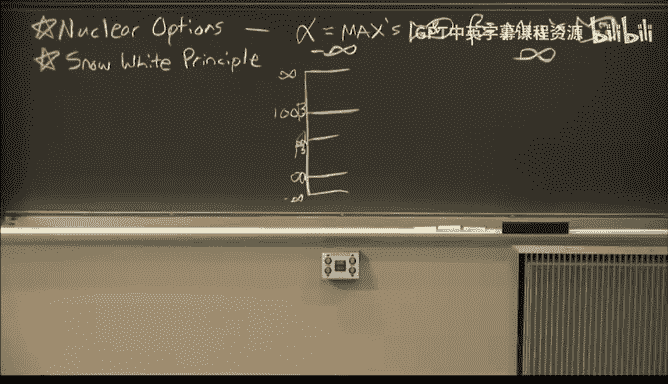
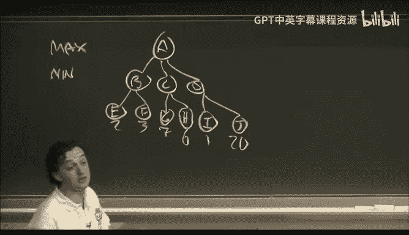
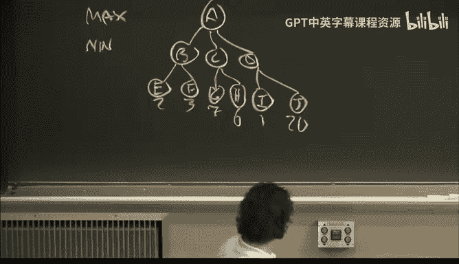

# 26：游戏、Minimax、Alpha-Beta剪枝 🎮



## 概述



在本节课中，我们将学习游戏树搜索的核心算法。我们将从基础的Minimax算法开始，然后深入探讨其优化版本Alpha-Beta剪枝算法。我们还将了解静态评估函数的概念，并讨论渐进深化策略。课程将通过一个具体的游戏树例子，一步步演示这些算法是如何工作的。

---

## Minimax算法回顾

上一节我们介绍了游戏树的基本概念。本节中，我们来看看最基础的Minimax算法是如何工作的。

Minimax算法是一种用于两人零和博弈的决策算法。在游戏树中，顶层的**最大化玩家**（Maximizer）试图获得最高分数，而其对手**最小化玩家**（Minimizer）则试图将分数压到最低。算法本质上是一种深度优先搜索。

考虑以下游戏树，节点从A到R。顶层的A是最大化玩家。

```
        A (Max)
      /   |   \
     B    C    D (Min)
    / \  / \  / \
   E  F G  H I  J (Max)
  /  / \| \  \  \
 2  K  L M N 1  O P (Min)
    3  0 Q R  20 2
        1 5   7  6
```

我们的目标是计算根节点A的Minimax值。以下是计算步骤：

1.  从A开始深度优先搜索。A需要从子节点B、C、D中取最大值。
2.  首先搜索B。B是最小化节点，需要从子节点E和F中取最小值。
3.  搜索E，得到静态评估值2。此时B的临时最小值为2。
4.  搜索F。F是最大化节点，需要从子节点K和L中取最大值。
5.  K的值为3，L的值为0。因此F的值为 `max(3, 0) = 3`。
6.  回到B，现在需要在E的值2和F的值3中取最小值。因此B的值为 `min(2, 3) = 2`。
7.  接着搜索C。C是最小化节点，需要从子节点G和H中取最小值。
8.  首先搜索G。G是最大化节点，需要从子节点M和N中取最大值。
9.  搜索M。M是最小化节点，需要从子节点Q和R中取最小值。Q=1，R=5，因此M的值为 `min(1, 5) = 1`。
10. 回到G，现在需要比较M的值1和N的值。搜索N，得到静态评估值7。因此G的值为 `max(1, 7) = 7`。
11. 回到C，现在需要在G的值7和H的值之间取最小值。搜索H，得到静态评估值6。因此C的值为 `min(7, 6) = 6`。
12. 最后搜索D。D是最小化节点，需要从子节点I和J中取最小值。
13. I的值为1，J是最大化节点，其子节点O=20，P=2，因此J的值为 `max(20, 2) = 20`。所以D的值为 `min(1, 20) = 1`。
14. 回到根节点A，现在需要在B=2、C=6、D=1中取最大值。因此A的最终Minimax值为 `max(2, 6, 1) = 6`。最优路径是 A -> C -> H。



**核心公式**：对于一个最大化节点，其值 `V = max(children)`；对于一个最小化节点，其值 `V = min(children)`。

---

## Alpha-Beta剪枝算法

上一节我们使用Minimax算法完整遍历了游戏树。本节中我们来看看如何通过Alpha-Beta剪枝来优化这个过程，避免搜索不必要的分支。

Alpha-Beta剪枝是Minimax算法的优化版本，其核心思想是引入两个值：
*   **Alpha（α）**：最大化玩家的“核选项”或安全底线。代表最大化玩家**至少**能保证获得的分值。初始值通常设为 `-∞`。
*   **Beta（β）**：最小化玩家的“核选项”或安全上限。代表最小化玩家**至多**允许最大化玩家获得的分值。初始值通常设为 `+∞`。

算法的关键被称为 **“白雪公主原则”**：每个节点初始时继承其父节点的α或β值。但在评估其子节点的过程中，如果发现更好的（对自身有利的）值，就会“夺取”这个值来更新自己的α或β。当某个节点的α ≥ β时，就可以断定剩余分支无需搜索，进行**剪枝**。

让我们用同一个游戏树演示Alpha-Beta剪枝的过程：

1.  **初始化**：根节点A（Max）的 α = -∞， β = +∞。
2.  **搜索左分支（B）**：
    *   节点B（Min）从A继承 β = +∞。
    *   深度优先搜索第一个子节点E（静态值2）。B看到2比+∞好（更小），于是更新自己的 β = 2。
    *   准备搜索下一个子节点F。在进入F之前，F（Max）从B继承 α = -∞。
    *   搜索F的第一个子节点K（静态值3）。F更新自己的 α = max(-∞, 3) = 3。
    *   **关键剪枝判断**：此时，F的α=3，而F的父节点B的β=2。出现了 **α（3） ≥ β（2）** 的情况。这意味着，对于B（最小化玩家）来说，走F分支至少会让对手得到3分，这已经比已知的另一个选择E（2分）更差了。因此，B没有必要继续探索F的另一个子节点L。**剪枝发生**，L不被评估。
    *   B的最终值就是2。A更新自己的 α = max(-∞, 2) = 2。
3.  **搜索中分支（C）**：
    *   节点C（Min）从A继承 β = +∞。但注意，此时A的α已更新为2。根据深度优先搜索，C的子节点G（Max）会继承这个α=2作为自己的初始α。
    *   搜索G。首先进入子节点M（Min），M从G继承 β = +∞。
    *   搜索M的子节点Q（静态值1）。M更新 β = min(+∞, 1) = 1。
    *   **关键剪枝判断**：现在，M的β=1，而M的父节点G的α=2。出现了 **α（2） ≥ β（1）** 的情况。这意味着，对于G（最大化玩家）来说，走M分支最多只能得到1分（因为最小化玩家M会选最小的），这比G已知的“安全底线”（α=2）还要差。因此，G没有必要继续探索M的另一个子节点R。**剪枝发生**。
    *   G继续探索另一个子节点N（静态值7）。由于7 > 2，G更新自己的 α = 7。
    *   G的值为7。回到C，C（Min）看到7，更新自己的 β = min(+∞, 7) = 7。
    *   C继续探索下一个子节点H（静态值6）。由于6 < 7，C更新 β = 6。
    *   C的值为6。回到A，A（Max）看到6比当前的α=2大，于是更新 α = 6。
4.  **搜索右分支（D）**：
    *   节点D（Min）从A继承 β = +∞。此时A的α=6。
    *   搜索D的第一个子节点I（静态值1）。D更新 β = min(+∞, 1) = 1。
    *   **关键剪枝判断**：此时D的β=1，而A的α=6。出现了 **α（6） ≥ β（1）** 的情况。这意味着，对于A（最大化玩家）来说，走D分支最多只能得到1分（因为最小化玩家D会选最小的），这已经比A当前的最佳选择（α=6）差了。因此，A没有必要继续探索D的另一个子节点J及其所有后代。**整个D分支被剪枝**。
5.  **最终结果**：A的α值6就是最终的Minimax值。

**被静态评估的节点顺序**（即实际计算了静态评估函数的叶子节点）为：E, K, Q, N, H, I。
**被剪枝而未评估的节点**包括：L, R, J, O, P。

**剪枝条件总结**：
*   在最大化节点处，如果其α值 ≥ 从其父节点继承来的β值，则可以剪掉剩余兄弟节点。
*   在最小化节点处，如果其β值 ≤ 从其父节点继承来的α值，则可以剪掉剩余兄弟节点。

---

## 静态评估与渐进深化

上一节我们深入了解了Alpha-Beta剪枝的机制。本节中我们来看看两个相关的概念：静态评估函数和渐进深化策略。

### 静态评估函数

静态评估函数用于在游戏树搜索无法到达终局时，对中间局面给出一个分数估计。它是对游戏状态的一种启发式评估。

**核心特点**：
*   它**不是**简单的数字，而是一个可能很复杂的函数，会考虑棋盘上的子力对比、控制区域、特殊威胁（如将军）等多种因素。
*   计算一个准确的静态评估值可能非常耗时，这正是在搜索中需要剪枝来减少其调用次数的原因。
*   在游戏树中，它只在**叶子节点**（或指定的搜索深度截断点）被调用。

### 渐进深化

渐进深化是一种优化搜索策略，旨在帮助Alpha-Beta剪枝更有效。其基本思想是：

1.  先以较浅的深度（例如2层）搜索整个游戏树。
2.  根据浅层搜索的结果，对每个节点的子节点进行**排序**。
3.  然后以更深的深度进行完整搜索，但使用排序后的顺序。

**排序原则**：
*   对于**最大化节点**，将其子节点按照上一轮浅层搜索得到的值**从高到低**排序。
*   对于**最小化节点**，将其子节点按照上一轮浅层搜索得到的值**从低到高**排序。

**目的**：让可能更优的分支（对当前玩家而言）先被搜索。这样，Alpha-Beta算法就能更早地建立更紧的α/β边界，从而在后续分支中引发更多的剪枝。





**示例**：假设我们对示例树只进行两层深度搜索（即评估F、G、J节点本身，得到值3、7、20）。那么：
*   在B节点（Min），子节点值分别为E=2，F=3。Min会偏好更小的值，所以应将E排在F前面。
*   在C节点（Min），子节点值分别为G=7，H=6。Min偏好更小的值，所以应将H排在G前面。
*   在D节点（Min），子节点值分别为I=1，J=20。Min偏好更小的值，所以应将I排在J前面。
*   在A节点（Max），子节点值分别为B=2，C=6，D=1。Max偏好更大的值，所以应将C排在B前面，B排在D前面。

按照这个顺序进行深层搜索，理论上能获得最佳的剪枝效果。

**需要注意**：渐进深化的效果依赖于浅层搜索静态评估函数的**启发式质量**。如果启发式函数很差，给出的排序是误导性的，那么剪枝效率可能反而会降低，甚至不如不排序。因此，使用渐进深化并不**保证**一定能得到更好或相等的剪枝效果。

---

## 总结

本节课中我们一起学习了游戏人工智能中的核心搜索算法。

1.  我们首先回顾了**Minimax算法**，它通过深度优先搜索和交替取极大/极小值来计算游戏树中每个节点的价值。
2.  接着，我们深入探讨了**Alpha-Beta剪枝算法**，它通过维护α（最大化玩家的下限）和β（最小化玩家的上限）两个值，并在满足`α ≥ β`条件时剪除不必要的分支，从而大幅提升搜索效率，而不影响结果正确性。我们通过“白雪公主原则”来理解α/β值的传递与更新。
3.  然后，我们解释了**静态评估函数**的作用，它是游戏树搜索在非终局节点上的估值依据，其计算成本是推动我们进行剪枝优化的主要动力。
4.  最后，我们介绍了**渐进深化**策略，即通过浅层搜索来对分支进行排序，以期在后续的深层Alpha-Beta搜索中引发更早、更多的剪枝。我们也讨论了其效果对启发式函数质量的依赖性。


掌握这些算法是构建高效游戏AI的基础。理解剪枝的条件和渐进深化的思想，对于优化搜索性能至关重要。