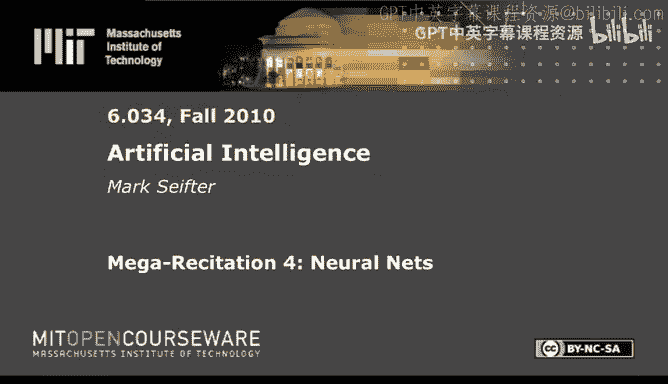
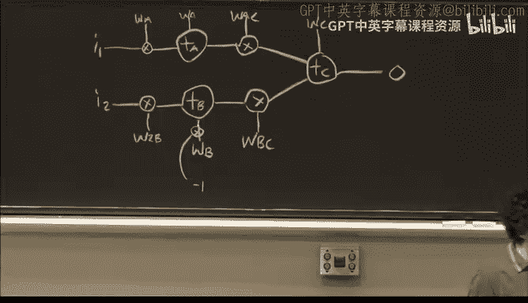
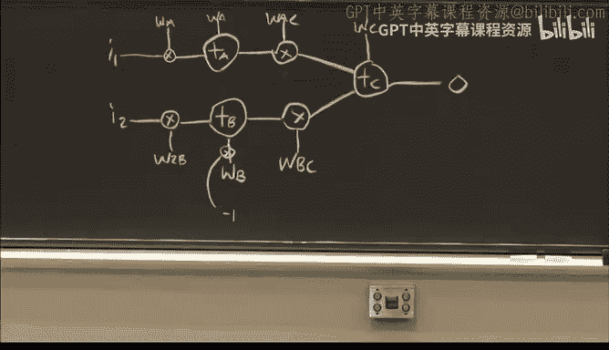
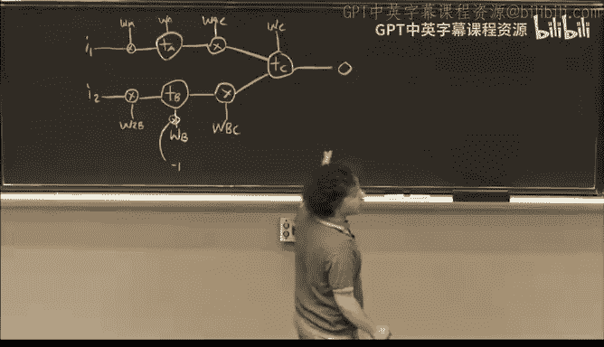
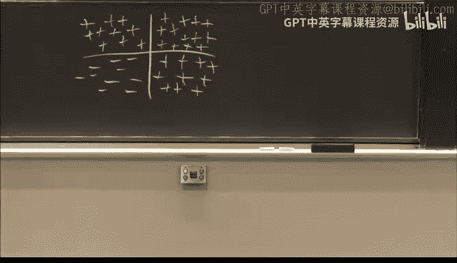

# 27：神经网络基础与反向传播 🧠

## 概述

在本节课中，我们将学习神经网络的基本原理，特别是反向传播算法的核心公式。我们将从神经网络的两种图示方法开始，详细推导权重更新的关键方程，并通过一个具体实例演示如何应用这些公式。最后，我们将探讨不同网络结构所能解决的不同类型问题。

## 神经网络图示方法 📐

上一节我们介绍了课程背景，本节中我们来看看神经网络的表示方法。

在过去的课程资料中，神经网络的图示方式并不统一。今年，我们将采用一种新的、更清晰的绘图方式。

左侧是旧式的绘图方式，右侧是新式的绘图方式。两者表示的是同一个网络。你可能会觉得左侧的图更简洁，但实际上右侧的图更利于理解。

在旧式表示法中，输入通常标记为X，输出标记为Y，但这容易与坐标轴混淆。此外，权重与输入的乘法操作以及节点输入的求和操作都是隐含的。

在新式表示法中，这些操作被明确展示出来。每个输入都会进入一个乘法器，与权重（W）相乘。然后，所有乘积被送入一个求和器（Σ）进行相加。求和的结果被送入激活函数（例如S型函数）。最后，输出可能继续进入下一层的乘法器和求和器。

**转换指南**：如果你在旧的测验中看到左侧样式的图，请尝试将其转换为右侧样式。能够成功转换，通常意味着你已理解其结构。

## 核心公式推导 📝

上一节我们统一了网络的画法，本节中我们来看看驱动网络学习的数学公式。

以下是反向传播算法所需的所有核心公式。

### 激活函数：S型函数

S型函数是我们的老朋友，其公式为：

**公式**：`σ(x) = 1 / (1 + e^(-x))`

S型函数有一个重要性质：其导数可以用其自身表示。

**公式**：若 `y = σ(x)`，则 `σ‘(x) = y * (1 - y)`

这个性质在反向传播中至关重要。

### 性能函数

性能函数用于衡量网络输出与期望输出之间的差距。我们选择以下形式：

**公式**：`P = 1/2 * (d - o)^2`

其中，`d` 是期望输出，`o` 是实际输出。我们希望通过调整权重使 `P` 最小化（即误差最小）。

选择这个函数的一个重要原因是其导数的简洁性：

**公式**：`∂P/∂o = -(d - o)`

### 反向传播权重更新公式

权重的更新是神经网络进行“爬山”学习的关键。每个权重都会根据以下公式进行微调：

**公式**：`W_ij’ = W_ij + α * I_i * δ_j`

让我们解析这个公式：
*   `W_ij’`：更新后的权重（连接节点 i 和 j）。
*   `W_ij`：更新前的旧权重。
*   `α`：学习率。由题目给出，控制每次更新的步长大小。
*   `I_i`：流入该权重乘法器的输入值。
*   `δ_j`：下游节点 j 的 Delta 值。这是理解误差如何通过网络反向传播的关键。

### Delta 值的计算

Delta 值（δ）通过误差的偏导数计算，指示了每个节点对最终误差的“责任”大小。计算方式取决于节点是输出层节点还是隐藏层节点。

**对于输出层节点 F**：
其 Delta 值直接由性能函数导数和激活函数导数决定。

**公式**：`δ_F = (d - o) * o * (1 - o)`

**对于隐藏层节点 I**：
其 Delta 值需要递归计算，考虑其对所有下游子节点的影响。

**公式**：`δ_I = o_I * (1 - o_I) * Σ (W_IJ * δ_J)`

求和遍历节点 I 的所有直接下游子节点 J。

## 公式变化的应对策略 🔄

在测验中，激活函数或性能函数可能会被替换。我们需要知道公式将如何变化。

**如果改变激活函数（例如，将 S 型函数改为加法器）**：
只需将 `δ_F` 和 `δ_I` 公式中的 `o * (1 - o)` 替换为新激活函数的导数。
*   例如，对于纯加法器 `y = x`，其导数为 1。因此 `δ_F` 变为 `(d - o)`，`δ_I` 公式中的 `o * (1 - o)` 因子也变为 1。

**如果改变性能函数**：
只需将 `δ_F` 公式中的 `(d - o)` 替换为新性能函数对 `o` 的导数。`δ_I` 公式完全不变。

## 实例演练：2008年测验题 💻

上一节我们掌握了理论公式，本节中我们通过一个具体问题来应用它们。

我们将解析2008年的一道测验题，该题后半部分曾难倒许多学生。

### 问题设定

网络中的所有节点均为**加法器**（而非S型函数）。所有初始权重均为1，除了偏移权重 `W_C = -0.5`。所有输入值 (`I1`, `I2`) 和期望输出 (`d`) 均为1。学习率 `α = 1`。

### 第一步：前向传播计算输出

首先，我们计算网络的初始输出 `o`。

以下是计算过程：
1.  计算节点 A 的输入：`(I1 * W1A) + (I2 * W2A) + (-1 * W_A) = (1*1) + (1*1) + (-1*1) = 1`
2.  节点 A 是加法器，输出即为 1。
3.  同理，节点 B 的输出也是 1。
4.  计算节点 C 的输入：`(A_out * W_AC) + (B_out * W_BC) + (-1 * W_C) = (1*1) + (1*1) + (-1*(-0.5)) = 2.5`
5.  节点 C 是加法器，输出 `o = 2.5`。

### 第二步：反向传播更新权重

现在，我们进行一轮反向传播来更新所有权重。

**首先，计算各节点的 Delta 值 (δ)**：
*   对于加法器，激活函数导数为 1。
*   `δ_C = (d - o) = (1 - 2.5) = -1.5`
*   `δ_A = 1 * (W_AC * δ_C) = 1 * (1 * -1.5) = -1.5`
*   `δ_B = 1 * (W_BC * δ_C) = 1 * (1 * -1.5) = -1.5`

**接着，根据公式 `W_ij’ = W_ij + α * I_i * δ_j` 更新每个权重**：

以下是更新过程：
*   `W_AC’ = 1 + 1 * (A_out=1) * (δ_C=-1.5) = -0.5`
*   `W_BC’ = 1 + 1 * (B_out=1) * (δ_C=-1.5) = -0.5`
*   `W_C’ = -0.5 + 1 * (I=-1) * (δ_C=-1.5) = -0.5 + 1.5 = 1.0`
*   `W1A’ = 1 + 1 * (I1=1) * (δ_A=-1.5) = -0.5`
*   `W2B’ = 1 + 1 * (I2=1) * (δ_B=-1.5) = -0.5`
*   `W_A’ = 1 + 1 * (I=-1) * (δ_A=-1.5) = 1 + 1.5 = 2.5`
*   `W_B’ = 1 + 1 * (I=-1) * (δ_B=-1.5) = 2.5`

**最后，使用新权重进行一次前向传播，得到新输出**：
节点 A 输入: `(1*-0.5)+(1*1)+(-1*2.5) = -2.0` -> 输出 -2.0
节点 B 输入: `(1*1)+(1*-0.5)+(-1*2.5) = -2.0` -> 输出 -2.0
节点 C 输入: `(-2.0*-0.5)+(-2.0*-0.5)+(-1*1.0) = 1.0` -> 新输出 `o_new = 1.0`

经过一轮反向传播，输出从 2.5 调整为了更接近期望值 1.0 的 1.0。

## 神经网络的能力与局限 🧩

上一节我们完成了计算，本节中我们退一步，思考神经网络的结构如何决定其解决问题的能力。

考虑一个分类问题：在二维平面上区分正负样本点。一个常见的理解是：**网络中的每个 S 型神经元可以在输入空间（即平面）上画出一条决策边界线**。
*   如果神经元只接收一个输入（如 I1），它只能画垂直线或水平线。
*   如果神经元接收两个输入（I1, I2），它可以画斜线。
*   后层的神经元可以对前层神经元画出的线进行逻辑组合（如 AND, OR），从而形成更复杂的区域（如矩形、三角形）。

给定六种不同的网络结构（A-F）和六种不同的分类问题图案（1-6），我们需要进行一对一匹配。

**解题思路**：
1.  **识别最简单的图案**：图案6（只需一条线）对应最简单的网络 A（只有一个神经元）。
2.  **识别最复杂的图案**：图案3（XOR 异或问题）需要多层非线性组合，对应最深的网络 C。
3.  **分析网络能力**：
    *   网络 D 的第一个神经元只接收 I1（只能画竖线），第二个只接收 I2（只能画横线）。因此它只能处理需要一横一竖两条线的问题，即图案4。
    *   网络 B 有两个神经元，且都接收 I1 和 I2，可以画两条任意方向的线，因此可以处理图案5（两条斜线）。
    *   网络 E 和 F 有三个第一层神经元，可以画三条线，用于处理需要三角形区域的问题（图案1和2）。其中，网络 F 的神经元输入受限（一个只收 I1，一个只收 I2，一个全收），更适合处理图案2（一横、一竖、一斜）。网络 E 则处理更自由的图案1。
4.  **最终匹配**：
    *   A - 6
    *   B - 5
    *   C - 3
    *   D - 4
    *   E - 1
    *   F - 2

这种练习有助于理解如何根据问题的复杂性（决策边界的形状和数量）来选择合适的网络架构。

## 总结

本节课中我们一起学习了神经网络的核心知识。我们首先对比了神经网络的两种图示方法，并强调了明确表示每个计算步骤的重要性。接着，我们系统推导了反向传播算法的核心公式：S型函数及其导数、性能函数以及权重更新公式。我们特别讨论了当激活函数或性能函数改变时，公式应如何调整。通过2008年测验题的实例，我们演练了前向传播和一轮完整的反向传播计算。最后，我们探讨了神经网络结构与其解决问题能力之间的关系，理解了不同层数和连接方式的网络如何对应不同复杂度的决策边界。掌握这些基础，是理解和应用更复杂神经网络模型的关键。