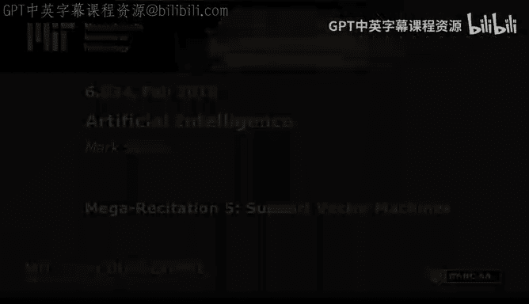
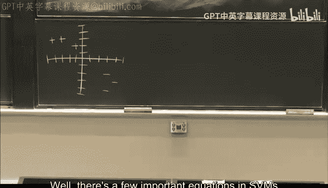
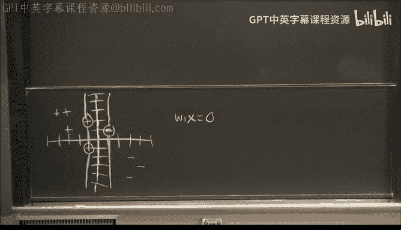

# 28：Mega-R5. 支持向量机 🧠

## 概述
在本节课中，我们将要学习支持向量机（SVM）的核心概念。我们将通过一个具体的例子，学习如何识别支持向量、确定决策边界，并使用一些技巧来求解关键的参数，而无需处理复杂的方程组。

---

## 支持向量机基础

支持向量机是一种用于分类的机器学习算法。它的目标是找到一个最优的决策边界，将不同类别的数据点分开，同时最大化边界两侧的“间隔”。

在二维空间中，数据点可以表示为向量。支持向量是那些位于“间隔”边缘、对确定决策边界至关重要的数据点。

## 关键方程与概念

支持向量机的核心可以用几个关键方程来描述。对于正类的支持向量，有：
**W · X⁺ + B = 1**
对于负类的支持向量，有：
**W · X⁻ + B = -1**
而决策边界（即“街道”的中线）的方程是：
**W · X + B = 0**

其中，**W** 是决定边界方向的权重向量，**B** 是偏置项。**X** 代表数据点的特征向量。

另一个核心概念是 **α**（阿尔法）。每个数据点都有一个对应的 α 值，它代表了该点对形成决策边界的重要性。只有支持向量的 α 值大于 0；所有其他点的 α 值都为 0。并且，所有正类支持向量的 α 值之和等于所有负类支持向量的 α 值之和。

权重向量 **W** 可以通过支持向量及其 α 值计算得出：
**W = Σ(α⁺ᵢ * X⁺ᵢ) - Σ(α⁻ⱼ * X⁻ⱼ)**

---

## 问题一：识别与求解

现在，我们来看第一个具体问题。我们的任务是：圈出支持向量，画出“街道”的边缘和中间的决策边界（用虚线表示），最后给出 **W** 和 **B** 的值。

### 识别支持向量与决策边界

首先，我们需要通过观察找出支持向量。支持向量是那些距离对方类别最近、从而“支撑”起最大间隔的数据点。

观察图形后，我们可以确定正类支持向量是坐标为 (-1, 2) 的点，负类支持向量是坐标为 (3, -2) 的点。连接这两点的垂直平分线就是我们的决策边界。通过观察，我们可以推断出这条线的方程是 **y = x - 1**。

### 求解 W 和 B

上一节我们介绍了支持向量机的核心方程，本节中我们来看看如何巧妙地求解 **W** 和 **B**，而不必陷入复杂的方程组。

我们知道决策边界方程 **W · X + B = 0** 在二维坐标下对应于 **y = x - 1**。通过对比标准直线方程 **y = (-W₁/W₂)x - (B/W₂)**，我们可以得出：
**-W₁/W₂ = 1** 且 **-B/W₂ = -1**

由此可知，**W₁** 和 **W₂** 符号相反，且 **B** 与 **W₂** 符号相同。我们设 **W₁ = -k**, **W₂ = k**, **B = k**。

接下来，我们利用“间隔”宽度与 **W** 的模长的关系。从正类支持向量到决策边界的垂直距离 **D** 是 `1 / ||W||`。在图中，通过几何计算可得 **D = 2√2**。因此：
**1 / ||W|| = 2√2** => **||W|| = √2 / 4**

向量 **W** 的模长计算公式为 **√(W₁² + W₂²)**。代入 **W₁ = -k**, **W₂ = k**，得到：
**√(2k²) = √2 / 4** => **k = 1/4**

所以，最终结果为：
**W = (-1/4, 1/4)**
**B = 1/4**

---

## 问题二：增加数据点

现在，我们来看一个稍作变化的问题。图形中增加了一个负类点 (2, -1) 和一个正类点。

### 确定新的边界

尽管增加了点，但通过观察，最近的正负点对仍然是 (-1, 2) 和 (3, -2)。它们的垂直平分线，即决策边界，仍然是 **y = x**。

### 快速求解

根据边界方程 **y = x**，我们可以直接得出 **B = 0**，且 **-W₁/W₂ = 1**，因此设 **W₁ = -k**, **W₂ = k**。

计算从支持向量到边界的距离 **D**。此时，**D = (3√2) / 2**。因此：
**1 / ||W|| = (3√2) / 2** => **||W|| = √2 / 3**

代入模长公式：
**√(2k²) = √2 / 3** => **k = 1/3**

所以，结果为：
**W = (-1/3, 1/3)**
**B = 0**

---

## 问题三：一维空间与核函数

前面的问题都在二维空间，但有时数据在原始空间中是线性不可分的。本节中我们来看看如何处理这种情况，并引入“核函数”的概念。

现在我们面对一个一维数轴上的分类问题，正负点交错，无法用一条直线分开。这时，我们需要使用“核技巧”。

### 核函数原理

基本思想是，通过一个函数 **Φ**，将原始数据 **X** 映射到一个更高维度的新空间。在这个新空间中，数据可能变得线性可分。

然而，聪明的做法是我们不需要直接知道映射函数 **Φ** 的具体形式。我们只需要一个“核函数” **K(X, Z)**，它能计算出映射后向量的点积：
**K(X, Z) = Φ(X) · Φ(Z)**

支持向量机的所有关键方程都只涉及数据点之间的点积，而不是数据点本身。因此，只要知道核函数 **K**，我们就可以在不显式计算 **Φ** 的情况下完成所有运算。

### 应用示例

题目给出了一个核函数：
**K(x, z) = cos(πx/4) * cos(πz/4) + sin(πx/4) * sin(πz/4)**

我们需要找出对应的映射函数 **Φ**。观察这个形式，它很像两个二维向量的点积：
**(a₁, a₂) · (b₁, b₂) = a₁b₁ + a₂b₂**

因此，我们可以令：
**Φ(x) = (cos(πx/4), sin(πx/4))**

这样，**Φ(x)** 就将一维的 **x** 映射到了二维空间。我们可以将所有原始数据点通过 **Φ** 映射，然后在新的二维空间中，这些点变得线性可分了。

---

## 总结

本节课中我们一起学习了支持向量机的核心内容。

我们首先回顾了SVM的关键方程，理解了支持向量、决策边界和间隔的概念。然后，我们通过具体的例子，学习了如何直观地识别支持向量和决策边界。

更重要的是，我们掌握了一种技巧：通过决策边界的几何方程和间隔宽度，直接求解权重 **W** 和偏置 **B**，避免了求解复杂方程组的过程。

最后，我们探讨了当数据线性不可分时，如何使用核函数将数据映射到高维空间以实现分离，并理解了核函数如何让我们绕开复杂的高维映射计算。

希望这节课能帮助你更好地理解支持向量机这一强大的分类工具。