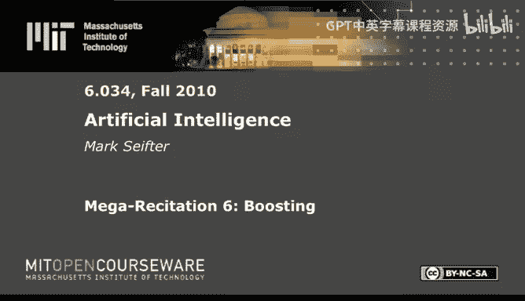

# 29：Boosting 提升算法 🚀

在本节课中，我们将学习一种强大的机器学习技术——Boosting（提升算法）。我们将通过一个具体的吸血鬼分类问题，一步步理解Boosting的核心思想、计算步骤以及如何构建一个强大的最终分类器。

---

## 概述

Boosting是一种集成学习方法，它通过组合多个“弱”分类器（即仅比随机猜测略好的简单分类器）来构建一个强大的“强”分类器。其核心思想是：在每一轮迭代中，重点关注之前被错误分类的样本，并赋予它们更高的权重，从而让新的弱分类器努力去纠正之前的错误。

---

## 问题设定与数据准备

假设我们为著名的吸血鬼猎人咨询公司工作，任务是构建一个优秀的吸血鬼分类器。我们有以下10个样本数据，每个样本包含若干特征及其是否为吸血鬼的标签（+ 表示是，- 表示不是）。

| ID | 名字 | 吸血鬼? | 邪恶? | 忧郁? | 变形? | 闪闪发光? | 浪漫兴趣数 |
|:---|:---|:---:|:---:|:---:|:---:|:---:|:---:|
| 1 | 德古拉 | + | 是 | 否 | 是 | 否 | 5 |
| 2 | 安吉尔 | + | 否 | 是 | 否 | 否 | 3 |
| 3 | 爱德华·卡伦 | + | 否 | 是 | 否 | 是 | 1 |
| 4 | 塞亚 | + | 否 | 是 | 是 | 否 | 3 |
| 5 | 莱斯特 | + | 是 | 否 | 是 | 否 | 5 |
| 6 | 比安卡 | + | 是 | 否 | 否 | 否 | 3 |
| 7 | 卡米拉 | + | 是 | 否 | 否 | 否 | 3 |
| 8 | 月野兔 | - | 否 | 否 | 是 | 否 | 1 |
| 9 | 斯考尔 | - | 否 | 是 | 否 | 否 | 1 |
| 10 | 喀耳刻 | - | 否 | 否 | 否 | 否 | 5 |

我们的目标是利用这些特征构建弱分类器，并通过Boosting将它们组合起来。

---

## 第一步：识别所有可能的弱分类器

首先，我们需要列出所有可能的简单（弱）分类规则。一个弱分类器基于单个特征做出判断。对于布尔特征（是/否），我们有两种规则：特征为“是”则判为吸血鬼，或特征为“否”则判为吸血鬼。对于数值特征“浪漫兴趣数”，我们可以设定阈值（例如 >2, >4）。

以下是所有14个候选弱分类器及其错误分类的样本ID（即分类错误的样本）：

*   **A.** `邪恶? = 是` -> 吸血鬼：错分 [2, 3, 4, 5]
*   **B.** `忧郁? = 是` -> 吸血鬼：错分 [1, 6, 7, 9]
*   **C.** `变形? = 是` -> 吸血鬼：错分 [3, 4, 5, 8]
*   **D.** `闪闪发光? = 是` -> 吸血鬼：错分 [1, 2, 4, 5, 6, 7, 8]
*   **E.** `浪漫兴趣 > 2` -> 吸血鬼：错分 [3, 10]
*   **F.** `浪漫兴趣 > 4` -> 吸血鬼：错分 [3, 4, 10]
*   **G.** `总是真` -> 吸血鬼：错分 [8, 9, 10]
*   **H.** `邪恶? = 否` -> 吸血鬼：错分 [1, 6, 7, 8, 9, 10] (A的互补)
*   **I.** `忧郁? = 否` -> 吸血鬼：错分 [2, 3, 4, 5, 8, 10] (B的互补)
*   **J.** `变形? = 否` -> 吸血鬼：错分 [1, 2, 6, 7, 9, 10] (C的互补)
*   **K.** `闪闪发光? = 否` -> 吸血鬼：错分 [3, 9, 10] (D的互补)
*   **L.** `浪漫兴趣 <= 2` -> 吸血鬼：错分 [1, 2, 4, 5, 6, 7, 8, 9] (E的互补)
*   **M.** `浪漫兴趣 <= 4` -> 吸血鬼：错分 [1, 2, 5, 6, 7, 8, 9] (F的互补)
*   **N.** `总是假` -> 吸血鬼：错分 [1, 2, 3, 4, 5, 6, 7] (G的互补)

---

## 第二步：筛选有效弱分类器

在Boosting中，我们永远不会选择一个在任何权重分布下都严格差于另一个分类器的分类器。具体来说，如果分类器X的错误样本集是分类器Y的错误样本集的**真子集**，那么在任何权重下，X的错误率都严格低于Y。因此，Y是无效的，可以被剔除。

通过比较错误集，我们可以筛选出最终可能被用到的6个分类器：
*   **A** (错分 [2,3,4,5])
*   **B** (错分 [1,6,7,9])
*   **C** (错分 [3,4,5,8])
*   **D** (错分 [1,2,4,5,6,7,8]) - 注意：尽管它错分很多，但没有其他分类器的错误集是其真子集。
*   **E** (错分 [3,10])
*   **G** (错分 [8,9,10])

其他分类器（如F、K等）都可以找到错误集是其真子集的分类器（如E的错误集[3,10]是F的错误集[3,4,10]的真子集），因此被淘汰。这大大简化了后续计算。

---

## 第三步：执行Boosting迭代

Boosting的核心步骤是迭代地选择弱分类器、计算其权重（Alpha），并更新样本权重。我们使用筛选后的6个分类器（A, B, C, D, E, G）进行迭代。

### 初始化
所有10个样本的初始权重相同：`W_i = 1/10 = 0.1`。

### 第一轮迭代
**目标**：选择当前权重下错误率最低的弱分类器。
由于初始权重相等，只需看哪个分类器错分的样本数最少。
*   **E** (`浪漫兴趣 > 2`) 只错分2个样本（3和10），错误率最低。
**选择分类器**: **E**
**计算错误率 ε**: `ε = 权重(3) + 权重(10) = 0.1 + 0.1 = 0.2`
**计算该分类器的权重 α**: 公式为 `α = 0.5 * ln((1 - ε) / ε)`
    *   `(1-ε)/ε = 0.8/0.2 = 4`
    *   `α_E = 0.5 * ln(4)`
**更新样本权重**:
*   **简化方法（分子法）**:
    1.  将所有权重视为分子（忽略分母）：所有样本权重分子 = 1。
    2.  圈出被E分类错误的样本（3, 10）。
    3.  计算新分母：
        *   错误样本权重分子和 * 2 = (1+1)*2 = 4
        *   正确样本权重分子和 * 2 = (8个1的和)*2 = 16
    4.  新权重为：错误样本: 分子/4，正确样本: 分子/16。统一分母为16后：
        *   样本 3, 10: 权重 = 4/16
        *   其他样本: 权重 = 1/16

### 第二轮迭代
基于新的权重，再次选择错误率最低的分类器。我们需要计算每个候选分类器的加权错误。
*   **A**: 错分[2,3,4,5]。错误 = `1/16 + 4/16 + 1/16 + 1/16 = 7/16`
*   **B**: 错分[1,6,7,9]。错误 = `1/16 + 1/16 + 1/16 + 1/16 = 4/16`
*   **C**: 错分[3,4,5,8]。错误 = `4/16 + 1/16 + 1/16 + 1/16 = 7/16`
*   **D**: 错分[1,2,4,5,6,7,8]。错误 = `1/16 + 1/16 + 1/16 + 1/16 + 1/16 + 1/16 + 1/16 = 7/16`
*   **E**: 错分[3,10]。错误 = `4/16 + 4/16 = 8/16`
*   **G**: 错分[8,9,10]。错误 = `1/16 + 1/16 + 4/16 = 6/16`
**选择分类器**: **B** (错误率最低，`4/16 = 0.25`)
**计算错误率 ε**: `ε_B = 0.25`
**计算权重 α**: `(1-ε)/ε = 0.75/0.25 = 3`，所以 `α_B = 0.5 * ln(3)`
**更新样本权重**（再次使用分子法）:
1.  当前权重分子（统一分母16后）：[1, 1, 4, 1, 1, 1, 1, 1, 1, 4] (对应样本1到10)。
2.  圈出被B分类错误的样本：[1, 6, 7, 9]。
3.  计算新分母：
    *   错误样本分子和 * 2 = (1+1+1+1)*2 = 8
    *   正确样本分子和 * 2 = (1+4+1+1+1+4)*2 = 24
4.  统一分母为24，得到新权重：
    *   错误样本 (1,6,7,9): 权重 = 3/24
    *   正确样本 (2,3,4,5,8,10): 权重 = 1/24 (样本2,4,5,8) 或 4/24 (样本3,10)？注意，我们需要基于**分子**计算。正确样本的原始分子和为 1+4+1+1+1+4=12，乘以2是24，所以每个正确样本的新权重是 `(其旧分子 * 2) / 24`。即样本3和10的新权重为 `(4*2)/24 = 8/24`，样本2,4,5,8的新权重为 `(1*2)/24 = 2/24`。为了简化比较，我们通常保持用分子计算。

### 第三轮迭代
基于第二轮更新后的权重（用分子表示：错误样本[1,6,7,9]分子为3，正确样本中，样本3和10分子为8，样本2,4,5,8分子为2），我们选择错误率最低的分类器。
计算各分类器的错误（用分子和表示，分母均为24）：
*   **A**: 错分[2,3,4,5]。错误分子 = 2 + 8 + 2 + 2 = 14
*   **C**: 错分[3,4,5,8]。错误分子 = 8 + 2 + 2 + 2 = 14
*   **D**: 错分[1,2,4,5,6,7,8]。错误分子 = 3 + 2 + 2 + 2 + 3 + 3 + 2 = 17
*   **E**: 错分[3,10]。错误分子 = 8 + 8 = 16
*   **G**: 错分[8,9,10]。错误分子 = 2 + 3 + 8 = 13
**选择分类器**: **A** 和 **C** 错误相同且最小（14）。按字母顺序选择 **A**。
**计算错误率 ε**: `ε_A = 14/24 = 7/12`
**计算权重 α**: `(1-ε)/ε = (5/12) / (7/12) = 5/7`，所以 `α_A = 0.5 * ln(5/7)`

---

## 第四步：构建最终分类器并评估

经过三轮Boosting，我们选择了三个弱分类器：E, B, A。最终强分类器是它们的加权投票组合：

**最终分类器公式**:
`H(x) = sign( α_E * h_E(x) + α_B * h_B(x) + α_A * h_A(x) )`

其中：
*   `sign()` 是符号函数，结果为正则判为吸血鬼(+1)，为负则判为非吸血鬼(-1)。
*   `h(x)` 是弱分类器的输出，正确判为吸血鬼则输出+1，否则输出-1。
*   `α_E = 0.5 * ln(4)`
*   `α_B = 0.5 * ln(3)`
*   `α_A = 0.5 * ln(5/7)`

**评估性能**:
我们不需要精确计算对数值来判断。观察三个α值，没有哪一个的绝对值明显大于另外两个之和（即 `|α_E| > |α_B| + |α_A|` 不成立）。因此，最终分类结果由这三个弱分类器的**简单多数投票**决定。
*   对于大多数样本，三个分类器中有两个判断正确，最终结果就正确。
*   只有**样本3（爱德华·卡伦）** 是个例外：E(`浪漫兴趣>2`)判断他为非吸血鬼(-1)，B(`忧郁?=是`)判断他为吸血鬼(+1)，A(`邪恶?=是`)判断他为非吸血鬼(-1)。结果是2票对1票判为非吸血鬼，但实际他是吸血鬼。因此，我们的最终分类器在10个样本中**错了1个**，准确率为90%。

---

## 概念探讨：组合弱分类器

问题：韦斯利建议将原有的简单弱分类器两两进行逻辑“与”或“或”组合，形成新的、更复杂的弱分类器集。他认为这可以用更少的Boosting轮次对更大的数据集进行分类。你同意吗？

**分析**：
*   **同意部分**：理论上，更复杂的弱分类器（如“忧郁=是 且 邪恶=是”）可能单轮就能捕捉到更特定的模式，从而有可能用更少的轮次达到相同的分类效果，即**减少迭代轮数**。
*   **不同意部分**：然而，这种组合会**极大地增加候选弱分类器的数量**（从O(n)增加到O(n²)）。在每一轮Boosting中，我们需要遍历所有候选分类器以找到错误率最低的那个。搜索空间的爆炸式增长可能会使**每一轮的计算成本显著增加**，从而抵消轮次减少带来的好处，甚至使总耗时更长。

因此，韦斯利的建议利弊参半，在实际中需要权衡计算复杂度与收敛速度。

---

## 总结

本节课我们一起学习了Boosting提升算法。我们从理解其核心思想——通过关注错误样本来迭代提升——开始，逐步演练了整个过程：从列举和筛选弱分类器，到进行多轮迭代（选择分类器、计算α、更新权重），最后构建并评估加权投票的最终强分类器。我们还探讨了关于分类器复杂性与计算效率的权衡问题。Boosting是一种强大而直观的集成方法，能够将许多简单的“弱”判断组合成非常准确的“强”预测模型。