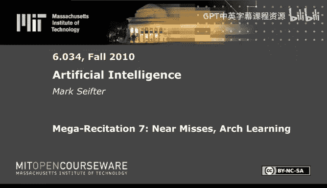
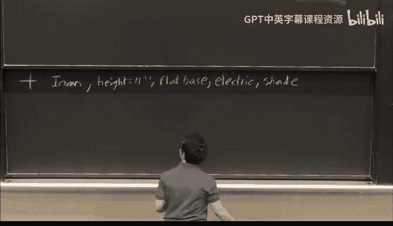

# 30：近失学习与拱形学习 🏛️

在本节课中，我们将学习一种名为“拱形学习”的早期机器学习方法。我们将重点探讨其核心机制，特别是如何处理“近失”样本，以及如何使用六种启发式规则来调整模型。

---

## 概述

拱形学习是一种概念学习系统，它通过观察正例和“近失”样本来构建和修正一个概念模型。“近失”样本是指与当前模型仅在一个属性上不同的负例。系统使用一组特定的启发式规则来根据新样本调整模型，使其更具一般性或更具体。

## 核心启发式规则

以下是拱形学习系统中使用的六种启发式规则。理解它们的作用至关重要。

*   **要求链接**：当遇到一个“近失”样本时，如果模型中某个属性值原本是可选的，但该“近失”样本恰好具有这个值，则可以**要求**模型必须包含这个值。这是一种**特化**操作。
    *   **公式**：`模型[属性] = 必须为值X`
*   **禁止链接**：当遇到一个“近失”样本时，可以**禁止**模型中某个属性取该样本所具有的特定值。这也是一种**特化**操作。
    *   **公式**：`模型[属性] != 值X`
*   **爬树**：当遇到一个正例，其某个属性值是当前模型所允许值的父节点（在概念树中层级更高）时，可以将模型中的该属性**泛化**到其父节点。这是一种**泛化**操作。
    *   **代码**：`模型.属性 = 父节点(模型.属性)`
*   **扩展集合**：当遇到一个正例，其某个属性值不在当前模型允许的离散值集合中时，可以将该值**加入**允许的集合。这是一种**泛化**操作。
    *   **代码**：`模型.允许集合.add(新值)`
*   **闭合区间**：当遇到一个正例，其某个数值属性值落在当前模型允许的区间之外时，可以**扩展**该区间以包含这个新值。这是一种**泛化**操作。
    *   **公式**：`模型.高度 ∈ [新最小值, 新最大值]`
*   **丢弃链接**：当遇到一个正例，表明某个属性无论取何值都无关紧要（所有观察到的值都是可接受的）时，可以从模型中**完全移除**对该属性的约束。这是一种**泛化**操作。
    *   **代码**：`del 模型[属性]`

---

## 规则应用场景总结

上一节我们介绍了六种启发式规则，本节中我们来看看它们各自的应用时机。关键在于区分样本类型：

*   **遇到正例时**：我们使用**泛化**规则，使模型更包容。可用的规则是：爬树、扩展集合、闭合区间、丢弃链接。
*   **遇到“近失”样本时**：我们使用**特化**规则，使模型更精确。可用的规则是：要求链接、禁止链接。

记住这个区别能帮助你快速做出正确选择。

---

## 实例演练：学习“灯”的概念

现在，让我们通过一个具体例子来应用这些规则。我们的任务是学习“灯”这个概念。初始模型基于一个典型的台灯：

*   **光源类型**：白炽灯
*   **高度**：24英寸
*   **支撑类型**：平底底座
*   **能源**：电力
*   **灯罩**：有

我们将根据一系列样本逐步调整这个模型。

### 样本 1：落地阅读灯（正例）

第一个样本是一个落地阅读灯，它是一个正例。其属性为：白炽灯，高11英寸，平底底座，电力驱动，有灯罩。

**与当前模型的差异**：只有高度不同（11英寸 vs 24英寸）。

**分析**：这是一个正例，我们需要泛化。高度是数值属性，因此使用**闭合区间**规则。

**模型更新**：
*   光源类型：白炽灯
*   高度：属于 [11, 24] 英寸区间
*   支撑类型：平底底座
*   能源：电力
*   灯罩：有

---

### 样本 2：无罩灯（正例）

第二个样本是一种没有灯罩的灯，也是正例。其属性为：白炽灯，高11.5英寸，平底底座，电力驱动，无灯罩。

**与当前模型的差异**：高度在允许区间内，但“灯罩”属性从“有”变成了“无”。

**分析**：这是一个正例，需要泛化。我们观察到“有灯罩”和“无灯罩”的灯都是正例，说明灯罩可能不是定义“灯”的必要属性。最简洁的做法是使用**丢弃链接**规则，移除对灯罩的约束。

**模型更新**：
*   光源类型：白炽灯
*   高度：属于 [11, 24] 英寸区间
*   支撑类型：平底底座
*   能源：电力
*   （灯罩属性被移除）

---

### 样本 3：荧光吊灯（正例）

第三个样本是一个荧光吊灯，是正例。其属性为：荧光灯，高13英寸，平底底座，电力驱动，有灯罩。

**与当前模型的差异**：光源类型不同（荧光灯 vs 白炽灯）。

**分析**：这是一个正例，需要泛化。光源类型“白炽灯”和“荧光灯”在概念树中拥有共同的父节点“光源”。使用**爬树**规则比创建一个包含两者的集合更简洁。

**模型更新**：
*   光源类型：光源（泛化自白炽灯）
*   高度：属于 [11, 24] 英寸区间
*   支撑类型：平底底座
*   能源：电力

---

### 样本 4：带轮荧光灯（正例）

第四个样本是一个带轮子的三脚架荧光灯，是正例。其属性为：荧光灯，高14英寸，带轮支脚，电力驱动。

**与当前模型的差异**：支撑类型不同（带轮支脚 vs 平底底座）。

**分析**：这是一个正例，需要泛化。“平底底座”和“带轮支脚”都是“底座支撑”的子类型。因此，我们再次使用**爬树**规则。

**模型更新**：
*   光源类型：光源
*   高度：属于 [11, 24] 英寸区间
*   支撑类型：底座支撑（泛化自平底底座）
*   能源：电力

---

### 样本 5：高脚白炽灯（近失样本？）

第五个样本是一个60英寸高的老式白炽灯，有平底底座、电力驱动和灯罩。它被标记为负例。

**与当前模型的差异**：高度（60英寸）不在[11,24]区间内；光源类型（白炽灯）是“光源”的子集，符合模型；支撑类型（平底底座）是“底座支撑”的子集，符合模型。

**分析**：这是一个负例，但**不是“近失”样本**，因为它与模型在“高度”这一个属性上就不匹配（区间外），并且光源和支撑类型虽然符合但具体值也不同。根据拱形学习规则，对于非近失的负例，系统通常不进行任何操作，因为无法确定具体是哪个差异导致了错误。

**模型更新**：无变化。

---

## 拱形学习的局限性讨论

通过上面的例子，我们可以看到拱形学习的一些特点，但也能发现其局限性：

1.  **对样本顺序敏感**：系统的状态完全取决于当前模型和最新样本。如果样本呈现的顺序不同，最终学到的模型可能完全不同。
2.  **无记忆性**：系统不会记住过去见过的样本。这导致它无法处理后来才变得清晰的“近失”情况，也无法识别训练数据中的矛盾。
3.  **依赖“好老师”**：该方法假设训练者会以逻辑清晰、循序渐进的方式提供样本，这在现实世界的杂乱数据中很难保证。

正如课程中所对比的，后续的“格子学习”等方法通过记忆样本在一定程度上解决了这些问题，但也引入了新的复杂性。

---

## 总结

本节课中我们一起学习了拱形学习的基本原理。我们掌握了其六种核心启发式规则（要求链接、禁止链接、爬树、扩展集合、闭合区间、丢弃链接），并明确了它们分别在处理正例（泛化）和近失样本（特化）时使用。通过一个构建“灯”的概念模型的实例，我们演练了如何应用这些规则。最后，我们也探讨了这种早期学习方法的主要优势和局限性，特别是其对样本顺序的敏感性和无记忆性的设计特点。理解这些有助于我们欣赏机器学习思想的历史演进。