# 1：L1 - 机器学习基础知识 🧠

在本节课中，我们将学习机器学习的基础概念，包括其定义、核心组件（如数据、假设、分类器）以及如何评估一个学习算法的好坏。我们将从一个具体的医学诊断例子出发，逐步构建起对机器学习问题的形式化理解。

---

## 课程安排与后勤 📅

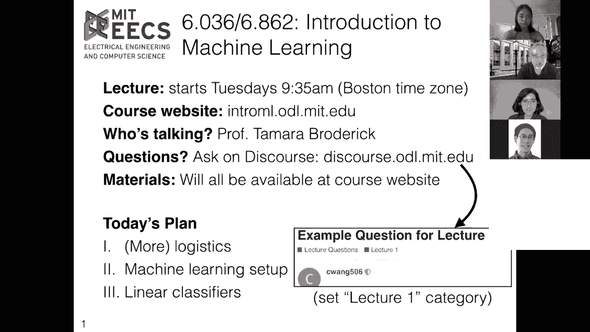

课程每周二进行。讲座会准时开始和结束。所有课程材料、幻灯片和讲座录像都会发布在课程网站上。

课程的主要沟通平台是 Discourse 论坛。鼓励所有关于课程内容的问题都在论坛上提出，教学团队会进行回复。Zoom 聊天仅用于课堂实时问答。

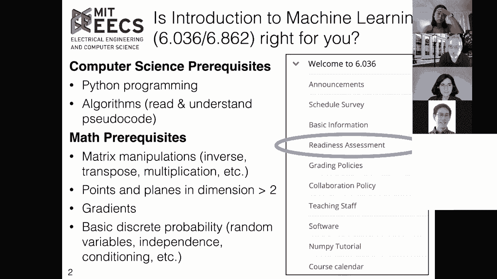

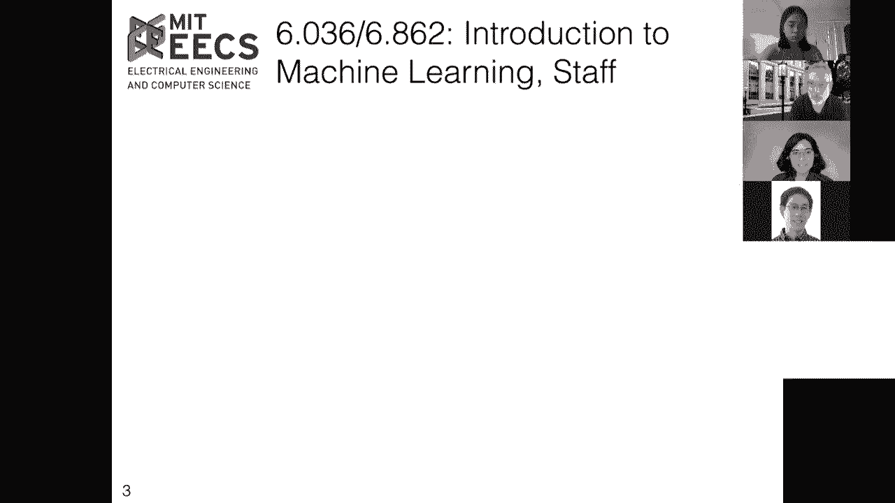

本课程（6.036）与另一门课程（6.862）有所关联。6.862 的录取已经结束，如果你被 6.862 录取但希望切换到 6.036，可以直接操作。如果你未被 6.862 录取，也可以直接注册 6.036。

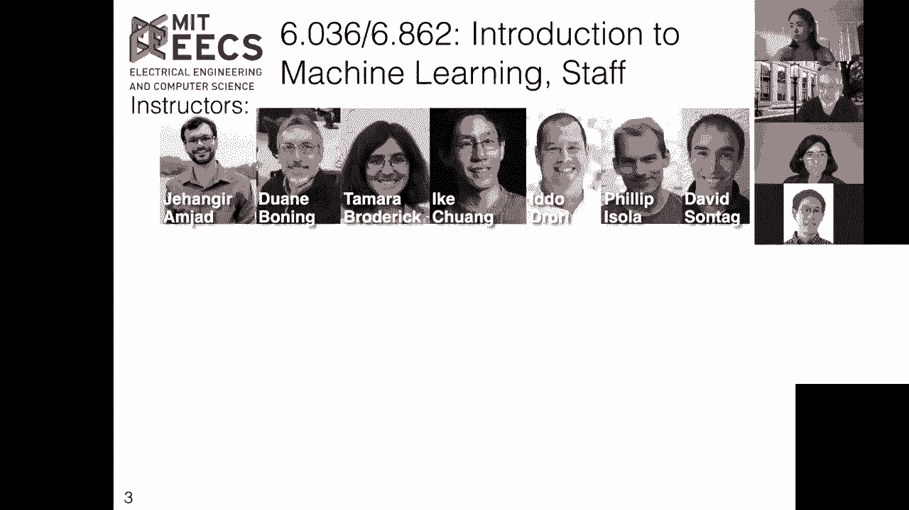

---

## 先修知识 📚

学习本课程需要具备以下基础知识：
*   **计算机科学基础**：需要熟悉 Python 编程。
*   **算法基础**：课程中会看到大量伪代码和算法思想。
*   **数学基础**：需要熟悉矩阵运算、线性代数（包括处理二维以上数据）、概率论（如条件概率）和基础离散概率。

课程提供了一个准备度评估，强烈建议学生在开课前完成，以确保自己具备所需的背景知识。

---

## 强大的教学团队 👨‍🏫👩‍🏫

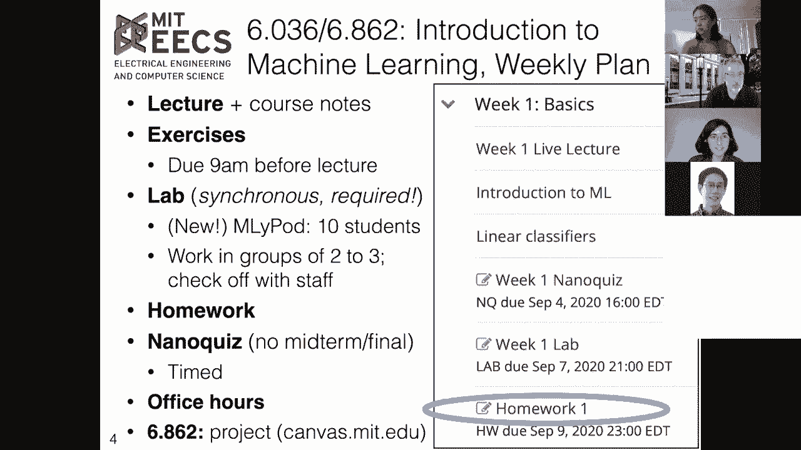

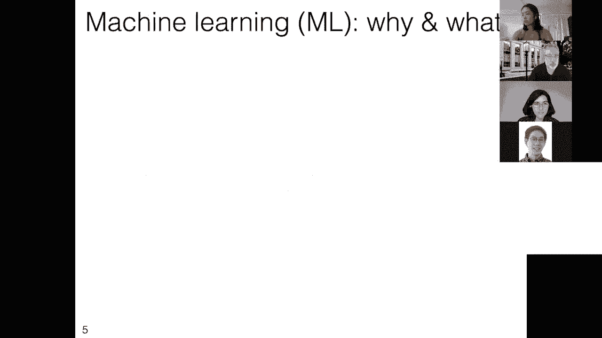

本课程拥有一支优秀的教学团队，包括主讲教师、其他讲师、助教和实验助理。他们为课程搭建了完善的基础设施，并将在整个学期中通过讲座、实验、办公时间等方式为大家提供支持。

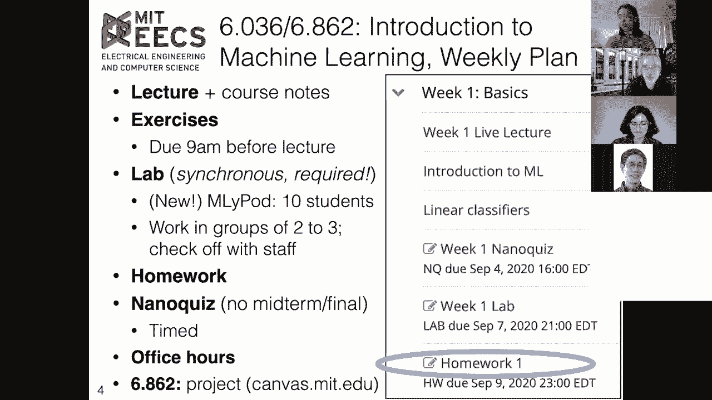

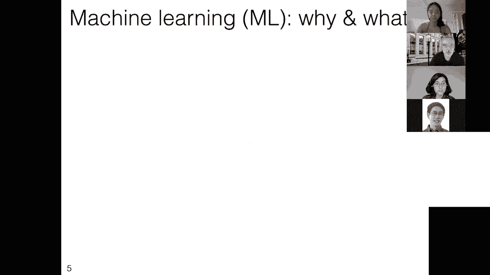

---

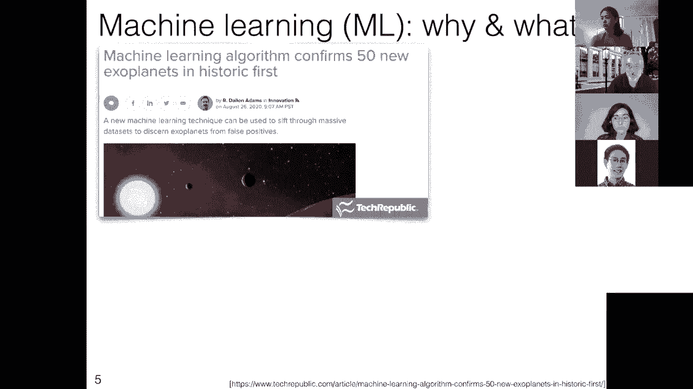

## 每周学习流程 🔄

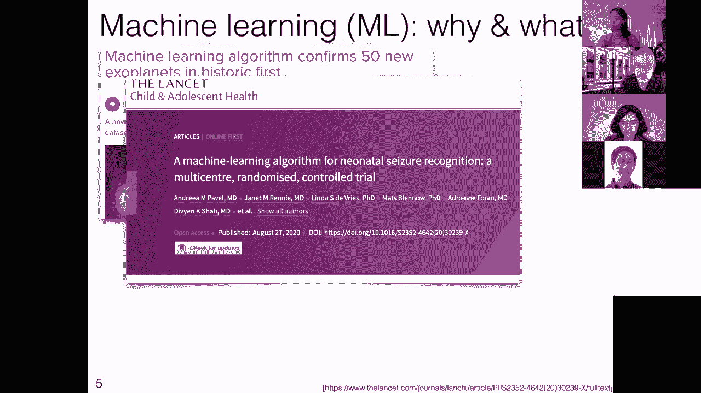

以下是每周典型的学习活动安排：

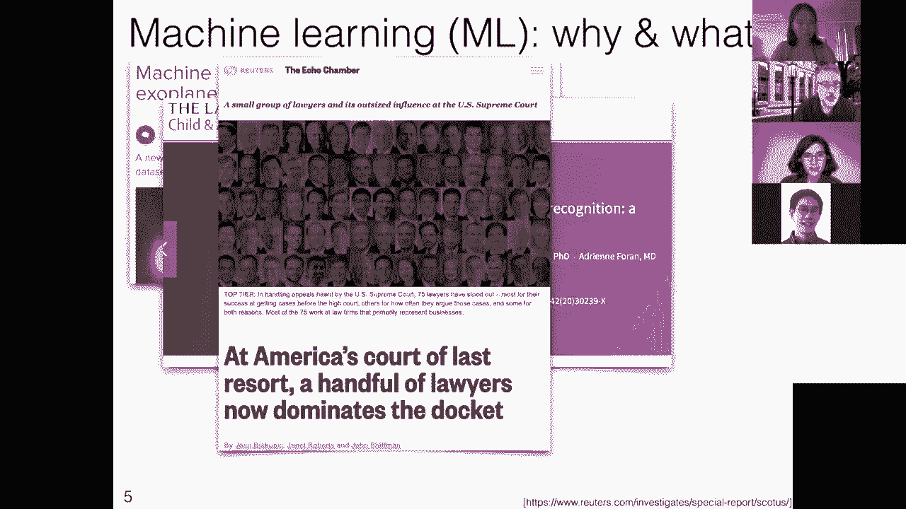

首先，请务必完成课程调查，以便教学团队安排实验时间。

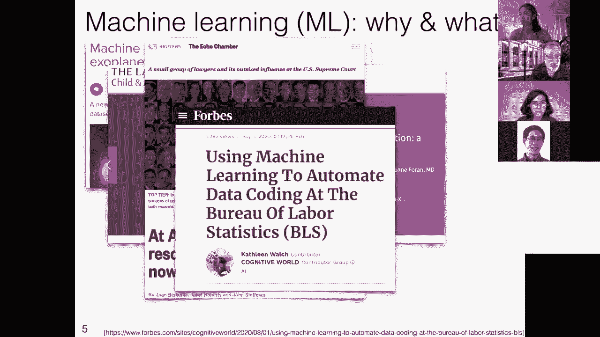

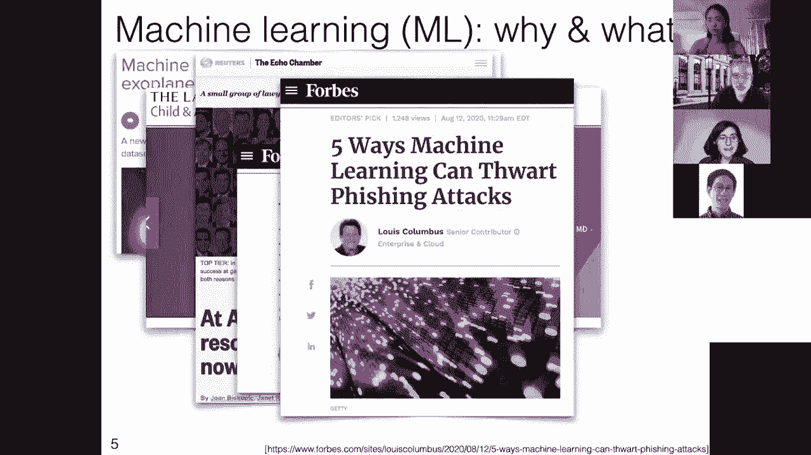

*   **讲座**：每周二进行，是获取核心知识的主要途径。
*   **课程笔记**：网站上提供了详细的课程笔记，用于课后复习和深入理解。
*   **练习**：每周有一组练习，旨在确保你跟上讲座进度并理解核心概念。第一次练习将于指定日期截止。
*   **实验**：这是课程的核心实践环节。学生将被分入称为“MLyPod”的小组（每组约10人），与固定的组员和助教一起，通过动手解决问题来深入理解材料。实验出勤是必须的。
*   **每周作业**：作业链接可以在课程主页的每周内容中找到。作业用于应用所学知识。
*   **每周测验**：本课程没有期中或期末考试，而是通过每周测验来持续评估学习效果。第一次测验主要是熟悉流程。
*   **办公时间**：教学团队几乎每天都会安排办公时间，为学生提供答疑支持。
*   **6.862 项目**：对于选修 6.862 的学生，还需要完成一个课程项目，相关信息在单独的网页上。

---

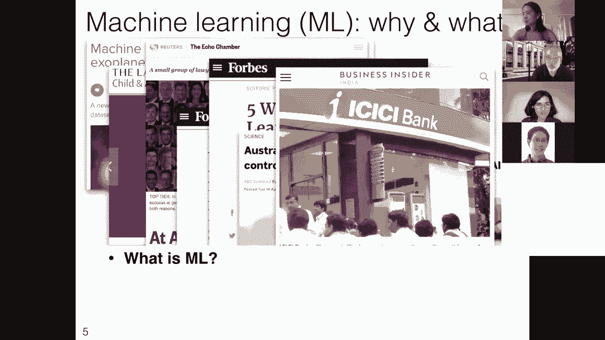

## 什么是机器学习？ 🤖

机器学习无处不在。为了理解它是什么以及为什么重要，让我们看几个近期的新闻案例：

以下是近期应用机器学习的一些例子：
*   **天文学**：机器学习算法通过分析望远镜图像数据，确认了50颗新的系外行星。
*   **医疗诊断**：算法分析新生儿的脑电图数据，自动识别癫痫发作迹象，辅助医疗决策。
*   **法律分析**：新闻机构使用机器学习分析提交给最高法院的请愿书文本，以预测其主题和结果。
*   **社会学研究**：用于自动编码职业访谈和调查的文本内容，以分析工作场所趋势。
*   **网络安全**：经典应用，如垃圾邮件和钓鱼邮件检测，通过分析邮件文本来保护用户。
*   **公共安全与争议**：面部识别技术用于识别监控录像中的人物，但也引发了关于准确性、偏见和隐私的争议。
*   **金融**：在印度用于评估农民的信誉，以决定是否发放贷款，依据的是历史数据和天气信息。

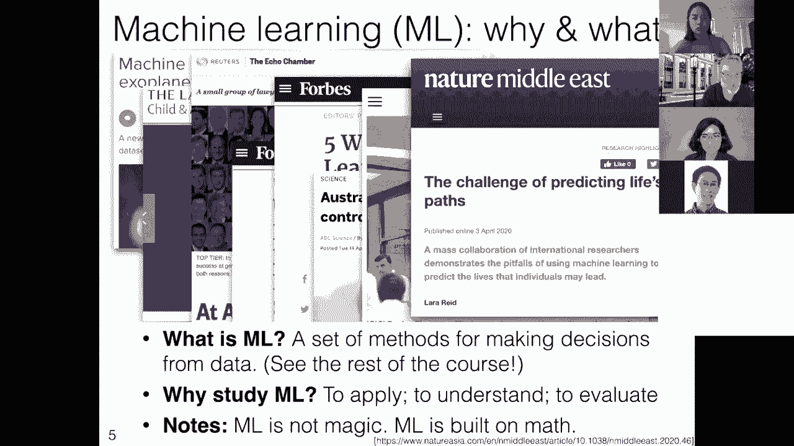

观察这些例子，可以发现一个共同模式：**机器学习是利用数据来自动做出决策或预测的一套强大工具**。

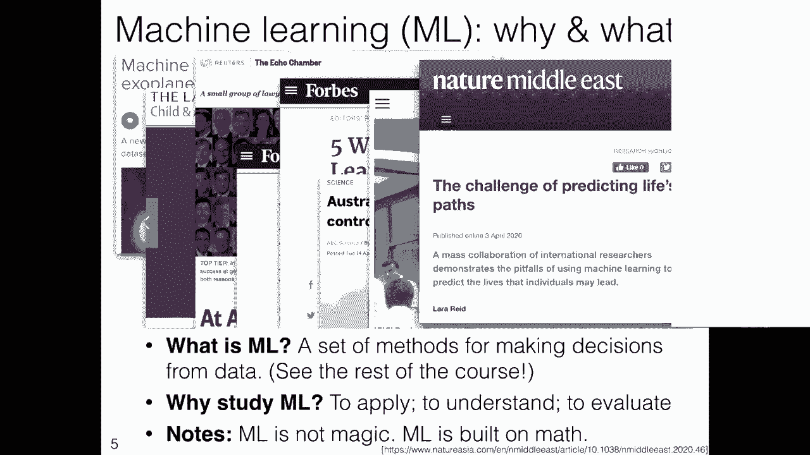

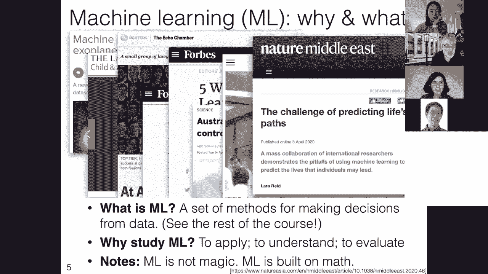

学习机器学习的原因至少有三点：
1.  它是一种强大的工具，可以节省时间和资源，并能应用到新领域。
2.  机器学习正影响着医疗、金融、司法等重要领域，理解其原理至关重要。
3.  需要具备评估他人声称的机器学习成果是否真实有效的能力。

同时也要认识到机器学习的局限性。它并非万能，有时数据或问题本身可能并不适合用机器学习很好地解决。此外，机器学习建立在坚实的数学基础之上，深入理解需要相应的数学知识。

---

## 形式化机器学习问题 🔧

上一节我们高瞻远瞩地看了机器学习的应用，本节我们将深入一个具体例子，并开始进行形式化定义。

我们以新生儿癫痫预测为例。我们拥有一些历史数据，目标是建立一个模型，在未来对新来的新生儿预测其是否会癫痫发作。

### 数据

我们拥有 *n* 个历史数据点，称为**训练数据**，记作 **D_n**。
每个数据点包括：
*   **特征向量 x**：描述一个数据点（如一个新生儿）的 *d* 个测量值。`x ∈ R^d`。例如，`x_1` 可能是血氧浓度，`x_2` 可能是心率。
*   **标签 y**：该数据点的真实结果。在我们的二元分类例子中，`y ∈ {-1, +1}`。例如，+1 代表有癫痫发作，-1 代表没有。

因此，训练数据是特征向量和标签对的集合：`D_n = {(x^(1), y^(1)), ..., (x^(n), y^(n))}`。

### 假设与分类器

我们的目标是找到一个函数 **h**，它能够接收**任何**新数据点的特征向量 **x**，并输出一个预测标签 `ŷ = h(x)`。
这个函数 **h** 被称为**假设**或**分类器**。

一个最简单的假设例子是常函数：`h(x) = +1`（总是预测“有癫痫”）。但这显然不是一个有用的分类器。

我们需要一个更丰富的假设集合。一个经典的选择是**线性分类器**。

---

## 线性分类器 📐

本节我们将深入探讨线性分类器，并用数学精确地定义它。

线性分类器对应的**假设类 H** 是这样一个集合：其中的每个假设 **h** 都对应空间中的一条直线（或超平面），并将空间划分为两个区域，一侧预测为 +1，另一侧预测为 -1。

### 数学定义

如何用数学描述“直线的一侧”？关键在于向量的点积（内积）。

给定一个方向向量 **θ**（`θ ∈ R^d`）和一个标量 **θ_0**，我们可以定义一条直线（超平面）为所有满足以下方程的点 **x** 的集合：
`θ^T x + θ_0 = 0`

这里，`θ^T x` 是向量 **θ** 和 **x** 的点积，代表 **x** 在 **θ** 方向上的投影分量。

基于这条直线，我们定义线性分类器 **h** 为：
`h(x; θ, θ_0) = sign(θ^T x + θ_0)`
其中 `sign(a)` 是符号函数，当 `a > 0` 时输出 +1，当 `a < 0` 时输出 -1。我们规定直线上（`a = 0`）的点可以任意归类，通常在实践中会统一处理。

参数 **θ** 决定了直线的方向，**θ_0** 决定了直线的位置。因此，线性分类器的假设类 **H_linear** 就是所有由不同 **(θ, θ_0)** 参数对定义的分类器的集合。

---

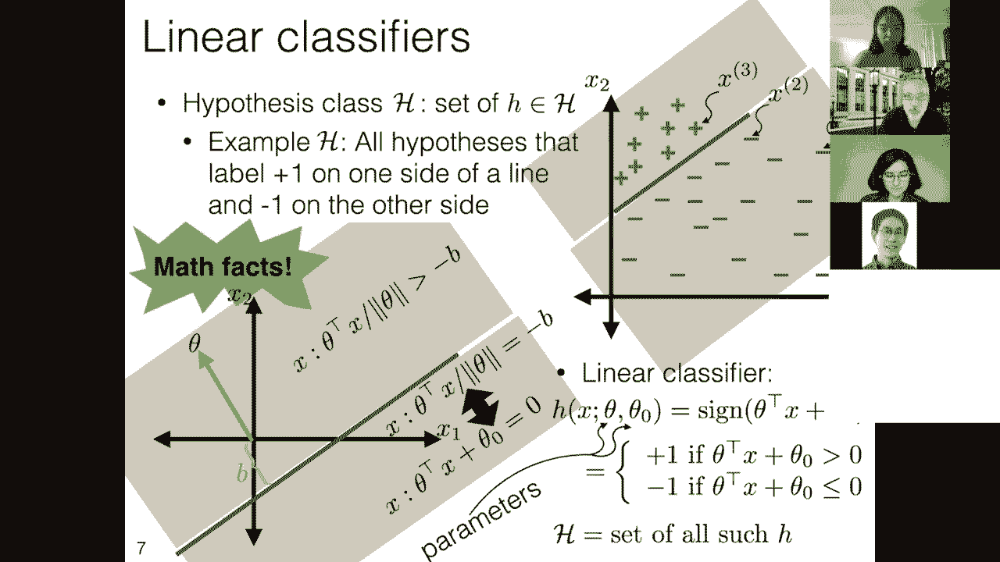

## 评估分类器：损失与误差 📊

我们已经知道如何定义分类器，但如何判断一个分类器是好是坏呢？本节我们来定义评估标准。

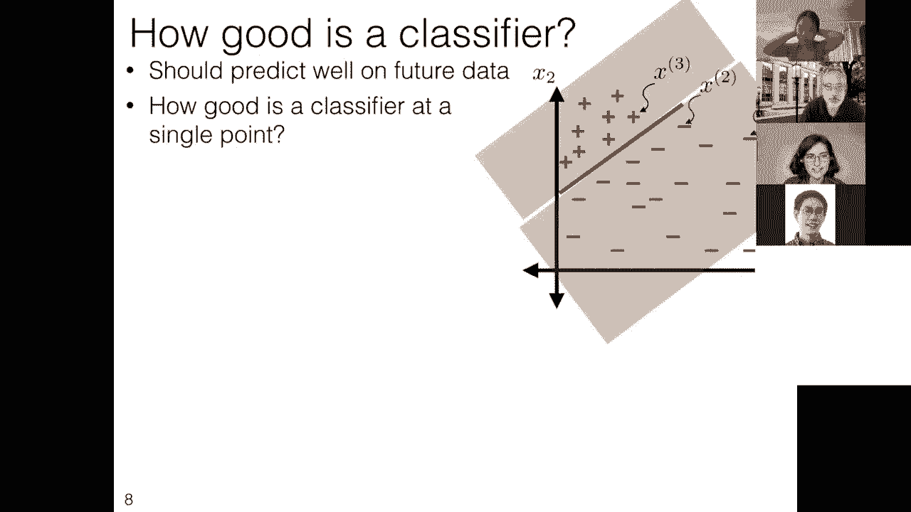

我们的终极目标是让分类器在**未来的、没见过的数据**上表现良好。这称为**测试误差**或**泛化误差**。

### 损失函数

首先，我们需要定义单个预测的代价。这由**损失函数 L** 来完成。它接收预测值 `ŷ` 和真实值 `y`，输出一个损失值 `L(ŷ, y)`。

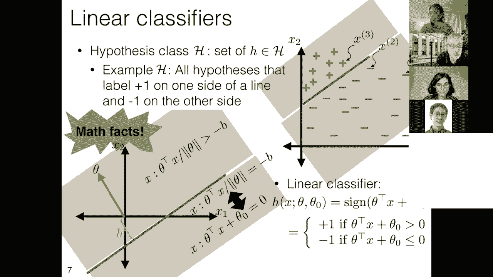

一个基础的损失函数是 **0-1 损失**：
`L_0-1(ŷ, y) = 0` 如果 `ŷ = y`；否则为 `1`。
这简单地统计了预测是否错误。

然而，在实际问题中，不同类型的错误代价可能不同。例如，在癫痫预测中：
*   **假阴性**（预测无癫痫，实际有）：可能导致患儿得不到及时救治，损失巨大。
*   **假阳性**（预测有癫痫，实际无）：可能导致不必要的医疗关注，损失较小。
这种损失不对称的情况非常重要，需要在设计算法时考虑。

### 从单个点到整体

对于包含 *n’* 个新数据点的测试集，测试误差 `E_test(h)` 是模型 `h` 在所有新数据点上损失的平均值：
`E_test(h) = (1/n’) * Σ L(h(x), y)`

问题在于，我们无法预先获得未来的测试数据。因此，一个常用的替代方案是计算**训练误差** `E_train(h)`，即模型在已有的训练数据上的平均损失：
`E_train(h) = (1/n) * Σ L(h(x^(i)), y^(i))`

虽然训练误差不等于我们真正关心的测试误差，但它是一个可计算的起点，用于比较不同的分类器。例如，我们可以说，如果分类器 `h` 的训练误差低于分类器 `h̃`，那么我们可能更倾向于选择 `h`。但需要注意，过分追求低训练误差可能导致过拟合，这个问题我们将在后续课程中深入探讨。

---

## 学习算法 🧮

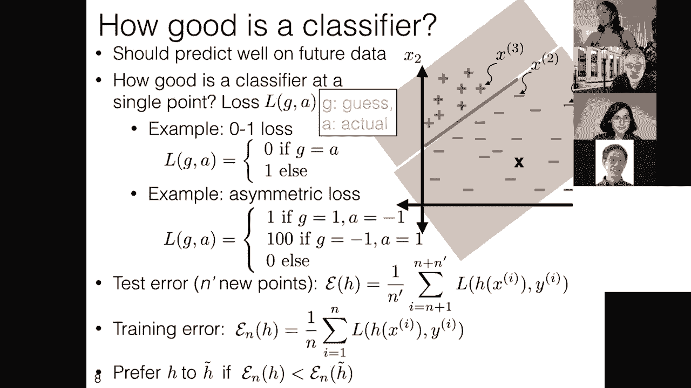

上一节我们讨论了如何评估一个给定的分类器，本节我们来看如何从数据中自动找到一个好的分类器。这就是**学习算法**的任务。

学习算法 **A** 是一个函数，它以训练数据 **D_n** 作为输入，输出一个分类器 **h**。
`h = A(D_n)`

### 一个示例学习算法

假设我有一个朋友，他预先枚举了 *K* 个不同的线性分类器 `h_1, h_2, ..., h_K`。
我可以设计一个简单的学习算法如下：
**算法 A_k(D_n)**:
1.  对于 j = 1 到 K，计算每个分类器 `h_j` 在训练数据 `D_n` 上的训练误差 `E_train(h_j)`。
2.  找出训练误差最小的那个分类器的索引 `j*`。`j* = argmin_j E_train(h_j)`。
3.  返回这个分类器 `h_{j*}`。

这个算法的行为取决于 *K*：
*   如果 *K=1*，它总是返回第一个分类器 `h_1`。
*   如果 *K=2*，它会返回 `h_1` 和 `h_2` 中训练误差更小的那个。
*   通常，*K* 越大，算法有机会找到训练误差更低的分类器。

然而，这个算法有很多问题：枚举所有分类器不现实，且只最小化训练误差可能不是最佳选择。在接下来的课程中，我们将学习更高效、更可靠的学习算法，如感知机、逻辑回归等，它们能直接搜索整个线性分类器假设空间，并更好地平衡训练与测试性能。

---

## 总结 🎯

本节课我们一起学习了机器学习的基础知识：
1.  **定义与动机**：机器学习是利用数据自动进行预测或决策的工具，应用广泛且影响深远。
2.  **问题形式化**：我们将一个预测问题分解为**数据**（特征和标签）、**假设/分类器**（从特征到标签的映射函数）和**假设类**（一组候选函数的集合）。
3.  **线性分类器**：我们深入探讨了一类重要的假设——线性分类器，并用参数 `(θ, θ_0)` 和 `sign` 函数对其进行了精确的数学定义。
4.  **评估标准**：我们引入了**损失函数**来衡量单个预测的好坏，并定义了**训练误差**和（理想中的）**测试误差**来评估分类器的整体性能。
5.  **学习算法**：我们了解了学习算法的概念，它负责从数据中自动产生分类器，并分析了一个简单的基于枚举的示例算法及其局限性。

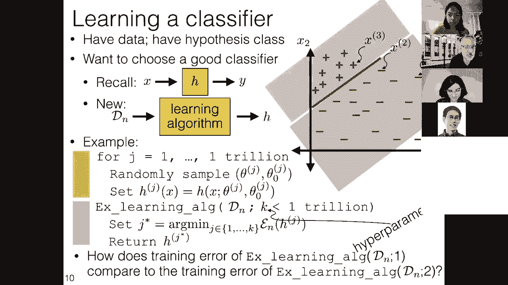

这仅仅是机器学习世界的冰山一角。在接下来的课程中，我们将深入探讨如何设计有效的学习算法，如何理论分析它们的性能，以及如何处理更复杂的数据和模型。