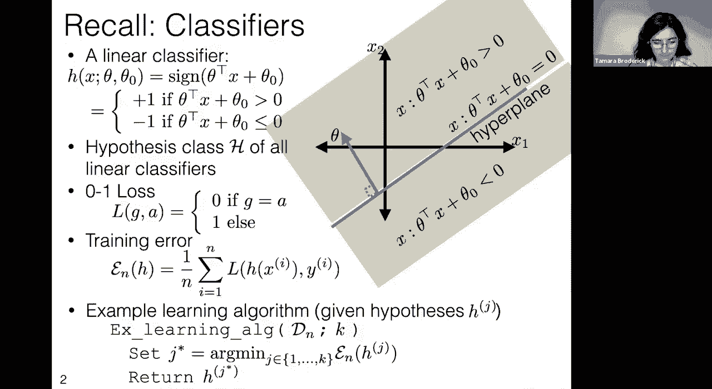
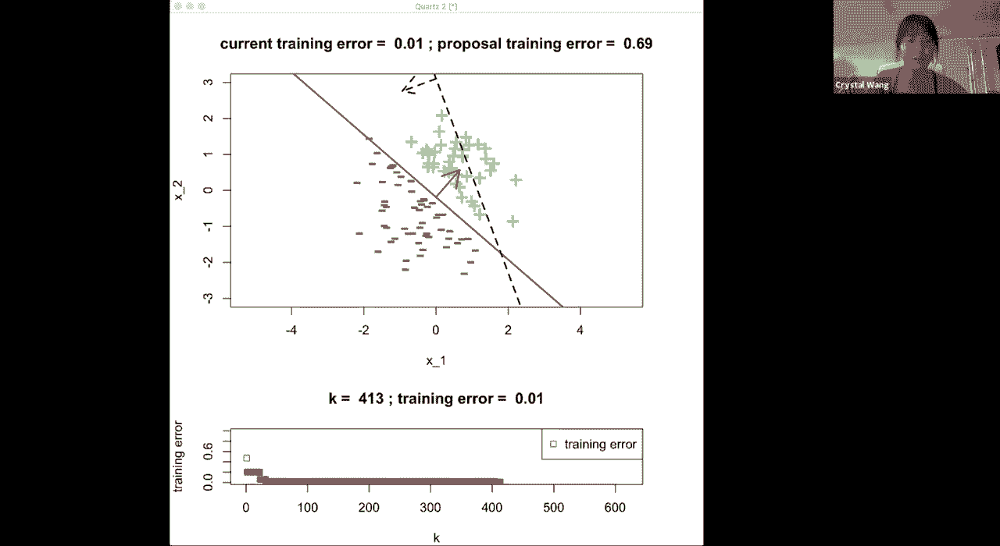
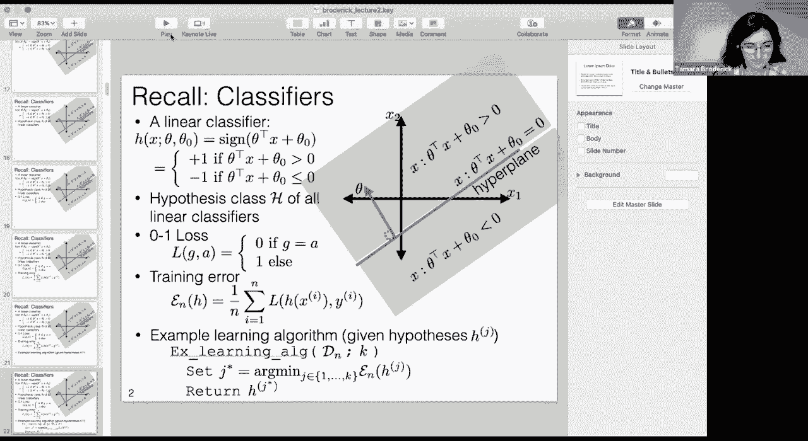
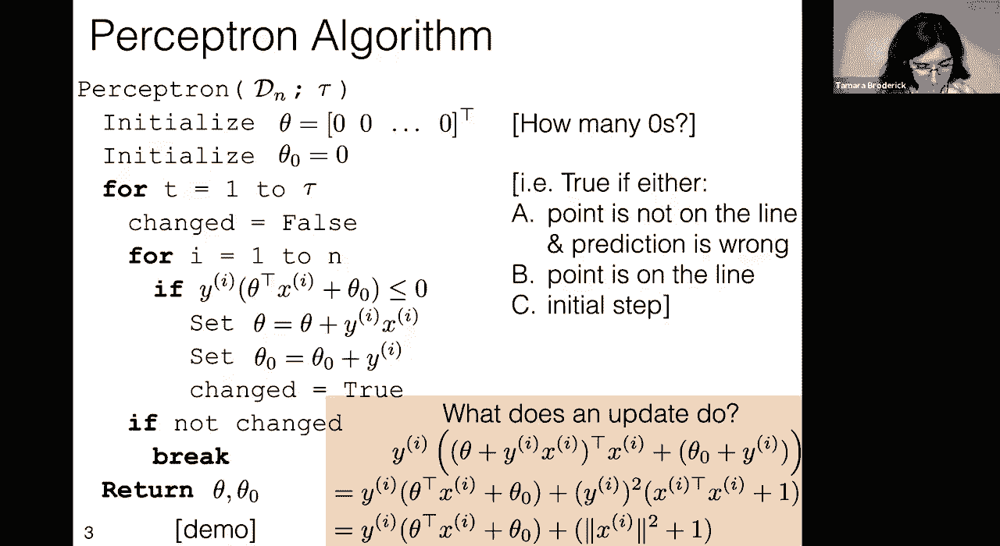
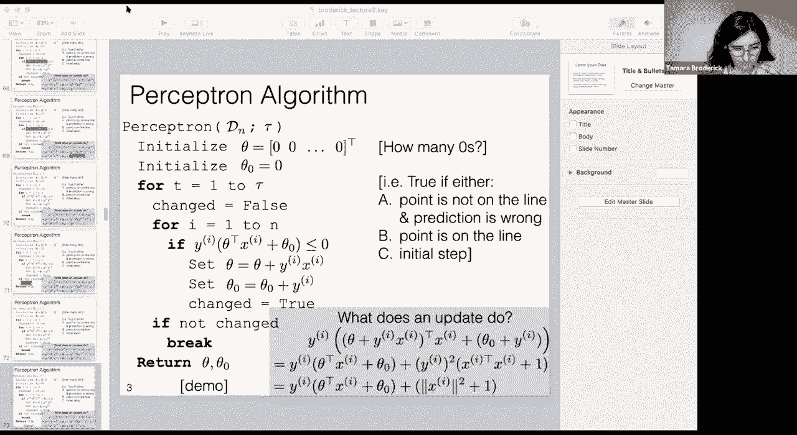
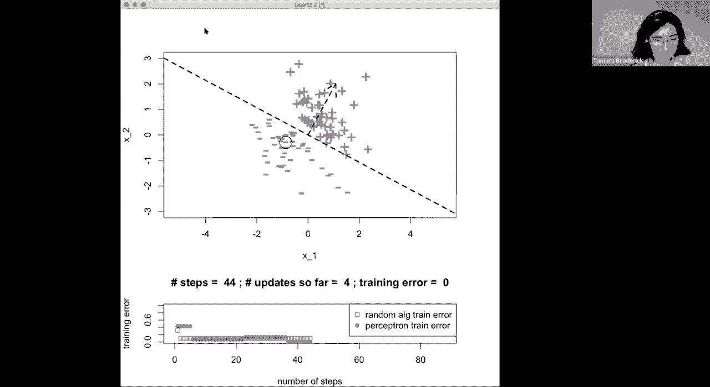
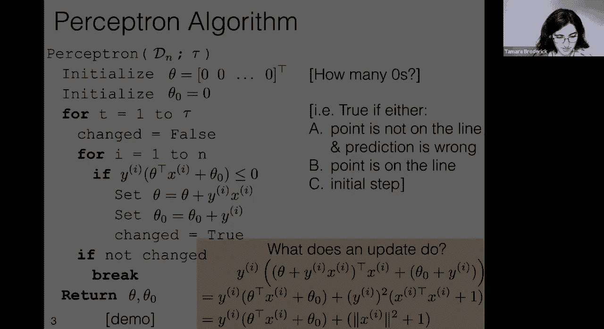
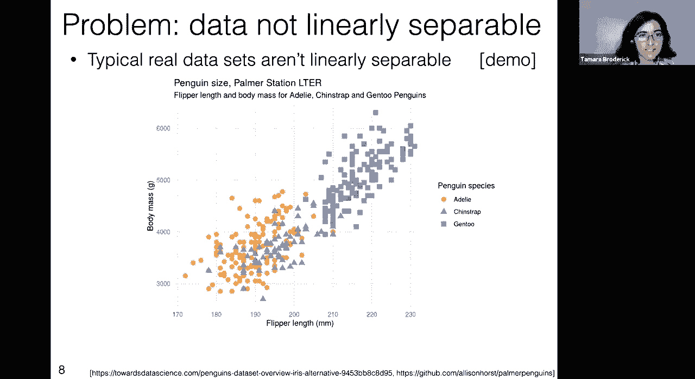
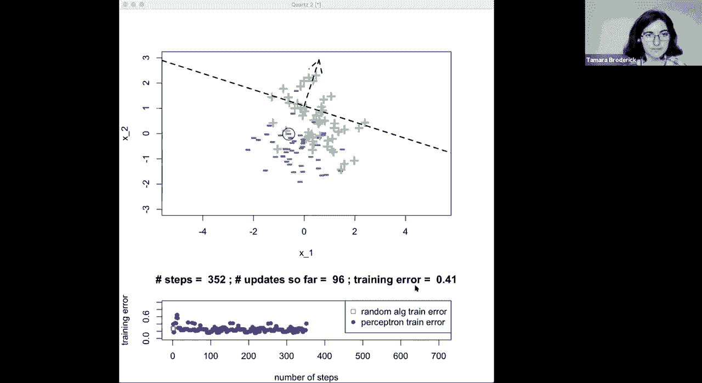
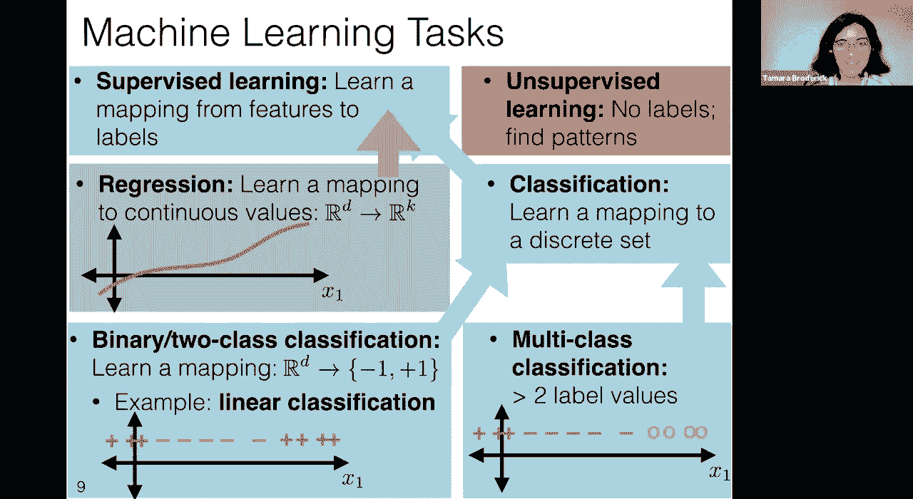

# 2：L2 - 感知器 🧠

在本节课中，我们将要学习感知器算法。这是一种用于线性分类的机器学习算法。我们将从回顾线性分类器开始，分析一个简单学习算法的不足，然后引入感知器算法，并通过定理理解其性能。最后，我们会探讨感知器在处理非线性可分数据时的局限性，并简要了解更广泛的机器学习任务类型。

## 回顾线性分类器

上一节我们介绍了机器学习问题的基本设置。本节中我们来看看线性分类器，这是我们今天讨论的核心。

线性分类器接收一组特征 `x`，并输出一个预测标签 `+1` 或 `-1`。它由参数 `θ`（法向量）和 `θ₀`（偏移量）定义，共同确定一个超平面。在超平面的一侧，分类器预测 `+1` 标签，在另一侧预测 `-1` 标签。

如果我们的特征是 `x₁` 和 `x₂`，那么 `θ` 和 `θ₀` 定义的就是一条直线。这条直线本身并不完整，需要结合决策规则才能构成完整的线性分类器。

在更高维度中，这将是一个超平面。如果数据存在于 `d` 维空间，超平面就是 `d-1` 维的。

## 定义损失与训练误差

定义了假设（即分类器）后，我们需要衡量其好坏。为此，我们引入损失函数。

一个非常常见的损失是 0-1 损失。如果我们的猜测 `g` 与实际值 `a` 相同，则损失为 `0`（最佳情况）；如果猜测错误，则损失为 `1`。

基于此，我们可以计算训练误差。训练误差计算的是在训练数据上分类错误的样本比例。

以下是训练误差的公式：

`训练误差 = (1/n) * Σ [预测错误]`，其中 `n` 是总样本数。

## 一个简单的学习算法及其问题

学习算法的目标是找到一个假设，并希望其训练误差较低。我们可以有好的算法，也可以有坏的算法。

上节课我们讨论了一个简单的学习算法：朋友随机生成一个包含 `k` 个假设的列表，我们从中选择训练误差最低的那个。另一种理解方式是顺序查看：查看第一个假设，记录其训练误差；查看下一个假设，如果它更好则更新最佳假设，否则保持不变；依此类推。

让我们通过一个演示来看看这个算法的表现。

演示中，顶部图表展示了数据和当前最佳分类器（蓝线）。算法随机提出新的假设（黑色虚线），并仅在其训练误差更低时才采纳它。

问题在于，这些随机提出的假设与数据无关，只是碰运气。算法可能看了很多假设后，训练误差仍然很高，没有系统性改进。对于一个简单的线性可分问题，我们应该能做得更好。

因此，我们需要一个更智能的算法，能够利用数据信息来提出更好的假设，而不是随机猜测。

## 引入感知器算法

上一节我们看到了简单算法的不足。本节中我们来看看感知器算法，这是一个更好的学习算法。

感知器算法接收数据 `(x⁽ⁱ⁾, y⁽ⁱ⁾)` 作为输入，并输出一个假设。它有一个超参数 `τ`（迭代次数）。算法初始化 `θ = 0` 和 `θ₀ = 0`。

以下是感知器算法的核心步骤：

1.  **初始化**：`θ = 0`, `θ₀ = 0`。
2.  **循环迭代**：进行 `τ` 次循环。
3.  **遍历数据**：在每次迭代中，遍历所有数据点 `i`。
4.  **检查错误**：对于每个点，检查条件 `y⁽ⁱ⁾ (θᵀ x⁽ⁱ⁾ + θ₀) ≤ 0`。如果为真，表示当前分类器对该点分类错误。
5.  **参数更新**：如果分类错误，则更新参数：
    *   `θ = θ + y⁽ⁱ⁾ x⁽ⁱ⁾`
    *   `θ₀ = θ₀ + y⁽ⁱ⁾`
6.  **提前终止**：如果在一次完整的数据遍历中没有发生任何更新（即所有点都分类正确），则提前终止循环。
7.  **返回结果**：循环结束后，返回最终的 `θ` 和 `θ₀` 作为学习到的假设。

更新步骤的目的是使错误分类的点在更新后更可能被正确分类。通过代数推导可以验证，更新后，原来错误分类的点对应的 `y⁽ⁱ⁾ (θᵀ x⁽ⁱ⁾ + θ₀)` 值会增加 `||x⁽ⁱ⁾||² + 1`，从而更可能变为正数，满足正确分类的条件。

## 感知器算法演示

让我们通过演示来观察感知器算法的工作过程。

在第一个线性可分数据集上，感知器从零开始，找到错误点并更新，最终找到了一个训练误差为 0 的完美分类器。

在第二个略有不同的数据集上，感知器同样通过多次更新，最终将训练误差降到了 0。

感知器算法通过每次修正一个错误来逐步改进分类器，这与之前随机猜测的算法有本质区别。

## 线性可分性与间隔

为了深入分析感知器，我们需要两个数学概念：线性可分性和间隔。

如果一个训练集存在一个线性分类器能够将所有正负样本完全分开，则称该数据集是**线性可分的**。这通常是一个更容易学习的问题。

**间隔** 衡量的是一个分类器对数据分类的“确信度”。对于给定的分类器 `(θ, θ₀)` 和一个数据点 `(x*, y*)`，其间隔定义为：

`间隔 = y* (θᵀ x* + θ₀) / ||θ||`

如果分类正确，间隔为正；错误则为负。整个训练集相对于分类器的间隔是所有数据点中间隔最小的那个。

正间隔意味着所有点都被正确分类，并且分类器与最近的数据点之间有一个“空隙”。

## 感知器收敛定理

基于线性可分性和间隔的概念，我们有一个重要的理论保证——感知器收敛定理。

定理假设如下：
1.  假设空间是所有过原点的线性分类器（即 `θ₀ = 0`）。
2.  存在一个最优分类器 `(θ*, θ₀*=0)` 和某个 `γ > 0`，使得所有训练样本的间隔至少为 `γ`（即数据是线性可分的，且存在一个“间隔”）。
3.  所有数据点的范数都有上界，即存在 `R`，使得对于所有 `i`，有 `||x⁽ⁱ⁾|| ≤ R`。

在这些假设下，感知器算法做出的**更新次数**（即参数改变的次数）最多为 `(R/γ)²`。

这个定理的意义在于：对于线性可分数据，感知器算法会在有限步内停止（找到完美分类器），并且这个步数有一个明确的上界。这回答了如何设置迭代次数 `τ` 的问题：只要 `τ` 足够大（大于这个上界），算法就能保证找到解。

## 关于“过原点”分类器的说明

定理中要求分类器过原点（`θ₀ = 0`），这似乎限制了模型能力。但实际上，我们可以通过特征变换将带偏移的分类器问题转化为过原点的问题。

具体方法是：对于原始特征 `x ∈ Rᵈ`，我们添加一个恒为 1 的新维度，得到扩展特征 `x_new = [x; 1] ∈ Rᵈ⁺¹`。同时，将参数向量扩展为 `θ_new = [θ; θ₀] ∈ Rᵈ⁺¹`。这样，在新空间中，决策规则 `θ_newᵀ x_new ≥ 0` 就等价于原始空间中的 `θᵀ x + θ₀ ≥ 0`。因此，任何线性可分问题都可以转化为新空间中的过原点分类器问题。

## 感知器的局限与更广阔的机器学习

上一节我们看到了感知器在线性可分数据上的理论保证。本节中我们来看看它的局限性。

一个核心问题是：很多真实世界的数据并不是线性可分的。例如，在企鹅物种分类数据中，不同类别的数据点相互重叠，无法用一条直线完美分开。

在这样的数据上运行感知器，算法不会收敛到一个训练误差为 0 的解，而是会持续更新，最终得到的分类器性能可能并不理想（训练误差较高）。我们可能希望选择迭代过程中遇到的最好模型，而不是最后一个模型。

这就引出了新的问题：对于非线性可分数据，我们能做什么？这是后续课程将要探讨的内容。

最后，让我们将二分类问题置于更广阔的机器学习图景中：
*   **监督学习**：模型从带有标签的数据中学习。
    *   **分类**：输出离散标签（如二分类、多分类）。
    *   **回归**：输出连续值。
*   **无监督学习**：模型从未标记的数据中发现模式（如聚类、主题建模）。

我们目前聚焦于二分类，这只是机器学习丰富世界中的一个部分。

## 总结

本节课中我们一起学习了感知器算法。我们从线性分类器的基础开始，指出了简单随机选择算法的缺陷。然后，我们详细介绍了感知器算法的工作原理，并通过演示观察其行为。我们引入了线性可分性和间隔的概念，并阐述了感知器收敛定理，该定理保证了算法在线性可分数据上的有限步收敛性。我们也讨论了通过特征变换处理分类器偏移的方法。最后，我们探讨了感知器在非线性可分数据上的局限性，并概览了监督学习与无监督学习等更广泛的机器学习任务类型。