# 3：L3 - 特征工程与模型评估 📚

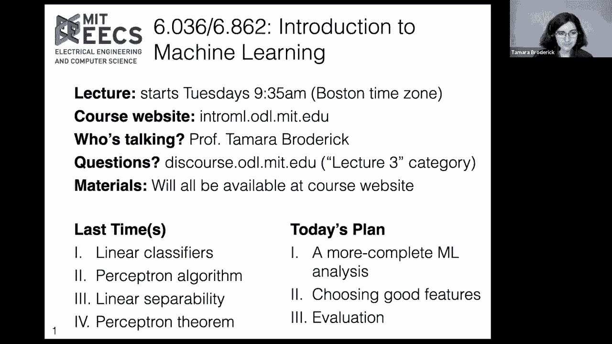

在本节课中，我们将学习如何构建一个完整的机器学习分析流程。我们将从数据收集开始，讨论如何将原始数据转换为适合机器学习算法的特征，并介绍如何评估和解释模型性能。特别地，我们将重点探讨特征工程的核心概念，包括如何处理不同类型的数据（如数值型、分类型、顺序型），以及如何通过特征变换来提升模型的表现力。最后，我们会介绍交叉验证等评估方法，以检测和避免过拟合。

---

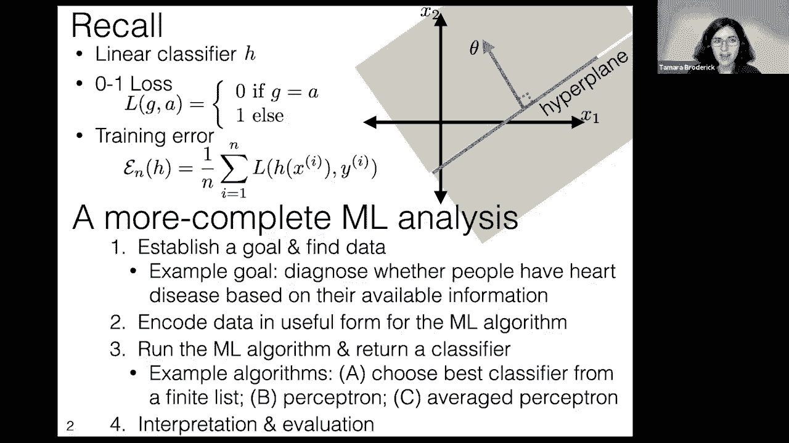

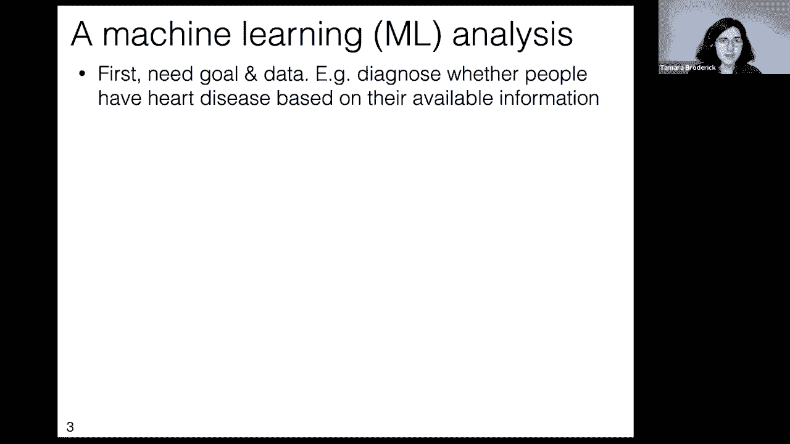

## 🔍 回顾线性分类器

上一节我们介绍了线性分类器及其算法。线性分类器通常表示为函数 **h**，它由参数 **θ** 和偏置 **θ₀** 定义。分类决策基于 **θᵀx + θ₀** 的符号：大于0预测为+1，小于0预测为-1。

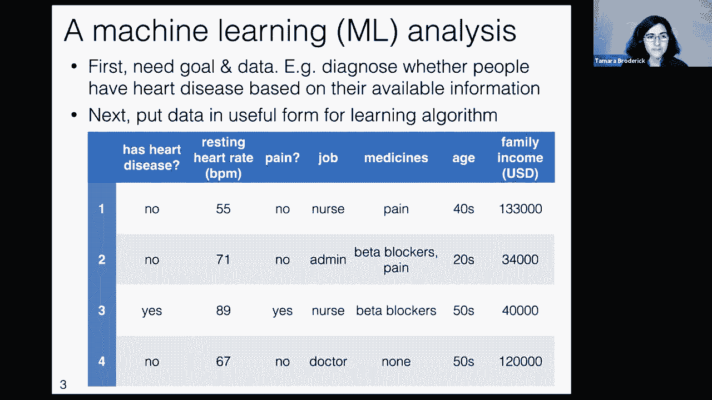

为了衡量分类器的性能，我们使用损失函数。在分类任务中，我们主要关注0-1损失：预测正确时损失为0，错误时损失为1。训练误差是训练数据上损失的平均值，它为我们提供了模型在已知数据上表现的一个指标。

然而，在实际应用中，我们很少能直接将原始数据输入到这些算法中。数据通常需要进行预处理和转换，才能被有效利用。接下来，我们将探讨这个过程。

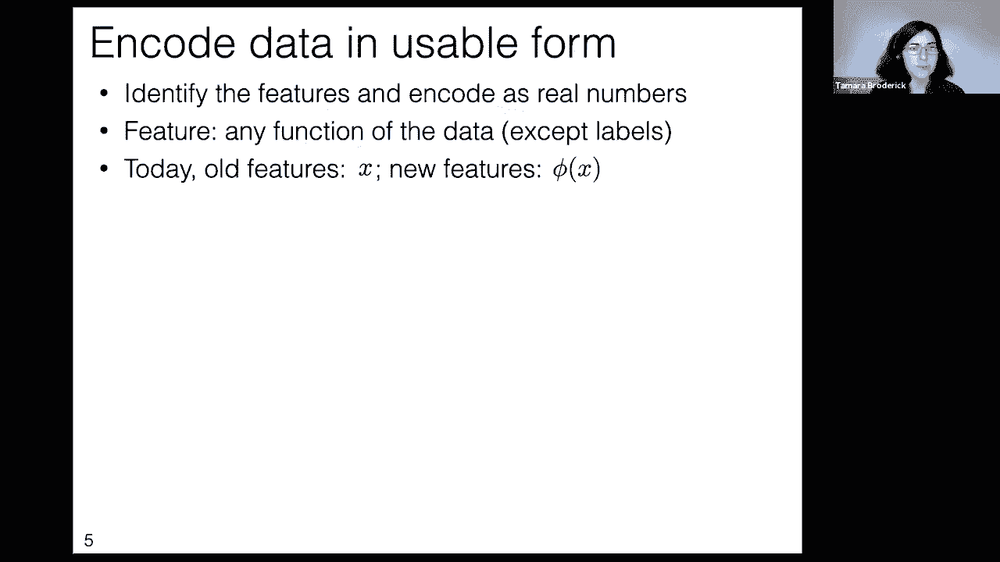

---

## 🎯 目标与数据收集

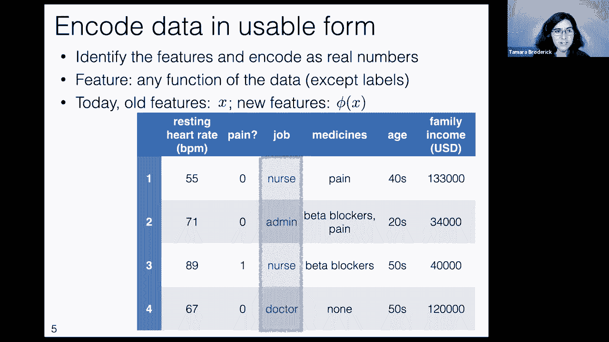

任何机器学习分析都始于明确的目标和相应的数据。例如，我们的目标可能是根据患者的可用信息（如静息心率、疼痛经历、职业、用药情况、年龄和家庭收入）来诊断其是否患有心脏病。

我们假设已经收集到了一个数据集，其中包含多名个体的上述信息以及他们是否患有心脏病的标签。数据可能以表格形式呈现，每一行代表一个个体，每一列代表一个特征或标签。

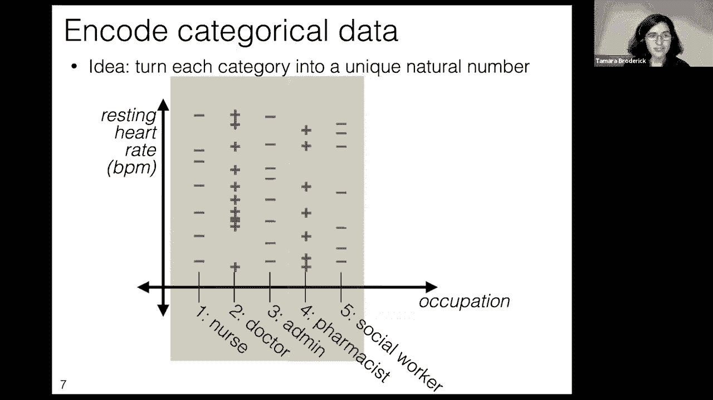

我们的首要任务是检查这些数据是否能转化为一个二分类问题。在这个例子中，标签“是”（患有心脏病）和“否”（未患病）正好对应两个类别。因此，我们可以将其转化为+1和-1的标签编码。

**标签编码示例：**
```python
# 假设原始标签为 ‘yes‘ 和 ‘no‘
label_mapping = {‘yes‘: +1, ‘no‘: -1}
y_encoded = [label_mapping[label] for label in raw_labels]
```
**注意：** 必须保存这个映射关系，以便在后续解释预测结果时，能将数值（如-1）转换回原始含义（如“否”）。

现在，我们有了标签 `y`。接下来，我们需要处理特征 `x`，使其能够与算法兼容（例如，能够计算点积）。

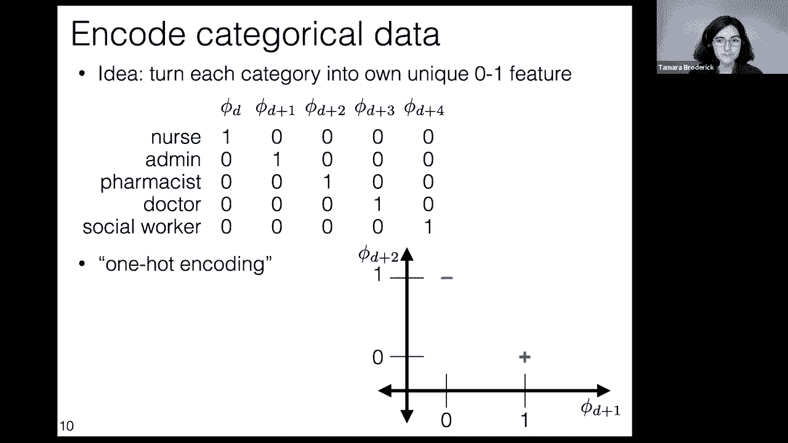

---

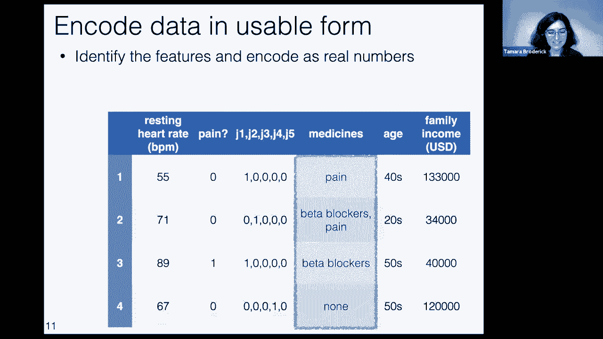

## 🛠️ 特征编码：从原始数据到可用特征

原始数据中的特征可能不是数值形式（例如字符串“护士”、“是/否”），因此无法直接用于计算。我们需要将它们编码为实数。这个过程可以看作是一个从原始特征 `x` 到新特征 `φ(x)` 的映射。

### 1. 数值型数据
像“静息心率”这样的特征已经是数字，通常可以直接使用。但后续我们可能会对其进行标准化处理。

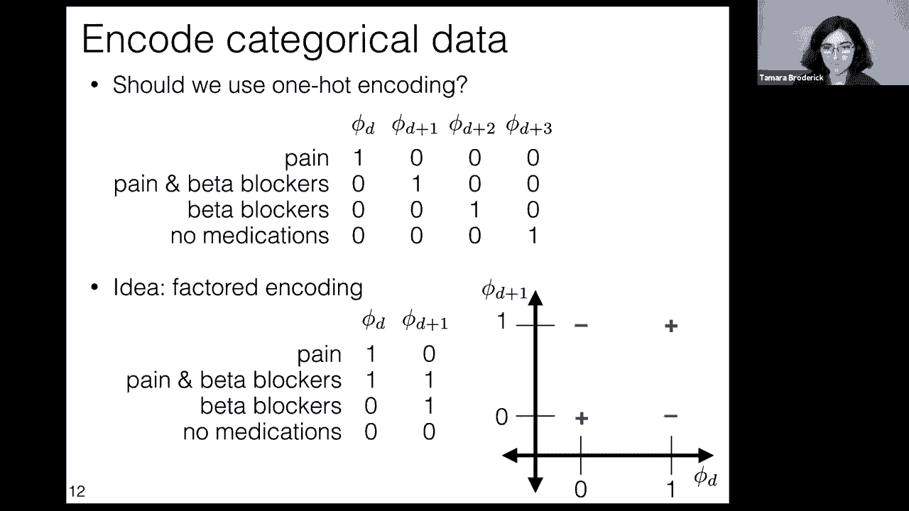

### 2. 分类型数据
对于像“是否经历疼痛”这样的二元类别，我们可以简单地将其映射为0和1（例如，“否”->0，“是”->1）。

对于像“职业”这样具有多个类别且**没有内在顺序**的特征，我们需要更谨慎的编码方式。

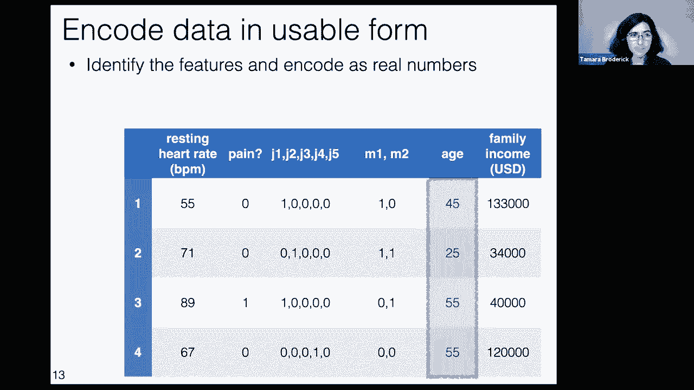

*   **错误想法1：顺序编码**
    将每个类别映射为一个唯一的自然数（如护士=1，医生=2，行政助理=3）。**问题在于**，这隐含地假设了类别之间存在顺序关系（如1<2<3），并且线性分类器会利用这种顺序，这可能不符合实际情况。

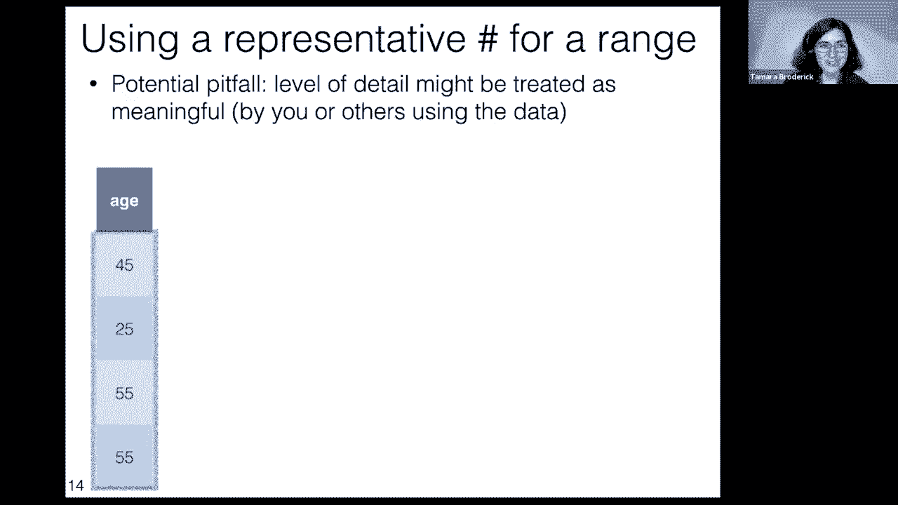

*   **错误想法2：二进制编码**
    使用多个二进制位进行编码（例如，用3位二进制数表示5个职业）。**问题在于**，这仍然限制了分类器能够做出的决策边界类型，可能无法灵活地将任意组合的类别分组。

*   **正确方法：独热编码**
    为每个类别创建一个新的二进制特征。对于每个数据点，只有对应其类别的那个特征值为1，其他所有特征值为0。
    **示例：** 假设有5种职业：护士、医生、行政助理、药剂师、社工。
    ```python
    # 原始数据: [‘Nurse‘, ‘Doctor‘, ‘Admin‘, ‘Pharmacist‘, ‘Social Worker‘]
    # 独热编码后（顺序：护士, 医生, 行政, 药剂师, 社工）:
    ‘Nurse‘         -> [1, 0, 0, 0, 0]
    ‘Doctor‘        -> [0, 1, 0, 0, 0]
    ‘Admin‘         -> [0, 0, 1, 0, 0]
    ‘Pharmacist‘    -> [0, 0, 0, 1, 0]
    ‘Social Worker‘ -> [0, 0, 0, 0, 1]
    ```
    这种方法不对类别强加任何顺序或分组假设，为线性分类器提供了最大的灵活性，是处理分类数据的标准方法。

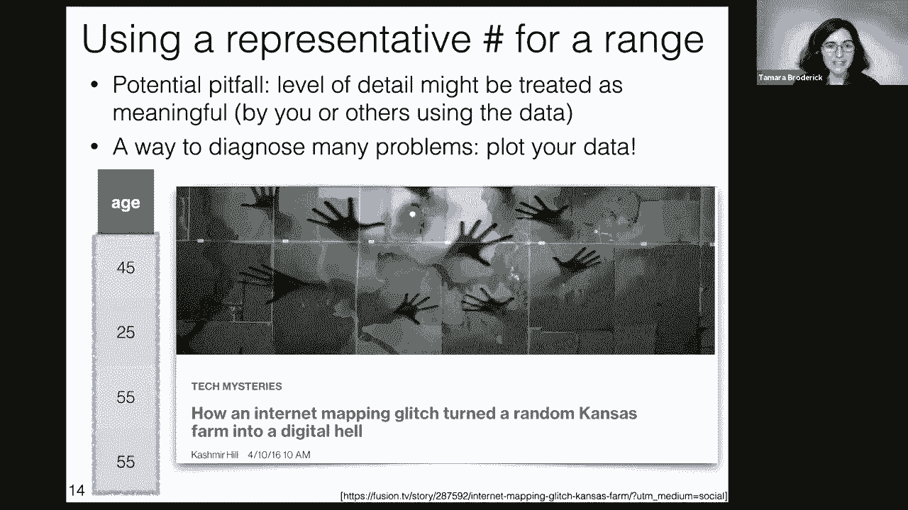

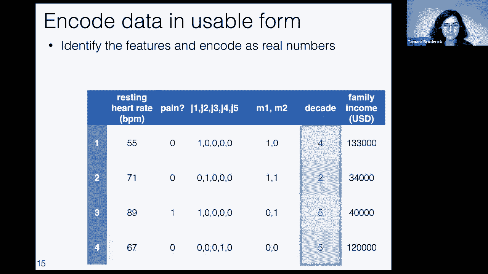

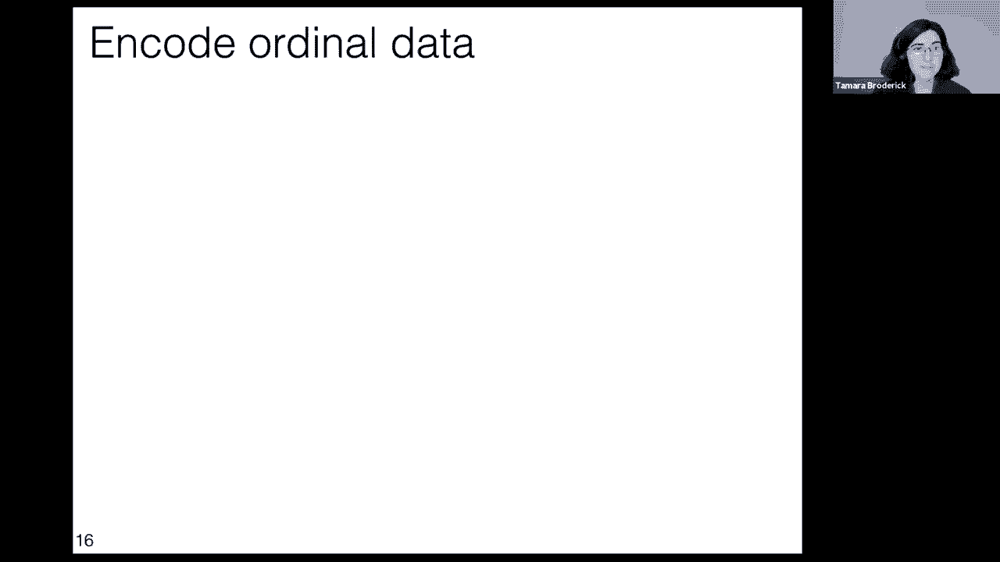


### 3. 多标签分类型数据
对于像“用药情况”这样的特征，个体可能同时属于多个类别（例如，同时服用止痛药和β受体阻滞剂）。这时，独热编码（为每种组合创建一个特征）会导致特征数量爆炸且难以解释。

*   **更好方法：因子化编码**
    将复合类别分解为多个独立的二元特征。
    **示例：** 将“用药情况”分解为两个特征：“是否服用止痛药”和“是否服用β受体阻滞剂”。
    ```python
    # 原始数据: [‘Pain‘, ‘Pain+Beta‘, ‘Beta‘, ‘None‘]
    # 因子化编码后:
    ‘Pain‘          -> [1, 0]  # 服止痛药，不服β阻滞剂
    ‘Pain+Beta‘     -> [1, 1]  # 两种都服
    ‘Beta‘          -> [0, 1]  # 服β阻滞剂，不服止痛药
    ‘None‘          -> [0, 0]  # 都不服
    ```
    这种方法更紧凑，更具可解释性，并且能更好地捕捉每个独立因素的影响。

### 4. 顺序型数据
有些数据有顺序，但差值没有明确意义（例如，疼痛等级：1-轻微，2-中度，3-剧烈；或李克特量表：1-强烈反对 到 5-强烈同意）。如果直接使用数字1,2,3...，线性分类器会认为差值相等。

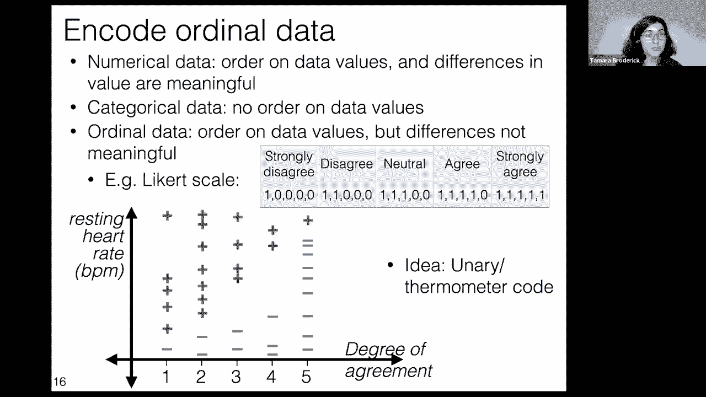

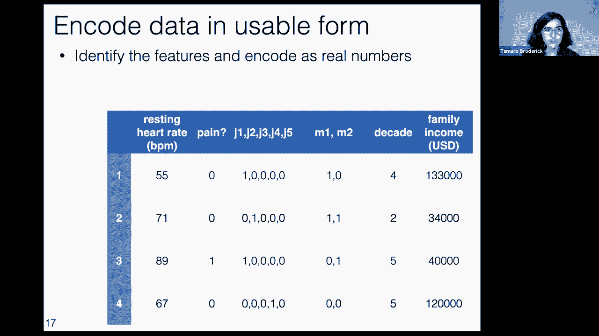

*   **更好方法：温度计编码**
    这种编码只保留顺序信息，而不假设等距。
    **示例：** 对5点量表进行编码。
    ```python
    # 温度计编码:
    1 -> [1, 0, 0, 0]
    2 -> [1, 1, 0, 0]
    3 -> [1, 1, 1, 0]
    4 -> [1, 1, 1, 1]
    # (有时5点量表会用4位表示，有时5位，这里用4位表示“达到或超过”某个等级)
    ```
    这样，分类器可以为每个“阶梯”设置不同的权重，从而更灵活地建模。

### 5. 数值型数据的标准化
即使特征是数值（如“年龄”、“收入”），如果它们的尺度差异很大（收入是数万，心率是几十），也会影响模型。分类器参数 `θ` 的大小会依赖于特征尺度，导致难以解释，并且可能影响某些算法的性能。

*   **解决方法：标准化**
    对每个数值特征，减去其均值，除以其标准差。
    **公式：**
    ```
    φ_i = (x_i - μ_i) / σ_i
    ```
    其中 `μ_i` 是特征 `i` 在训练集上的均值，`σ_i` 是其标准差。这使得所有特征大致处于同一尺度（均值为0，标准差为1），有助于解释和某些算法的稳定运行。

---

## 🧠 专家知识与数据探索

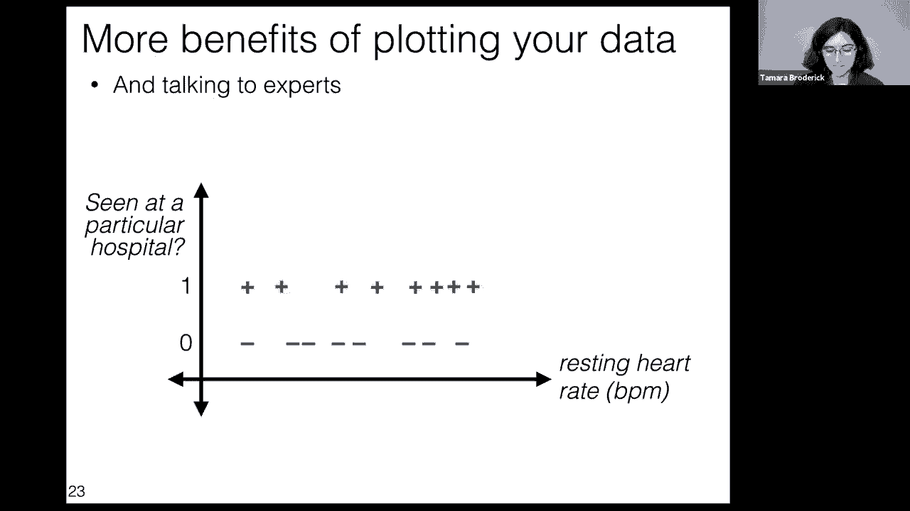

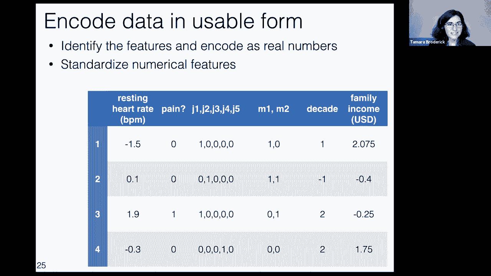

在特征工程过程中，与领域专家交流并可视化数据至关重要。
*   **绘制数据图** 可以帮助发现异常值、数据分布问题或无关特征。
*   **与专家讨论** 可以避免陷入“虚假预测”的陷阱。例如，如果“就诊医院”这个特征完美预测了心脏病，可能是因为专科医院收治了所有心脏病患者。这个特征对于开发新的诊断工具没有实际价值，应该被剔除或谨慎对待。

---

## 🌈 处理非线性边界：特征变换

有时数据本身不是线性可分的。例如，健康指标往往存在一个“最佳范围”，过高或过低都可能预示问题，导致数据分布呈环形或更复杂的形状。

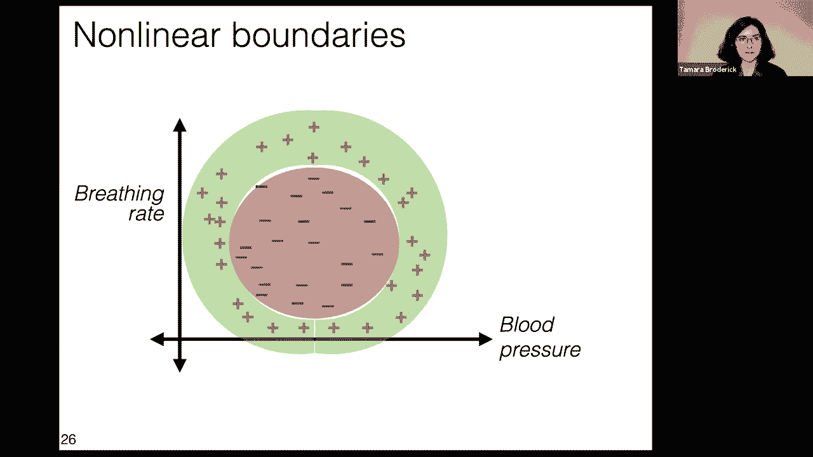

线性分类器无法处理这种模式。一个强大的思路是进行**特征变换**，将原始特征映射到更高维的空间，在那里数据可能变得线性可分。

*   **多项式特征**
    一种常见方法是添加原始特征的多项式项（如 `x₁²`, `x₂²`, `x₁x₂`）。这相当于用多项式函数来拟合决策边界。
    **示例：** 在二维空间中，使用二阶多项式特征：
    ```
    φ(x) = [1, x₁, x₂, x₁², x₁x₂, x₂²]
    ```
    然后在这个新的6维空间中使用线性分类器。这允许决策边界是二次曲线，从而能够拟合圆形、椭圆等形状。

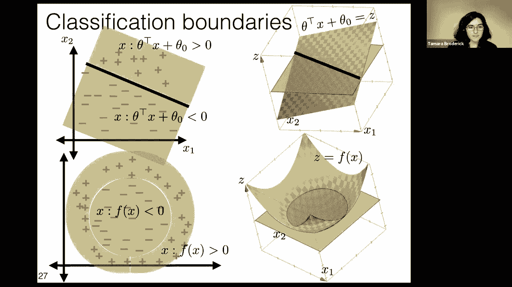

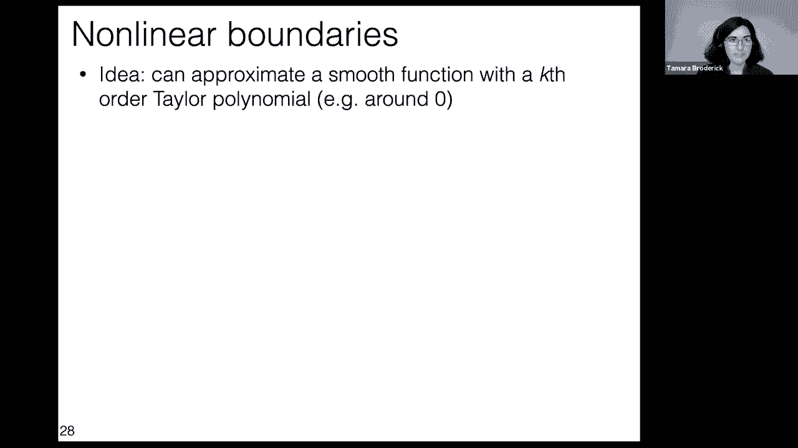

通过增加多项式阶数，我们可以获得极其灵活的决策边界。然而，这也带来了新的风险——过拟合。

---

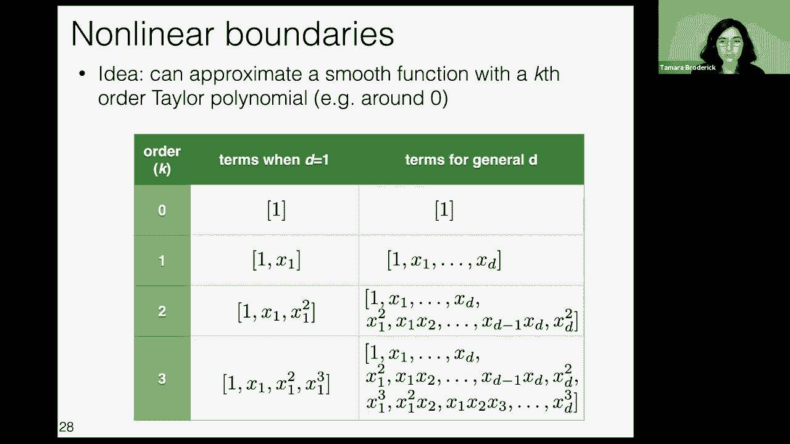

## ⚠️ 过拟合与模型评估

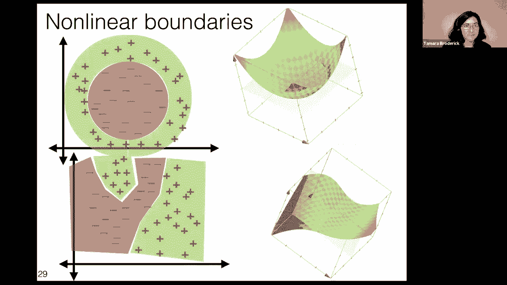

当一个模型在训练数据上表现完美（训练误差为0），但在未知数据上可能表现很差时，就发生了过拟合。这通常是因为模型过于复杂，捕捉到了训练数据中的噪声而非潜在规律。

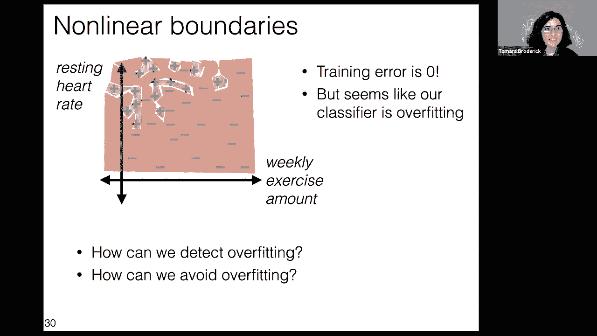

### 如何检测过拟合？
关键在于评估模型在**未见过的数据**上的性能。我们不能只用训练误差来评价模型。

*   **简单划分：训练集/测试集**
    将数据随机分为两部分（例如70%训练，30%测试）。在训练集上学习模型，在测试集上评估误差。**缺点：** 评估结果可能因一次划分的随机性而有很大波动，且训练数据量减少了。

*   **更好的方法：K折交叉验证**
    1.  将数据随机打乱，然后平均分成K份（“折”）。
    2.  进行K轮实验。在每一轮 `i` 中：
        *   将第 `i` 份数据作为**验证集**。
        *   将剩余的 K-1 份数据合并作为**训练集**，用于训练模型 `h_i`。
        *   计算模型 `h_i` 在验证集上的误差 `e_i`。
    3.  最终的评估指标是K个误差 `e_i` 的平均值。
    **公式表示：**
    ```
    CV_error = (1/K) * Σ_{i=1 to K} Loss(h_i, D_valid_i)
    ```
    **优点：** 更稳定地利用了所有数据进行评估，减少了因单次划分带来的随机性，能更好地反映模型的泛化能力。

---

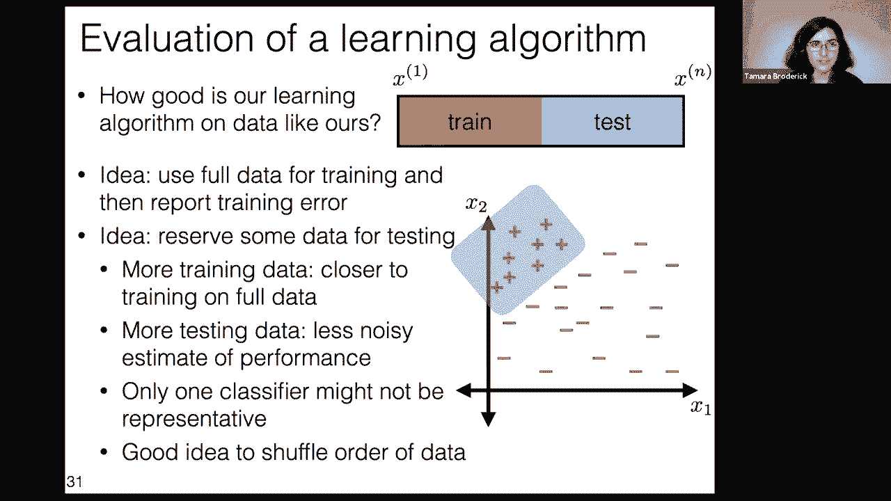

## 📝 总结

本节课我们一起学习了构建完整机器学习流程的关键步骤：

1.  **目标与数据**：明确问题并收集带有标签的数据。
2.  **特征工程**：将原始数据转换为算法可用的形式。我们深入探讨了：
    *   **标签编码**：映射为+1/-1。
    *   **特征编码**：针对数值型、分类型（独热编码）、多标签型（因子化编码）、顺序型（温度计编码）数据的不同处理方法。
    *   **标准化**：调整数值特征的尺度。
    *   **特征变换**：通过添加多项式特征来捕捉非线性关系。
3.  **模型训练与解释**：应用线性分类器等算法，并尝试理解模型学到的规律（如通过参数 `θ`）。
4.  **模型评估与过拟合检测**：认识到训练误差的局限性，并介绍了使用**测试集**和**K折交叉验证**来更可靠地评估模型泛化性能。

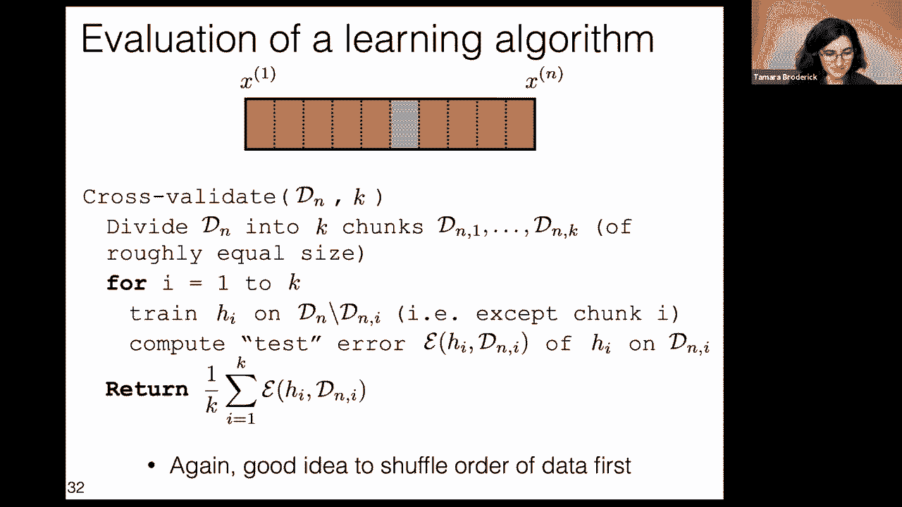

特征工程是机器学习成功的关键，它需要数据理解、领域知识和反复实验。同时，严谨的评估方法能帮助我们选择真正有效的模型，为下一阶段讨论如何**避免**过拟合（例如通过正则化）奠定了基础。