# 4：L4 - 逻辑回归（对数几率回归） 🧮

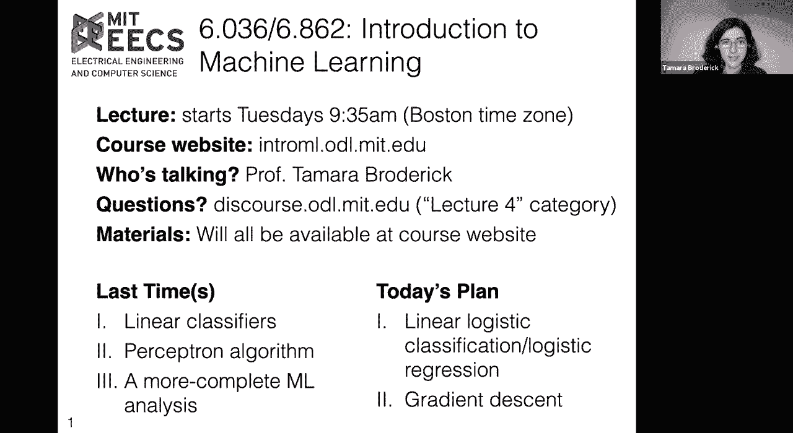

在本节课中，我们将学习逻辑回归（也称为对数几率回归）。这是一种在现实数据分析中应用极为广泛的分类算法。我们将看到，梯度下降是一种更通用的算法，它允许我们最小化或接近最小化一个通用函数，我们可以将其“插入”并用于逻辑回归的目的。

## 概述：为什么需要逻辑回归？🤔

上一节我们介绍了线性分类器。我们开发了多种算法，其中重点之一是感知机算法。然而，感知机在处理**非线性可分数据**时存在困难。现实生活中的数据大多不是线性可分的。

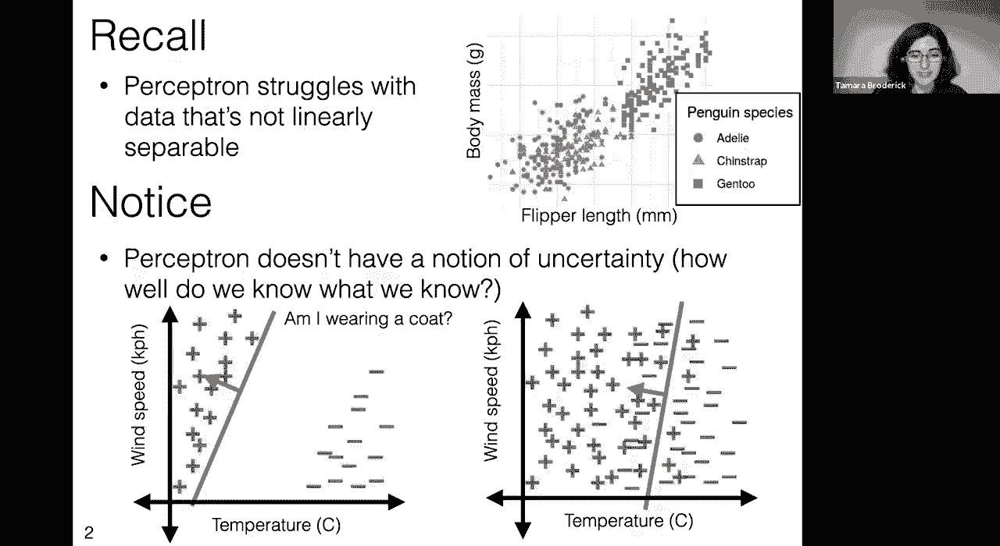

此外，感知机缺乏**不确定性**的概念。它只给出最佳猜测，但无法表达这个猜测的置信度有多高，或者我们在问题中实际知道什么。这对于许多实际问题（例如，根据温度和风速决定是否穿外套）来说是一个重要缺陷。

## 从感知机到概率模型 📈

上一节我们讨论了感知机的局限性，本节我们来看看如何用概率模型来捕捉不确定性。

假设我们想根据温度来预测穿外套的概率。感知机会给出一个硬性的决策边界（例如，低于15°C穿，高于则不穿）。但实际情况是，在15°C左右，我们有时穿，有时不穿。我们更希望模型能输出一个**概率**，例如“在10°C时，穿外套的概率是80%”。

一个理想的概率函数形状是从概率1（肯定穿）平滑地过渡到概率0（肯定不穿），像一个“S”形曲线。

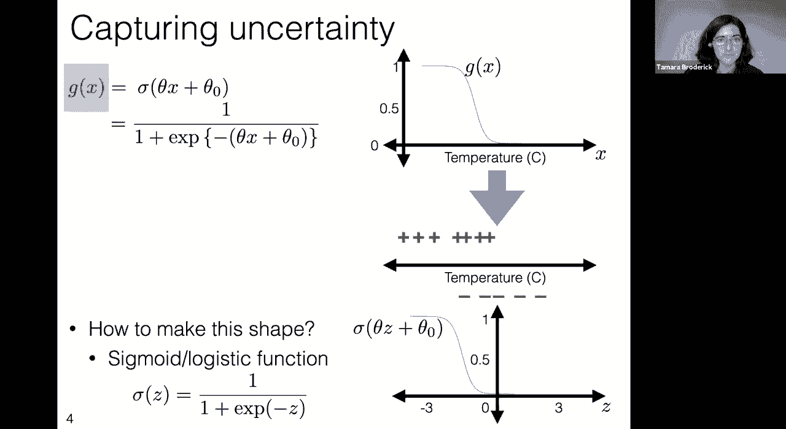

### 核心概念：Sigmoid（逻辑）函数

这个“S”形曲线有一个名字，叫做 **Sigmoid函数** 或 **逻辑函数**。其标准形式如下：

**公式：**
`σ(z) = 1 / (1 + e^{-z})`

其中，`z` 是输入。这个函数的输出范围在0到1之间，非常适合表示概率。

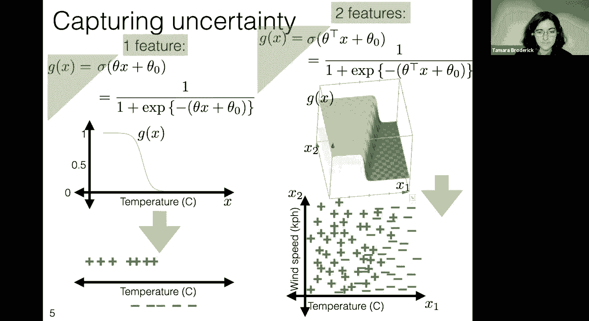

*   当 `z` 趋近于负无穷时，`σ(z)` 趋近于 0。
*   当 `z` 趋近于正无穷时，`σ(z)` 趋近于 1。
*   当 `z = 0` 时，`σ(z) = 0.5`。

为了将这个标准函数应用到我们的特征（如温度 `x`）上，我们需要对其进行拉伸和平移。我们可以引入参数 `θ`（控制斜率/陡峭度）和 `θ₀`（控制偏移/中心点）。

**公式：**
`g(x) = σ(θx + θ₀) = 1 / (1 + e^{-(θx + θ₀)})`

这里的 `g(x)` 就表示在给定特征 `x` 时，预测为正类（例如“穿外套”）的概率。

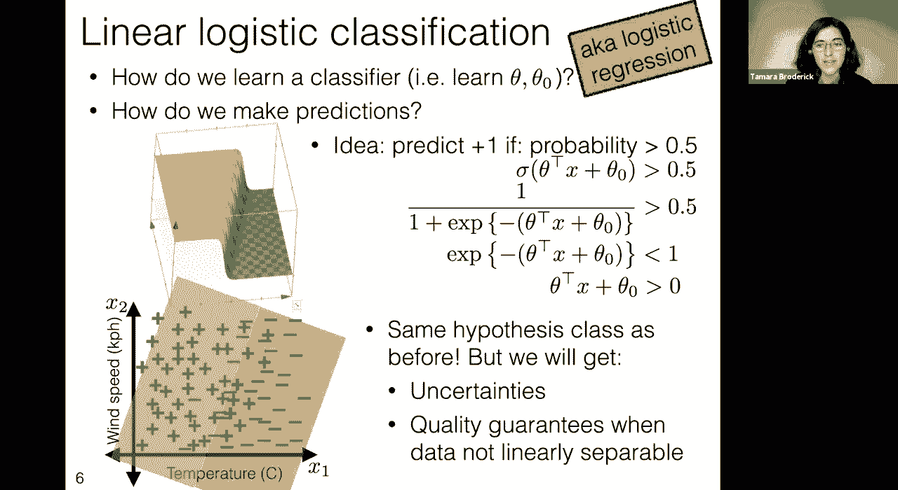

## 扩展到多维特征 🌐

上一节我们在一维特征（如温度）中引入了Sigmoid函数，本节我们来看看在更高维特征空间中的情况。

在现实中，我们的特征通常是多维的。例如，决定是否穿外套可能同时考虑温度 `x₁` 和风速 `x₂`。

我们将模型推广到多维情况：

**公式：**
`g(x) = σ(θᵀx + θ₀) = 1 / (1 + e^{-(θᵀx + θ₀)})`

这里：
*   `x` 是特征向量。
*   `θ` 是权重向量（与特征维度相同）。
*   `θ₀` 是偏置项（标量）。
*   `θᵀx + θ₀` 的结果是一个标量，作为Sigmoid函数的输入。

这个模型在二维空间中的决策边界（即 `g(x) = 0.5` 的地方）是直线 `θᵀx + θ₀ = 0`。沿着 `θ` 方向移动，概率趋近于1；沿着 `-θ` 方向移动，概率趋近于0。这形成了一个平滑的概率“斜坡”，而不是感知机的硬边界。

## 学习分类器：定义损失函数 🎯

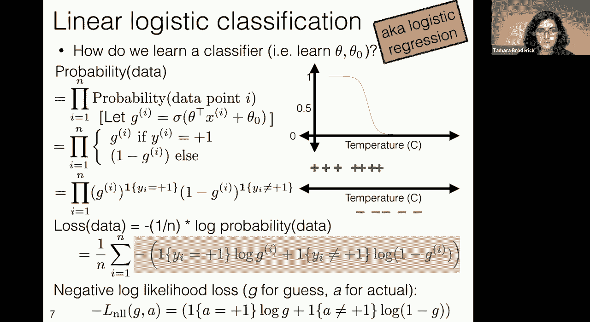

我们已经定义了概率模型 `g(x)`。现在的问题是：如何从数据中学习参数 `θ` 和 `θ₀`？

我们的目标是找到一组参数，使得模型预测的概率与观测到的数据尽可能一致。一种自然的方法是**最大化观测到当前数据的概率**，这被称为**最大似然估计**。

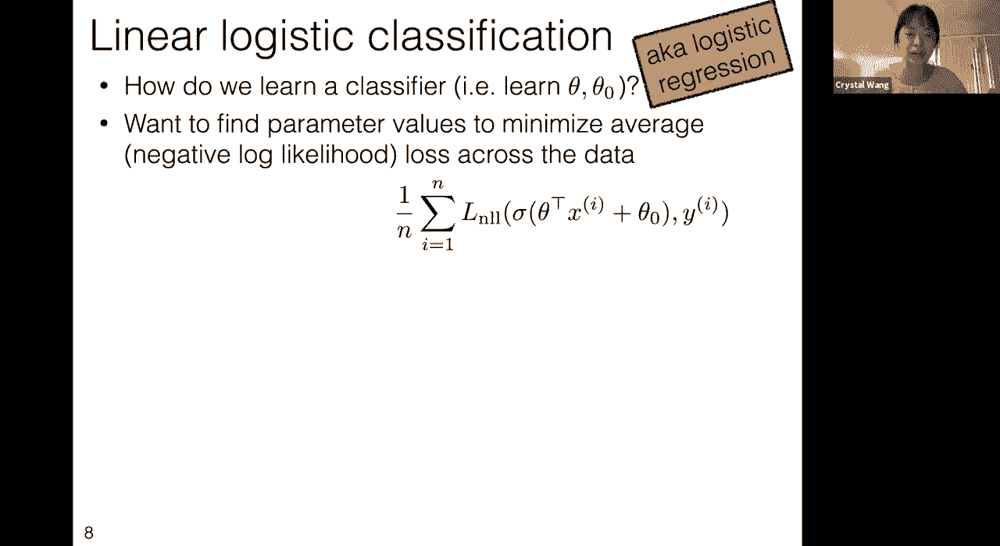

假设我们有 `n` 个独立的数据点 `(x⁽ⁱ⁾, y⁽ⁱ⁾)`，其中 `y⁽ⁱ⁾ ∈ {+1, -1}`。在给定参数下，观测到整个数据集的概率是每个数据点概率的乘积。

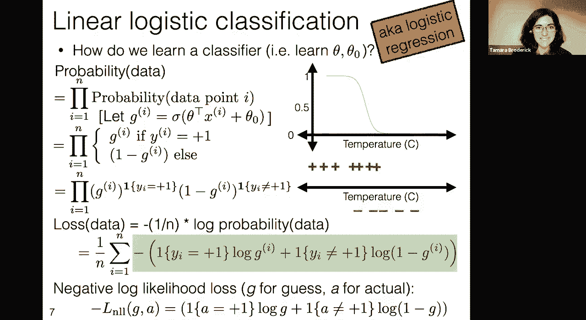

**公式：**
`P(数据 | θ, θ₀) = ∏ᵢ P(y⁽ⁱ⁾ | x⁽ⁱ⁾; θ, θ₀)`

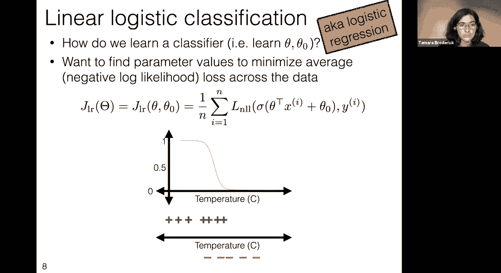

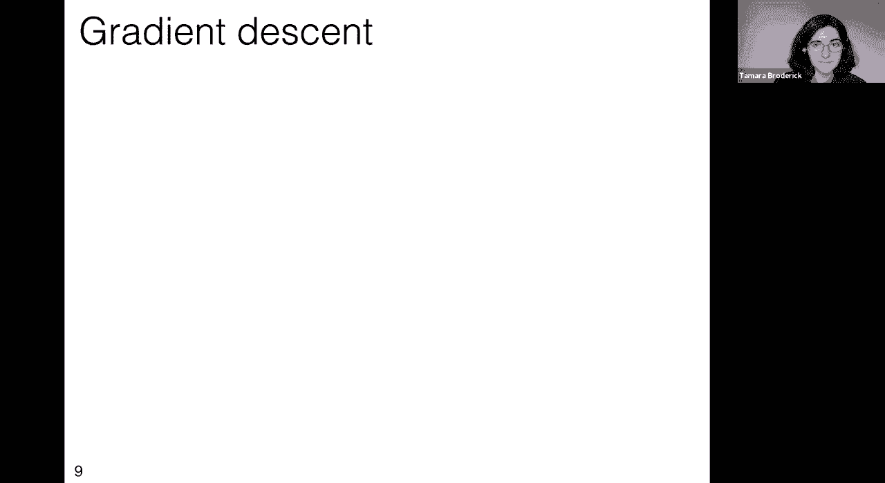

对于单个数据点，其概率为：
*   如果 `y⁽ⁱ⁾ = +1`，概率为 `g(x⁽ⁱ⁾)`。
*   如果 `y⁽ⁱ⁾ = -1`，概率为 `1 - g(x⁽ⁱ⁾)`。

为了方便计算和避免数值下溢（多个小于1的概率相乘会变得非常小），我们通常取对数似然（乘积变求和）。为了将其转化为我们熟悉的**最小化损失**框架，我们取**负对数似然**。

最终，我们得到逻辑回归的损失函数（训练误差）：

**公式：**
`J_lr(θ, θ₀) = (1/n) * Σᵢ L_nll(g(x⁽ⁱ⁾), y⁽ⁱ⁾)`

其中，单个数据点的**负对数似然损失**为：

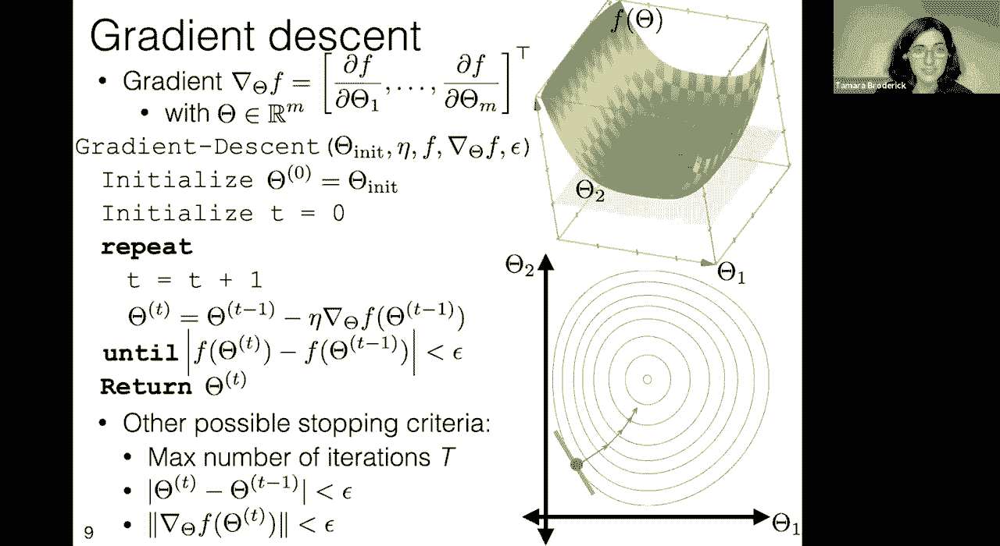

**公式：**
`L_nll(预测概率 g, 真实标签 y) = - [ ( (1+y)/2 ) * log(g) + ( (1-y)/2 ) * log(1-g) ]`

（注：这个公式巧妙地处理了 `y=+1` 和 `y=-1` 两种情况，本质是 `-log(g)` 当 `y=+1`，`-log(1-g)` 当 `y=-1`）。

## 优化工具：梯度下降法 📉

上一节我们定义了逻辑回归的损失函数 `J_lr`，它是一个关于参数 `θ` 和 `θ₀` 的连续可微函数。本节我们介绍一种强大的优化算法——**梯度下降法**，来最小化这个损失函数。

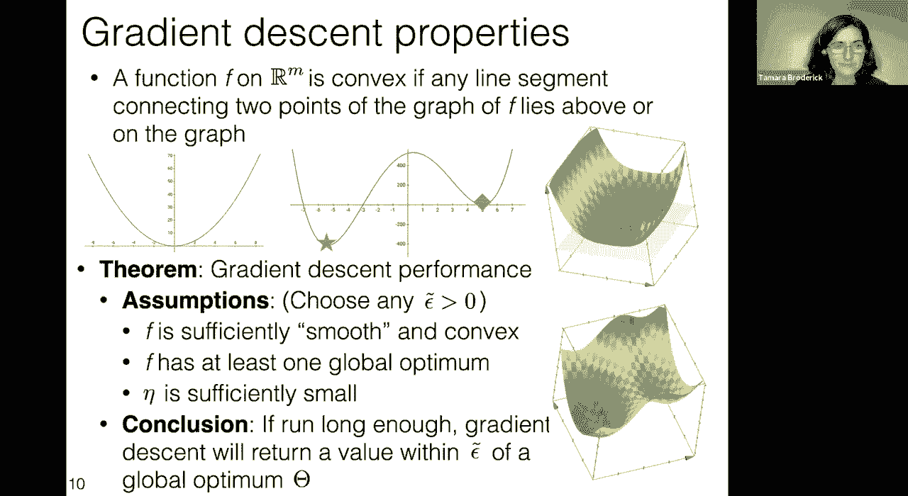

梯度下降法的核心思想是：函数在某一点的**梯度**指向该点函数值**增长最快**的方向。因此，**负梯度**方向就是函数值**下降最快**的方向。

**算法：梯度下降**
1.  **初始化**：选择起始参数 `θ⁽⁰⁾`，设置步长（学习率）`η > 0`，设置容差 `ε`。
2.  **迭代更新**：对于 `t = 0, 1, 2, ...`：
    a. 计算当前点的梯度 `∇J(θ⁽ᵗ⁾)`。
    b. 更新参数：`θ⁽ᵗ⁺¹⁾ = θ⁽ᵗ⁾ - η * ∇J(θ⁽ᵗ⁾)`。
    c. 如果参数变化或函数值变化小于 `ε`，则停止。
3.  **输出**：返回最终参数 `θ⁽ᵗ⁾`。

梯度下降法适用于任何可微函数。对于**凸函数**（即函数图像上任意两点的连线都在图像上方），梯度下降在适当条件下可以保证收敛到**全局最优解**。

逻辑回归的负对数似然损失函数（在加入正则项后）是凸的，这保证了梯度下降能找到很好的解。

## 应对过拟合：正则化 🛡️

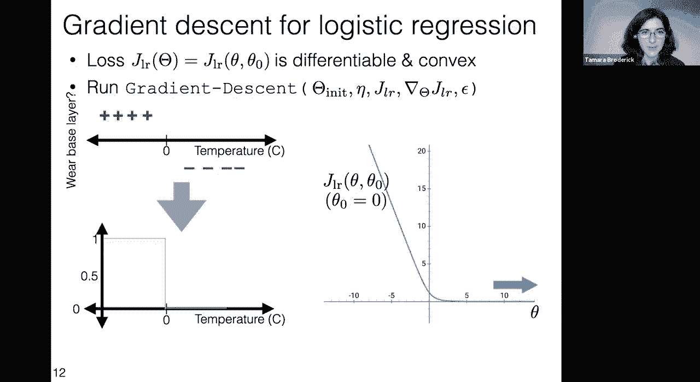

在训练逻辑回归模型时，如果不对参数加以约束，模型可能会对训练数据“过度自信”。具体表现为权重 `θ` 的绝对值变得非常大，使得Sigmoid函数在决策边界附近变得非常陡峭，几乎像感知机一样输出0或1的概率，从而失去了表达不确定性的能力。

为了解决这个问题，我们在损失函数中增加一个**正则化项**（或**惩罚项**），以阻止参数变得过大。最常用的是 **L2 正则化**（也称为权重衰减）。

**公式：带L2正则化的逻辑回归损失**
`J_lr_reg(θ, θ₀) = J_lr(θ, θ₀) + λ * ||θ||²`

其中：
*   `λ >= 0` 是正则化强度超参数。
*   `||θ||²` 是权重向量 `θ` 的L2范数的平方（即各分量平方和）。

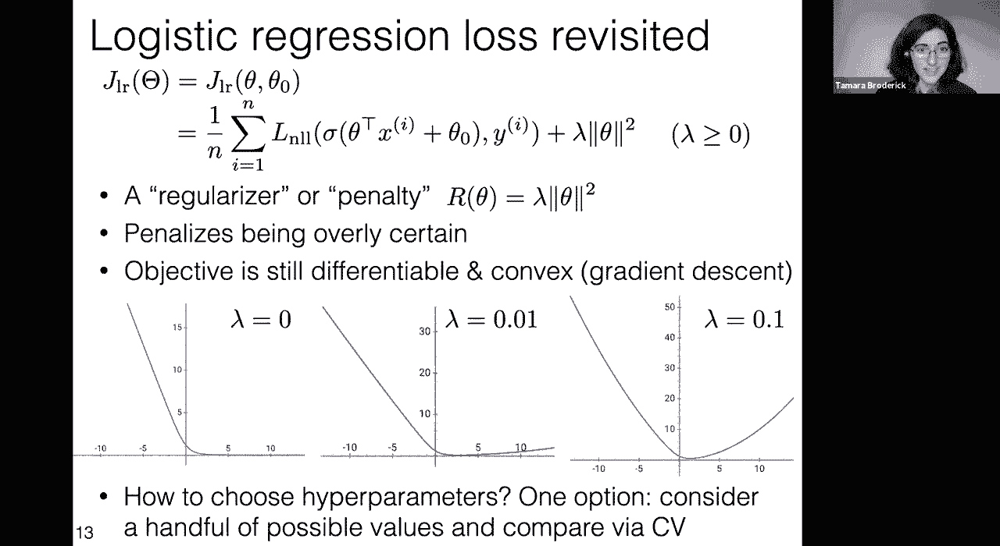

正则化项 `λ||θ||²` 惩罚大的权重值。`λ` 越大，对大幅值的惩罚越重，模型倾向于选择更小的权重，从而变得更“简单”，缓解过拟合。`λ` 的选择通常通过交叉验证等技术来确定。

## 逻辑回归算法总结 🧠

本节课中，我们一起学习了逻辑回归这一核心分类算法。

以下是关键步骤的总结：
1.  **模型定义**：使用Sigmoid函数将线性组合 `θᵀx + θ₀` 映射到 `(0, 1)` 区间，作为正类的预测概率。
    `g(x) = σ(θᵀx + θ₀) = 1 / (1 + e^{-(θᵀx + θ₀)})`
2.  **损失函数**：采用负对数似然损失来衡量模型预测概率与真实标签的差异。
    `J_lr = (1/n) Σᵢ [ -I(y⁽ⁱ⁾=+1)log(g(x⁽ⁱ⁾)) - I(y⁽ⁱ⁾=-1)log(1-g(x⁽ⁱ⁾)) ]`
3.  **正则化**：引入L2正则化项 `λ||θ||²` 来控制模型复杂度，防止过拟合。
4.  **优化**：使用梯度下降法（或其变种，如随机梯度下降）最小化带正则化的损失函数 `J_lr_reg`，从而学习到最优参数 `θ` 和 `θ₀`。

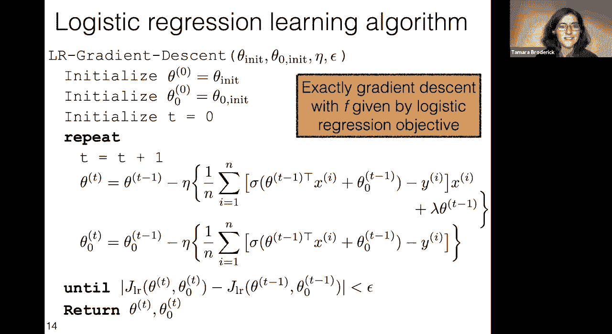

逻辑回归不仅提供了分类决策，更重要的是输出了属于各类别的概率，这在实际应用中（如风险评估、推荐系统）具有重要价值。它是连接线性模型与更复杂神经网络的基础。