# 5：L5-回归建模 📊

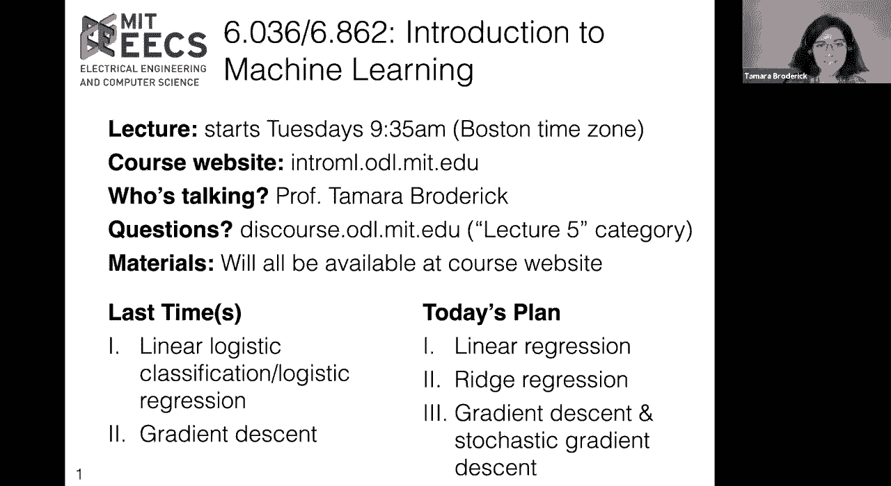

在本节课中，我们将要学习回归建模，特别是线性回归。我们将从回顾分类问题开始，逐步引入回归的概念，并深入探讨线性回归、岭回归以及优化方法，包括梯度下降和随机梯度下降。

---

## 🔄 从分类到回归

上一节我们介绍了分类问题，特别是逻辑回归。本节中，我们来看看回归问题。回归是监督学习的另一种类型，与分类不同，回归的标签可以是连续值。

在分类中，我们处理的是离散标签，例如“穿外套”或“不穿外套”。而在回归中，标签可以是任意实数值，例如空调账单的金额。

以下是分类与回归的主要区别：

*   **特征向量 (x)**：在两者中都是 d 维向量。
*   **标签 (y)**：在分类中是离散值（如 -1, +1），在回归中是连续值（实数）。
*   **假设 (h)**：都是一个从特征到标签的函数。
*   **损失函数 (Loss)**：用于衡量预测的好坏。分类中常用零一损失、负对数似然损失等；回归中常用平方误差损失。

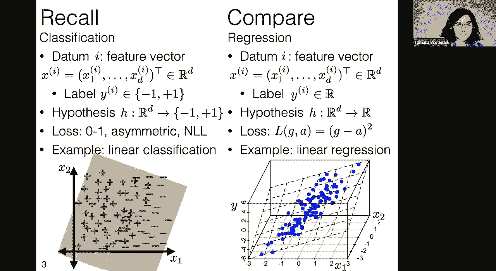

---

## 📈 线性回归与损失函数

本节我们将深入线性回归。线性回归的目标是找到一个超平面（在特征空间中的线性函数），使得预测值与真实值之间的差距最小。

我们使用**平方误差损失**来衡量预测的好坏。对于单个数据点，损失定义为预测值 \( g \) 与实际值 \( a \) 之差的平方：\( (g - a)^2 \)。

对于整个数据集，训练误差（或均方误差）是所有数据点平方误差的平均值：

\[
J(\theta) = \frac{1}{n} \sum_{i=1}^{n} (h_{\theta}(x_i) - y_i)^2
\]

其中，线性回归的假设函数为：
\[
h_{\theta}(x) = \theta^T x = \theta_0 + \theta_1 x_1 + ... + \theta_d x_d
\]

为了方便数学处理，我们通常进行特征增广，即在特征向量末尾添加一个值为1的维度，从而将偏移项 \( \theta_0 \) 并入参数向量 \( \theta \) 中。此时假设简化为：
\[
h_{\theta}(x) = \theta^T \tilde{x}
\]

---

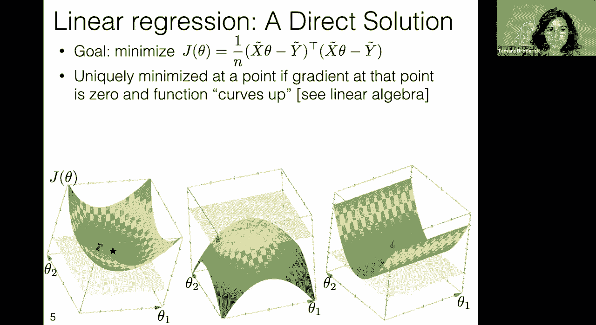

## 🧮 线性回归的解析解

线性回归的一个优点是，其损失函数是参数 \( \theta \) 的二次函数。这意味着在满足条件的情况下，我们可以直接通过求导并令导数为零来找到全局最优解（解析解），而不必使用迭代算法。

我们的目标是最小化损失函数 \( J(\theta) \)。通过求梯度并设为零，我们可以推导出最优参数 \( \theta^* \) 的公式。

首先，将损失函数用矩阵形式表示。令 \( \tilde{X} \) 为 n×d 的设计矩阵（每行是一个增广后的数据点），\( \tilde{y} \) 为 n×1 的标签向量。则损失函数可写为：
\[
J(\theta) = \frac{1}{n} ||\tilde{X}\theta - \tilde{y}||^2_2
\]

对 \( \theta \) 求梯度并令其为零向量：
\[
\nabla_{\theta} J(\theta) = \frac{2}{n} \tilde{X}^T (\tilde{X}\theta - \tilde{y}) = 0
\]

经过推导，得到最优解（正规方程）：
\[
\theta^* = (\tilde{X}^T \tilde{X})^{-1} \tilde{X}^T \tilde{y}
\]

**注意**：该解存在且唯一的条件是矩阵 \( \tilde{X}^T \tilde{X} \) 可逆。当特征之间存在严格线性相关（如冗余特征）或数据点数量少于特征维度时，该矩阵可能不可逆，导致没有唯一解。

---

## ⚠️ 问题：多重共线性与过参数化

在实际应用中，直接使用解析解可能会遇到问题。主要问题包括：

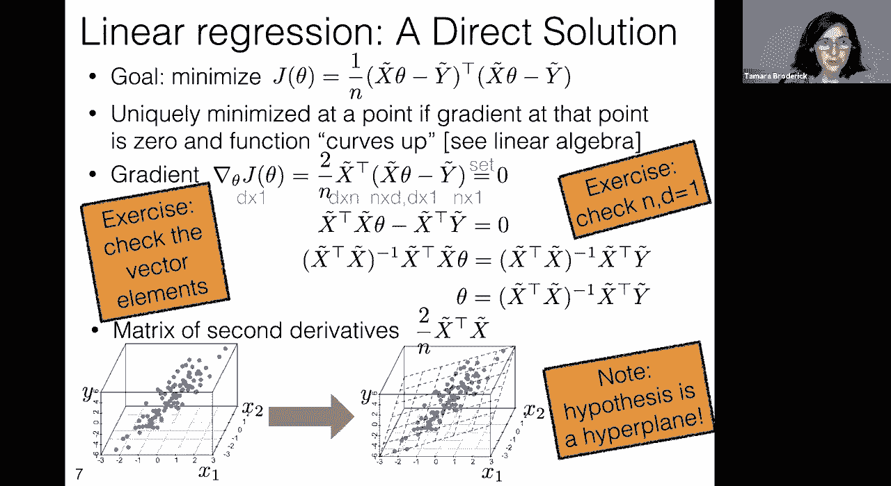

1.  **特征冗余**：例如，同时使用华氏温度和摄氏温度作为特征，它们传递相同信息，导致 \( \tilde{X}^T \tilde{X} \) 不可逆。
2.  **高度相关特征**：即使不是完全冗余，高度相关的特征也会使矩阵接近奇异，数值计算不稳定。
3.  **过参数化**：当特征维度 d 大于数据点数量 n 时，存在无数个可以完美拟合训练数据的超平面（训练误差为零），但其中许多是毫无意义的噪声拟合。

在这些情况下，数据无法为我们提供一个明确、唯一且可靠的“最佳”超平面。

---

## 🛡️ 岭回归：引入正则化

为了解决上述问题，我们引入**正则化**。与在逻辑回归中添加惩罚项类似，我们在损失函数中加入一个对参数 \( \theta \) 大小的惩罚项，偏好较小的参数值，除非数据有强有力的证据支持较大的值。

这种方法称为**岭回归**。其优化目标变为：
\[
J_{ridge}(\theta) = \frac{1}{n} ||\tilde{X}\theta - \tilde{y}||^2_2 + \lambda ||\theta||^2_2
\]
其中，\( \lambda > 0 \) 是正则化强度参数。

*   **当 \( \lambda = 0 \)**：退化为普通线性回归。
*   **当 \( \lambda > 0 \)**：惩罚大的 \( \theta \) 值，促使模型更简单。
*   **当 \( \lambda < 0 \)**：没有意义，会导致参数趋向于无穷大以最小化损失。

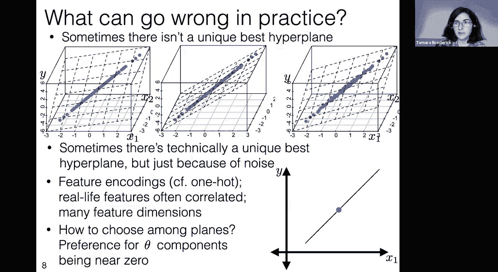

岭回归也有解析解：
\[
\theta^*_{ridge} = (\tilde{X}^T \tilde{X} + \lambda I)^{-1} \tilde{X}^T \tilde{y}
\]
其中 \( I \) 是单位矩阵。只要 \( \lambda > 0 \)，矩阵 \( (\tilde{X}^T \tilde{X} + \lambda I) \) 总是可逆的，从而保证了唯一解。

**重要提示**：使用岭回归（或任何基于参数范数的正则化）时，通常需要先将特征进行标准化（例如，缩放至均值为0，方差为1），以确保所有特征在相同尺度上受到公平的惩罚。

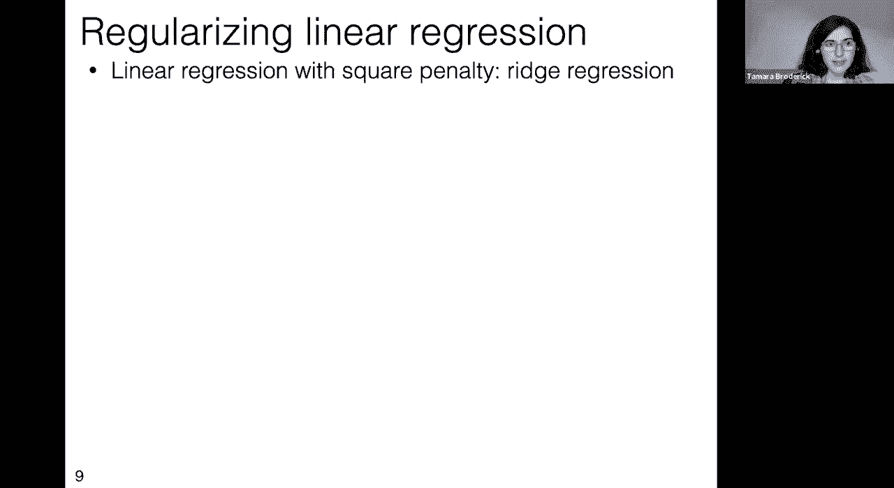

---

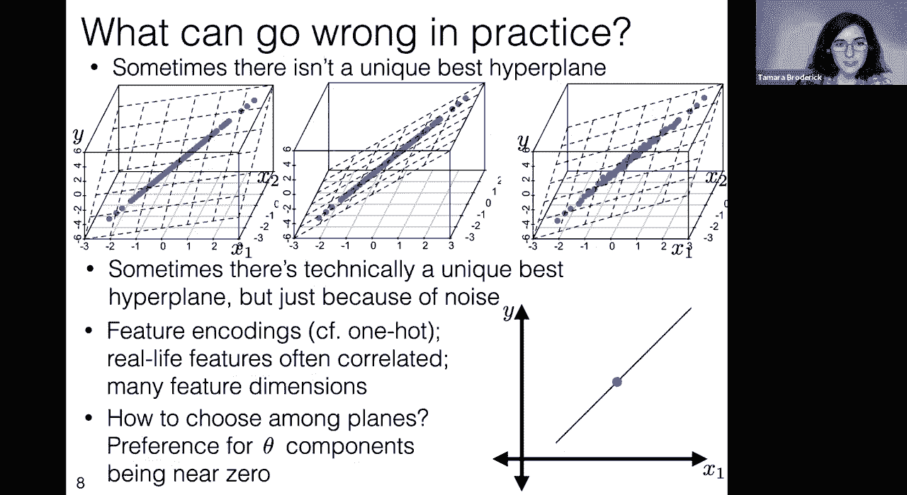

## ⚙️ 优化方法：梯度下降与随机梯度下降

尽管线性回归和岭回归存在解析解，但在实际中我们有时仍会使用迭代优化方法，如**梯度下降**。原因如下：

*   **计算效率**：当特征维度 d 非常大时（例如百万级以上），计算解析解中的矩阵逆 \( (X^T X)^{-1} \) 的计算复杂度很高（约为 \( O(d^3) \)），可能变得不可行。梯度下降的每次迭代成本较低。
*   **大规模数据**：当数据点数量 n 非常大时，即使梯度下降需要多次迭代，其每次迭代也可能比操作巨大的设计矩阵更高效。

梯度下降的更新规则为：
\[
\theta^{(t+1)} = \theta^{(t)} - \eta \cdot \nabla_{\theta} J(\theta^{(t)})
\]
其中 \( \eta \) 是学习率。

对于超大规模数据集，**随机梯度下降** 更为常用。它每次迭代只随机使用一个数据点（或一小批数据）来计算梯度并更新参数：
\[
\theta^{(t+1)} = \theta^{(t)} - \eta_t \cdot \nabla_{\theta} \text{Loss}(h_{\theta}(x_i), y_i)
\]
虽然每次更新方向噪声较大，但由于更新极其频繁，总体而言往往能更快地达到可接受的解。

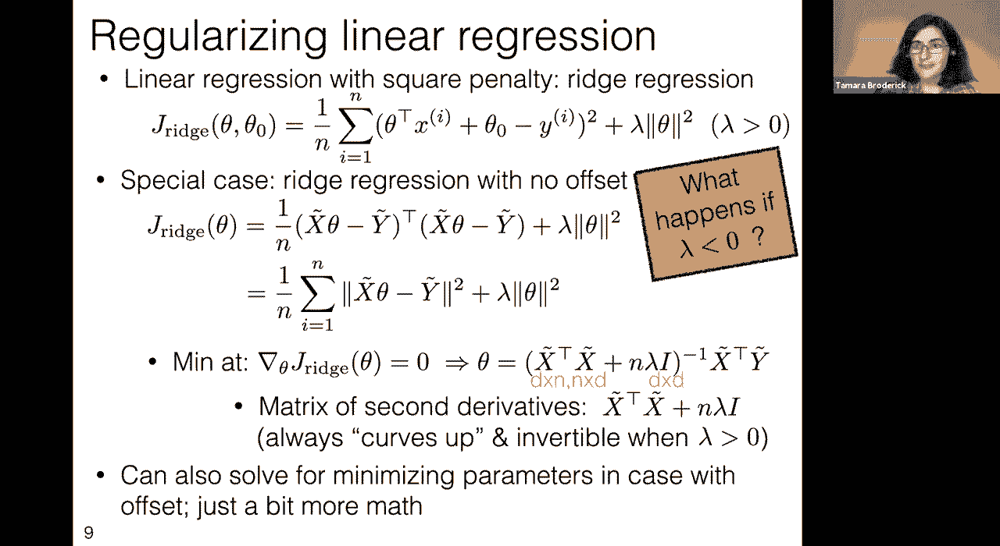

---

## 📝 特征工程的重要性

与分类问题一样，特征工程在回归中至关重要。模型性能很大程度上取决于如何表示和预处理特征。

需要注意的事项包括：

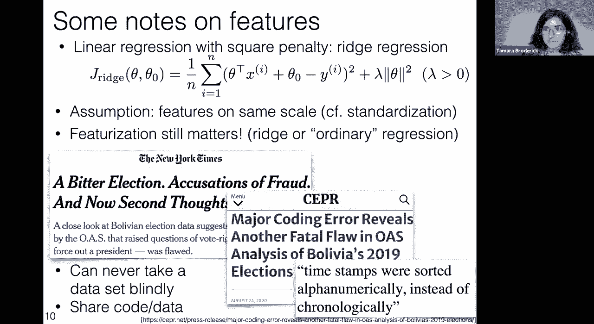

*   **特征缩放**：在使用正则化时尤为重要。
*   **特征构造**：通过多项式特征、交互项等可以拟合非线性关系（尽管模型在参数上仍是线性的）。
*   **数据清洗与理解**：错误的数据编码（如时间戳按字母而非时间排序）会导致完全错误的分析结论。在实际工作中，必须仔细检查数据，理解其含义，并与领域专家沟通。

---

## 🎯 总结

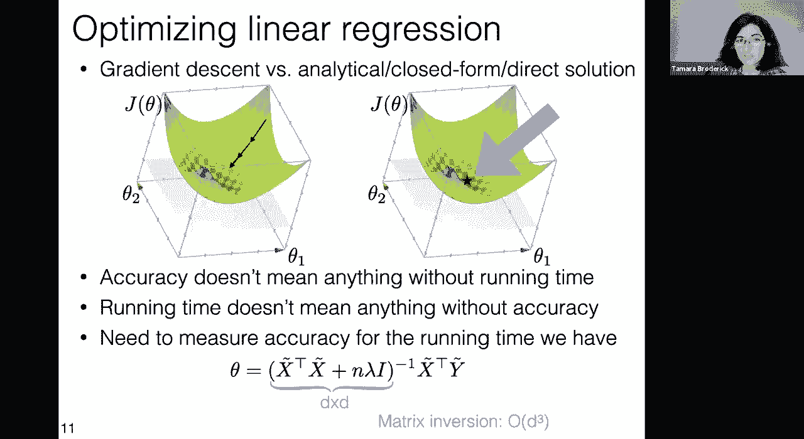

本节课中我们一起学习了：

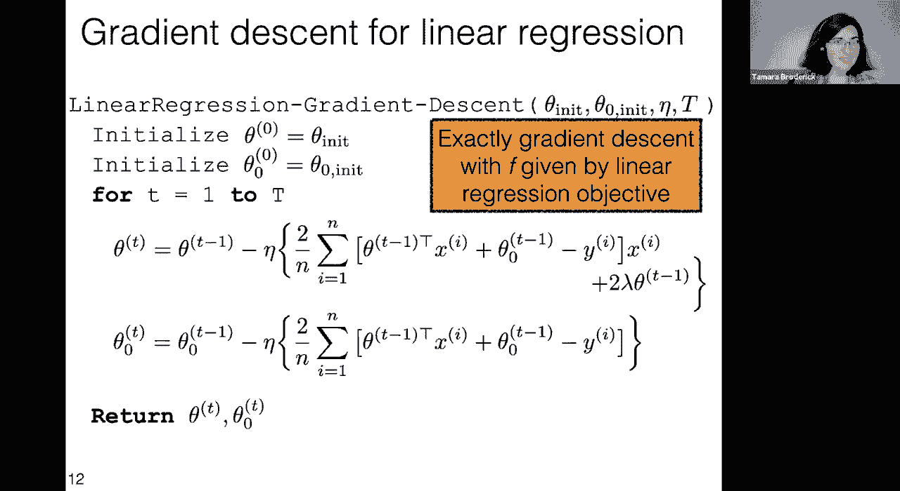

1.  **回归的基本概念**：与分类的区别，以及平方误差损失函数。
2.  **线性回归**：如何用超平面进行预测，以及通过正规方程求解析解。
3.  **潜在问题**：多重共线性和过参数化导致解不唯一或不稳定。
4.  **岭回归**：通过 L2 正则化解决上述问题，偏好简单模型，并总能得到唯一解。
5.  **优化视角**：即使有解析解，梯度下降和随机梯度下降在大规模或高维场景下可能更实用。
6.  **特征工程的核心地位**：正确的特征处理是模型成功的基石。

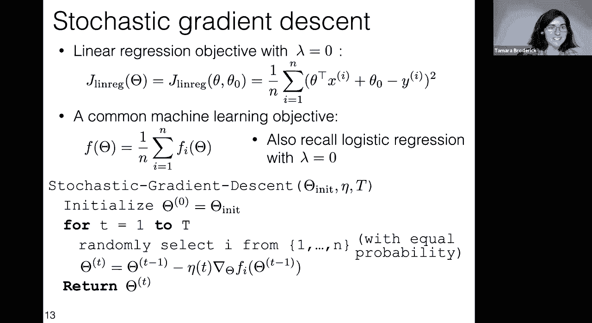

回归建模是机器学习中强大而基础的工具，理解其原理和细节将为学习更复杂的模型奠定坚实的基础。