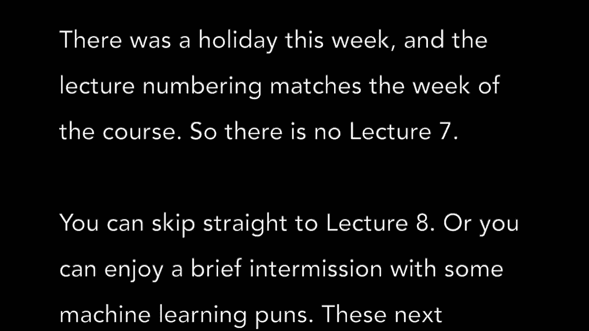
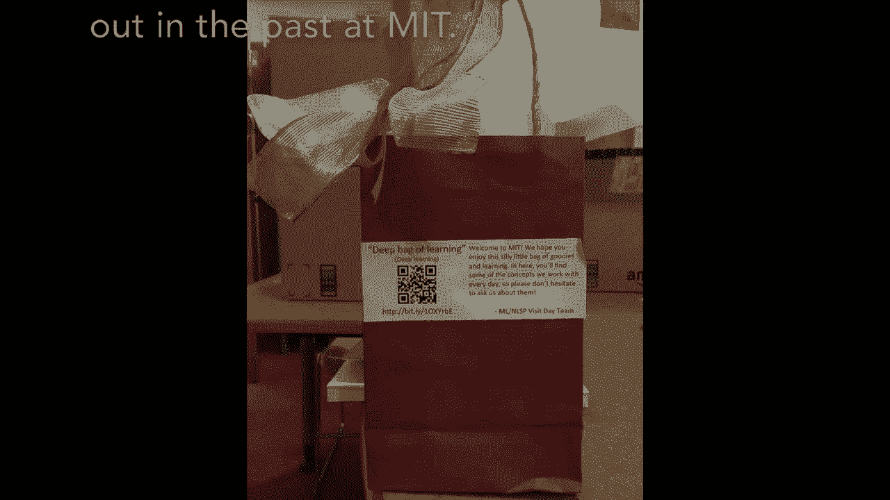
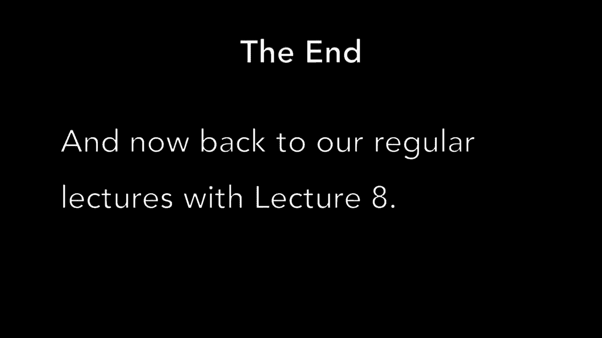

# 7：L7- 休息／Break 🧠

在本节课中，我们将学习如何在程序中实现“休息”或“中断”功能。这个功能允许程序在特定条件下暂停执行，或者跳出当前的循环结构，是控制程序流程的重要工具。

## 🔍 什么是“休息”或“中断”？

“休息”或“中断”在编程中通常指`break`语句。它的作用是**立即终止**当前所在的循环（如`for`循环或`while`循环）或`switch`语句，并将程序的控制权转移到循环或`switch`语句之后的代码。

## 📝 `break`语句的基本语法



`break`语句的语法非常简单，在大多数编程语言中，它就是一个单独的关键字。

```python
break
```

当程序执行到`break`时，它会立刻跳出当前最内层的循环。

## 🧩 `break`在循环中的应用

上一节我们介绍了`break`的基本概念，本节中我们来看看它在循环中的具体应用。`break`通常与条件判断语句（如`if`）结合使用，用于在满足某个条件时提前结束循环。

以下是`break`在`while`循环中的一个典型示例：



```python
count = 0
while True:  # 这是一个无限循环
    print(count)
    count += 1
    if count >= 5:
        break  # 当count等于5时，跳出循环
```

在这个例子中，`while True:`创建了一个理论上会永远执行下去的循环。然而，我们在循环内部设置了一个条件：当变量`count`的值大于或等于5时，就执行`break`语句。因此，循环只会打印数字0到4，然后就会终止。

## 🔄 `break`在`for`循环中的应用

`break`语句在`for`循环中同样有效。它的作用方式与在`while`循环中完全一致。

以下是`break`在`for`循环中的一个例子：

```python
for i in range(10):  # 循环将从0迭代到9
    print(i)
    if i == 5:
        break  # 当i等于5时，跳出循环
```



这段代码本应打印0到9，但由于我们在`i`等于5时使用了`break`，所以循环在打印0到5后就提前结束了。

## ⚠️ 使用`break`的注意事项

在使用`break`时，有几点需要特别注意：

1.  **作用范围**：`break`只能跳出**当前最内层**的循环。如果存在嵌套循环（即循环里面还有循环），`break`只会跳出它所在的那一层。
2.  **与`continue`的区别**：`break`是彻底终止循环，而`continue`是跳过当前循环的剩余语句，直接开始下一次循环迭代。不要混淆两者。
3.  **代码可读性**：过度使用`break`可能会让程序的逻辑变得难以跟踪。在可能的情况下，优先考虑使用清晰的循环条件来结束循环。

## 📊 总结

本节课中我们一起学习了`break`语句。我们了解到，`break`是一个强大的流程控制工具，它允许我们在循环中设置一个“紧急出口”，在满足特定条件时立即终止循环。我们通过`while`循环和`for`循环的示例，掌握了`break`的基本用法，并讨论了使用时需要注意的关键点。合理使用`break`可以使代码更加灵活和高效。