# 13：L13 - 聚类算法 📚

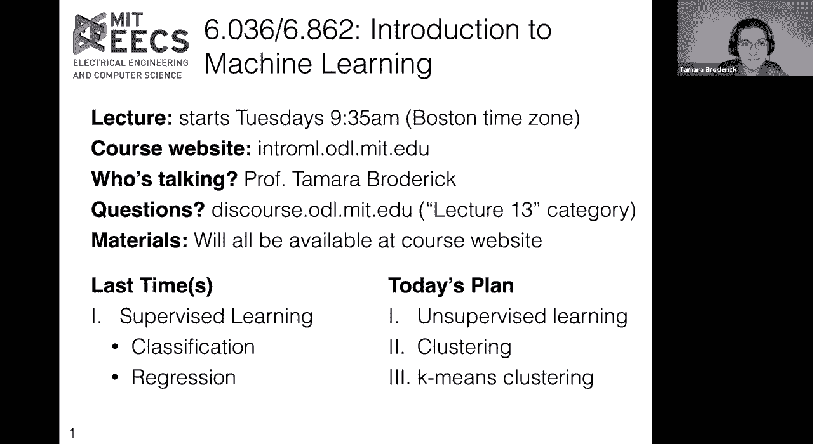

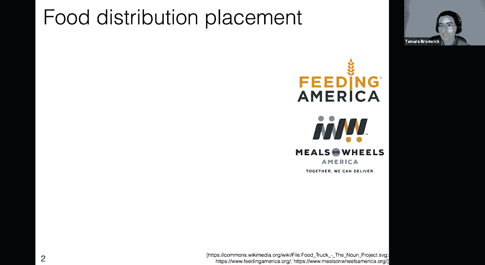

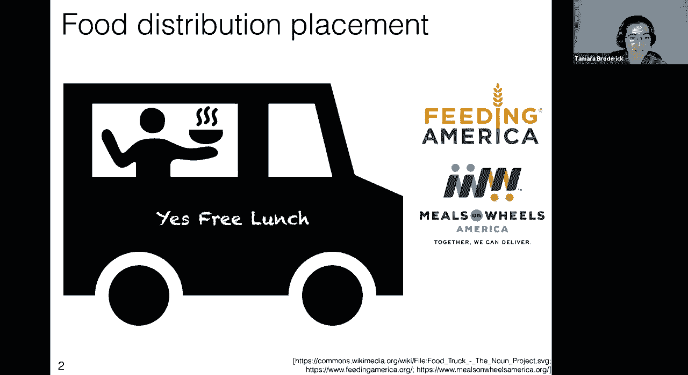

在本节课中，我们将要学习一种重要的无监督学习方法——聚类算法。我们将重点介绍最流行的聚类形式之一：K-Means 聚类。通过一个具体的慈善机构食物卡车选址案例，我们将理解聚类的核心思想、算法步骤以及其应用场景。

---

## 🚀 动机与问题定义

到目前为止，我们在课程中花费了大量时间讨论监督学习，例如分类和回归。今天，我们将深入探讨之前提到但未深入研究的机器学习的另一部分：无监督学习。我们将特别关注最流行的无监督学习形式——聚类，并重点介绍其中最流行的形式：K-Means 聚类。

我们从一个具体的例子开始。假设有一个名为“Yes Free Lunch”的新慈善机构，他们希望通过食物卡车向有食物保障问题的人们分发食物。他们的模型是将这些卡车放置在美国各地，以便人们可以步行到卡车处领取食物并返回家中。他们向我们这些机器学习专家寻求帮助，以最优化的方式放置他们的卡车。

假设他们有一个新的服务区域，我们正在查看该区域。下图中的每个点代表一个可能使用他们服务的个体，即可能从他们的某个卡车领取食物的人。横轴可以视为经度，纵轴可以视为纬度。因此，我们实际上是在查看地图上人们居住的点，并希望询问如何最小化服务损失。

---

## 📝 建立符号与损失函数

首先，我们建立一些符号以便描述问题。

*   假设有 `n` 个不同的个体需要服务。
*   第 `i` 个人位于位置 `x_i`，这是一个特征向量，包含该人位置的经度和纬度。
*   同样，我们有 `j` 辆食物卡车，`j` 的取值范围是从 `1` 到 `k`（`k` 是卡车总数）。第 `j` 辆卡车的位置也是一个特征向量 `μ_j`。
*   假设每个人步行到一辆特定的食物卡车。我们用 `y_i` 表示分配给第 `i` 个人的食物卡车编号。

现在，我们需要定义第 `i` 个人步行到第 `j` 辆卡车的损失。损失函数可以是任何你认为合适的形式。这里我们选择使用平方误差损失，即个体位置与食物卡车位置之间的欧几里得距离的平方。

**损失函数公式：**
`loss(x_i, μ_j) = ||x_i - μ_j||²`

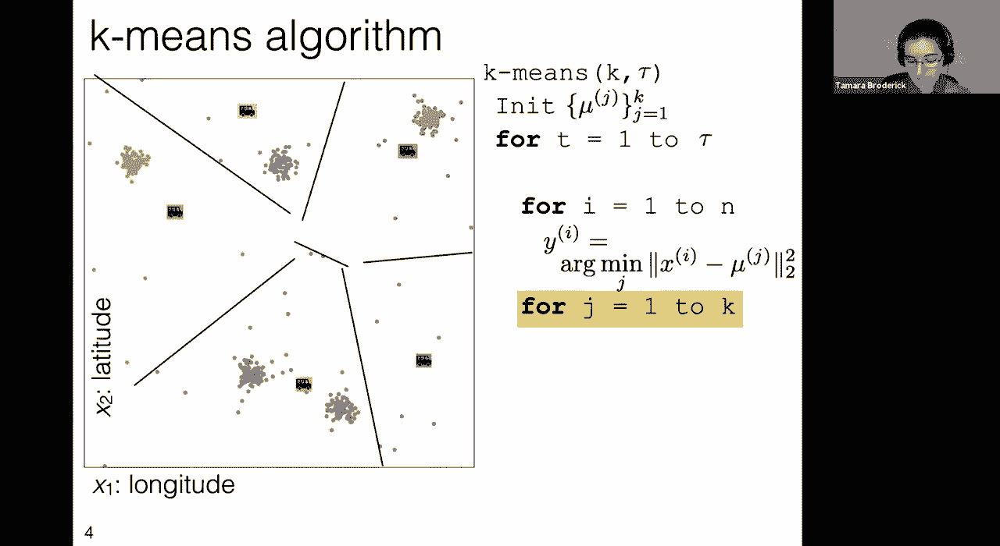

选择平方损失的一个原因是，人们非常不喜欢走很长的距离。让10个人走0.5英里与让1个人走5英里是不同的，5英里是令人望而却步的。平方损失对距离远的卡车惩罚更重。

现在，我们可以询问所有被服务个体的总损失。总损失是所有个体损失的总和。

**总损失公式（形式一）：**
`L(μ, y) = Σ_{i=1}^{n} ||x_i - μ_{y_i}||²`

我们可以用另一种等价的方式重写这个公式。我们考虑每个人可能去的所有卡车，但只有被分配的那辆卡车贡献损失。

**总损失公式（形式二）：**
`L(μ, y) = Σ_{i=1}^{n} Σ_{j=1}^{k} 1{y_i = j} * ||x_i - μ_j||²`
其中 `1{条件}` 是指示函数，当条件为真时值为1，否则为0。

求和顺序可以交换，这不会改变结果。

我们的目标是找到卡车位置 `μ` 和人员分配 `y`，以最小化这个总损失 `L(μ, y)`。这通常被称为 **K-Means 聚类** 的目标函数。

---

## 🔧 K-Means 算法详解

我们有了食物卡车问题的形式化定义，知道了要做什么：最优化地放置卡车并分配人员。现在我们需要思考如何实现。有一个历史悠久且被广泛使用的算法，称为 **K-Means 算法**。

K-Means 算法将接收两个输入：`k`（聚类的数量，即卡车数量）和 `τ`（最大迭代次数）。算法还会隐式地接收数据，即所有个体的特征向量集合 `{x_1, x_2, ..., x_n}`。注意，这里只有特征向量，没有标签，这是无监督学习的特点。

以下是算法的步骤：

1.  **初始化**：将卡车“开进城镇”，即初始化卡车的位置 `μ_j`。初始化方式可以是：
    *   从数据点中随机选择（无放回）。
    *   在每个特征维度上，根据数据的范围均匀随机初始化。
2.  **迭代优化**：对于 `t = 1` 到 `τ`（最大迭代次数），执行以下步骤：
    *   **步骤 A：分配人员到最近的卡车（更新 `y`）**。对于每个人 `i`，将其分配到当前距离最近的卡车。
        **分配公式：**
        `y_i = argmin_{j} ||x_i - μ_j||²`
        这意味着我们用颜色或线条将所有点分配给最近的卡车，形成一种称为 Voronoi 图的结构。
        
    *   **步骤 B：重新计算卡车位置（更新 `μ`）**。对于每辆卡车 `j`，将其位置更新为所有分配给它的个体的平均位置（即均值）。
        **更新公式：**
        `μ_j = (Σ_{i=1}^{n} 1{y_i = j} * x_i) / (Σ_{i=1}^{n} 1{y_i = j})`
        这本质上是计算分配给卡车 `j` 的所有人的位置的平均值。
        
    *   检查是否收敛（例如，分配不再变化）。如果分配 `y` 与上一次迭代相同，则提前终止循环。

3.  **返回结果**：返回最终的卡车位置 `μ` 和人员分配 `y`。

这个算法本质上是一种坐标下降法：固定 `μ` 优化 `y`（步骤A），然后固定 `y` 优化 `μ`（步骤B），交替进行。

---

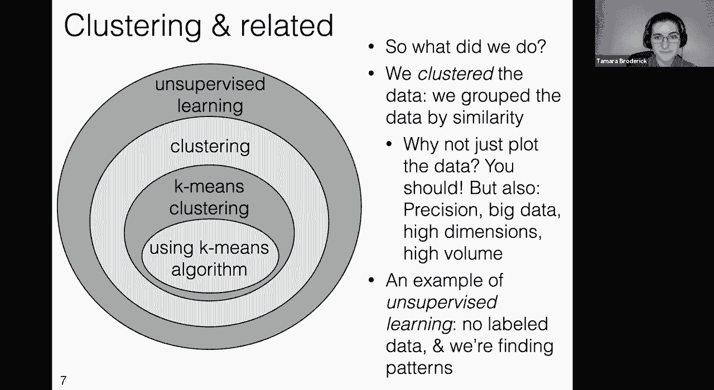

## 🤔 聚类 vs. 分类

K-Means 看起来有点像分类，因为它为每个数据点 `x_i` 分配了一个标签 `y_i`（取值范围为 `1` 到 `k`）。但关键区别在于：

1.  **有无标签数据**：在分类中，我们从**已标记的训练数据**开始学习，然后预测新数据的标签。在聚类中，我们开始时**没有任何标签**，只是从数据本身中发现模式或分组。
2.  **标签的含义**：在分类中，标签具有固有含义（例如，“猫”或“狗”）。在聚类中，标签（簇编号）本身没有绝对意义；它们只是标识不同的分组。交换所有标签（即对簇进行排列）不会改变聚类的本质，因为我们只是在划分数据。

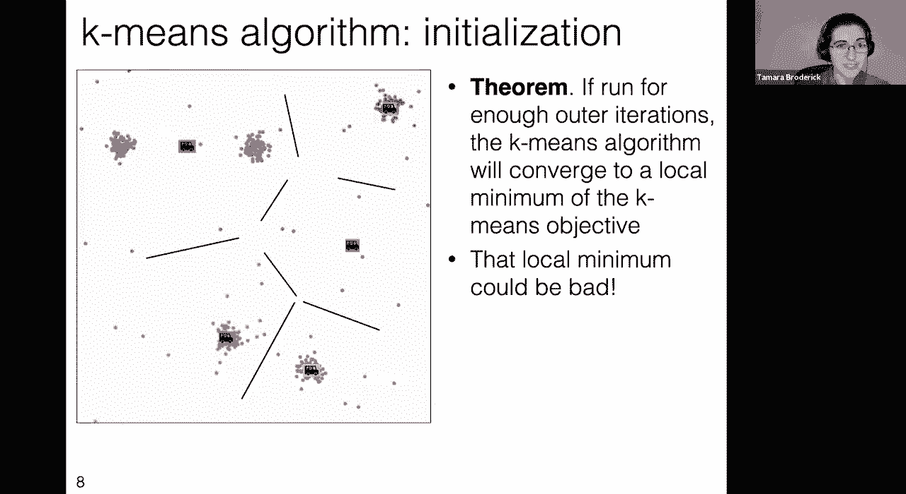

因此，聚类是**根据相似性对数据进行分组**。我们从一个未标记的特征向量集合开始，使用某种相似性度量（如欧氏距离）将数据划分为互斥且完备的组（即分区）。

---

## 💡 为什么需要算法？可视化不够吗？

你可能会问，为什么不直接绘制数据并观察其中的“簇”？

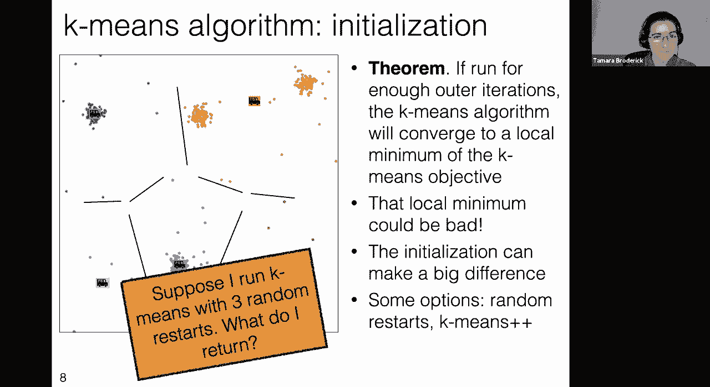

*   **应该始终可视化数据！** 在运行任何机器学习算法之前和之后，绘制数据都是至关重要的，这有助于理解数据和发现潜在问题。
*   **然而，仅靠可视化可能不够**：
    *   **精度**：对于精确优化（如卡车选址），算法能提供更精确的结果。
    *   **高维度**：当特征维度超过2维时，人类无法直接可视化。算法可以处理高维数据。
    *   **数据量巨大**：对于数百万甚至更多的数据点，绘制成图可能只是一团模糊的斑点。算法可以高效处理大规模数据。
    *   **自动化与速度**：在需要快速、自动处理大量数据的场景（如网络搜索聚类），算法是不可或缺的。

---

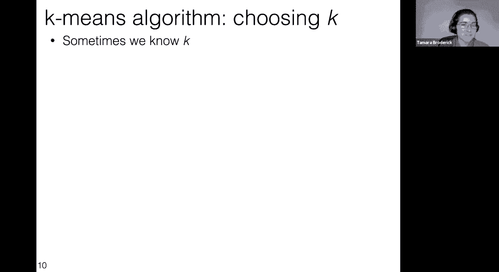

## ⚠️ 初始化的影响与局部最优

K-Means 算法有一个重要的性质：如果运行足够多的迭代，它将收敛到 K-Means 目标函数的一个**局部最小值**。这意味着算法会停止变化，并且任何小的改变都不会使目标函数值更优。

然而，**局部最小值可能不是全局最小值**。算法的最终结果严重依赖于初始卡车位置的设置。不同的随机初始化可能导致截然不同的最终聚类结果和不同的目标函数值。

*（一次随机初始化可能得到看似合理的聚类）*

*（另一次随机初始化可能得到次优的聚类）*

为了缓解这个问题，一个常用的策略是 **随机重启**：
1.  多次运行 K-Means 算法，每次使用不同的随机初始化。
2.  每次运行后，计算最终的目标函数值 `L(μ, y)`。
3.  选择所有运行中目标函数值**最小**的那次结果作为最终输出。

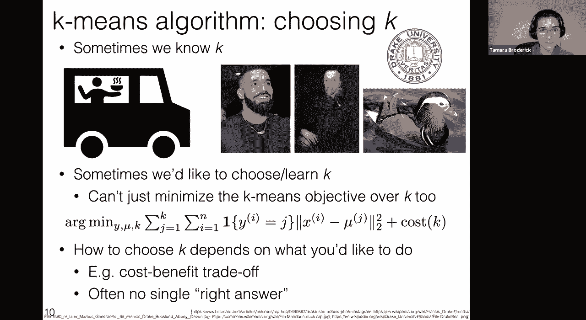

这不能保证找到全局最优，但通常能得到比单次运行更好的结果。此外，还有一些更智能的初始化方案，如 **K-Means++**，旨在选择更好的初始点。

---

## ❓ 如何选择 K 值？

`k`（簇的数量）是一个需要预先设定的参数。有时 `k` 是由问题本身决定的：
*   慈善机构有5辆卡车（`k=5`）。
*   搜索结果页面只显示4个类别（`k=4`）。
*   有 `k` 个客户服务代表来对应 `k` 个客户群。

但有时我们想从数据中“学习”或“发现”合适的 `k` 值。**注意：我们不能简单地通过最小化 K-Means 目标函数来选择 `k`**，因为当 `k = n`（每个点自成一簇）时，目标函数值可以达到0（全局最小），但这没有意义，它没有提供任何有价值的数据分组信息。

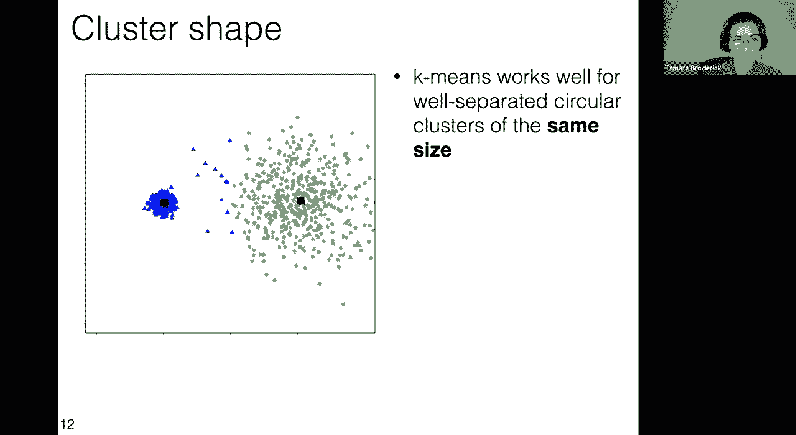

选择 `k` 通常取决于实际目标：
1.  **成本效益权衡**：如果可以量化成本（如卡车成本）和效益（如距离减少），可以将成本 explicitly 纳入一个扩展的目标函数中进行优化。
2.  **探索性数据分析**：如果没有明确的成本，选择 `k` 可能没有唯一正确答案。例如，对动物观测数据进行聚类，`k` 可能对应物种、属或科等不同分类级别。这时可能需要借助其他指标（如轮廓系数）或基于业务理解来判断。

---

## 🔎 K-Means 的假设与局限性

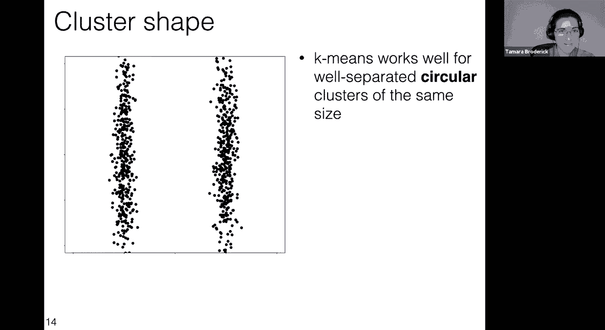

K-Means 在数据满足以下条件时效果较好：
*   **簇之间分离较好**
*   **簇呈圆形（或超球形）**
*   **簇的大小（半径和样本量）相近**

当这些假设不成立时，K-Means 的结果可能不符合直观的“聚类”期望，但它仍然在优化其定义的目标函数（最小化平方距离和）。

1.  **不同大小的簇（样本量不同）**：K-Means 倾向于根据样本量划分簇边界，可能导致大簇“吞噬”小簇的一部分。
    
2.  **非圆形簇（特征尺度不同）**：如果特征尺度差异大，或簇本身是拉长的，K-Means 的圆形边界可能无法捕捉真实结构。标准化特征可能有所帮助，但非本质解决。
    
3.  **簇重叠严重**：如果簇在特征空间中有大量重叠，任何基于距离的聚类算法都难以清晰分离它们。这更多是数据本身的问题，而非算法缺陷。
    

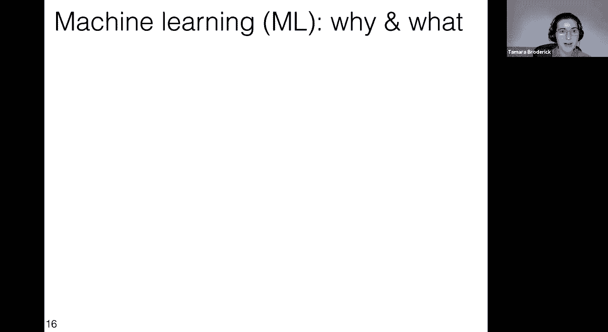

理解这些局限性非常重要，它们说明了机器学习模型是强大的工具，但也有其适用范围和前提条件。

---

## 🎓 课程总结与机器学习全景

本节课我们一起学习了无监督学习中的核心算法——K-Means 聚类。

*   我们从食物卡车选址的实际问题出发，定义了 K-Means 的目标函数。
*   详细讲解了 K-Means 算法的步骤：初始化、交替进行样本分配和簇中心更新。
*   区分了聚类与分类的根本区别：聚类使用无标签数据发现内在分组。
*   探讨了算法实践中的重要问题：初始化的影响（及随机重启策略）、K值的选择以及算法的局限性。

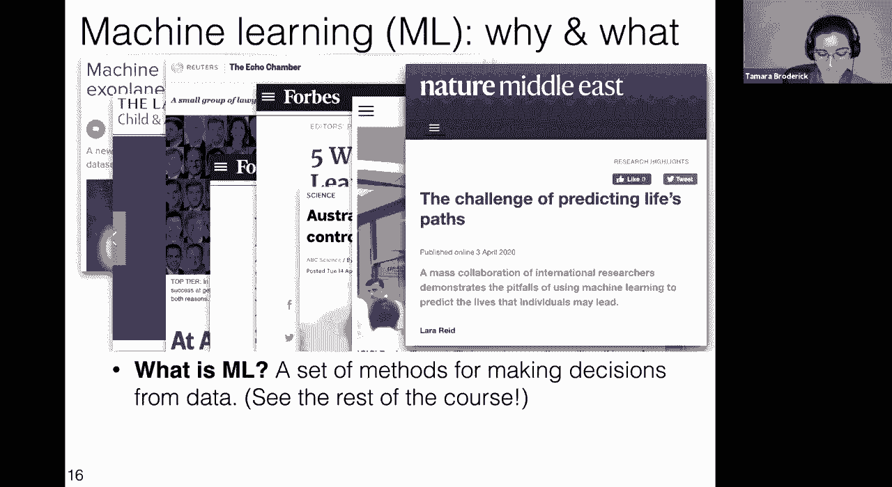

回顾整个课程，我们已经涵盖了广泛的内容：
*   **监督学习**：分类（逻辑回归、神经网络、决策树等）与回归。
*   **无监督学习**：聚类（如本次课的K-Means）。
*   **学习算法**：梯度下降、随机梯度下降、贪婪算法等。
*   **关键概念**：特征工程、模型评估（交叉验证）、集成方法、偏差-方差权衡。
*   **其他领域**：强化学习（马尔可夫决策过程）。

机器学习是一个从数据中做出决策的方法论工具箱。它并非魔法，无法在无信号处创造信号，但它能提供强大的工具来解决许多实际问题。同时，理解其数学基础和局限性对于负责任和有效地应用它至关重要。希望本课程为你开启了探索这一广阔领域的大门，鼓励你通过实践、进一步学习和批判性思考来继续你的机器学习之旅。

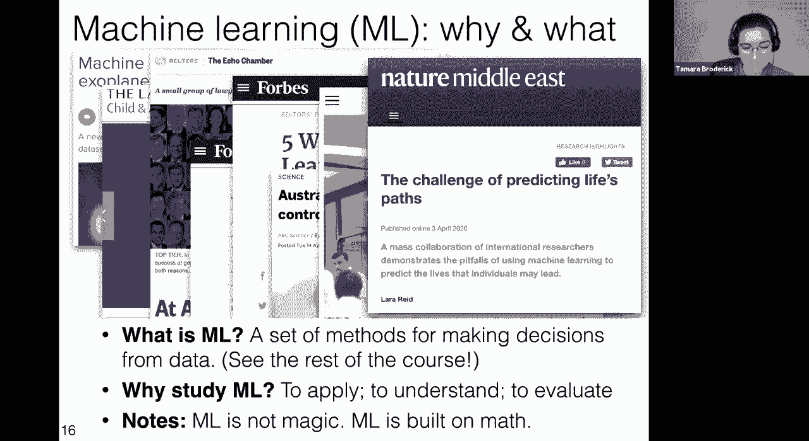

---
**致谢**：感谢课程中所有出色的教学人员以及积极参与的同学们。你们的提问和参与让这门课程更加精彩。机器学习是一个不断发展的领域，期待大家在未来能应用所学，并保持好奇与探索的精神。