# 14：L14 - 医疗健康中的机器学习应用 🏥

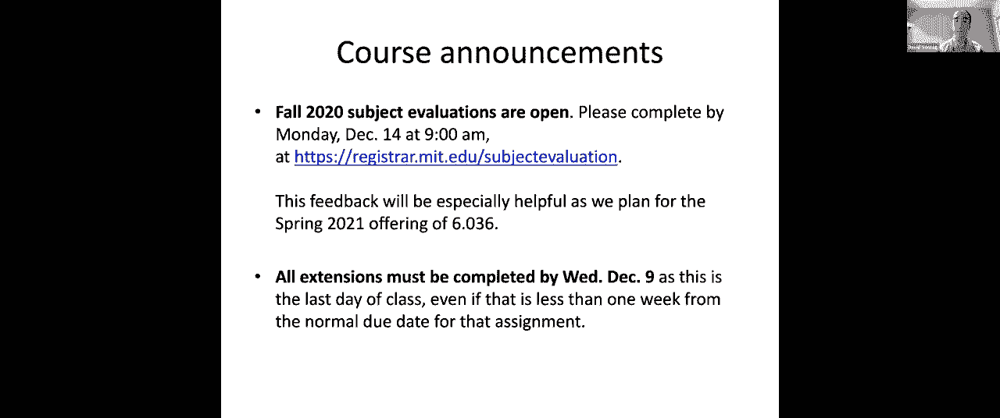

在本节课中，我们将学习如何将机器学习技术应用于医疗健康领域。我们将通过三个具体的案例，分别探讨监督学习、无监督学习和强化学习在解决实际医疗问题中的作用。课程内容将涵盖从数据来源、特征工程到模型构建与评估的全过程，旨在让初学者理解机器学习在复杂领域中的应用逻辑与挑战。

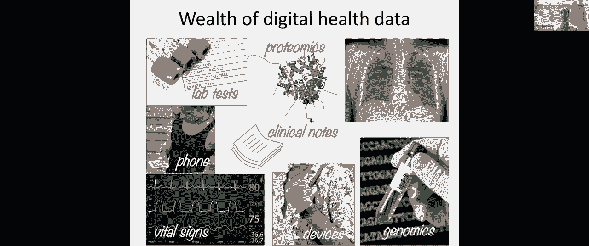

***

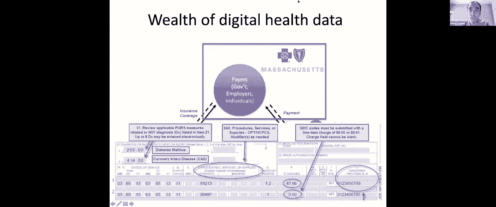

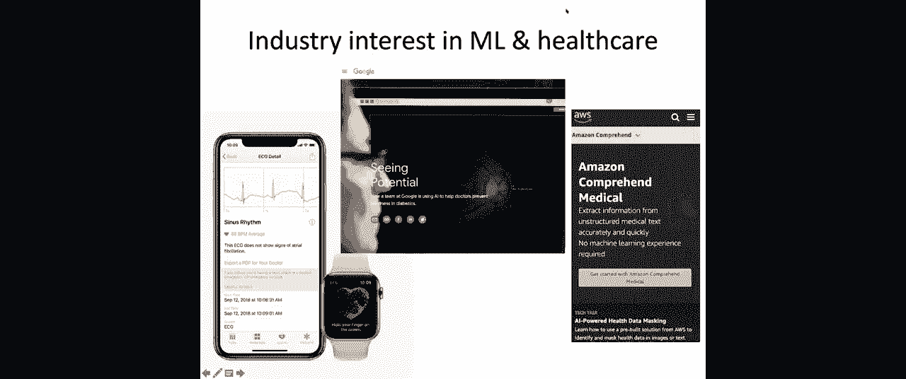

## 概述：医疗数据的数字化浪潮

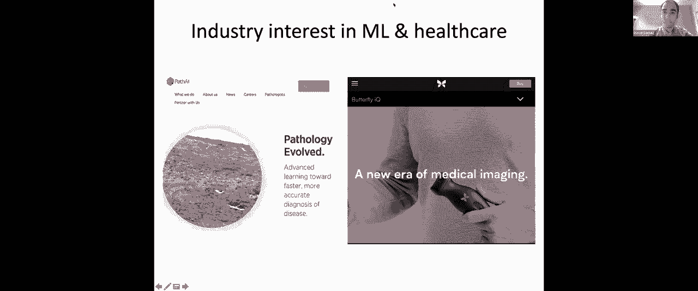

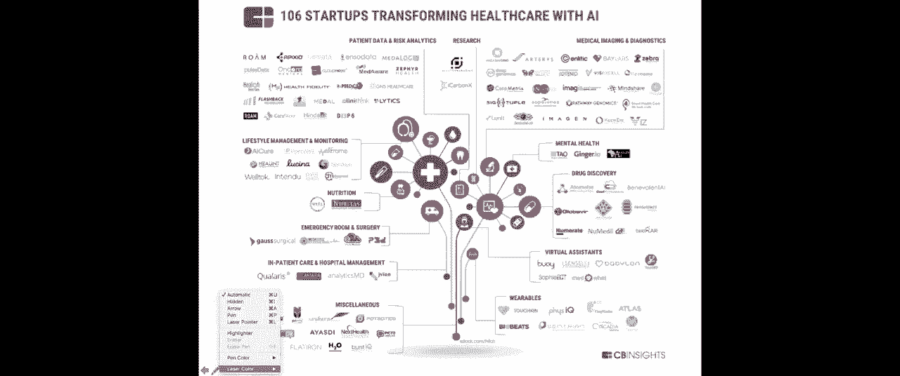

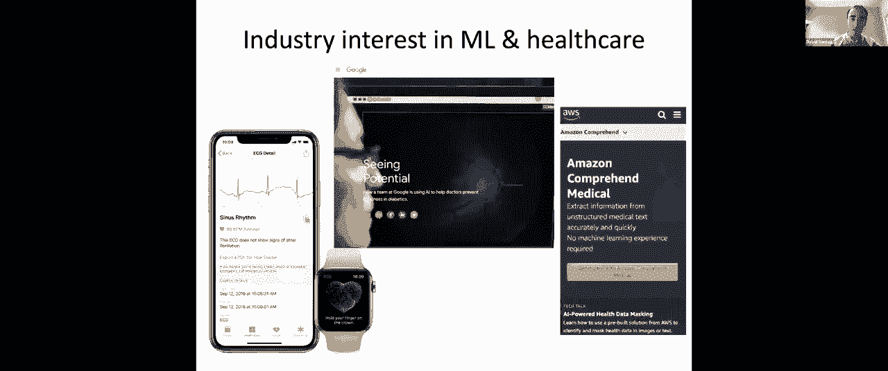

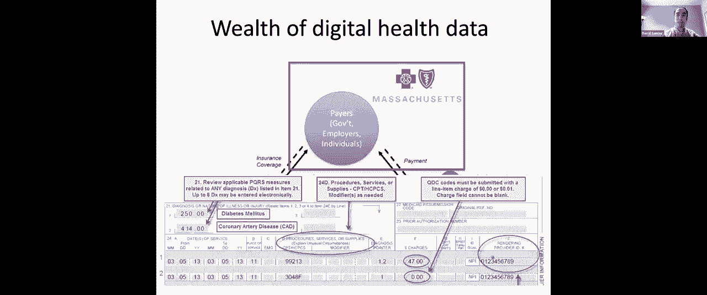

我是David Sontag，是本课程的教师之一。在过去的几年里，我的研究重心从纯机器学习转向了由医疗健康驱动的应用研究。

当前医疗领域之所以令人兴奋，是因为存在海量的数字化健康数据。这些数据范围广泛，包括非结构化的临床记录、生命体征，以及最近出现的蛋白质组学、基因组学数据，甚至传统上不被视为健康数据的信息，如移动设备活动数据。数据的数字化意味着我们可以应用机器学习算法，从数据中学习知识，并在此基础上构建临床决策支持等应用。

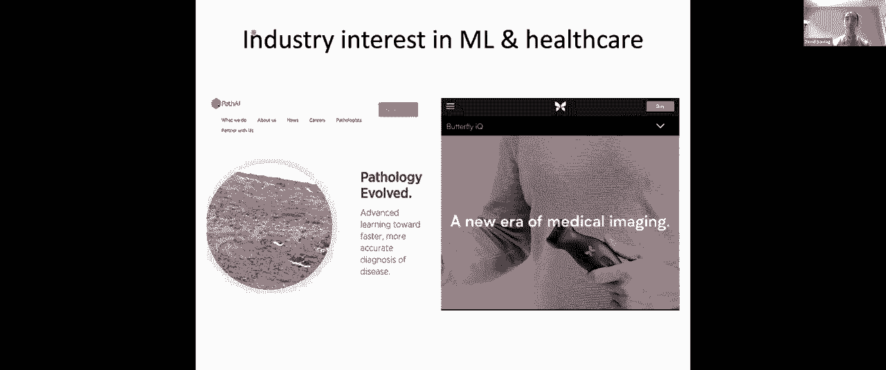

***

## 医疗数据的来源与类型

健康数据存在于各种不同的系统中。在思考如何解决不同问题之前，我们首先需要了解数据的可能来源。

以下是一些主要的健康数据来源：
*   **电子病历**：例如，麻省理工学院的医疗中心就拥有电子病历系统。如今，美国超过85%的医院和诊所都采用了电子病历。这些数据包含诊断代码、临床记录和影像数据。
*   **健康保险理赔数据**：这是另一个主要来源。医疗提供者（如医生）为了获得支付，需要向健康保险公司提交账单。这张账单包含了关于就诊的宝贵信息，例如诊断代码和执行的医疗程序。

这些海量数据已经引起了工业界的注意，我们可以看到谷歌、亚马逊等大型科技公司都涉足了医疗领域。例如，苹果公司推出了可以读取患者心电图的设备，谷歌开发了帮助诊断糖尿病视网膜病变的产品，亚马逊则在其云平台上发布了能处理临床记录以辅助编码的产品。此外，还有许多初创公司正在利用机器学习改变医疗的各个方面。

***

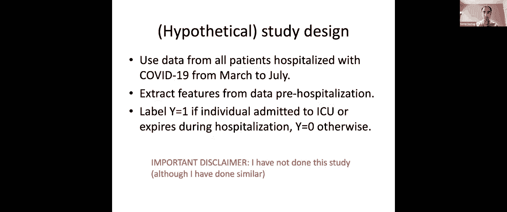

## 应用一：监督学习与疫情风险分层 📊

上一节我们介绍了医疗数据的概况，本节中我们来看看一个具体的监督学习应用案例。

让我们思考以下场景：我们即将为人群接种新冠病毒疫苗。在最初的几个月里，疫苗供应可能不足，因此需要确定优先接种的人群，例如一线工作者或老年人。我们关注的问题是：一旦决定优先为老年人接种，如何最有效地实现这个目标？

具体来说，考虑一位刚满65岁的老年人。虽然他们有资格接种，但并非所有人都会知晓或优先考虑接种。政府可以组织一个呼叫团队，联系那些一旦感染最可能出现并发症的高风险个体，尝试安排他们到当地诊所接种。一个主要的挑战是资源有限，可能只够联系或拜访一小部分人。这就引出了一个问题：如何优先分配这些资源？

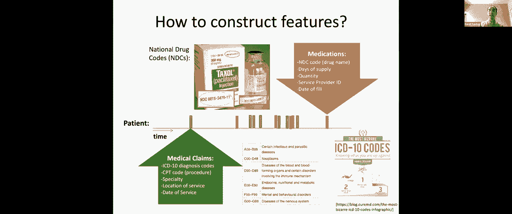

一种思路是，我们可以尝试预测哪些人一旦感染最可能出现不良后果。从机器学习的角度来看，直接预测感染后的结果很困难，因为我们没有所有感染者的数据。然而，我们确实有很好的数据记录哪些人因感染住院。因此，我们可以将问题转化为：在那些住院的患者中，预测谁会出现不良后果（如进入重症监护室或死亡）。

这个问题已被多项研究探讨过。研究发现，年龄较大、有高血压、肥胖、糖尿病等病史是风险因素。一个直接的方法是使用电子病历数据训练模型来预测这些不良后果，并基于预测采取行动。但挑战在于，电子病历数据通常孤立存在于单个机构中，而我们需要一个能在全国范围快速部署的解决方案。

因此，我建议使用全国范围内的健康保险理赔数据，特别是覆盖大多数美国老年人的联邦医疗保险数据。我们可以利用这些数据快速训练和部署一个风险分层模型。

以下是假设的研究设计：
我们提取所有在美国因新冠肺炎住院的患者数据，从中构建特征，以预测患者是否会出现不良后果。具体来说，我们设计一个二分类任务：标签为1表示患者进入重症监护室或死亡，标签为0表示患者未进入重症监护室且存活出院。

### 特征工程：从时间序列到特征向量

现在开始思考如何为每位患者构建特征向量。标签基于住院期间的结果，而特征则来自住院前的历史数据。健康保险公司拥有患者每次就医或购药的记录。

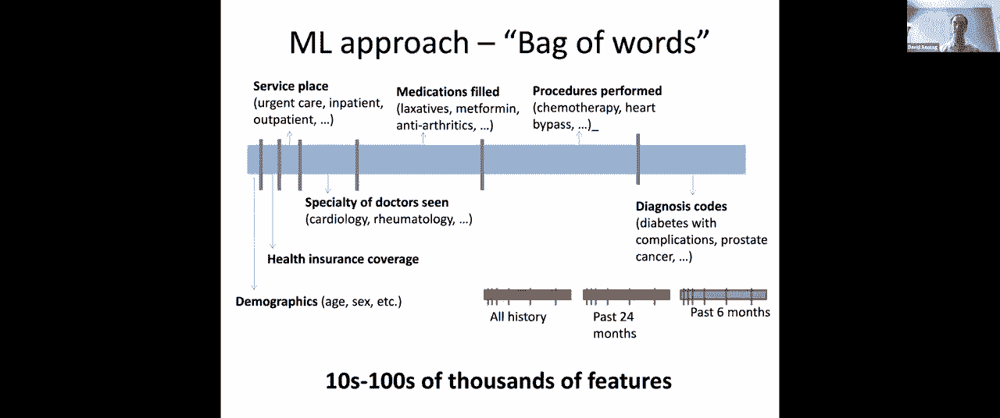

传统的特征构建方法（例如一些使用电子病历的研究）是手动设计特征。例如，根据诊断代码和用药记录，定义“患者是否有高血压”这样的二元特征。对其它各种疾病也如法炮制，最终得到一个由几十个预设特征组成的特征向量。

这种方法存在两个挑战：
1.  创建特征列表耗时耗力。
2.  难以捕捉病情的细微差别。例如，重要的可能不是是否有高血压，而是高血压是否得到控制。这一点很难从理赔数据中直接表征。

因此，我们将采取一种更偏向“黑盒”的机器学习方法。我们可以借鉴课程中处理文本分类的思路。对于文本，我们为词汇表中的每个单词创建一个二元特征（是否出现在邮件中）。对于医疗数据，我建议采用类似的“词袋”方法处理患者的纵向健康记录。

以下是构建特征向量的步骤：
1.  首先包含一些基本人口统计学特征，如年龄、性别，以及保险覆盖类型（这可以反映社会经济状况）。
2.  对于医疗服务地点、专科医生类型、药品、医疗程序和诊断代码等类别，我们分别创建二元特征。例如，对于前1000种最常见的诊断代码，每个代码对应一个特征：“该诊断代码是否曾在此患者记录中出现过？”（是或否）。
3.  为了纳入时间信息，我们将重复此过程：首先用患者过去全部的医疗历史数据创建一组特征；然后，仅用住院前特定时间段（如3个月）的数据创建另一组特征。
4.  最后，将这些特征向量拼接起来，形成一个最终的高维特征向量，用于预测住院结果。

我们最终可能得到数万甚至数十万个特征，因此需要一个能够处理高维数据并防止过拟合的机器学习方法。

### 模型构建：L1正则化逻辑回归

我们将要使用的技术是**L1正则化的逻辑回归**，这在本课程最近的实验课中已经出现过。

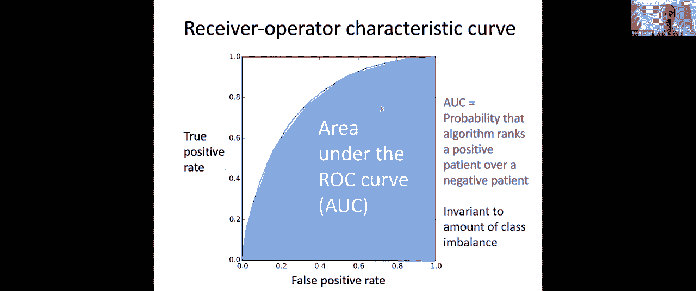

逻辑回归的目标函数是负对数似然。我们使用线性模型 `θ^T x` 作为预测器，然后通过sigmoid函数得到概率预测。为了防止在高维特征下过拟合，我们在目标函数中加入正则化项。

与常见的L2正则化（权重平方和）不同，我们使用**L1正则化**，即权重绝对值的和。L1正则化倾向于产生稀疏的权重向量（即很多权重为0），这符合我们的先验知识：只有少量特征对预测不良后果真正重要。这有助于模型避免过度拟合噪声。

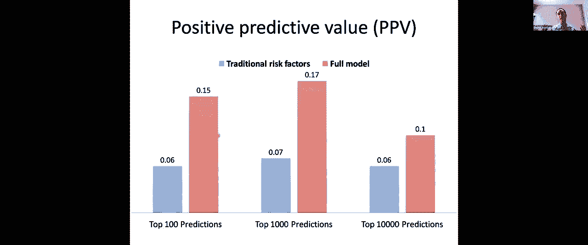

目标函数可以表示为：
`J(θ) = -∑[y_i log(σ(θ^T x_i)) + (1-y_i) log(1-σ(θ^T x_i))] + λ ||θ||_1`
其中 `||θ||_1 = ∑|θ_j|`。

我们可以使用随机梯度下降等优化算法来求解此目标函数。

### 模型评估与决策支持

学习模型后，下一步是检查模型是否合理。通过观察权重向量，我们可以发现可能无意义的特征关联。

更重要的是，我们需要理解模型性能，以支持最初的疫苗接种外联决策。我们关心的是，如果根据模型预测联系前N个高风险个体，其中实际会出现不良后果的比例有多高。这需要用到**受试者工作特征曲线** 和**阳性预测值**。

*   **ROC曲线**：绘制不同概率阈值下的真阳性率与假阳性率。曲线下面积 用于总结模型整体排序能力。
*   **阳性预测值**：在决策中更为关键。它表示在被模型预测为阳性（高风险）的个体中，真正出现不良后果的比例。当我们资源有限，只能联系固定数量的个体时，PPV直接反映了干预的效率。

向决策者展示模型时，我们可以说明：如果增加预算，联系更多由模型识别出的高风险个体，预计可以预防多少例不良后果。

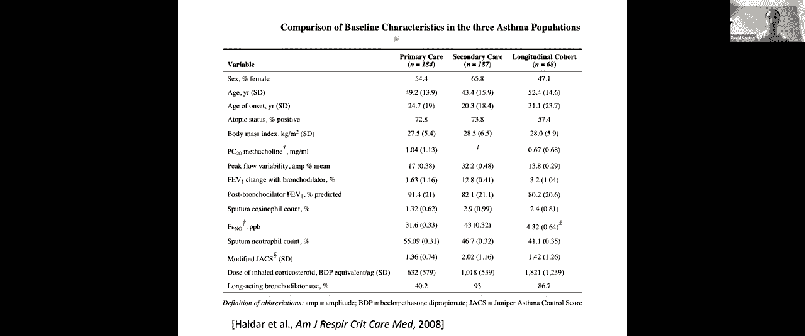

***

## 应用二：无监督学习与哮喘亚型发现 🔍

上一节我们探讨了监督学习在风险预测中的应用，本节中我们来看看无监督学习如何帮助发现疾病的新亚型。

回顾第13讲，Tamara介绍了k-means聚类算法。该算法旨在发现数据中隐藏的分组结构，而无需预先标注的标签。

我将介绍一个k-means在哮喘研究中的应用。哮喘影响约5-10%的人口，其中部分患者即使接受现有最佳治疗仍控制不佳。研究目标是更好地理解哮喘，发现新的治疗靶点。

研究人员对三组非吸烟哮喘患者的数据进行了分析，并应用k-means聚类来发现潜在的哮喘亚型。

以下是分析过程：
1.  **在初级保健队列中聚类**：对184名患者运行k-means（k=3）。特征包括性别、哮喘发病年龄、体重指数、肺功能指标、住院情况等。通过分析每个簇的中心点（均值），他们识别出三个簇：
    *   **簇1（早发/重症哮喘）**：发病年龄早，住院和严重发作次数多。
    *   **簇2（肥胖相关型哮喘）**：以女性为主，平均体重指数高。
    *   **簇3（健康型哮喘）**：患者虽有哮喘，但住院和严重发作极少。
2.  **在哮喘专科队列中验证**：在另一个187名患者的专科队列中重复聚类，得到了四个簇，其中三个与初级保健队列中发现的簇高度相似，这增加了这些亚型可信度。
3.  **指导治疗决策**：在一个小型随机对照试验数据集中，研究人员根据前两个队列定义的亚型对患者进行分类，然后分析不同治疗策略（标准治疗 vs. 基于痰液监测的个性化治疗）在各亚型中的效果。结果发现，对于“炎症主导型”亚组，个性化治疗显著优于标准治疗；而对于其他亚组则不然。这表明，聚类发现的亚型可以用于识别对特定治疗反应最佳的患者群体，从而实现精准医疗。

***

## 应用三：强化学习与脓毒症休克治疗 🧠

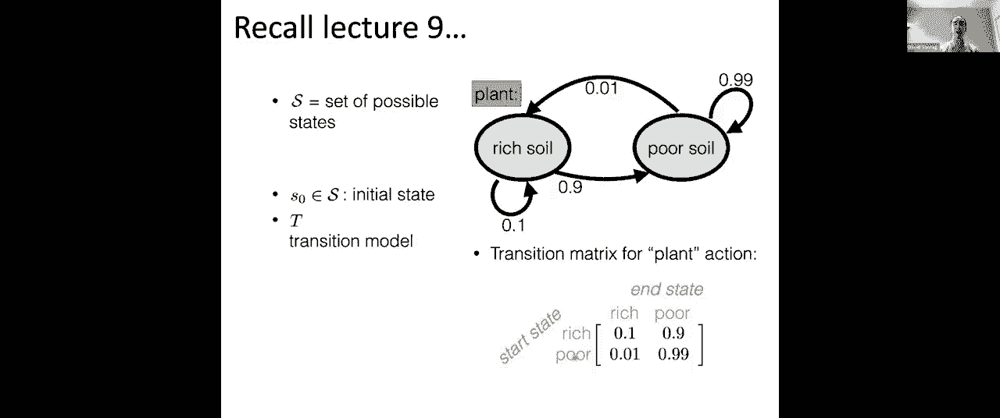

前面我们介绍了监督和无监督学习，最后我们来看看强化学习如何用于优化临床治疗策略。

回顾第9讲和第10讲，Tamara介绍了马尔可夫决策过程 和强化学习。MDP包含状态空间、行动空间、转移概率和奖励函数。

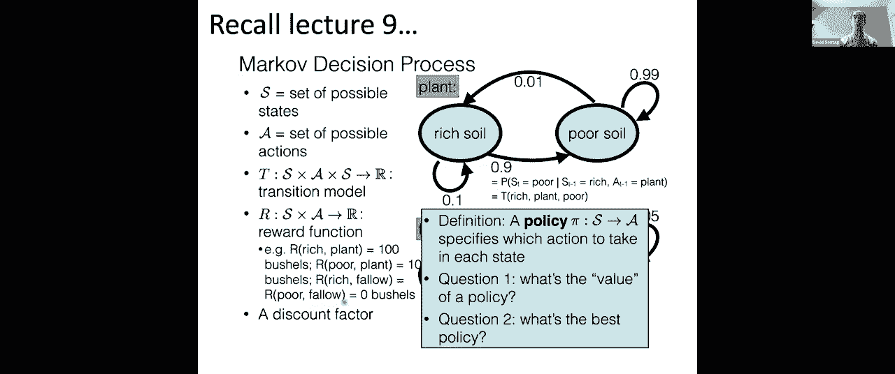

我们可以利用MDP框架为临床医生提供决策支持，例如管理危重疾病——脓毒症休克。脓毒症休克是感染引起的全身性炎症反应，死亡率高。治疗涉及一系列复杂决策，如使用抗生素、呼吸机、血管升压药等。

目标是学习一个最优策略 `π(s)`，它根据患者当前状态推荐一个治疗行动，以最大化长期累积奖励（即患者生存率）。

一项已发表的研究按以下方式构建了这个MDP：
*   **状态**：将患者随时间变化的高维特征向量（生命体征、用药等）通过k-means聚类离散化为有限个状态。
*   **行动**：定义一系列治疗行动，如是否使用呼吸机、给予何种剂量的液体等。
*   **奖励**：奖励函数的设计至关重要。可以设置最终奖励（出院为正向奖励，死亡为强负向奖励），也可以加入基于生理指标的中间奖励（如血压过低给予负奖励）。

在医疗环境中，我们不能像在游戏中那样进行“探索-利用”策略，因为随机尝试不同治疗存在伦理风险。因此，我们通常使用**离线强化学习**。即利用回顾性数据（过去患者的`(s, a, s’, r)`序列）来学习策略，例如拟合转移模型后运行值迭代，或使用Q-learning直接更新Q值。

然而，将强化学习成功应用于医疗仍面临巨大挑战，例如状态表示是否完备、奖励函数设计是否合理，以及缺乏可以安全测试策略的模拟器。

***

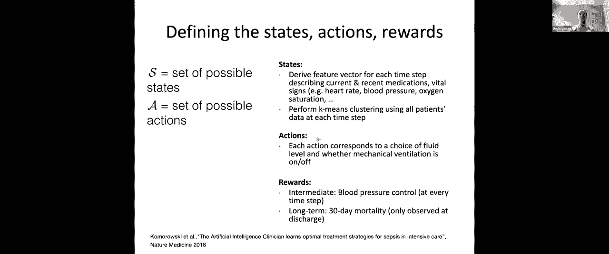

## 总结与后续学习建议 🎓

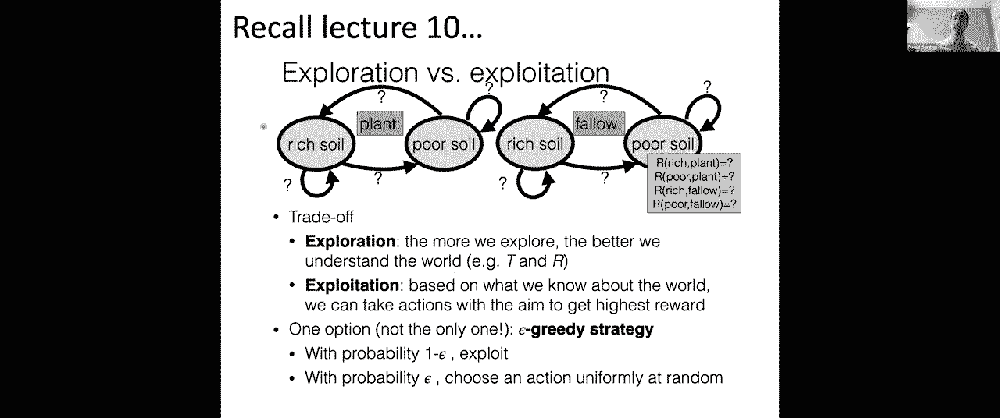

本节课中，我们一起探索了机器学习在医疗健康领域的三种典型应用：使用L1正则化逻辑回归进行新冠肺炎风险分层，利用k-means聚类发现哮喘亚型，以及通过离线强化学习优化脓毒症休克治疗策略。

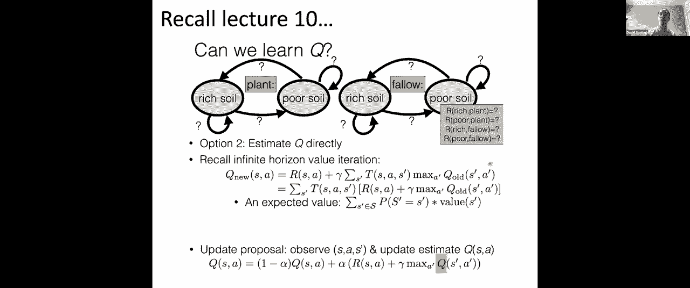

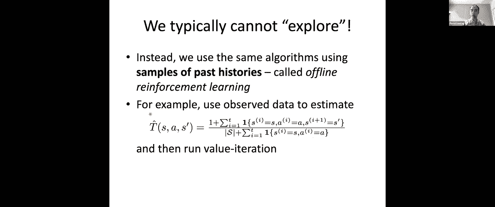

恭喜你完成了6.036课程的学习！通过13次课程，你们已经掌握了从监督学习到无监督学习的基础。这只是机器学习广阔天地的冰山一角。希望你们获得的技能能够帮助你们在行业工作、实习或深造中继续探索。

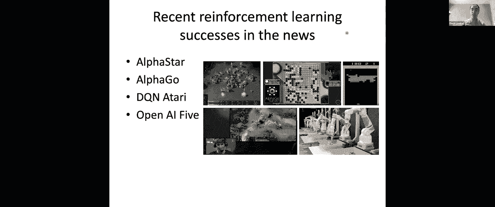

如果你想继续深入学习，可以考虑麻省理工学院后续的相关课程，例如更深入的数据科学课程、专注于机器学习算法的研究生课程，或者像我教授的6.871（健康信息学）这类应用课程。

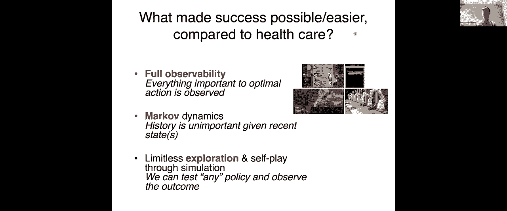

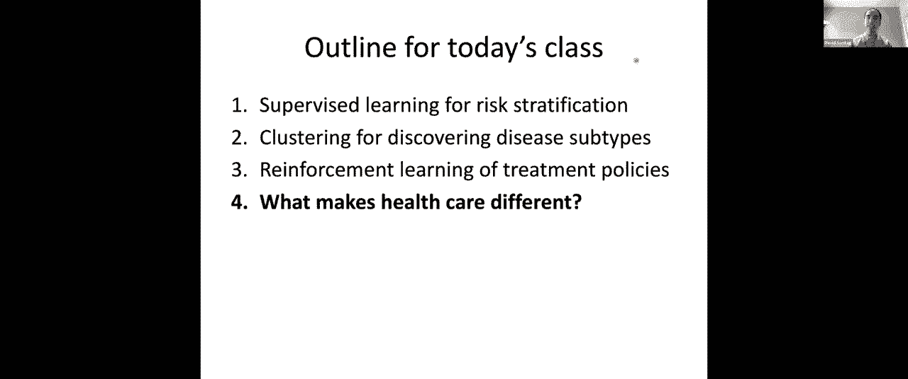

祝大家寒假愉快！

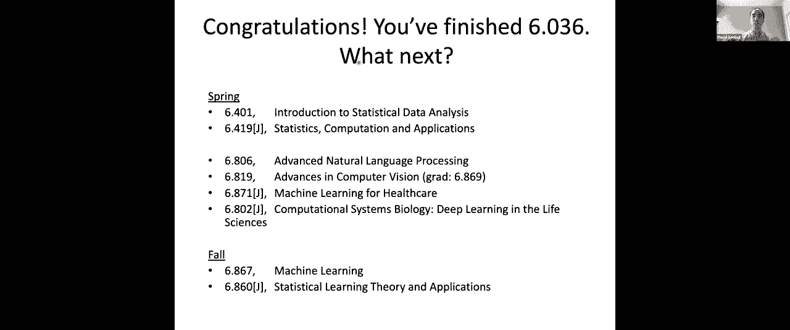

***