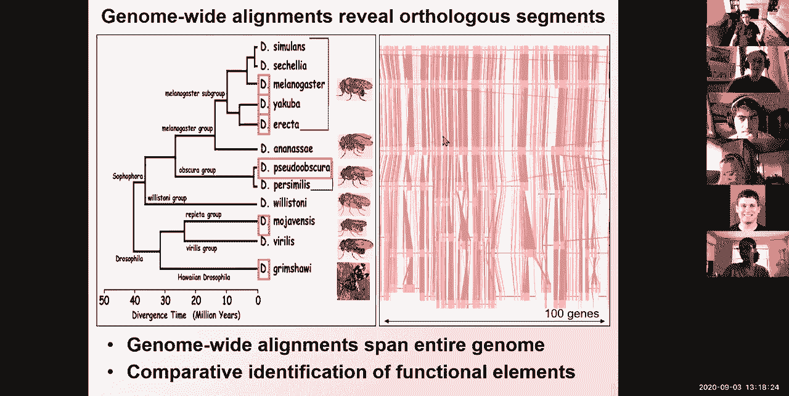
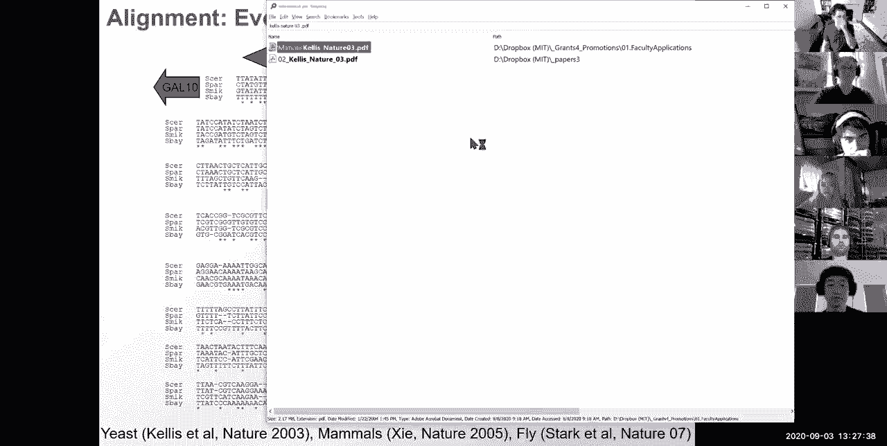
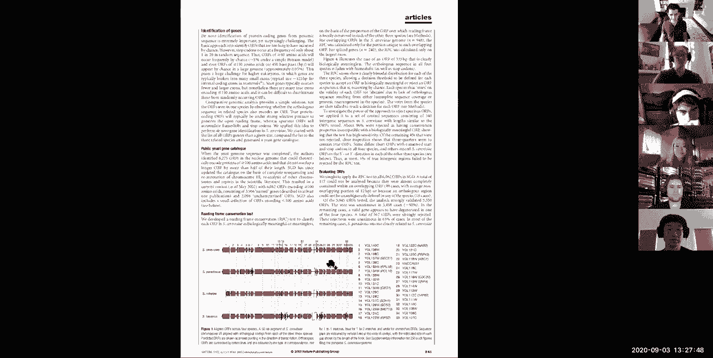
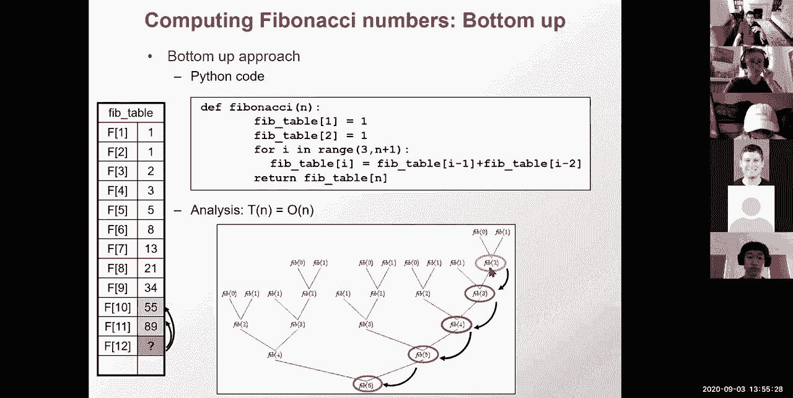
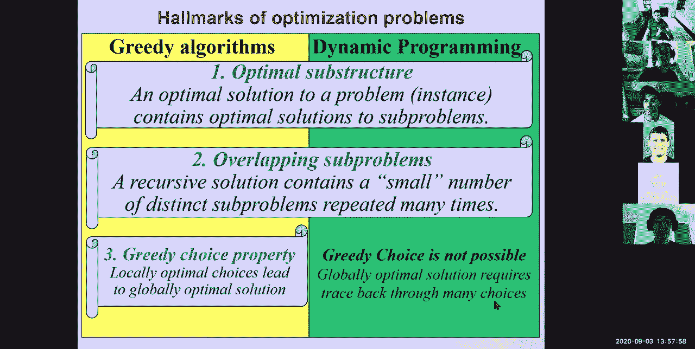
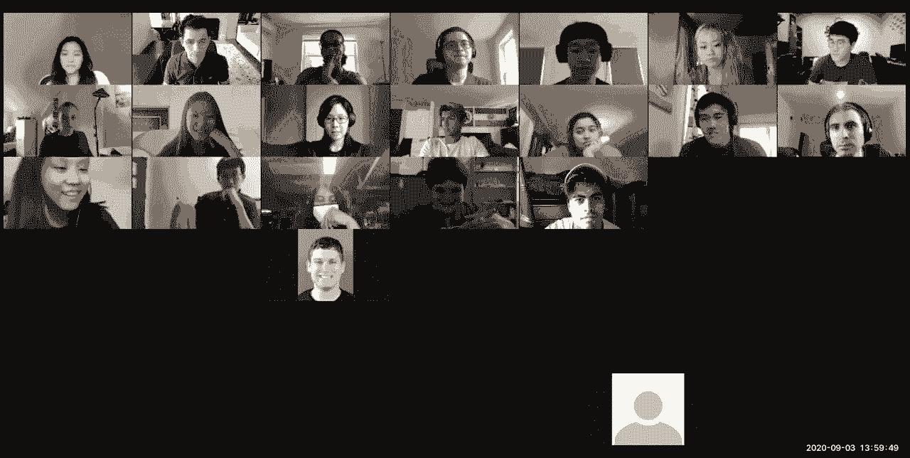
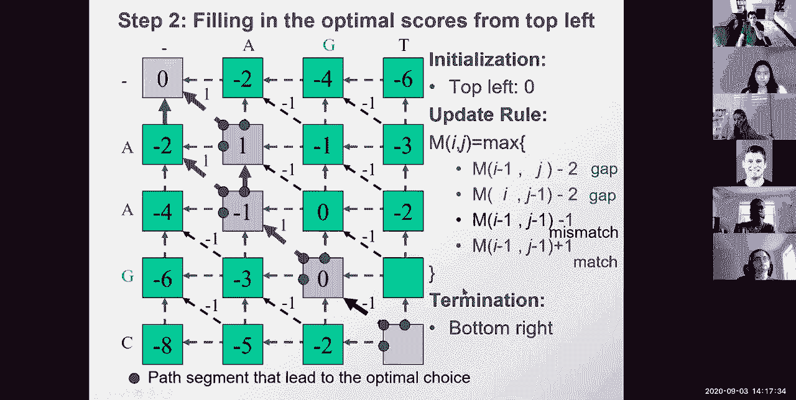
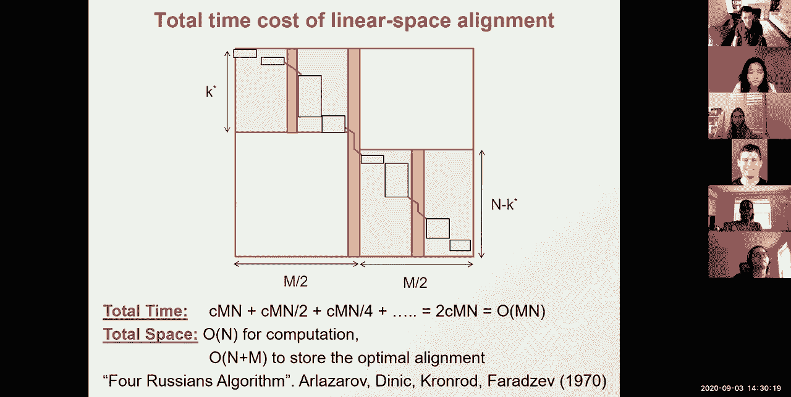
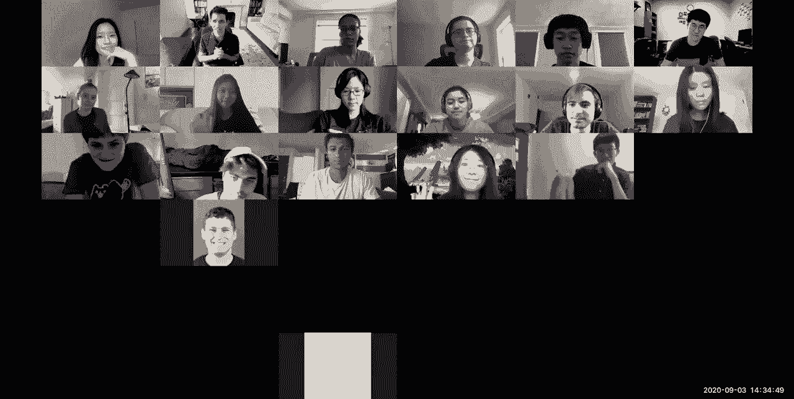

# 2：L2- 动态规划 - ShowMeAI - BV1RM4y1g76r

在本节课中，我们将要学习序列比对和动态规划。这是课程第一个模块的开始。这个模块将全部关于动态规划，以及代理推断和如何使用隐马尔可夫模型和快速字符串搜索。模块一关注基因组。这些模块的计算基础将是动态规划。具体来说，我们将探讨如何探索指数级空间，但只使用多项式时间，这听起来有些神奇。我们希望你能真正欣赏它的精妙之处。我们将强调这些空间有多大、多复杂。下周我们将介绍隐马尔可夫模型，这是计算机科学的核心工具。我们将研究隐马尔可夫模型算法，如编码、评估、解析和评分。我们还将研究哈希，这在计算机科学中同样无处不在，用于实现基于内容的索引。本周我们将专注于序列比对和比较基因组学。我们将研究局部比对、全局比对，以及如何推断核苷酸水平的进化事件。下节课我们将研究数据库搜索，如何扫描可能具有快速匹配的区域。现在，我们将研究它为何是一个指数级问题，以及我们如何用多项式时间解决它。然后下周我们将使其实际达到线性时间，这很惊人。接着，我们将研究如何用隐马尔可夫模型对基因组建模。这就是模块一。

首先，环顾四周，整个世界充满了运动的事物。它们要么在攻击我们并试图杀死我们，比如冠状病毒；要么是食物，比如栖息在你体内的大约30万亿个细菌细胞；要么是你的一部分，比如另外30万亿个真正的人类细胞，它们与你的细菌一起携带。就像我们用来酿酒（如果你放太久）的酵母；就像第一个拥有脊髓和中央处理单元的有机体，如果蝇；以及比新冠病毒致命得多的蚊子，例如疟疾每年导致数百万人死亡；就像第一个脊椎动物基因组，以及我们所有的脊椎动物亲属，包括我们可爱的毛茸茸的朋友，它们有助于生物医学研究；还有我们的表亲，它们实际上有很多与我们相似的特征，只是它们的额头在眉毛处停止，而我们的额头则继续向上，拥有这个巨大的大脑。所有的生命，你从窗外、海底（如果你去潜水和浮潜）和空中看到的这种令人难以置信的多样性，都从一个共同祖先进化而来。这些共同祖先产生了许多许多谱系，其中一些如你所知已经灭绝。在尤卡坦半岛奇琴伊察以北的希克苏鲁伯曾有一次巨大的小行星撞击，基本上消灭了绝大多数恐龙，除了一些进化成鳄鱼，一些进化成鸟类。灭绝是生命的一部分，很遗憾。这使我们能够开始研究所有这些不同物种之间的进化关系。我们可以做的是，实际上获取密切相关的物种的基因组。这里有一系列不同的果蝇物种。我的叔叔迈克尔·坎比塞利斯实际上是夏威夷的研究人员之一，他研究这些果蝇物种，它们非常有趣和复杂。但每个人都说，为什么人类的基因组比苍蝇的优越那么多？事实证明，我们不能飞，我们没有一百只眼睛，我们不能以毫秒级的速度移动。所以苍蝇有很多优势。但它们的基因组与人类非常相似，基因数量也非常可比。如果你观察越来越多密切相关物种的基因组，你会发现这些物种的基因大致顺序相同，方向也大致相同。在这里，你可以看到基因编码在沃森链上，指向这个方向，显示为黄色；基因编码在克里克链上，指向另一个方向，显示为某种粉紫色。然后你可以看到，它们的顺序大致保留，基于这些显示不同物种基因组坐标匹配的线条。这类比对一次跨越数百个基因，这些基因基本上是共线的。所以你意识到，所有这些物种基本上都是彼此的不同版本。就像一个是运行Windows 98，另一个是运行Windows 2000。它们都只是略有不同，但或多或少保留了相同的功能。这非常重要，因为我们可以使用比较基因组学来识别功能元件。我们基本上可以比较Windows 98和Windows 2000，寻找被保留的指令，这些指令更可能是功能性的。而许多随机的非编码位点是非功能性的。

为了更具体，如果你观察人类基因组，绝大多数人类基因组不编码蛋白质。只有1.5%的人类基因组实际编码构成人类约20，000个基因的氨基酸，并最终构成人类基因组的所有蛋白质功能。这令人难以置信。另外98.5%不编码蛋白质。如果你观察密切相关的物种，如狗、小鼠、大鼠，你会发现这另外98.5%在很大程度上是不保守的。所以人类基因组的绝大部分，大约5%到15%，可以明确识别为保守的。这基本上可以帮助我们精确定位这些基因组中的功能元件。因此，我们基本上可以观察保守区域，并说也许保守区域可以帮助我们找到基因，也许它们还可以帮助我们找到其他可能具有基因调控或控制这些基因功能的东西。所以我们可以使用比较基因组学，这基本上意味着排列不同物种的基因组，以揭示功能元件。例如，蛋白质编码外显子，这些是在剪接发生时保留的用于编码外显子的部分，在小鼠、鸡、鱼等物种中深度保守。你可以看到，每次这里有一个蛋白质编码外显子（用深蓝色表示），在我们所有的脊椎动物亲属中。相比之下，还有许多其他元件也高度保守。问题是它们是外显子还是调控元件等等。当我们讲到课程的进化部分时，我们将研究这些，这实际上稍晚一些。我们将开发估计约束水平的方法。我们将计算编辑操作的数量、替换的数量和空位的数量，作为约束的度量。我们将使用概率模型估计包括回复突变在内的突变数量。我们将结合邻域信息，使用隐马尔可夫模型寻找保守窗口。我们将估计约束隐藏状态的概率。事实上，这就是我在这里展示的内容。对于那些听说过隐马尔可夫模型的人（我们将在两节课中介绍），隐马尔可夫模型基本上允许你基于观察变量估计隐藏状态。这里的观察变量是你看到的保守程度。然后隐藏状态具有是保守状态或非保守状态的后验概率。然后，对于真正保守的区域，该概率更高。这是另一种估计约束的方法。或者，你实际上可以使用将这些物种联系在树中的系统发育关系，来基本理解沿着树发生了多少次替换。我将读出数字，因为我每次投票后都会擦掉它们。所以如果你听到我说一串五个数字，基本上是跟随人数：80以上、60到80、40到60、20到40、0到20。这里的数字是：28， 10， 0， 0， 0。这很棒。然后我给你们的下一个问题是：节奏如何？很好。关于节奏，28人认为正好，5人认为太快，4人认为太慢。聊天中似乎有一个问题：如果你有完整的遗传数据，你会有什么隐藏状态？这是一个很好的问题。问题是为什么你需要一个隐藏状态来估计？答案是，你拥有的是某物是否保守的观察结果。你推断的是该区域是否受到进化约束，因为它可能只是偶然出现保守。基于你拥有的证据量，你能够权衡那个概率。这回答了你的问题吗？这是一个很好的问题。基本上，隐藏状态是它是否真正具有功能，或者是否不具有功能。但观察结果是保守的核苷酸数量。莉莉问什么是功能基因？如果你破坏它，生物体可能会有劣势。它可能不会立即死亡，那个基因可能只在每17年当有巨大的暴风雪时才有所帮助。在进化时间尺度上，前16年可能没问题，第17年所有拥有该基因缺陷版本的生物体可能会死亡。这就是进化的工作方式，它基本上在巨大的进化跨度上求和，以那种方式测量功能。曼努埃尔问，许多不编码蛋白质的基因做什么？人类基因组中大约有20，000个基因，它们编码蛋白质。我们可能知道其中大约80%的功能。另外20%信不信由你，我们实际上不知道它们做什么，这相当引人注目。除了20，000个蛋白质编码基因外，还有大约2，000个长非编码RNA。其中许多作为染色质折叠的支架，因此它们并不真正具有功能，但被转录。也许转录行为本身具有功能，也许它们具有我们尚未理解的功能。它们通常以非常低的丰度表达，因此很难找到它们的功能。除了长非编码RNA，还有无数短非编码RNA。这些可以是帮助将mRNA翻译成蛋白质的tRNA，这些可以是剪接RNA，这些可以是帮助翻译的核糖体RNA。我希望这回答了你的问题。好了，还有一个问题：谁觉得这些问题有帮助？如果你觉得问题有帮助，请给我一个5；如果你觉得一般，给4；3， 2， 1，否则。对于那些提问的人，这应该是一些积极的强化，因为17人说对问题超级兴奋，13人说好，7人在中间，只有1人在底部。所以提问很重要，请继续提问。好了，这就是为什么我们需要比较基因组学的基础。但我告诉你的一切都假设我们实际上可以比对基因组。今天，我们将学习如何实际比对基因组，如何基于这些比对来研究不同类别元件的进化特征。我们可以识别蛋白质编码基因与非编码区域、RNA结构、microRNA和调控基序以及单个基序实例的特定进化模式。这些是我们可以区分的特定类别的元件，不仅基于它们的保守水平，还基于它们的进化模式。我们将在第13或17讲左右更多地学习这些。但今天，我们将专注于如何甚至生成这些比对，如何获取一个物种的一个序列，并与另一个物种的序列对齐。这实际上非常贴近我的心，因为这是我博士论文中的一张幻灯片。所以如果你搜索“kellis nature03。pdf”，你会找到它。是的，很久以前，在一个遥远的星系，我也曾是一名学生。这是我的第一篇论文。我的名字是凯利斯。

如果你看这篇论文的图六，我现在很自豪能在讲座中教授它，这很酷。总之，这是酵母酿酒酵母（我是希腊人，所以我会给你很多词源：糖，然后是霉菌，即真菌，所以糖真菌，然后酿酒酵母与啤酒相同，所以制造啤酒的糖真菌，也称为面包酵母，更政治正确）与奇异酵母、尼克松酵母和比安努斯酵母的比对。我们在这里展示的是一个多序列比对，它跨越多行。然后星号表示比对中该核苷酸完全保守的所有位置。真正令人兴奋的是，如果你看TATA基序，它是完全保守的。基因GAL10，如果你看GAL4基序，它是完全保守的。所以3， 11， 3，这是双螺旋的一圈。如果你看MIG-1基序，它相当保守。然后有第二个BIG1基序，不是特别保守。然后有第二个保守岛，它不匹配。为什么这令人兴奋？因为它意味着我们实际上可以通过观察比对来解读进化。这基本上也意味着我们可以使用这些比对来解码功能元件。我们基本上可以说，保守岛在哪里？那里一定有什么重要的东西，因为所有其他区域都不保守，但那些岛是保守的，所以这可能意味着它们很重要。因此，我们可以解读进化以揭示功能元件。我们今天的目标是使这成为可能，实际比对两个基因。我们将通过首先形式化问题来实现这一点。我在这部分讲得慢一点，因为这是你们所有人将在项目中做的练习，所以在实践中看到它非常重要。因此，我们将提出一个生物学问题，将其转化为计算术语，以不同的方式，我们将研究不同的形式化。然后我们将看到所有这些形式化实际上相当困难，实际上存在指数级数量的可能比对。然后我们将介绍我们将用于解决这些指数级数量问题的计算技术，然后将该计算技术直接应用于序列比对。首先，我们将介绍一个问题，然后我们将介绍该技术，然后我们将两者结合起来。最后，我们将研究一些关于该锚点变体的很酷的高级主题。到目前为止，我们已经看到了比较基因组学和分子进化，以及为什么存在进化及其如何运作的简要介绍，以及序列比对。现在我们将研究如何将这个生物学问题转化为计算机科学术语。首先，基因组随时间变化，存在突变、缺失和插入。这些发生是因为当DNA聚合酶愉快地沿着DNA行走并将DNA复制成DNA时，它基本上打开双螺旋，然后在这里制作第二个副本，在这里制作第二个副本。这是DNA的半保守复制，你在一侧有旧链和新链，在另一侧有旧链和新链。每次，偶尔会出错，它基本上有时插入错误的核苷酸，有时插入一个空位等等。这些事情就这样发生了。听起来像是错误，但突变也是进化的动力。我总是喜欢说，如果我们没有突变，如果工程师设计了进化和复制机制，那么我们就会是完美复制的细菌，我们基本上永远不会发生突变。突变既有害，但也是进化的动力。它们也允许多样性，然后选择保留或拒绝。这些是进化的基本操作。问题是，如果你只有起始序列（即酿酒酵母）和结束序列（即奇异酵母），那么你如何将一个转化为另一个？你如何推断导致从一个到另一个的一系列突变、缺失和插入操作？这就是形式化问题的部分。实际上有一个问题：这是否意味着基因长度在短时间内不保守？不，基因长度不是问题，只要它保持功能，你就不需要担心基因长度。我们要做的第一件事是定义一组进化操作：插入、缺失和突变。使这些操作对称允许时间可逆性，这是我们设计选择的一部分。原因是我们并不真正比较酿酒酵母和奇异酵母，我们并不真正比较人类和老鼠，因为人类是从老鼠进化而来的吗？不，不，我们都从一个共同祖先进化而来。基本上，时间可逆性的原因是，当我们将人类与小鼠比对时，我们希望能够讨论方向性的操作，无论它们是朝一个方向还是另一个方向移动，这都不应该重要。这就是为什么我们有这种时间可逆性。有一些例外，比如甲基化的CpG二核苷酸，绝对是非甲基化的，失去甲基化的胞嘧啶变成胸腺嘧啶，但你不必担心那个。接下来我们需要问的是，我们的最优性标准是什么？我们怎么知道我们做得好？这是一个好的解决方案吗？也许我们想要的是最少数量的操作，即有多少插入、缺失和突变。或者，我们可能想要最小成本，这些操作实际上可能有不同的成本。根据成本，我们可能更喜欢三个廉价操作，而不是两个非常昂贵的操作。第三，可能实际上不可能推断出确切的操作序列，因为当人类转化为小鼠，反之亦然，在这个时间可逆模型中，你基本上可能走一条非常迂回的路径，你将A变成T，然后变回C，然后变回A。看起来从未改变，但实际上我们进行了几次不可见的操作。但我们将选择一条最小路径，一个最小成本转换。这就是奥卡姆剃刀原理。奥卡姆剃刀基本上说，在多个同样好地解释数据的假设中，我将用我的剃刀选择最尖锐的假设，最小的模型。所以从所有我可以拥有的、同样好地解释数据的超级复杂模型中，我将选择这些模型中最小的一个。一旦我们有了最优性标准，我们还必须设计一个实现该最优性或近似该最优性的算法。该解决方案的可处理性将取决于我们在形式化中所做的具体假设。例如，我们可能做出一些捕捉生物学每一个方面的决策，例如CpG二核苷酸不可逆性，或者这种随时间来回的奇怪情况等等。这可能使其与生物学更相关、更正确，可能处理更多特殊情况，但会使我们远离可处理性。所以基本上存在权衡。我们可以做出一些简化假设，使计算更容易，或者处理一些使这更困难的特殊情况。在你们的所有最终项目中，当你们设计这个时，都会有权衡。当然，并非所有决策都是冲突的。一些决策可能既与生物学更相关，又更易处理。有一个著名的例子，佩夫兹纳与桑科夫关于染色体倒位方向性的争论。事实证明，将方向性作为标准并使其更具生物学意义，也使其更易处理，并将其从NP中移除。现在，让我们沿着这个形式化连续体看看，我们可以为进化问题推断使用哪些不同的形式化。我们将看的第一个形式化是最长公共子串。给定两个可能相关的字符串（没有空位的字符串），子串是一组连续的字符。那么你在这里看到的最长公共子串的长度是多少？我看到长度为3，例如TCA匹配DCA相当好，然后有一个长度为4的，即G T C A。所以如果我只偏移一个位置，我得到TCA，但如果我再偏移一个位置，我实际上在这里得到GTCA。这很酷，对吧？我们基本上能够搜索两个序列，将它们彼此扫描，这是你们在脑海中解决的计算挑战，能够找到这三个，然后找到这四个。你使用的那个算法的运行时间是多少？在每个偏移处，你可能比较了一定数量的字符，然后这是一个n平方操作，因为你必须比较序列的每个部分。但你们中的许多人可能更聪明地解决了它，通过对齐单个字符，然后从该对齐扩展，这就是我们将在周二研究的BLAST算法的基础。总之，这是寻找最长公共子串的基本算法的基础。但这不处理空位，插入和删除无法用此建模。所以我们需要稍微增加复杂性。下一个形式化将是最长公共子序列。子序列是最长的不一定连续的字符集。注意，在这里我可以捕获我之前有的TCA，如果我在这里只插入一个空位，我有G和T，如果我在这里插入另一个空位，我也有A。所以现在我可以捕获更多具有共同祖先的字符，因为我容忍插入和删除事件。这在序列二中推断一个空位，一个T的插入，在序列一中推断C和A的删除，然后C到G的突变。如果你注意到，这正是我们之前的例子。所以我们基本上创建了这些之间的最长公共子序列，并发现了一个插入、两个删除和一个突变。这就是我们想要做的。我们想通过一个可以做到这一点的很酷的算法来解决我们提出的原始问题。同样，每个这样的比对立即推断、暗示和关联一系列事件：两个删除、一个插入和一个突变。所以最长公共子序列实际上与编辑距离相同，其中使用统一评分函数在s1和s2之间所需的更改次数，实际上就是最长公共子序列所解决的。但我们可以更进一步。我们可以开始建模空位可能有固定惩罚，例如每个插入和删除对每个字符有唯一成本。或者你可能实际上对不同的空位有不同的惩罚。你可能还对不同类型的操作有不同的惩罚。例如，A和G之间的转换（两者都是相当大的碱基）比A与较小碱基（T或C）之间的转换发生得容易得多，仅仅因为它们在DNA聚合酶内的化学计量学。这些类型的错误，大碱基被大碱基替换更容易，小碱基被小碱基替换更容易，而不是大碱基被小碱基替换，后者更罕见。所以我们可能实际上想要编码一个评分矩阵，而不是对每个突变惩罚完全相同的量。我们可能想要包括一个评分矩阵，基本上对E和G之间的错配只惩罚一半，然后对T和C之间的错配惩罚全额，然后对匹配奖励加一。很好。所以31， 5， 0， 0， 0相当不错。这些是越来越复杂的形式化，因为聚合酶更常将A与G、G与T混淆。所以让我们编码那个。然后另一个形式化可能是改变空位成本。基本上，线性空位成本可能与以前相同。现在，仿射空位成本可能对开始或结束一个空位有很大的初始成本，并对每个额外字符有小的增量成本。因为聚合酶有时会滑动，它可能滑过多个字符，多个核苷酸。或者一般空位惩罚基本上可以允许任何类型的成本，但那不再能用相同的模型计算。你还可以构建一个阅读框感知的空位惩罚，其中三的倍数破坏编码区域，保留编码区域的没问题，但破坏编码区域的非三的倍数（