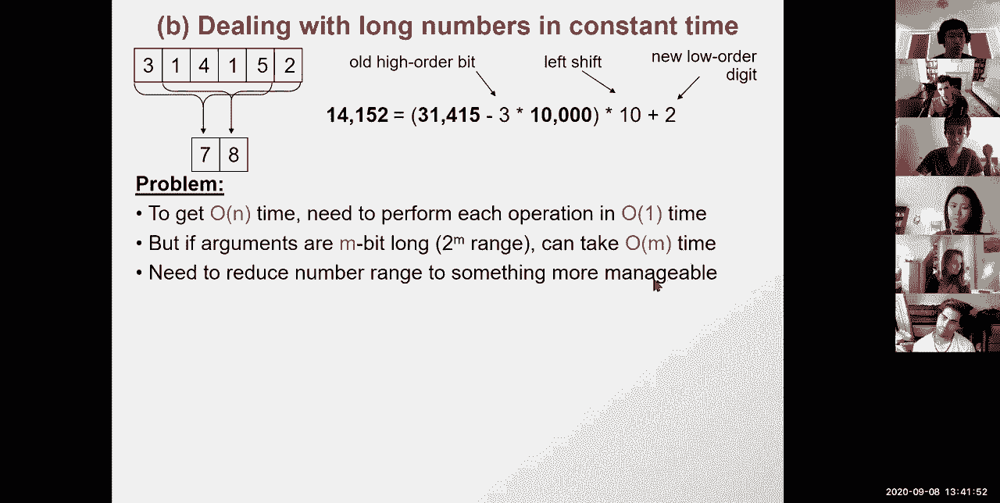
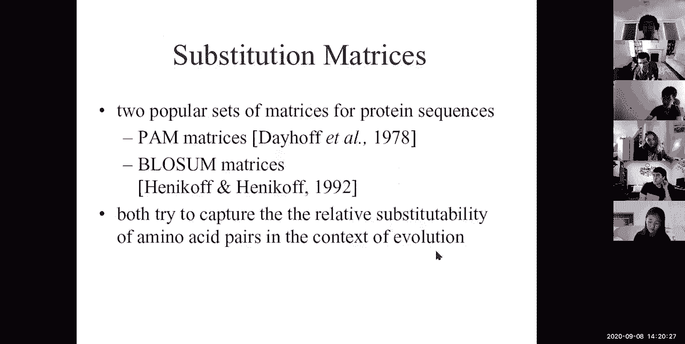
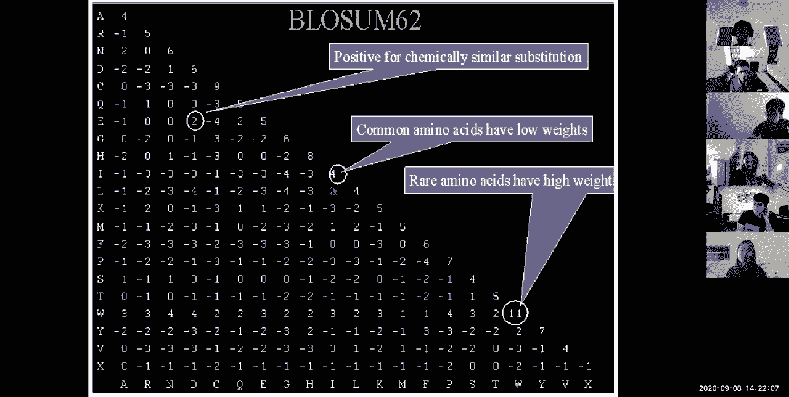
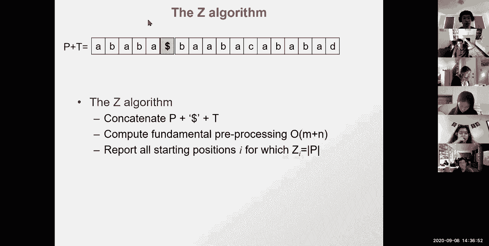

# 3：L3 - 局部对齐、哈希与BLAST对齐分数 🧬

在本节课中，我们将深入学习序列比对和数据库搜索。我们将探讨全局比对与局部比对的区别，学习如何通过哈希技术加速字符串匹配，并深入了解BLAST算法的核心思想。最后，我们将探讨比对分数背后的概率学基础，理解这些分数如何反映序列间的进化关系。

---

## 🔄 全局比对与局部比对

上一节我们介绍了使用动态规划进行全局序列比对的方法。本节中，我们来看看如何将其调整为局部比对。

局部比对的目标是寻找两个序列中相似度最高的子串进行比对，而不是强制比对整个序列。这在生物学上很有意义，例如寻找基因中的保守结构域或在长染色体中定位短基因。

以下是全局比对（Needleman-Wunsch算法）与局部比对（Smith-Waterman算法）的核心区别：

*   **初始化**：全局比对从矩阵左上角（0,0）开始。局部比对可以从矩阵任何位置开始。
*   **递推规则**：全局比对的递推公式为 `M[i,j] = max(M[i-1,j-1] + s(i,j), M[i-1,j] + gap, M[i,j-1] + gap)`。局部比对在此基础上增加了一个选项：`M[i,j] = max(0, M[i-1,j-1] + s(i,j), M[i-1,j] + gap, M[i,j-1] + gap)`。这个“0”选项允许比对在任何位置重新开始。
*   **终止**：全局比对在矩阵右下角结束。局部比对可以在矩阵中任何得分最高的位置结束。

通过以上调整，算法就能找出两个序列内部最相似的片段，而不是强迫进行端到端的比对。

---

## ⚡ 半数值字符串匹配与哈希

我们了解了如何高效地进行比对，但当需要在超长文本（如染色体）中快速搜索一个短模式（如基因）时，直接使用动态规划（O(nm)复杂度）仍然太慢。本节中我们来看看如何利用哈希技术实现接近线性的搜索速度。

核心思想是将字符串视为数字，从而将字符间的比较转化为数字间的比较。Karp-Rabin算法正是基于这一思想。

以下是该算法的基本步骤和关键优化：

1.  **将模式串转换为数字**：例如，模式串“31415”可以解释为数字31415。
2.  **滑动窗口计算**：在文本串上滑动一个与模式等长的窗口，计算每个窗口对应的数字。
3.  **快速更新**：通过数学推导，可以从上一个窗口的数字`Y(i-1)`快速计算出当前窗口的数字`Y(i)`，公式为：`Y(i) = 10 * (Y(i-1) - 10^(m-1) * digit_out) + digit_in`。这避免了每次重新计算整个数字，使窗口更新成为常数时间操作。
4.  **哈希处理**：直接处理长数字（如1000位）在计算机中效率很低。我们通过取模运算（哈希）将大数字映射到一个小范围内，例如 `H(x) = x mod 13`。这样，我们只需要在小整数上进行运算。
5.  **处理碰撞**：哈希可能导致不同的原始字符串映射到相同的哈希值（碰撞）。因此，当哈希值匹配时，我们必须回退到原始字符串进行逐字符验证，以确保是真正的匹配，而非伪命中。

通过哈希，我们将每次比较的复杂度从O(m)降到了O(1)（期望情况），使得整个搜索过程的期望时间复杂度接近O(n+m)。

---

## 🚀 BLAST算法：快速数据库搜索

基于哈希的思想，我们可以构建更强大的工具来搜索生物序列数据库。本节中我们来看看生物信息学中最著名的工具之一——BLAST算法。

BLAST用于解决数据库搜索问题：给定一个查询序列，快速在庞大的序列数据库中找出与之相关的序列。其核心策略是“先筛选，后验证”。

以下是BLAST算法的工作流程：

1.  **分词**：将查询序列切分成一系列重叠的短单词（例如，长度为3个氨基酸的单词）。
2.  **构建邻域**：对于每个单词，根据替换矩阵（如BLOSUM62）找出所有得分超过一定阈值的相似单词，构成一个“邻域”。这允许在匹配时容忍一定程度的错配。
3.  **哈希与搜索**：预先为数据库中的所有序列建立哈希表，记录每个短单词出现的位置。然后，用查询序列所有单词的“邻域”去扫描这个哈希表，寻找命中点。
4.  **延伸与评估**：对找到的命中点向两侧延伸，进行更细致的局部比对，并计算一个最终得分。只报告那些得分超过显著性阈值的匹配。

BLAST之所以快速，是因为它利用哈希实现了对数据库的常数时间查找，并且通过邻域搜索和双命中策略等技巧，在保持高灵敏度的同时最大限度地减少了不必要的详细比对计算。

---

## 📊 比对分数的概率学基础

我们一直在使用匹配、错配和空位罚分，但这些分数是如何制定的？它们代表什么？本节中我们将揭示比对分数背后的概率学解释。

比对分数本质上衡量的是“观察到的比对是由于进化相关（同源）而非随机巧合”的可能性。我们可以用**对数似然比**来形式化这一概念。

给定两个序列X和Y的一个比对，我们比较两个假设：
*   **假设R（相关）**：序列源于共同祖先。
*   **假设U（不相关）**：序列是独立随机产生的。

比对的概率在假设R下是 `P(X,Y | R) = Π_i P(x_i, y_i)`，即每个位置氨基酸对联合出现的概率的乘积。
在假设U下是 `P(X,Y | U) = Π_i P(x_i) P(y_i)`，即每个位置氨基酸独立出现概率的乘积。

**对数似然比**为：
`S = log( P(X,Y | R) / P(X,Y | U) ) = Σ_i log( P(x_i, y_i) / (P(x_i)P(y_i)) )`

这个公式的妙处在于：**我们常用的加和式比对得分，恰好就是这个对数似然比的和**。因此，替换矩阵（如BLOSUM62）中的分数 `s(a, b)`，实际上就是 `log( P(a,b) / (P(a)P(b)) )`，即观察到氨基酸a和b配对相对于随机期望的对数几率。

所以，当我们用动态规划计算出一个最优比对的总分时，这个总分直接对应了这个比对由进化关系产生的（对数）可能性相对于随机产生的可能性有多大。这使得我们可以为比对结果计算统计显著性（p值）。

---

## ✨ 总结

本节课中我们一起深入学习了序列比对和数据库搜索的多个核心主题。

我们首先比较了**全局比对和局部比对**的算法差异，理解了如何修改动态规划规则来寻找序列内部最相似的区域。接着，我们探索了**半数值字符串匹配和哈希技术**，看到了如何将字符串比较转化为数字运算，并利用哈希实现快速的近似搜索。在此基础上，我们剖析了**BLAST算法**，了解了它如何通过分词、邻域搜索和哈希表等技术，在庞大的生物序列数据库中实现高速且灵敏的搜索。最后，我们探讨了**比对分数的概率学基础**，明白了常用的替换矩阵分数实际上源于对数似然比，这使得我们的比对得分具有明确的统计意义。

这些概念将算法效率、生物学意义和统计推断紧密结合，是生物信息学分析的基础。