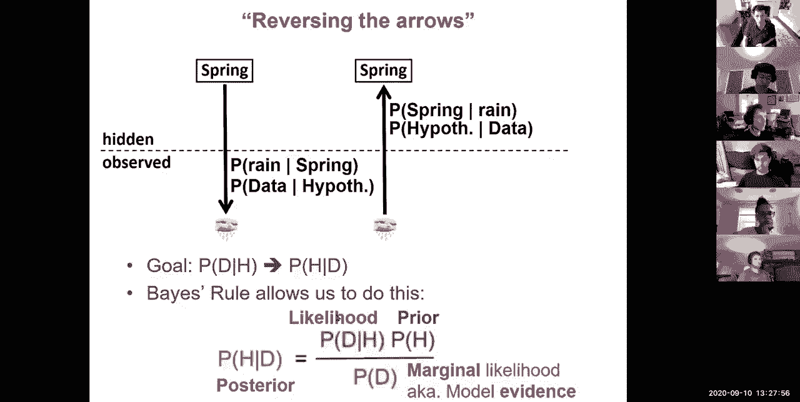
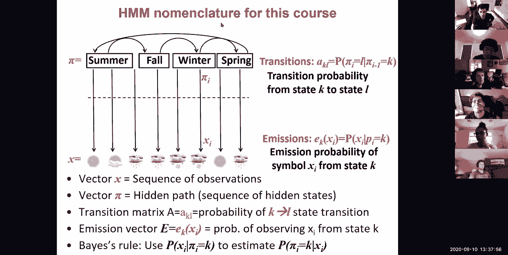
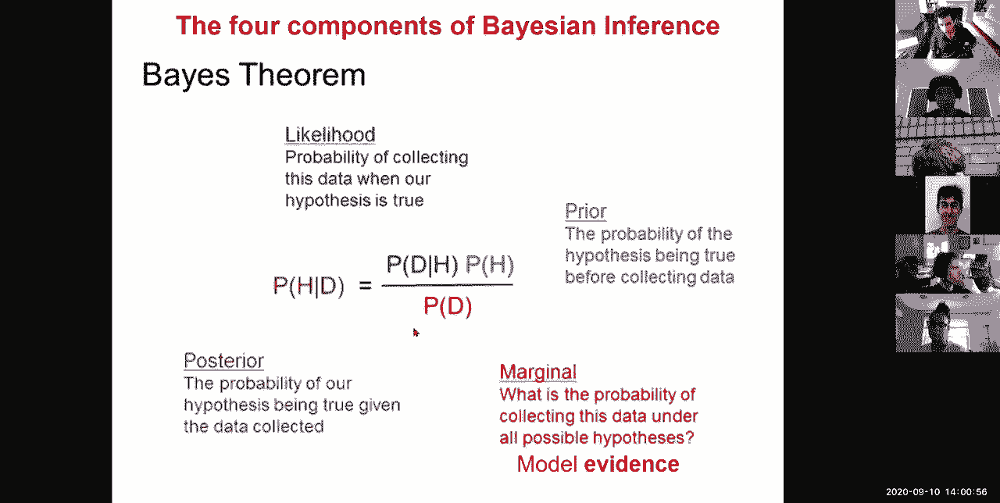
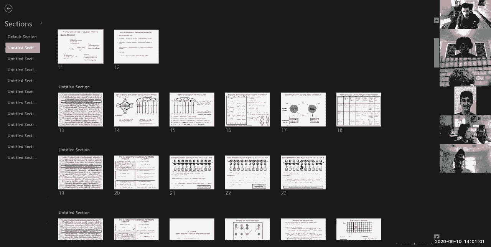
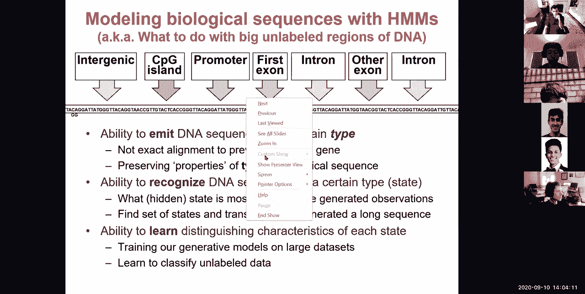
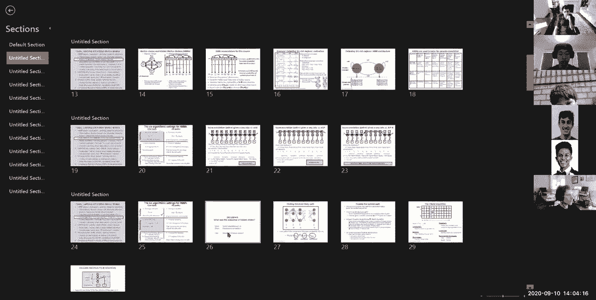
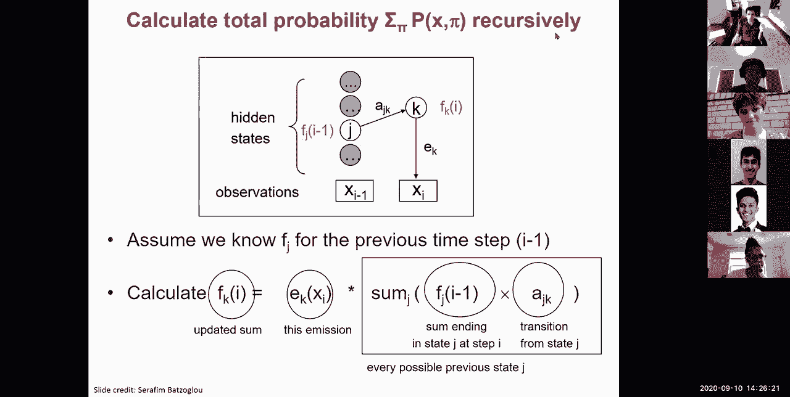
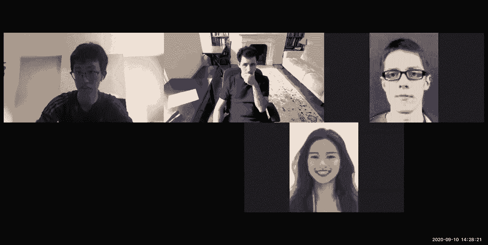

# 4：L4 - 隐马尔可夫模型 (HMM) 第1部分 📚

在本节课中，我们将学习隐马尔可夫模型及其在生物序列分析中的应用。我们将首先介绍贝叶斯推断和贝叶斯规则的基本概念，然后将这些概念与马尔可夫链的时间动态特性相结合。接着，我们会从一个简单的背景序列与CpG富集启动子序列的例子开始，逐步探索隐马尔可夫模型。我们将学习一系列用于处理隐马尔可夫模型的算法，包括如何对序列进行评分、如何推断最佳路径、如何对所有路径进行评分。之后，我们会通过增加状态空间来扩展模型，并转向后验解码和学习。本节课是两部分中的第一部分，旨在为初学者提供清晰、易懂的讲解。

---

## 🧠 贝叶斯推断简介

上一节我们介绍了课程的整体目标。本节中，我们来看看如何对世界进行推断。

生成模型允许你表达在给定世界隐藏状态下，事件发生的正向概率。我们通过感官收集观察结果，但永远无法直接了解世界的真实状态。例如，你坐在房间里，只能看到走廊外的景象，但看不到天空。你观察到有阳光、下雨或下雪，并试图推断出是什么季节。你是在根据一组观察结果，推断世界的真实状态。

贝叶斯推断允许我们逆转这个箭头。生成模型提供了在给定季节（假设）下观察到某种天气（数据）的概率。贝叶斯推断则允许我们计算在观察到特定数据（如下雨）后，某个假设（如存在大型风暴系统）为真的概率。

为了做到这一点，我们将计算假设在给定数据下的后验概率。这依赖于似然（数据在给定假设下的概率）、先验（假设在收集数据前的概率）以及数据在所有可能假设下的总概率（即数据的边际似然）。

以下是贝叶斯规则的公式：

`P(H|D) = [P(D|H) * P(H)] / P(D)`

其中：
*   `P(H|D)` 是后验概率（观察到数据D后，假设H为真的概率）。
*   `P(D|H)` 是似然（假设H为真时，观察到数据D的概率）。
*   `P(H)` 是先验概率（在观察数据前，假设H为真的概率）。
*   `P(D)` 是证据或边际似然（在所有可能假设下，观察到数据D的总概率）。

我们关心概率序列建模，因为生物数据是嘈杂的，概率为操作这些模型提供了一套演算方法。它不局限于“是”或“否”的答案，可以提供信念的程度。许多常见的计算工具都基于这些概率模型，而今天我们将重点讨论马尔可夫链和隐马尔可夫模型。

---

## ⛓️ 从马尔可夫链到隐马尔可夫模型

上一节我们介绍了贝叶斯推断。本节中，我们来看看如何将时间动态引入模型。

隐马尔可夫模型与简单贝叶斯推断的关键区别在于，我们处理的不是孤立的观察，而是一系列观察。例如，如果每天早上我通过长走廊的窗户观察，我可以利用从一天到另一天的信息来改进我对当前季节的后验概率判断。

隐马尔可夫模型允许你将贝叶斯推断的概念（世界的隐藏状态 vs. 观察状态）与状态间的依赖关系和转移耦合起来。这些状态间的转移由一个马尔可夫链控制。

*   **马尔可夫链** 是一个概率模型，它根据状态间的转移概率在不同状态间移动（例如，从夏季到秋季，从秋季到冬季）。它没有记忆性，下一个状态只取决于当前状态。
*   **隐马尔可夫模型** 与马尔可夫链的区别在于，在HMM中，链（隐藏状态序列）与观察序列是解耦的。隐藏的世界状态（例如，季节或风暴系统）决定了观察结果的发射概率。你看到的（如下雪）和世界的真实状态（如冬季）之间存在脱节。

---

## 🔬 隐马尔可夫模型的数学描述

现在，让我们为所有这些概念赋予数学形式。

一个隐马尔可夫模型包含以下部分：

*   **观察序列 `X`**：这是你可以观察到的序列（例如，阳光、多云、雨、雪）。
*   **隐藏路径 `π`**：这是生成每个观察结果的隐藏状态序列（例如，夏季、冬季）。
*   **发射概率 `e_k(b)`**：这是在隐藏状态 `k` 下发射出符号 `b`（观察结果）的概率。例如，`P(x_i | π_i = k)`，即在位置 `i` 的状态为 `k` 时，观察到字符 `x_i` 的概率。
*   **转移概率 `a_{kl}`**：这是从状态 `k` 转移到状态 `l` 的概率。例如，`P(π_i = l | π_{i-1} = k)`，即从位置 `i-1` 的状态 `k` 转移到位置 `i` 的状态 `l` 的概率。转移矩阵 `A` 是一个 `K x K` 的矩阵（`K` 是状态数）。发射概率可以组织成一个矩阵，其中每行对应一个状态，每列对应一个可能的观察符号。

我们将使用贝叶斯规则来估计在给定观察结果下，隐藏状态的概率。但我们的生成模型将只包含这些正向概率：在给定隐藏状态下发射每个字符的概率。

---

## 🧬 生物学示例：GC富集区域检测

让我们回到生物学领域，看一个具体例子。

如果你观察人类基因组中转录起始位点周围的GC含量（G和C核苷酸的比例），你会发现靠近转录起始位点的地方，GC含量和CpG二核苷酸频率显著富集。根据物种不同，这个信号可能不同。

我们想要建模的是：给定一段DNA序列的GC含量，它属于启动子区域的概率。我们将基因组建模为两种状态：
*   **状态 P**：启动子（Promoter）
*   **状态 B**：背景（Background）

我们将对背景区域和启动子区域的不同核苷酸组成进行建模。
*   在背景区域，我们可能期望四个核苷酸（A, C, G, T）的频率各为25%。
*   在GC富集的启动子区域，我们可能期望G和C的频率高达80%，而A和T各占10%。

此外，从对基因组的研究中，我们可能知道GC富集区域平均持续约20个核苷酸，而非启动子（背景）区域平均持续约100个核苷酸。

现在，我们将这些生物学知识编码到一个隐马尔可夫模型中：
*   **发射概率**：编码了背景区各字符25%的均等频率，以及GC富集区80%为G/C、20%为A/T的特性。
*   **转移概率**：编码了状态的平均持续时间。例如，从背景状态转移出去的概率为1%（意味着平均停留100个时间步），从启动子状态转移出去的概率为5%（意味着平均停留20个时间步）。

这个简单的两状态HMM可以用于检测GC富集区域。类似地，HMM可以用于检测保守区域（状态：保守 vs. 不保守；发射：保守水平）、蛋白质编码外显子（状态：编码 vs. 非编码；发射：三核苷酸组成或三联体）以及更复杂的基因结构或染色质状态。

---

## 📊 评估给定路径的联合概率

上一节我们构建了一个HMM模型。本节中，我们来看看如何评估一个特定的序列解析（路径）的好坏。

给定一个观察序列 `X` 和一个特定的隐藏路径 `π`，它们的联合概率 `P(X, π)` 是序列和该路径同时出现的概率。这可以通过生成模型计算：

`P(X, π) = P(X | π) * P(π)`

计算过程是：从起始状态概率开始，然后沿着路径，依次乘以从当前状态发射当前观察字符的概率，以及转移到下一个状态的概率。

让我们用之前的启动子/背景模型和一个示例序列 “ATTAGGCT” 来测试。我们比较三种解析：
1.  全部为背景状态（`BBBBBBBB`）。
2.  全部为启动子状态（`PPPPPPPP`）。
3.  中间部分是启动子，两边是背景（例如，`BBBBPPBB`）。

通过计算每种解析的联合概率，我们发现：
*   全部背景的解析具有最高的联合概率（尽管绝对值很小，例如 `5.2e-9`），因为序列中A/T较多，更符合背景的发射概率，且背景状态本身更常见（先验高）。
*   全部启动子的解析概率较低（例如 `2.0e-9`），因为序列中的A/T在启动子模型下发射概率低。
*   混合解析的概率甚至更低（例如 `1.6e-9`），因为状态转移本身概率较低，引入两次转移带来了较大惩罚。

这个比较实际上是在计算不同假设（解析）下的似然与先验的乘积。由于观察序列 `X` 对于所有假设是相同的，在比较时，边际似然 `P(X)` 会被抵消掉。因此，我们通常直接比较 `P(X|π) * P(π)`。

---

## 🧭 维特比算法：寻找最佳路径

上一节我们学会了如何评估一个特定路径。本节中，我们来看看如何从指数级数量的可能路径中找到**最佳**的那一条。

对于一个长序列，可能路径的数量是状态数的指数级（对于长度为 `n` 的序列和 `K` 个状态，有 `K^n` 条路径）。逐一评估是不可行的。

解决方案是使用**动态规划**，具体算法称为**维特比算法**。其核心思想是存储中间计算结果，并利用最优子结构性质：到达当前位置 `i` 的状态 `k` 的最佳路径，必然由到达前一个位置 `i-1` 的某个状态 `j` 的最佳路径，加上从 `j` 到 `k` 的转移构成。

我们定义一个维特比变量 `v_k(i)`，它表示在位置 `i` 以状态 `k` 结束的所有可能路径中的最大联合概率（或对数概率）。

算法步骤如下：
1.  **初始化**：对于每个状态 `k`，计算 `v_k(1) = initial_prob(k) * emission_k(x_1)`。
2.  **递归**：对于位置 `i = 2` 到 `n`，对于每个状态 `k`，计算：
    `v_k(i) = emission_k(x_i) * max_{j} [ v_j(i-1) * transition_{j->k} ]`
    同时，记录下是哪个前驱状态 `j` 带来了这个最大值（用于后续回溯）。
3.  **终止**：在序列末尾，最佳路径的概率是 `max_{k} [ v_k(n) ]`。
4.  **回溯**：从获得最大概率的最终状态开始，根据记录的前驱指针，反向追踪到序列开头，即可得到最佳隐藏路径 `π*`。

该算法的时间复杂度为 `O(K^2 * n)`，空间复杂度为 `O(K * n)`，远优于穷举搜索。

---

## ∑ 前向算法：计算所有路径的总概率

上一节我们找到了最可能的单一路径。本节中，我们来看看如何计算生成整个观察序列的**总概率**，即对所有可能路径进行求和。

总概率 `P(X)` 表示在模型参数下，观察到序列 `X` 的可能性，它考虑了**所有**可能的隐藏路径。这对于模型比较和后续的学习算法非常重要。

计算 `P(X)` 同样面临路径数量指数级的问题。解决方案是另一个动态规划算法——**前向算法**。

我们定义一个前向变量 `f_k(i)`，它表示在位置 `i` 以状态 `k` 结束，并且生成了前 `i` 个观察字符 `x_1...x_i` 的所有可能路径的概率之和。

算法步骤如下：
1.  **初始化**：对于每个状态 `k`，计算 `f_k(1) = initial_prob(k) * emission_k(x_1)`。
2.  **递归**：对于位置 `i = 2` 到 `n`，对于每个状态 `k`，计算：
    `f_k(i) = emission_k(x_i) * sum_{j} [ f_j(i-1) * transition_{j->k} ]`
    注意，这里用的是**求和** `sum`，而不是维特比算法中的**取最大值** `max`。
3.  **终止**：序列 `X` 的总概率是 `P(X) = sum_{k} [ f_k(n) ]`。

前向算法的时间复杂度也是 `O(K^2 * n)`。它高效地计算了所有可能路径对总概率的贡献，而不需要显式枚举每一条路径。

---

## 🎯 总结

在本节课中，我们一起学习了隐马尔可夫模型的第一部分内容。

我们首先从**贝叶斯推断**入手，理解了如何通过观察数据来推断世界的隐藏状态，并掌握了贝叶斯规则的核心公式。接着，我们引入了**时间动态**，将贝叶斯推断与**马尔可夫链**结合，从而得到了**隐马尔可夫模型**的框架。我们明确了HMM的组成部分：观察序列、隐藏路径、发射概率矩阵和转移概率矩阵。

然后，我们探讨了HMM在**生物序列分析**中的一个经典应用：区分GC富集的启动子序列和背景序列。我们学习了如何计算一个特定序列与隐藏路径的**联合概率**。

面对指数级数量的可能路径，我们介绍了两个核心的动态规划算法：
1.  **维特比算法**：用于高效地找到**最有可能**的隐藏状态路径（解码问题）。
2.  **前向算法**：用于高效地计算观察到整个序列的**总概率**，即对所有可能路径求和（评估问题）。

这些算法是理解和使用HMM的基石。在下节课中，我们将继续探讨HMM的更多内容，包括增加状态空间的复杂性、后验解码以及如何从数据中**学习**HMM的参数。