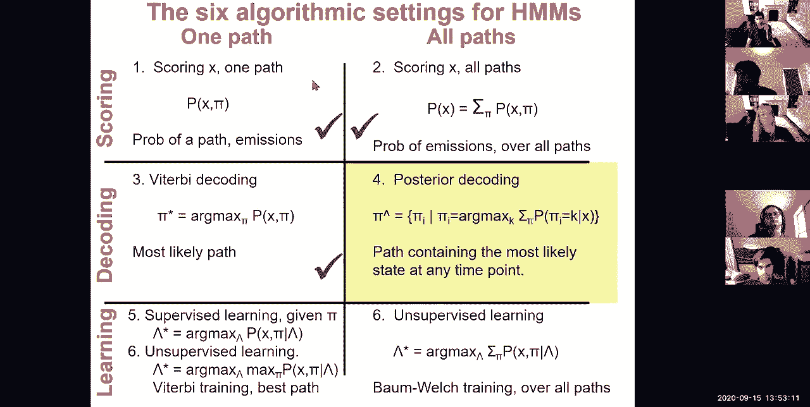
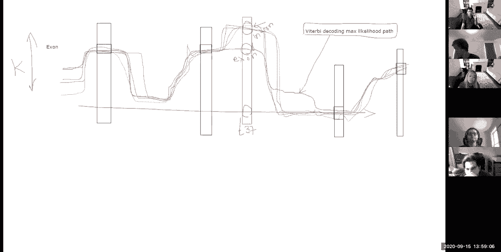
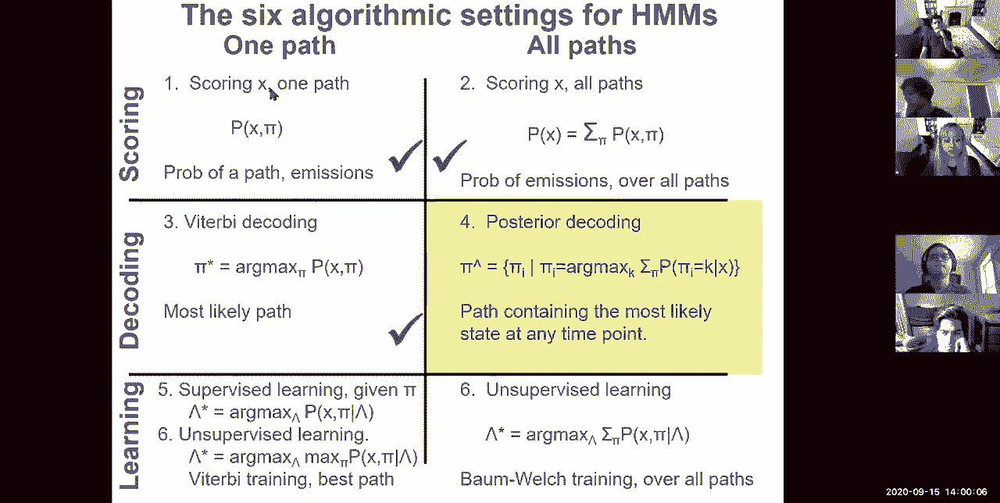
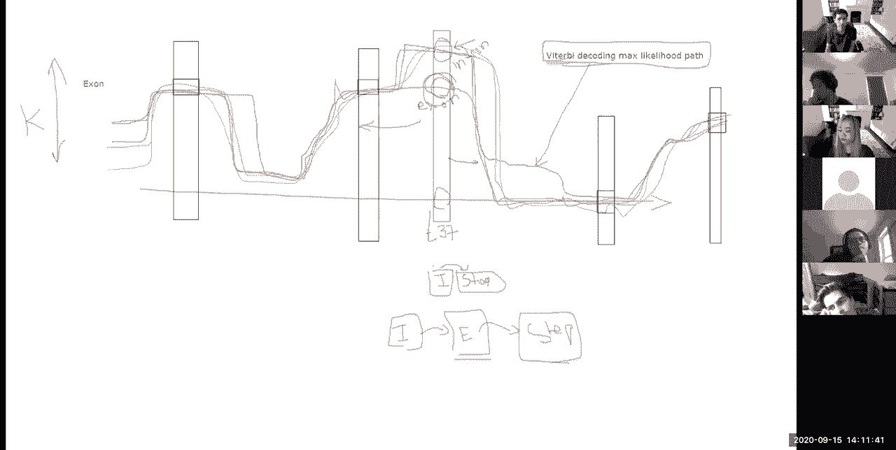
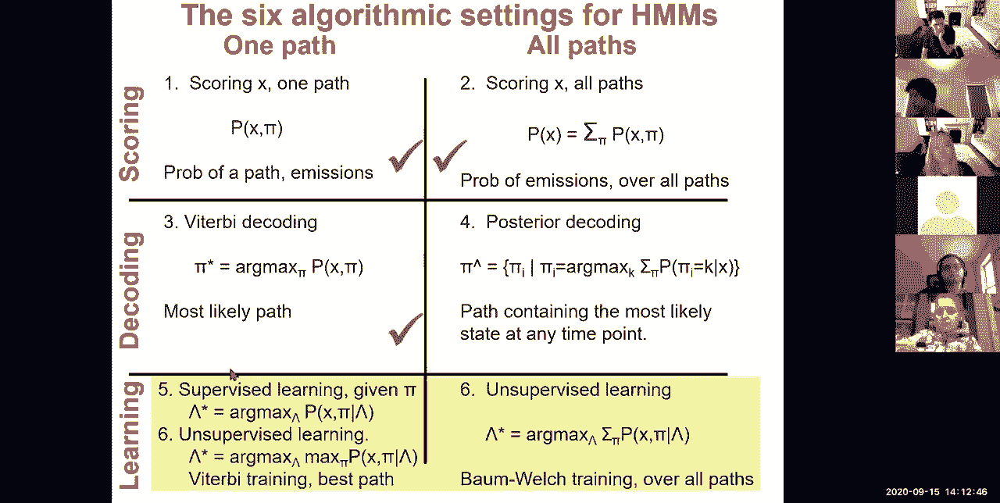
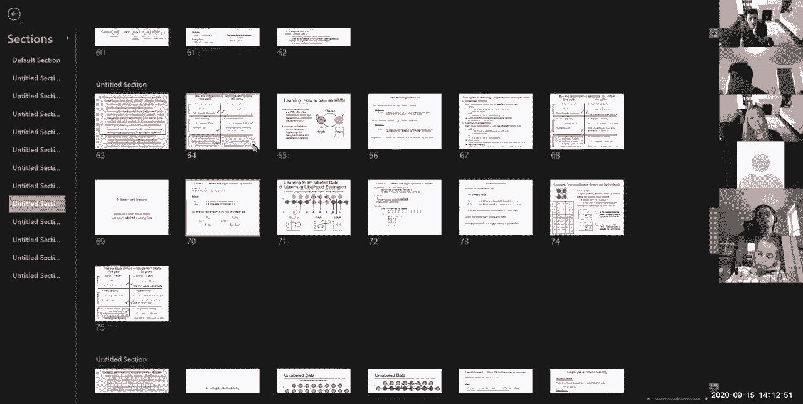
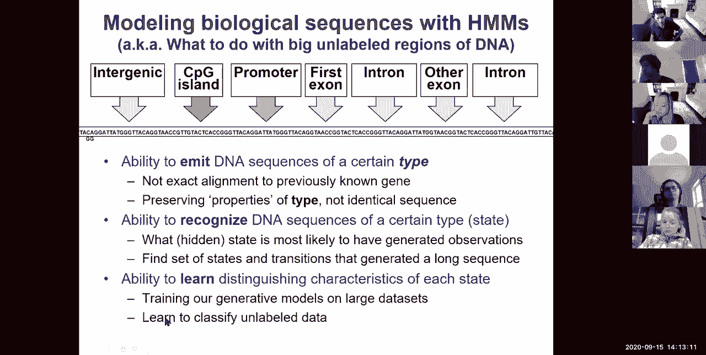
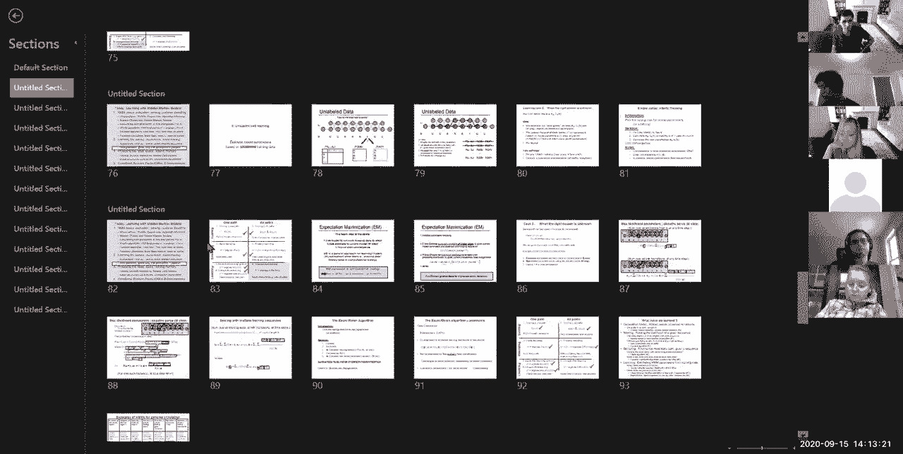
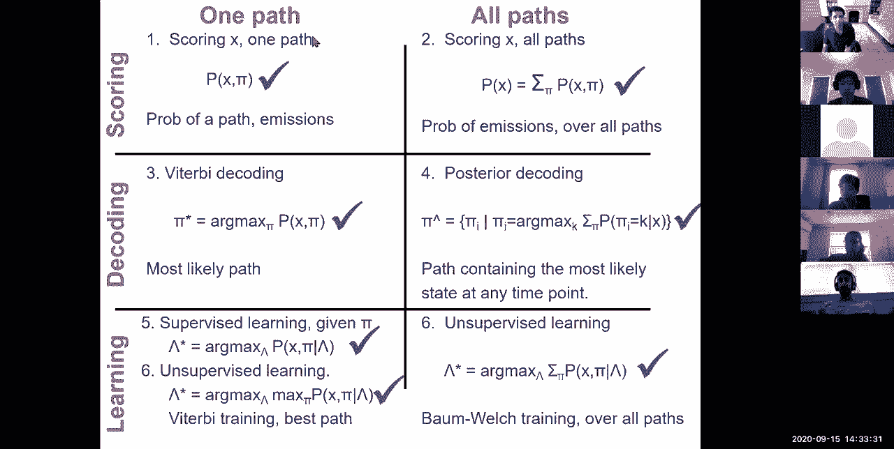

# 5：L5 - 隐马尔可夫模型（HMM）第二部分教程 📚

在本节课中，我们将深入学习隐马尔可夫模型（HMM）的核心算法与应用。我们将回顾HMM的基础知识，探讨如何扩展模型状态空间以处理更复杂的生物序列，并详细介绍参数学习的方法，包括监督学习和无监督学习。课程内容旨在让初学者能够理解并掌握HMM在生物信息学中的关键应用。

---

## 🔄 回顾：HMM基础与核心算法

上一节我们介绍了HMM的基本概念，包括评估、解析和后验解码。我们探讨了观测模型、贝叶斯规则以及贝叶斯推断。核心思想是，我们现在能够对序列进行建模，而不仅仅是简单的比对。

建模通过三个主要任务实现，对应我们矩阵的行：
1.  发射特定类型的DNA序列（即从不同类别的元素生成发射）。
2.  识别特定类型的DNA序列（即根据观测序列推断最可能产生它的隐藏状态）。
3.  推断这些状态的概率分布（本节课将重点学习）。

我们分离了隐藏状态和观测序列。隐藏状态代表我们对世界的推断模型，观测序列则是我们实际看到的数据。我们利用贝叶斯规则来逆转这些条件概率的方向性。

**贝叶斯规则公式**：
`P(H|D) = [P(D|H) * P(H)] / P(D)`
其中，`P(H|D)` 是后验概率，`P(D|H)` 是似然，`P(H)` 是先验，`P(D)` 是证据或边际概率。

HMM将这种贝叶斯推断与顶层的马尔可夫链（控制状态转移）结合起来。我们讨论了观测向量 `X`、路径或解析向量 `π`（即隐藏状态序列），以及发射概率和转移概率。

**发射概率**：对于每个状态，发射每个字符的概率，即 `P(字符 | 状态)`。
**转移概率**：给定前一个位置 `i-1` 的状态是 `k`，下一个位置状态是 `l` 的概率，即 `P(状态_l | 状态_k)`。

我们看到了一个简单的HMM示例，用于基于核苷酸频率和状态间转移概率的差异来检测背景序列与GC富集启动子区域。我们计算了给定路径和观测序列的总概率，并比较了不同解析方式的可能性。

由于可能路径的数量是指数级的，直接计算不可行。因此我们定义了**维特比算法**，通过动态规划递归地计算结束于每个状态的最大可能概率路径。

**维特比变量递归公式**：
`v_k(i) = e_k(x_i) * max_j [ v_j(i-1) * a_{j,k} ]`
其中，`v_k(i)` 是在位置 `i` 结束于状态 `k` 的所有路径中的最大概率，`e_k(x_i)` 是状态 `k` 发射字符 `x_i` 的概率，`a_{j,k}` 是从状态 `j` 转移到状态 `k` 的概率。

我们还定义了**前向算法**，用于计算所有可能路径的总概率（即边际化所有路径）。

**前向变量递归公式**：
`f_k(i) = e_k(x_i) * sum_j [ f_j(i-1) * a_{j,k} ]`
其中，`f_k(i)` 是在位置 `i` 结束于状态 `k` 的所有路径的概率总和。

前向算法可以按列从左到右计算，最后对所有状态的概率求和，得到观测序列的总概率 `P(X)`。在实际计算中，通常使用对数空间以避免数值下溢。

---

## 🧠 扩展状态空间：增加模型“记忆”

第一个HMM示例只是一个玩具模型，只有两个状态，发射四种字符，状态间转移简单。现在，让我们讨论如何检测二核苷酸频率。既然HMM基于的马尔可夫链是无记忆的，我们如何增加系统的“记忆”呢？

解决方案是**增加状态的数量**。通过将更多信息编码到当前状态中，我们可以创建更多的“记忆”。例如，为了记住前一个核苷酸，我们可以将原来的“启动子”状态扩展为四个子状态：`P_A`, `P_C`, `P_G`, `P_T`，分别表示前一个字符是A、C、G、T的启动子状态。对“背景”状态也进行同样的扩展。这样，我们就得到了一个八状态的HMM。

这种扩展允许我们编码二核苷酸频率。转移概率现在可以捕获二核苷酸模式。例如，在CpG岛（启动子）模型中，`C`后接`G`的频率很高，而在非CpG岛（背景）区域，这种频率则低得多。

**为什么CpG岛重要？**
CpG二核苷酸中的胞嘧啶（C）可以被甲基化，这是一种常见的基因表达抑制标记。在进化过程中，甲基化的C容易脱氨基变成T，因此基因组中大部分CpG位点会逐渐消失。然而，启动子等区域通常保持低甲基化状态，从而保留了CpG岛。因此，寻找CpG岛有助于定位可能的启动子区域。

以下是扩展状态空间的其他应用示例：

*   **蛋白质编码基因检测**：需要更复杂的结构，包括起始密码子（ATG）、外显子、内含子、剪接位点（GT-AG）、终止密码子（TGA, TAG, TAA）以及5‘和3’非翻译区（UTR）。关键在于必须**记住阅读框**，因为翻译是按三个核苷酸（一个密码子）进行的。从一个外显子过渡到下一个外显子时，必须保持阅读框的连续性。这通常通过创建多个外显子状态（如E0, E1, E2）来编码阅读框的偏移量来实现。
*   **染色质状态检测**（如ChromHMM）：使用HMM根据组蛋白修饰的组合模式来推断不同的染色质状态（如增强子、启动子、转录区域、抑制区域）。每个隐藏状态发射一个染色质标记的向量，转移矩阵捕获这些状态的空间关系。
*   **蛋白质编码保守性检测**：使用两状态HMM，基于密码子替换频率的差异来区分编码和非编码外显子。

所有这些应用都展示了通过增加状态数量，HMM能够捕获生物序列中复杂而多样的模式。

---

## 🎯 后验解码

之前我们讨论了维特比解码，它找到**最可能的单一路径**（最大似然路径）。**后验解码**则提供了另一种方式：它找到在**每个位置**上最可能的**状态**，这个判断考虑了**所有可能路径**的概率。

**后验解码定义**：
对于序列的每个位置 `i`，选择状态 `k`，使得在所有路径中，位置 `i` 处于状态 `k` 的总概率最大。即：
`π_i = argmax_k P(π_i = k | X)`

**如何计算后验概率 `P(π_i = k | X)`？**
这需要计算通过位置 `i` 状态 `k` 的所有路径的总概率。我们可以利用**前向-后向算法**：
1.  **前向算法**：计算从序列开头到位置 `i` 并结束于状态 `k` 的所有路径的概率 `f_k(i)`。
2.  **后向算法**：计算从位置 `i` 的状态 `k` 开始，到序列末尾的所有路径的概率 `b_k(i)`。
3.  那么，通过位置 `i` 状态 `k` 的所有路径的概率为 `f_k(i) * b_k(i)`。
4.  后验概率为：`P(π_i = k | X) = [f_k(i) * b_k(i)] / P(X)`，其中 `P(X)` 可由前向或后向算法在序列末端/始端得到。

**后向算法递归公式**（从右向左计算）：
`b_k(i) = sum_l [ a_{k,l} * e_l(x_{i+1}) * b_l(i+1) ]`

**后验解码的优点**：
*   比维特比路径提供更精细的、每个位置的信度度量。
*   对于分类任务非常有用，能更好地反映状态的不确定性。

**后验解码的缺点**：
*   得到的状态序列可能不是一个**有效的路径**（即某些相邻状态之间的转移概率可能为零或极低，不符合模型约束）。而维特比路径始终是一个连贯的、符合模型转移规则的有效路径。

---

## 📈 参数学习：监督与无监督

现在我们来探讨如何学习HMM的参数（发射概率和转移概率）。这对应我们最初的第三个任务：学习每个状态的区分性特征。

### 监督学习
如果我们有**已标注的序列**（即已知每个位置对应的隐藏状态），那么参数学习非常简单，只需计数即可。

**最大似然估计方法**：
*   **发射概率**：`e_k(b)` = （在状态 `k` 下观察到字符 `b` 的次数） / （处于状态 `k` 的总次数）。
*   **转移概率**：`a_{k,l}` = （从状态 `k` 转移到状态 `l` 的次数） / （离开状态 `k` 的总次数）。

为了避免零概率（在取对数时会导致无穷大的惩罚），通常加入**伪计数**（加性平滑），这相当于引入了一个弱的先验分布。

### 无监督学习（鲍姆-韦尔奇算法）
更常见的情况是，我们只有**观测序列**，没有标注。我们需要同时推断隐藏状态序列和模型参数。这可以通过**期望最大化（EM）算法**来实现，具体到HMM就是**鲍姆-韦尔奇算法**。

**基本思想（迭代优化）**：
1.  **初始化**：随机猜测一组模型参数（或基于先验知识初始化）。
2.  **E步（期望步）**：使用当前参数，计算所有位置处于每个状态的后验概率 `P(π_i = k | X)`（前向-后向算法），以及所有相邻位置状态对的后验概率 `P(π_i = k, π_{i+1} = l | X)`。这相当于对隐藏状态进行“软”赋值或概率估计。
3.  **M步（最大化步）**：利用E步计算出的后验概率（作为“软计数”），重新估计模型参数，类似于监督学习中的计数，但现在是加权计数。
    *   **发射概率**：`e_k(b)` ∝ 对所有 `x_i = b` 的位置 `i` 求和 `P(π_i = k | X)`。
    *   **转移概率**：`a_{k,l}` ∝ 对所有位置 `i` 求和 `P(π_i = k, π_{i+1} = l | X)`。
4.  **重复**：用新的参数替换旧参数，回到E步。迭代直到参数收敛（变化很小）。

**为什么EM算法有效？**
即使从随机参数开始，观测序列本身的结构也会引导E步中的后验概率计算。在M步中，这些后验概率会更新参数，使其更符合序列中实际存在的模式（如不同的核苷酸组成区域）。每次迭代，模型的对数似然值都会增加（或保持不变），最终收敛到一个局部最优解。

**简化版本：维特比训练**
一种更简单的无监督学习方法是**维特比训练**，它是EM算法的一个近似：
1.  E步：使用当前参数运行**维特比算法**，找到**最可能的单一路径**（硬赋值）。
2.  M步：像监督学习一样，在这条路径上进行计数，更新参数。
3.  重复。
这种方法计算更快，但不如使用所有路径信息的完整鲍姆-韦尔奇算法精确。

---

## ✅ 总结

在本节课中，我们一起深入学习了隐马尔可夫模型（HMM）的核心内容：

1.  **回顾了HMM基础**：包括贝叶斯推断、维特比算法（用于寻找最可能路径）和前向算法（用于计算序列总概率）。
2.  **探讨了状态空间扩展**：通过增加状态数量，HMM可以编码更复杂的“记忆”，例如二核苷酸频率、蛋白质编码基因的阅读框信息等，从而应用于CpG岛检测、基因预测、染色质状态分析等多个生物信息学领域。
3.  **学习了后验解码**：这是一种不同于维特比解码的方法，它找出每个位置上最可能的状态，考虑了所有路径的信息，提供了更细致的概率解释。
4.  **掌握了参数学习**：
    *   **监督学习**：在已知状态序列时，直接通过计数获得参数。
    *   **无监督学习（鲍姆-韦尔奇算法）**：在只有观测序列时，使用期望最大化（EM）算法迭代地估计状态后验概率并更新模型参数，直至收敛。

通过掌握这些概念和算法，你已经具备了使用HMM对复杂生物序列进行建模、解析和学习的基本能力。