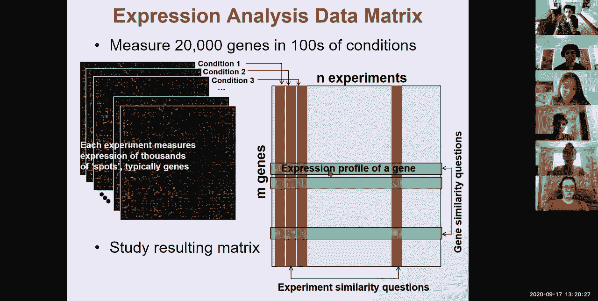
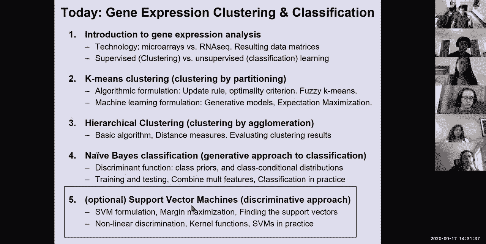

# 6：L6- 基因表达分析：聚类与分类 🧬

在本节课中，我们将学习基因表达分析的基础知识。我们将探讨两种核心技术——微阵列和RNA测序，并深入理解两种核心的计算方法：无监督学习（聚类）和有监督学习（分类）。课程将涵盖K均值聚类、层次聚类以及朴素贝叶斯分类等核心算法。

---

## 🧬 基因表达分析基础

基因表达分析是生物学和计算机科学的基础。在完成基因组注释模块后，我们现在进入模块二，该模块关注基因表达的动态变化。模块一讨论了静态基因组，模块二将关注转录本动态和表观基因组修饰。后续模块将涉及基因调控网络、疾病基因组学和进化基因组学。

模块二的计算基础将包括有监督和无监督学习、快速读段比对以及RNA的二维结构。生物学前沿将涵盖基因表达分析、转录本结构、表观基因组学和三维基因组学。

本节课的目标是：
1.  介绍基因表达分析的基础。
2.  讲解两大技术支柱：微阵列和RNA测序。
3.  探讨有监督和无监督分析的计算方法。

在介绍之后，我们将讨论K均值聚类和层次聚类，然后是分类的生成式方法。如果时间允许，我们还将探讨分类的判别式方法。

---

## 🔬 基因表达分析技术

基因表达谱分析的两大技术支柱是微阵列技术和下一代测序技术。

**微阵列技术** 的工作原理是：针对基因组中的一组固定基因，为每个基因制作探针。通过逆转录将RNA转化为互补DNA（cDNA），然后将这些cDNA与微阵列上的探针进行杂交。通过DNA-DNA杂交，标记了荧光染料的cDNA会与互补探针结合，通过测量每个DNA点的荧光强度，可以推断每个基因的表达水平。

探针可以是每个基因的一个长探针，也可以是覆盖基因的多个短探针（平铺探针）。微阵列技术的优势在于，即使每个细胞的分子数非常少，它也能让你专注于感兴趣的特定小区域。

**RNA测序技术** 是过去十年的革命性进展。它直接对成熟的mRNA分子进行测序，然后使用我们之前讨论过的技术（以及即将讨论的更新技术）将读段映射回基因组。通过这种映射方法，可以计算映射到基因组中每个已知基因的读段数量，从而推断基因的表达量。

与微阵列的模拟信号（荧光强度）不同，RNA测序提供的是数字化的分子计数。需要进行各种标准化，例如根据基因长度和总测序读段数进行校正（如RPKM）。这种方法的优势在于无需预先知道感兴趣的特定基因，可以进行无偏的mRNA测序实验，从中推断所有已知基因的计数，甚至可能发现新的高表达基因。

---

## 📊 数据分析的两个维度

完成测量后，你通常拥有成千上万个基因在数百个条件下的表达数据。这形成了一个数据矩阵。

你可以从两个维度分析数据：
1.  **基因相似性**：将每个基因在所有条件下的表达水平视为一个向量。通过比较这些基因向量，可以询问哪些基因在表达模式上行为相似。
2.  **条件相似性**：将每个条件下所有基因的表达水平视为一个向量。通过比较这些条件向量，可以询问哪些实验条件最为相似。例如，比较精神分裂症与某种医学干预后的表达谱。

这两个维度为研究基因表达数据提供了不同的视角。

---

## 🧩 无监督学习：聚类

聚类意味着将相似的项目分组，这些项目可能来自同一类别，从而揭示数据的隐藏结构。我们可以对基因进行聚类，也可以对实验条件进行聚类。

聚类不依赖于任何先验注释，它是一种无监督的方法，旨在寻找相似性模式。聚类结果可以通过后续分析进行验证，例如检查聚类出的基因是否富集了特定的生物学功能。

实验条件可以是不同的组织（如肝脏、大脑）、不同的生理状态（如餐后、住院）、疾病状态或年龄等。聚类完成后，我们可以检查每个簇中的基因是否在特定功能类别上显著富集。

---

## 🏷️ 有监督学习：分类

与聚类不同，分类属于有监督学习。我们预先知道一些类别（例如，已知某些基因参与胰腺β细胞功能）。分类的目标是从数据中提取特征（即特定条件下的表达水平），这些特征能最好地将新元素分配到一个或多个明确定义的类别中。

在有监督学习中，类别是预先定义好的，算法学习基因的表达模式如何映射到这些类别。而在无监督学习中，我们只在聚类完成后才用生物学数据验证结果。

分类的一个子问题是特征选择，即从高维向量中识别出最重要的特征。评估分类效果的指标包括准确率、敏感性、特异性等。

---

## 📐 聚类与分类的形式化描述

聚类和分类是机器学习和计算机科学中普遍使用的方法，用于通过一个或多个特征来表征对象。

在我们的例子中，对象是基因，特征可以是基因在不同组织或数百万个细胞中的表达水平。每个基因点都存在于一个超高维空间中。

**分类** 是指我们的数据点带有标签（如红色或绿色），我们希望找到一个“规则”，能够准确地将新数据点分配标签。特征选择是分类的一个子问题。

**聚类** 是无监督的，没有标签。它根据数据点之间的邻近程度将其分组，目标是识别数据中的结构。评估指标可以是某种独立的验证特征，例如聚类后检查基因的功能富集情况。

---

## 🔢 聚类方法一：K均值聚类（划分式）

我们将探讨两种聚类方法：划分式聚类和凝聚式聚类。

K均值聚类是一种划分式方法，它将对象划分为K个不重叠的簇，每个数据对象只属于一个簇。其基本思想是：假设存在固定数量（K）的簇，目标是将点划分到这些簇中，并使簇内紧凑。

**算法步骤如下**：
1.  **随机初始化**：随机选择K个点作为初始簇中心（质心）。
2.  **分配点**：将每个数据点分配给距离它最近的簇中心。
3.  **更新质心**：将每个簇的中心移动到属于该簇的所有点的中心（平均值）。
4.  **迭代**：重复步骤2和3，直到分配不再发生变化（收敛）。

K均值算法试图最小化一个成本标准，即所有点到其所属簇质心的距离平方和。这实质上是在使每个簇尽可能紧凑。

**模糊K均值** 是K均值的一个变体。它不进行硬分配（一个点100%属于一个簇），而是进行软分配。每个点以一定的概率属于所有簇，概率大小取决于该点到各簇中心的距离。然后，质心更新为所有点的加权平均值，权重就是各点属于该簇的概率。标准的K均值是模糊K均值在概率为100%或0%时的特例。

---

## 🤖 K均值的机器学习公式：生成式模型

我们可以从生成式模型的角度来看待K均值聚类。这被称为**高斯混合模型**。

生成过程如下：首先抛一枚硬币来选择使用哪个高斯分布（例如，以30%的概率选择蓝色分布，以70%的概率选择红色分布），然后从选定的高斯分布中采样生成数据点。

在实际中，我们观察到数据点（灰色），但不知道每个点是由哪个高斯分布生成的（这是隐变量）。我们的目标是：仅给定样本，估计模型参数（两个高斯分布的均值和方差）以及点的分配标签。

这可以通过**期望最大化算法**来解决：
*   **E步（期望步）**：给定当前估计的簇中心，计算每个数据点属于每个簇的概率（即“期望”的分配）。
*   **M步（最大化步）**：根据E步计算出的概率权重，重新计算每个簇的中心（即“最大化”似然性的参数）。

迭代进行E步和M步，直到收敛。可以证明，在高斯分布方差相等且为先验知识的情况下，EM算法的解与K均值算法的解是等价的。

模糊K均值对应于使用所有可能路径（全路径）的EM算法，而标准K均值对应于只选择最可能路径（维特比路径）的EM算法。此外，还可以使用吉布斯采样从后验分布中采样单个标签。

---

## 🌳 聚类方法二：层次聚类（凝聚式）

K均值需要预先指定簇的数量K，而层次聚类则不需要。层次聚类会产生一组嵌套的簇，组织成树状结构（树状图）。

**算法步骤如下（凝聚式）**：
1.  **开始**：将每个点视为一个单独的簇。
2.  **合并最接近的簇**：在每一步，找到并合并两个最接近的簇。
3.  **重复**：重复步骤2，直到所有点都合并成一个簇。

结果是一个树状图。要获得离散的簇，只需在树的特定高度“切割”即可。切割的位置决定了簇的数量。

**关键问题是如何定义簇与簇之间的距离**，常见方法有：
*   **单链法**：两个簇中最近的两个点之间的距离。
*   **全链法**：两个簇中最远的两个点之间的距离。
*   **平均链法**：两个簇中所有点对之间的平均距离。
*   **质心法**：两个簇的质心之间的距离。

不同的距离度量会影响聚类结果和运行时间。同样，点与点之间的距离（如欧氏距离、曼哈顿距离、皮尔逊相关系数等）也会影响最终结果。

---

## 📈 聚类结果评估

如何评估聚类结果的好坏？
*   **紧凑性**：可以测量簇内的紧凑程度。
*   **鲁棒性**：通过从数据中随机抽样并重新聚类，检查簇是否重复出现。
*   **富集分析**：使用独立的注释信息（如基因功能类别）来评估。对于一个聚类结果，可以计算某个功能类别在特定簇中是否显著富集。这通常使用**超几何分布**来计算p值，以评估观察到的富集程度是否随机。

---

## 🎯 分类方法：朴素贝叶斯分类器

分类方法可分为生成式方法和判别式方法。**朴素贝叶斯分类器**是一种常见的生成式方法。

生成式方法对每个类别的特征分布进行建模。例如，假设我们有两个类别（红色和绿色），每个类别下，某个特征（如基因表达水平）服从一个高斯分布（类条件分布）。

**分类过程**：对于一个新数据点，我们使用贝叶斯规则计算它属于每个类别的后验概率。后验概率正比于 **（类条件概率 × 类先验概率）**。选择后验概率较高的类别作为预测结果。

决策边界可以表示为一个**判别函数**。当判别函数值大于0时，选择类别1；否则选择类别2。

**训练过程**：使用已标记的数据（训练集）来估计类条件分布的参数（如均值和方差）以及每个类别的先验概率。

**“朴素”的假设**：为了简化计算，特别是在特征维度很高时，朴素贝叶斯假设在给定类别的条件下，各个特征之间是相互独立的。因此，联合的类条件概率可以分解为每个特征单独的概率的乘积。这使得计算变得非常高效。

尽管这个假设很强，但在许多实际应用中，朴素贝叶斯分类器表现得出奇地好。评估分类性能可以使用准确率、敏感性、特异性等指标。

---

## 🎓 总结

在本节课中，我们一起学习了基因表达分析的核心内容。

我们首先介绍了基因表达分析的技术基础：**微阵列**和**RNA测序**。然后，我们探讨了分析基因表达数据的两个计算范式：**无监督学习（聚类）** 和 **有监督学习（分类）**。

在聚类部分，我们深入讲解了：
*   **K均值聚类**：一种划分式方法，通过迭代优化使簇内紧凑。我们看到了它的算法步骤、最优性准则，以及其模糊变体和生成式模型（高斯混合模型）解释。
*   **层次聚类**：一种凝聚式方法，无需预先指定簇数，通过构建树状图来揭示数据的层次结构。我们讨论了不同的簇间距离度量方法。

在分类部分，我们重点介绍了：
*   **朴素贝叶斯分类器**：一种生成式方法，基于贝叶斯定理和特征条件独立性假设，通过建模类条件概率分布来进行分类。

通过本节课的学习，你应该对如何利用计算工具从基因表达数据中提取生物学见解有了基本的认识。这些聚类和分类方法是生物信息学数据分析的基石。