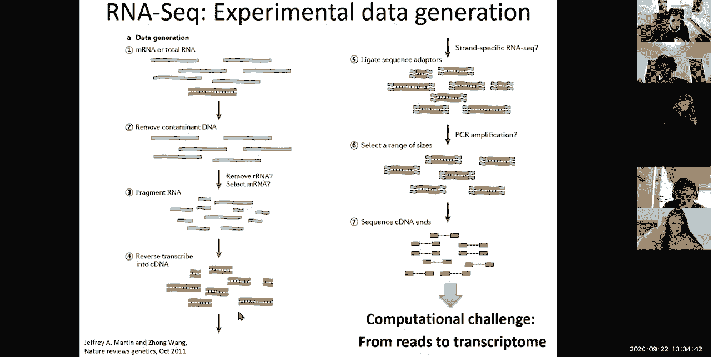
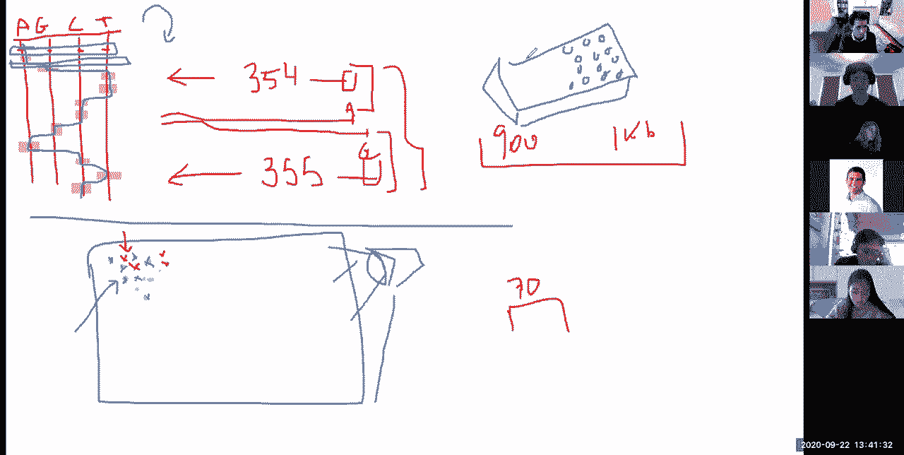
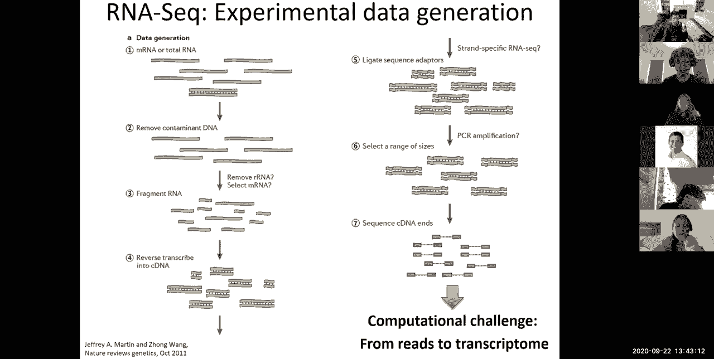
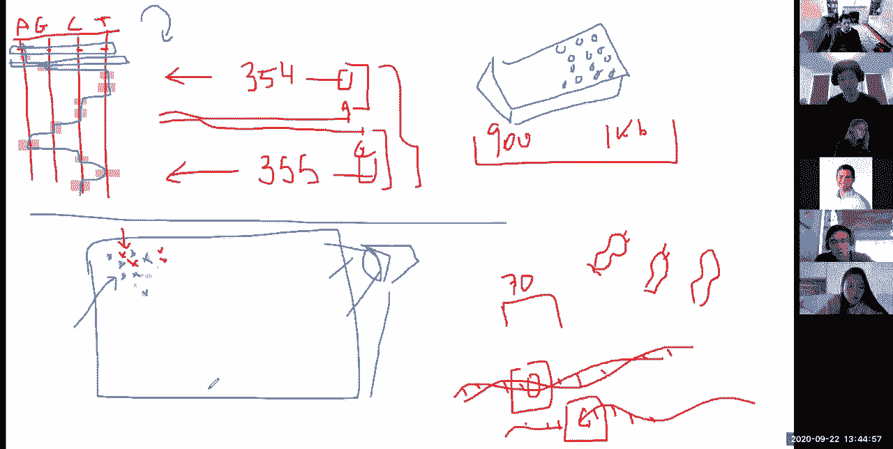
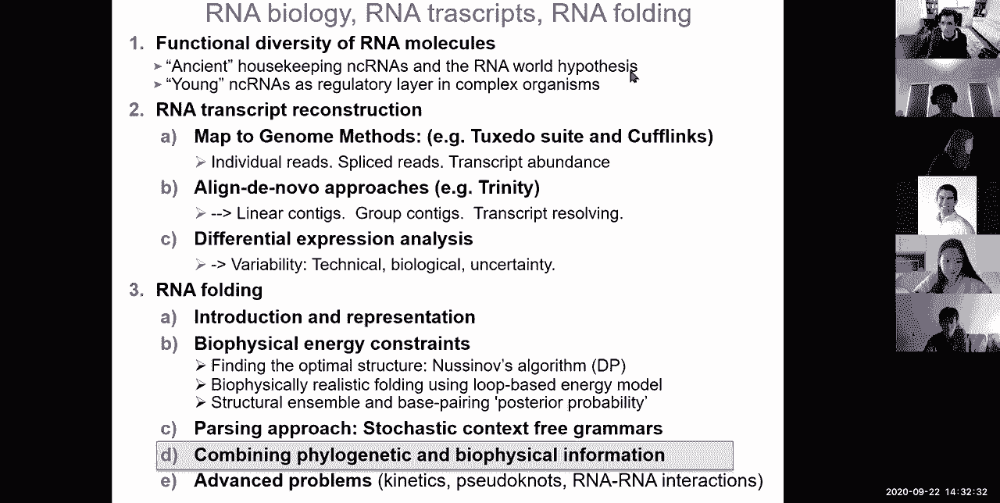

# 7：L7 - RNA折叠、RNA世界与RNA结构 🧬

在本节课中，我们将学习RNA生物学、RNA转录本重建以及RNA结构预测。我们将探讨RNA在生命起源中的核心作用，了解如何从测序数据中重建RNA转录本，并学习预测RNA二级结构的计算方法。

---

## 📚 RNA生物学：为什么RNA如此重要

上一节我们介绍了基因表达分析，本节中我们来看看RNA在分子生物学中的核心作用。传统观点认为，RNA仅仅是DNA和蛋白质之间的信使，但现代研究发现，RNA的功能远不止于此。

以下是RNA扮演的多种角色：

*   **信使RNA (mRNA)**：携带遗传信息，用于蛋白质合成。
*   **核糖体RNA (rRNA)**：构成核糖体的催化核心，负责翻译过程。
*   **转运RNA (tRNA)**：作为适配器分子，在翻译过程中携带特定氨基酸。
*   **参与剪接的RNA**：如核小RNA (snRNA)，在mRNA前体的剪接中起关键作用。
*   **调控RNA**：如微RNA (miRNA) 和长链非编码RNA (lncRNA)，参与转录后基因表达调控。
*   **结构RNA**：作为支架，参与染色质组织等过程。
*   **核酶**：某些RNA分子具有酶活性，可以催化化学反应，例如自我剪接的内含子。

RNA甚至可以作为某些病毒（如SARS-CoV-2）的遗传信息存储载体。这表明，RNA能够扮演现代生物学“中心法则”中DNA（信息存储）、RNA（信息传递）和蛋白质（功能执行）的全部三种角色。

---

## 🌍 RNA世界假说

基于RNA的多功能性，科学家提出了“RNA世界”假说。该假说认为，在生命进化早期，存在一个以RNA为主导的世界。

在这个假想的世界中：
*   **RNA是核心**：RNA同时承担信息存储、自我复制和催化化学反应的功能。
*   **自我复制与进化**：能够自我复制的RNA分子通过自然选择不断进化，复杂性增加。
*   **向现代世界过渡**：RNA后来“发明”了蛋白质来分担催化工作，并最终将信息存储的任务交给了更稳定的DNA，形成了我们今天所知的“DNA → RNA → 蛋白质”的中心法则。

现代细胞中保留的多种RNA功能（如rRNA的催化作用）被认为是“RNA世界”留下的遗迹。

---

## 🧬 从测序数据重建RNA转录本

接下来，我们探讨如何利用现代测序技术来识别和量化RNA转录本。核心挑战在于，高通量测序（如RNA-seq）产生的读段很短（约30-70个核苷酸），而转录本可能很长且存在可变剪接。

### 方法一：基于基因组的比对

该方法需要一个参考基因组作为“地图”。

**基本流程如下：**

1.  **短读段比对**：首先使用超快速比对工具（如**Bowtie**），将所有能连续比对到基因组上的读段进行定位。
2.  **识别剪接位点**：对于无法连续比对的读段，其两端可能分别比对到基因组上相距很远的位置，这提示存在剪接事件。使用**TopHat**等工具来识别这些潜在的剪接位点。
3.  **转录本组装与定量**：将比对上的读段连接起来，重建出完整的转录本（**Cufflinks**）。由于一个读段可能来自多个不同的剪接变体，需要使用期望最大化（EM）等算法，概率性地分配读段，并估算每个转录本的表达量。表达量通常用 **FPKM**（每千碱基每百万片段数）进行标准化。
4.  **差异表达分析**：在量化基础上，使用统计模型（如**Cuffdiff**）比较不同样本间的基因表达差异，考虑技术变异和生物学变异。

### 方法二：从头组装

当没有参考基因组时（例如研究非模式生物），可以采用从头组装方法。

**基本思路如下：**

1.  **构建重叠图**：直接将所有测序读段相互比较，构建一个**德布鲁因图**。该图能展示读段之间的重叠关系，并将序列差异（如测序错误、单核苷酸多态性、可变剪接）表示为图中的不同路径。
2.  **遍历路径推断转录本**：通过遍历图中所有可能的路径，可以推导出不同的转录本异构体。
3.  **定量与比对**：估算各转录本的丰度，并可将组装出的转录本序列比对到近缘物种的基因组上进行分析。

---

## 🧮 RNA二级结构预测

了解了RNA的序列和表达后，我们进一步探索其功能的关键——RNA结构。RNA分子可以通过碱基配对形成复杂的二级和三级结构，这些结构决定了其功能。

我们主要关注**二级结构**的预测，因为它决定了大部分折叠自由能，且计算上更易处理。二级结构不允许假结（即碱基配对交叉）。

### 纽辛格算法：最小自由能折叠

最经典的RNA二级结构预测算法是**纽辛格算法**，其目标是找到**自由能最低**的二级结构。该算法基于动态规划思想。

**核心步骤如下：**

1.  **能量模型**：为不同的碱基对（如A-U， C-G， G-U）以及结构单元（如茎环、凸环、内环、多分支环）分配自由能值。这些值来自实验测量。
2.  **动态规划矩阵**：定义一个二维矩阵 `E(i, j)`，表示从序列位置 `i` 到 `j` 的子序列所能形成的最佳二级结构的**最小自由能**。
3.  **递归计算**：从短序列片段开始（矩阵对角线附近），逐步向外计算更长的片段。对于子序列 `(i, j)`，其最小自由能 `E(i, j)` 可以通过考虑以下几种情况递归计算：
    *   `i` 和 `j` 配对，则能量为 `E(i+1, j-1)` 加上配对 `(i, j)` 的能量。
    *   `i` 不参与配对，则能量为 `E(i+1, j)`。
    *   `j` 不参与配对，则能量为 `E(i, j-1)`。
    *   在 `i` 和 `j` 之间某个位置 `k` 将结构分成两部分，则能量为 `E(i, k) + E(k+1, j)`。
    *   计算 `(i, j)` 形成各种环结构（如发夹环、内环、凸环）的能量。
4.  **回溯**：填充完整个矩阵后，从 `E(1, n)` 开始回溯，即可得到自由能最低的二级结构。

### 从单一结构到结构集合：分区函数

纽辛格算法只给出一个最优结构。然而，RNA在溶液中可能以多种构象存在。我们可以计算**分区函数** `Z`，即所有可能结构的玻尔兹曼权重之和。通过计算 `Z`，我们可以得到每个碱基对的**配对概率**，从而了解结构的稳定性和动态性。

### 基于语法的预测：随机上下文无关文法

另一种强大的方法是使用**随机上下文无关文法**来建模和解析RNA二级结构。

**基本概念如下：**

*   **产生式规则**：定义一套文法规则来描述如何“生成”一个RNA结构。例如，一条规则可以是：`S → a S u`，表示在结构`S`的两端添加一对配对的碱基`a`和`u`。
*   **随机性**：为每条产生式规则赋予一个概率。
*   **解析与推断**：给定一个RNA序列，可以使用**CYK算法**等动态规划方法，找到概率最高的结构解析（即最可能生成该序列的结构），或计算所有可能解析的总概率（分区函数）。
*   **系统发育SCFG**：可以进一步扩展，结合多个同源RNA序列的进化信息，提高结构预测的准确性。

---

## 📝 总结

本节课中我们一起学习了：
1.  **RNA的多功能性**：RNA远不止是信使，它在催化、调控、结构等方面扮演着核心角色。
2.  **RNA世界假说**：生命可能起源于一个以RNA为核心的自我复制和催化系统。
3.  **RNA转录本重建**：我们学习了如何从短读段测序数据中，通过“比对到基因组”或“从头组装”两种策略来识别和量化RNA转录本。
4.  **RNA二级结构预测**：我们探讨了使用**纽辛格算法**基于最小自由能模型预测RNA结构，以及使用**随机上下文无关文法**进行基于概率模型的结构解析。这些方法是理解RNA功能机制的基础。

通过本课的学习，我们看到了RNA从生命起源到现代细胞复杂调控中的核心地位，以及计算生物学在解析其序列、表达和结构中的强大作用。