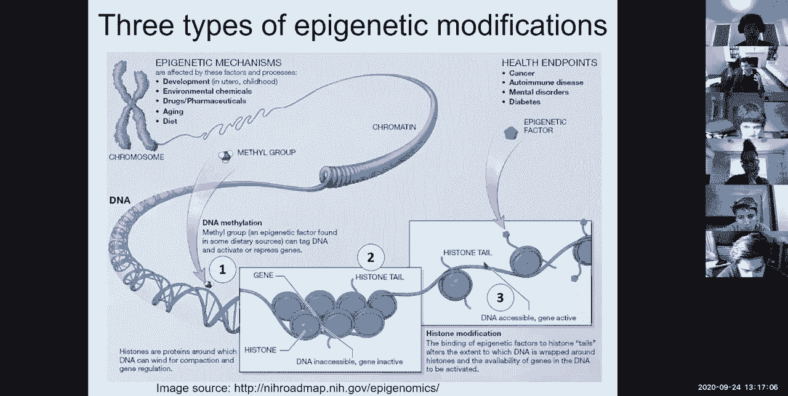
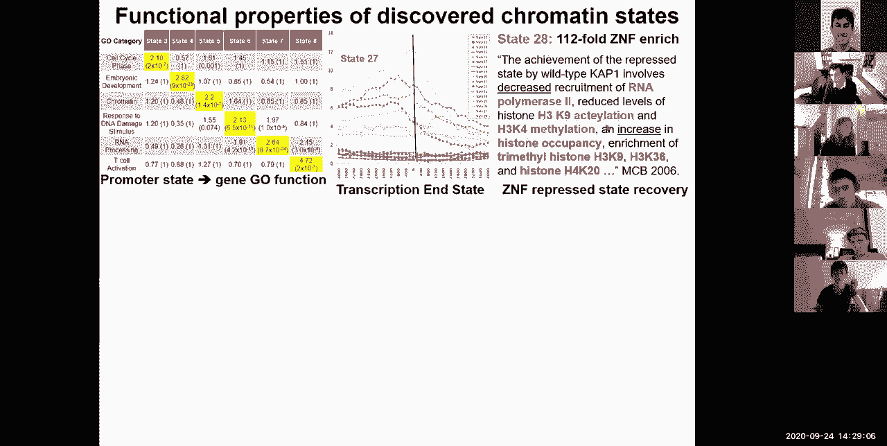
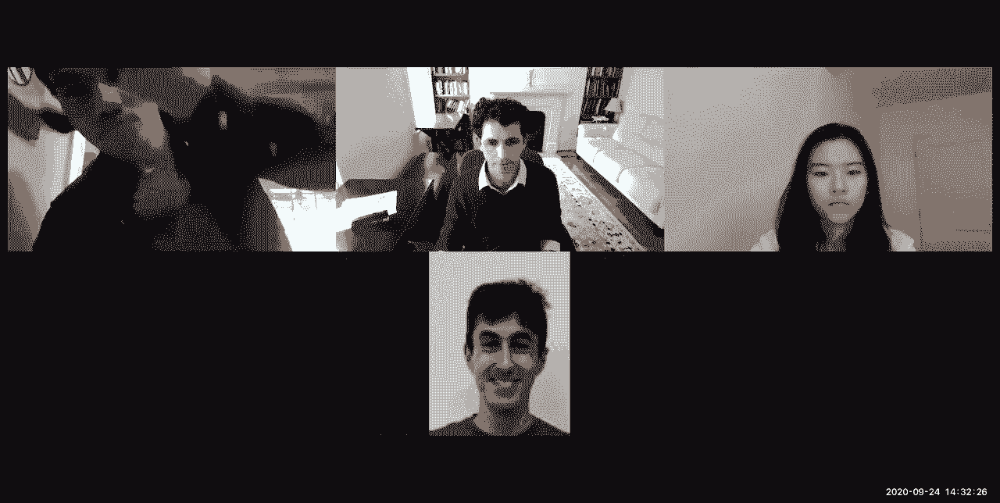

# 8：L8- 表观基因组学L1部分 🧬

在本节课中，我们将要学习表观基因组学的基础知识。表观基因组学是研究在DNA序列之上发生的、可遗传的化学修饰如何调控基因表达的领域。我们将从介绍该领域开始，逐步深入到数据生成、处理和分析的核心计算方法。

## 引言：什么是表观基因组学？🧬

大家好，今天我们将讨论表观基因组学。基因组学领域存在许多挑战，而表观基因组学是我最喜欢的领域之一。

这是模块二关于基因表达和表观基因组学的第三讲，内容介于基因组注释和即将开始的调控基因组学、网络与疾病以及比较基因组学之间。

今天，我们将聚焦于表观基因组学的计算方面。首先，我将介绍这个领域：表观基因组学是关于什么的？染色质修饰的多样性是怎样的？然后，我们将探讨如何找到这些修饰的位置，即如何使用抗体和染色质免疫沉淀结合下一代测序技术。

接着，我们会介绍数据生成项目、原始数据以及初级数据处理：如何比对测序读段、如何识别峰以及如何进行质量控制。之后，我们将重点介绍整合多种表观基因组修饰以推断染色质状态的方法，并定义一个用于此目的的多变量隐马尔可夫模型来注释这些状态。

很多人问过关于模型复杂性的问题：如何选择染色质状态的数量以及标记的数量？如何捕捉状态间的依赖性和条件标记依赖性？如何跨多种细胞类型进行联合学习？以及如何利用这些染色质状态的活动模式来进行我们下周将要讨论的调控基因组学研究，特别是将增强子与其上游调控因子和下游靶基因联系起来。

最后，我们将讨论如何通过利用染色质标记之间的相关性来进行表观基因组推算。

让我们开始吧。

## 表观基因组学简介 🧬

表观基因组是为什么你可以在几乎所有细胞中共享一个几乎相同的、静态的基因组，却拥有如此惊人的细胞类型多样性的原因。

如果你观察血细胞类型，有大量不同类型的免疫细胞、携氧细胞、凝血细胞等等。我们最近通过新冠疫情新闻学到了很多免疫学知识。大脑拥有令人难以置信的细胞类型多样性，有主要的神经元、星形胶质细胞、少突胶质细胞、小胶质细胞等类型，还有早期大脑和人类新皮层中大量的组织多样性。

如果你观察我们所有的内部器官，如心脏、肝脏、脾脏等，同样存在令人难以置信的细胞类型和腔室多样性。即使只看你的皮肤，也有令人难以置信的神经支配，神经元直接与你的皮肤、毛发、血液供应、神经支配以及其他环境相互作用。如果你有伤口，它会愈合，所有相同的细胞类型会重新构建。这是一个相互连接的系统，不仅仅是细胞类型，还包括通讯、供给、反馈和控制的组织网络，这些在你身体的任何部分都有所体现。

所有这些都是通过表观基因组实现的。那么，这是如何实现的呢？

表观基因组本质上是将你的DNA维系在一起的结构，它首先扮演结构角色，但也扮演功能角色，并使得这种细胞类型的多样性成为可能。为了让你了解每个细胞中DNA的包装程度，你大约有**两米长**的DNA被包装在一个尺寸小**六个数量级**的细胞里。而DNA链本身的直径又比其长度小**九个数量级**。这是一个惊人的包装壮举，将两米长的DNA包装进你万亿个细胞中的每一个。如果你将你30万亿个细胞首尾相连，其DNA总长度足以到达木星10次。地球上的每个人体内都包装了如此多的DNA。

这就是表观基因组的第一个功能：它使得所有这些DNA能够组合在一起。这是如何可能的呢？通过许多不同层次的包装。

首先，DNA双螺旋缠绕在这些核小体“碗”周围。每个核小体包含**147个核苷酸**，加上大约**50个核苷酸**的连接区。你可以将基因组中**200个核苷酸**的片段想象成包装在这些“碗”里。这些“碗”本身又被包装在染色质纤维中，而染色质纤维本身又在更高的组织层次上被包装成A区和B区，这些区域更活跃或更受抑制。我们将在下一讲详细讨论这些。

所有这些最终凝聚成我们所熟知的染色体。顺便说一下，你通常看到的染色体图片只出现在细胞周期的特定阶段，即染色体排列准备在子细胞间分离时。但在大多数时候，染色体的包装程度要低得多，并且是漂浮的，但仍然保持它们自己的结构域。

再次强调，DNA非常长，细胞非常小，压缩程度比伸展的DNA小几个数量级。为了使用DNA，这种紧凑的结构必须在局部打开，以便转录因子结合。染色质状态的可及性和三维相互作用在实现这一切中扮演着巨大角色。

当我们谈论表观基因组学时，“epi”意味着“之上”，“genomics”意味着“基因组之上”，所以表观基因组学是研究在遗传信息之上发生的修饰。因此，表观基因组修饰是可以施加在人类基因组主要信息之上的修饰。

主要DNA信息可以被调节和修饰。我喜欢给出的类比是：就像乐谱上的注释可以让你演奏得更响亮或更柔和、增加或减少强度等。这些修饰可以通过三种类型的修饰来实现，这些修饰涉及DNA本身以及DNA缠绕的蛋白质。

第一种修饰是在DNA本身上，我们之前简要提到过，即**CpG甲基化**。“CpG”是因为它是C后面跟着磷酸基团，再跟着G。在连续的CG核苷酸中，你基本上有一个甲基化的C，这通常在调控区域指示抑制。如果你有这个“第五个碱基”——甲基化的C碱基，该区域更可能被抑制。事实上，人类基因组的大部分是甲基化的，只有一小部分在我们之前讨论过的CpG岛中是非甲基化的。

所以，这些甲基化是表观基因组修饰的第一种形式，它直接发生在DNA上。

第二种形式是**DNA可及性**。这基本上是DNA在哪些区域实际上是可以接近的，即没有紧密包装在核小体周围。这种可及性基本上告诉你调控因子在哪里结合。如果你有一个转录因子，它通常会结合DNA的可及区域。如果你进行可及性测定（例如，切割DNA的可及区域，然后读取哪些区域被切割，或者以某种方式标记这些开放的可及区域，然后读取哪些区域被标记），你会看到这些区域被核小体大小的不可及区域隔开。在这些可及区域内，你实际上会以超高分辨率看到单个调控因子的足迹，这些足迹有时一次覆盖10个核苷酸。围绕这些足迹，你会看到可及性，然后是缺乏可及性，等等。

因此，可及性有两个层次：第一个是在峰的水平，但当你放大到峰内部时，你会注意到峰实际上具有这种双峰形状，其中转录因子结合在那里。在某些情况下，你会看到可及区域的多个凹陷，这表明这是一个普遍可及的区域，但在这里和那里结合了两个不同的调控因子。

所以，可及性可以在多个分辨率层次上考虑。这是第二种类型的修饰：第一种是DNA甲基化，第二种是DNA可及性。

第三种是**组蛋白修饰**。这些表观遗传因子基本上可以修饰DNA本身的解读方式。这是迄今为止最多样化和最丰富的表观基因组量化形式。它们是如何发生的呢？它们基本上发生在构成核小体的组蛋白的尾部。

我介绍了很多术语：DNA缠绕两圈，这就是我之前谈到的147个碱基对。每一个核小体由八种蛋白质组成，这些蛋白质被称为组蛋白。这些组蛋白通常是：H2A两份、H2B两份、H3两份和H4两份。但是这些组蛋白有很多变体，它们可以在基因组特定位置交换，形成修饰的核小体和核小体变体。

就表观基因组信息而言，在基因组信息之上，你有DNA甲基化、DNA可及性和组蛋白修饰。这些修饰是什么？

这些组蛋白尾部有长的氨基酸尾巴，可以伸出并被甲基化、泛素化、乙酰化、磷酸化等修饰。这些修饰可以被专门的蛋白质识别，然后通过标记在细胞类型中重要的区域来影响该DNA区域的解读。

如果你回到人体不同的细胞类型，也许神经元会有一组特定的区域被表观基因组标记为活跃，而相同的区域在例如小胶质细胞或星形胶质细胞中被标记为非活跃。

这就是通过这种表观基因组记忆实现的。当我说它们调节时，它们基本上可以直接物理地使其不可接近，或者改变“序列”，使得通常识别非甲基化C的转录因子无法再识别甲基化的C，或者通过招募其他因子来竞争掉通常结合的调控因子，或者通过自身使染色质更凝聚或更松散，等等。

因此，你可以将基因调控想象为转录因子（直接结合DNA的调控因子，这些是序列特异性因子，结合我们将在两讲后讨论的序列基序）、组蛋白（对DNA有固有亲和力）、它们构成的核小体、染色质调控因子等之间不断的竞争。

我们将基于特定的蛋白质（如H2A、H2B、H3或H4）来命名这些修饰。例如，这是H3，然后是从末端计数的特定氨基酸残基，所以赖氨酸4是这个，我们称之为K4，或者赖氨酸36更靠下。然后是特定的化学修饰，例如是甲基化、磷酸化、乙酰化等。有时你可以在同一个位点有多个甲基基团，我们称之为三甲基化。

所以，我们将讨论H3，即组蛋白H3，赖氨酸4三甲基化，简称为H3K4me3。或者H2B赖氨酸5乙酰化，称为H2BK5ac。除了DNA修饰（CpG上的甲基化C）、核小体定位和DNA可及性之外，这些都是组蛋白修饰。

总的来说，表观基因组的标记方式是通过DNA甲基化、组蛋白修饰、DNA可及性共同协作，用不同的“颜色”标记DNA。这些“颜色”对应于在感兴趣的细胞类型中活跃的增强子、活跃的启动子、转录区域、抑制区域、重复区域等。

已知有数百种这样的修饰，还有许多新的修饰正在被发现。我们可以使用染色质免疫沉淀、亚硫酸氢盐测序和DNA可及性测定来系统地绘制它们。

DNA可及性我之前已经提到过，基本上是找出哪些区域实际上在物理上可以被特定的酶（如DNA酶I，一种切割可及DNA的切割酶）接近。所以，如果DNA被切割，那么你就知道它是可及的。这是其中一种方法。

第二种方法是，你通过化学方式处理DNA，以不同的方式修饰甲基化C和非甲基化C核苷酸，查看差异，并基于差异推断哪些区域实际上是甲基化的与非甲基化的。为了获取DNA甲基化信息，你基本上进行亚硫酸氢盐测序，这是一种化学修饰然后测序的方法。

然后是染色质免疫沉淀，我们将会讨论，但这是使用抗体来下拉具有特定修饰的基因组区域。然后你切割DNA，下拉这些区域，对你得到的东西进行测序，然后查看它们落在基因组的哪个位置。

这三种方法（以及许多其他方法）被用来系统地绘制数百个样本，涵盖成人和人类胚胎身体的不同区域、大脑的不同区域、不同类型的原代细胞、体外分化细胞等。

其中一个例子是ENCODE项目（DNA元件百科全书），另一个是Roadmap表观基因组学项目（这是NIH路线图计划的一部分），还有modENCODE、mouseENCODE等。我们的研究小组在这个领域非常活跃，我们帮助领导了其中一些联盟，当然是在计算方面，整合所有这些数据集以推断人类表观基因组图谱。

今天的许多内容实际上与我的研究密切相关，因为许多方法是由我小组的学生和博士后开发的，然后广泛应用于表观基因组学领域。

Roadmap项目绘制了超过100种不同的原代组织和细胞，并绘制了多种组蛋白修饰、DNA可及性、DNA甲基化和基因表达数据，然后整合所有这些数据以产生人类表观基因组图谱。

你会注意到我在这里使用这些颜色。这些颜色是我们发明并在许多不同项目中重复使用的，所以它们有点标准化。这些颜色基本上代表：**远端基因调控区域**（极其细胞类型特异性，它们环化到启动子附近以帮助招募多种因子类型，当需要时）——这些是增强子，因为它们增强表达；**启动子**（近端调控区域，这是RNA聚合酶最终结合以启动转录的地方）——它们同样由组蛋白修饰、DNA甲基化和可及性的组合标记；**转录区域**我们将用绿色表示，启动子用红色，增强子用橙色，抑制区域用灰色，等等。

这里我展示了每种类型区域中一些普遍的标记，但再次强调，有数十种这样的修饰。

这个项目的目标是绘制多种修饰、多种细胞类型、多个个体、多个物种、多种条件、使用多种抗体、跨越整个基因组的数据。已经发布了多波这样的数据，我们最近刚刚发布了ENCODE的最新一波数据，这在Nature杂志上有多篇论文报道。

你们很幸运，因为你们拥有大量在我还是学生时根本不可用的数据。

这是表观基因组学的基本概述：为什么表观基因组有用？染色质修饰的多样性。现在我们将更多地讨论抗体、ChIP-seq、数据生成项目和原始数据。

## 数据处理：比对、质量控制和峰识别 🔬

现在让我们深入探讨我们实际上如何处理数据：如何推断峰、读段去向以及这些修饰的位置。

这就是染色质免疫沉淀结合测序的用武之地。染色质免疫沉淀结合测序是什么意思？首先，染色质基本上是DNA和蛋白质的组合，它们维系着你的遗传信息。染色质通常指构成组蛋白的蛋白质、缠绕在它们周围的DNA以及将其维系在一起的辅助因子。

“免疫”基本上意味着我将使用抗体，即利用免疫系统来做这件事。“沉淀”意味着下拉某些东西，使其沉淀，有点像雨水沉淀。

我们如何找出基因组中特定修饰所在的所有位置？方法是：你基本上构建一种抗体（我们用这种可爱的抗体结构表示），然后你基于该修饰的许多副本来训练这种抗体。你生成大量该修饰，将其喂给兔子、山羊、骆驼或其他具有良好免疫系统的动物，这些动物会产生大量这些抗体，然后你生成这种抗体库存，世界各地的人订购它。

如果你想绘制例如启动子标记H3K4me3或增强子标记H3K27ac，你基本上只需订购大量那种抗体。当你得到抗体后，你使用该抗体下拉你的染色质。你首先片段化DNA，这样每次下拉时，你只下拉实际被该修饰结合的区域。然后你使用抗体将其下拉，然后纯化DNA。你首先进行交联以将蛋白质和DNA捆绑在一起，然后片段化，然后下拉，用你的抗体选择，然后逆转交联并纯化DNA，然后使用我们上次讨论的不同类型的测序技术对DNA进行测序。

你通常还会做一个输入DNA对照，即不使用抗体或使用像IgG这样的不结合任何东西的抗体。然后你基本上从你的对照中得到一堆读段，从例如抗体到Pol II或STAT2或CSE4或任何转录因子中得到一堆读段，或者你可以专门针对组蛋白修饰构建你的抗体。完成后，你进行测序，然后将它们比对到基因组。

所以，再次强调：你有你的细胞核，你进行交联，添加你的蛋白质或修饰特异性抗体，用这种抗体下拉，逆转交联，得到一堆DNA，对DNA进行测序，并将DNA比对回基因组。

你最终得到的是：这基本上是对应于x轴上每个基因组位置，y轴上我得到的测序读段数量的表示，对应于该修饰。

这里真正酷的是，在这种下拉数据中有大量的数据。你首先会注意到这种凹凸不平的性质，这基本上是个别核小体的定位。所以你基本上在核小体所在的位置下拉了很多，它们具有大约200个碱基对的周期性。

你注意到的第二件事是，存在这些无核小体区域。你在这里看到很多核小体，你下拉了组蛋白修饰标记H3K4me1，然后有一个低谷，你不再看到它们，然后又是更多。这个低谷也存在于这个H3K4me3数据中。那个低谷是什么？那个低谷基本上是启动子区域，通常是一个无核小体区域，即核小体通常不占据的区域。所以你基本上可以在那里看到那个特征。

你注意到的另一件事是，H3K4me1（这个增强子标记）可以看到它侧翼于转录起始点，所有增强子都在转录的上游和下游，在这个特定例子中，位于第一个和第二个内含子内。你看到这个启动子标记H3K4me3，它相当精确地定位在该基因的启动子和起始点。然后你看到H3K36三甲基化，这是我之前用绿色标记转录区域的标记。

所以，H3K36me3是转录区域的标记，启动子用H3K4me3，增强子用H3K4me1和H3K27ac。还有与延伸、Polycomb抑制、异染色质抑制等相关的额外标记。

这基本上是你对所有那些组蛋白修饰染色质免疫沉淀实验或ChIP-seq实验得到的主要数据。每个测序标签大约有30个碱基长，就像我的小片段一样。然后我将这些标签比对到30亿个碱基的参考基因组中的唯一位置。我得到的读段数量取决于测序深度、读段的密度和定位、浓度以及这些读段的分布，告诉我该修饰在基因组中的位置。

当然，我们不仅用一种标记做这个，而是用许多不同的标记。所以，这里是你之前看到的H3K4me3，这是你之前看到的H3K4me1，这是你之前看到的H3K36me3，但然后我们在许多额外标记的背景下看到这些。这是一个Polycomb抑制标记H3K27me3。相比之下，H3K27ac是增强子区域的最佳标记之一。注意它们都在组蛋白H3的第27位赖氨酸上。这基本上意味着该位置只能有一种标记，因为每个基因组有两条染色体，每个细胞有每条染色体的两个拷贝。当然，不仅仅是两条染色体，而是每条染色体的两个拷贝。两个拷贝实际上可能有不同的标记，所以一个拷贝可能有H3K27ac，另一个拷贝实际上可能有H3K27me3。所以这些被称为二价区域，其中两个姐妹染色体或混合细胞中的不同细胞基本上具有活跃或抑制标记的组合。

这就是数据的样子。这是原始数据。我们今天将要学习的一件事是如何将这些数据转化为染色质状态，使用我们之前看到的隐马尔可夫模型框架，你可以基于观察到的不同组蛋白修饰标记的定位，推断每个位置表观基因组的隐藏状态。

我们讨论了很多探测表观基因组的不同技术。我们特别讨论了染色质免疫沉淀，以及我们如何使用这些抗体在下拉染色质后找出其位置并相应地进行比对。

当然，问题是围绕这些的一些计算挑战是什么？其中一个计算挑战是，我们如何通过这种表观基因组下拉（这种抗体染色质免疫沉淀下拉）的视角，超快速地对人类基因组进行重测序比对？我们基本上只是对基因组片段进行重测序，我们需要将数十万甚至数百万的测序读段比对到相同的参考基因组。

你最不想做的事情就是动态规划。动态规划基本上会进行匹配，但速度不够快。BLAST是一个非常好的解决方案，你可能想要使用它，因为它使用了哈希方法。但BLAST的挑战在于它具有巨大的内存占用。因此，当每个人都想从他们的所有实验中BLAST 1亿个读段时，最终会导致服务器崩溃，人们无法在自己的机器上完成，因为哈希表的内存占用太大了。

所以我们要看的第一件事是如何将数百万个短读段比对到基因组。首先，我们将讨论传统的哈希方案，然后我们将讨论一种非常酷的计算技术，称为Burrows-Wheeler变换。

问题是：大家