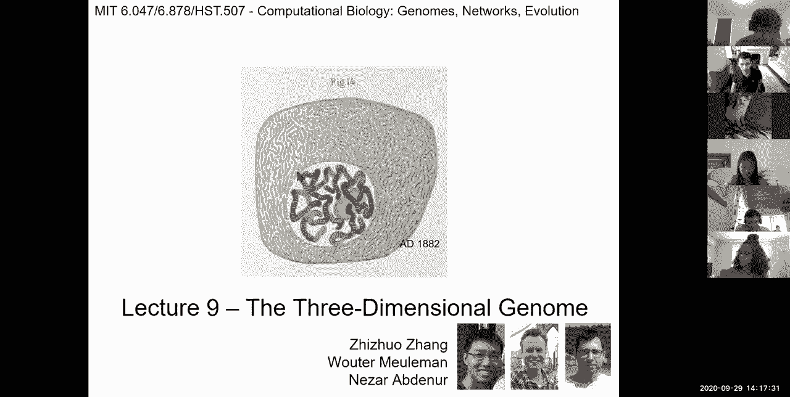
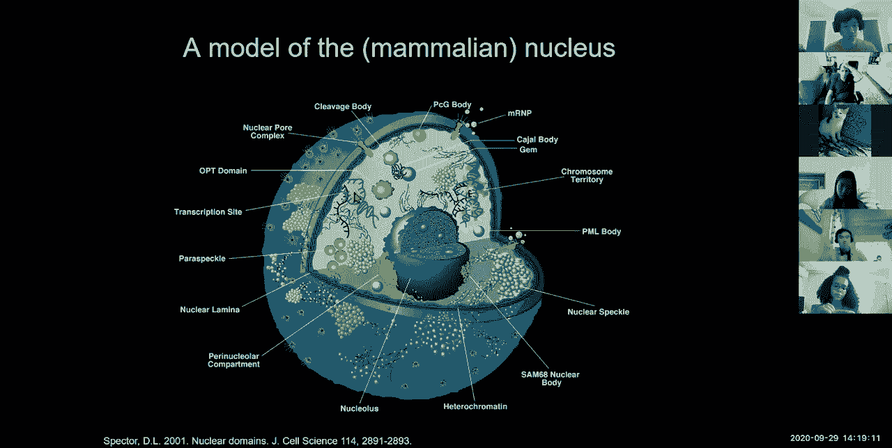
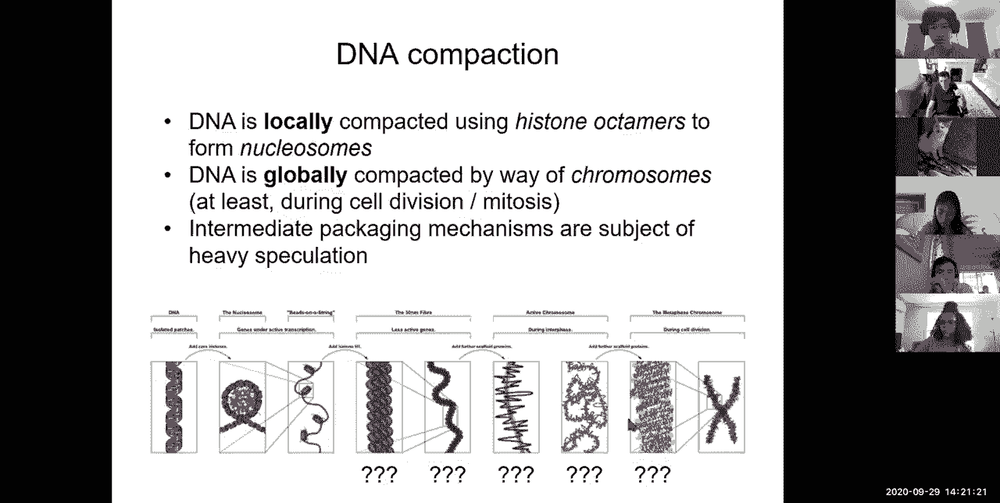
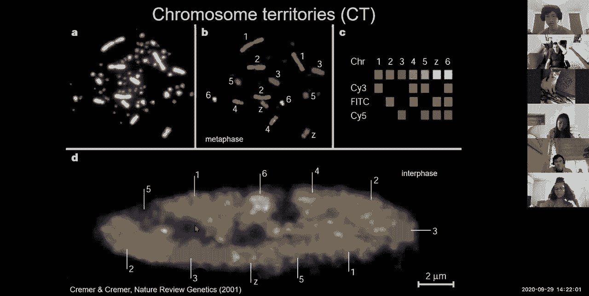
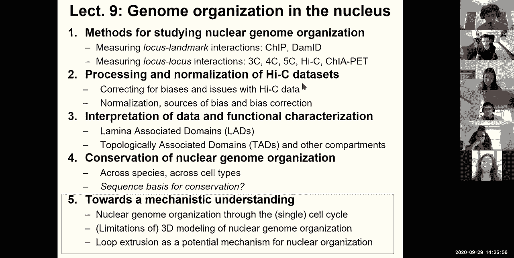

# 9：L9- 表观基因组学L2 部分和 3D 基因组 🧬

在本节课中，我们将继续学习表观基因组学。我们将探讨如何确定染色质状态模型的复杂度，如何跨多种细胞类型联合学习染色质状态，以及如何利用多细胞类型数据来解析增强子调控网络。最后，我们将转向三维基因组学，学习如何研究细胞核内基因组的空间组织。

上一节我们介绍了表观基因组学的基础知识、数据生成和处理流程。本节中，我们来看看更高级的分析方法。

## 📊 模型复杂度选择

在上一讲中，我们学习了如何使用多元隐马尔可夫模型来发现不同的染色质状态。一个关键问题是：我们如何确定模型中染色质状态的数量和所需的表观遗传标记？

一个简单的答案是，这取决于输入数据的丰富程度以及我们解释生物学差异的能力。输入数据越多，区分不同状态的能力就越强。然而，传统的机器学习模型选择标准（如贝叶斯信息准则）在基因组这种极其复杂的数据上往往倾向于选择越来越多的状态，难以确定一个合理的阈值。

因此，我们需要其他指标。一个有用的技巧是评估模型是否捕获了不同标记之间的依赖关系。

以下是评估模型捕获标记间依赖关系的方法：
1.  计算每个染色质状态下，单个标记的预期出现频率（即发射概率）。
2.  基于这些单个频率的乘积，预测任意两个标记在该状态下共同出现的频率。
3.  将预测的共同出现频率与在该状态注释的基因组位置上实际观察到的共同出现频率进行比较。

如果模型能很好地捕获标记间的依赖关系，预测值和观测值将落在对角线上。如果存在大量偏离对角线的点，则说明当前模型复杂度不足以捕获这些标记组合关系，可能需要增加状态数量。

为了解决随机初始化对模型结果的影响，并更稳健地选择模型复杂度，可以采用一种称为“嵌套初始化”的计算技巧。

以下是嵌套初始化的步骤：
1.  首先，学习一个包含大量状态（例如80个）的模型，以捕获所有可能的相关状态。
2.  然后，采用贪心策略，逐步剔除信息量最少的冗余状态。
3.  最终，基于生物学的可解释性，选择一个主观的截止点来确定最终的状态数量。

这种方法比随机初始化更稳健，能更一致地捕获关键的染色质状态。

## 🔗 跨细胞类型的联合学习

之前的学习都是针对单一细胞类型。现在，我们希望利用多种细胞类型的数据进行联合学习，以确保染色质状态定义的一致性，并研究其动态变化。

主要有三种策略来实现跨细胞类型的染色质状态联合学习。

以下是三种主要的联合学习策略：
1.  **独立学习后聚类**：在每个细胞类型中独立学习一个染色质状态模型（例如15个状态），然后基于发射概率矩阵或基因组注释的后验概率对所有模型进行聚类，将相似的州合并。
2.  **堆叠法**：将所有细胞类型的所有标记数据堆叠成一个很长的向量，让每个隐藏状态发射这个完整向量。这种方法会组合性地增加状态数量（同时捕获元件类别和细胞类型特异性），在细胞类型很多时难以扩展。
3.  **串联法**：将不同细胞类型的基因组数据像串联不同染色体一样串联起来，形成一个“巨型基因组”，然后在此之上学习一套共同的染色质状态定义。这种方法要求分析的标记相同，或能将缺失数据作为缺失值处理。这是目前最广泛采用的方法。

串联法确保了所有细胞类型使用共同的状态定义，便于直接比较。通过这种方法，我们可以将每个细胞类型总结为一条染色质状态轨道，然后比较不同细胞类型间相同基因组区域的状态变化（如从“预备启动子”变为“活跃启动子”或“抑制状态”）。

多细胞类型分析的强大之处在于，它允许我们寻找基因组不同位置之间**相关的活性模式**。例如，一个基因间增强子与某个基因在不同细胞类型中表现出同步的开启/关闭模式，这提示该增强子可能调控那个基因，而不是其物理位置上更近的其他基因。这种相关性分析有助于我们解析基因调控回路。

## 🧩 利用活性谱解析调控网络

通过跨细胞类型联合学习得到的染色质状态活性谱（即每个元件在不同细胞类型中是活跃还是沉默的向量），是解析增强子调控网络的强大工具。

我们可以利用这些活性谱做两件事：1）将增强子与其靶基因连接；2）将转录因子与其调控的增强子连接。

**连接增强子与靶基因**：通过计算增强子活性谱与附近基因表达谱在不同细胞类型间的相关性，可以推断增强子的靶基因。当增强子活性与某个基因的表达高度正相关时，该基因很可能是其靶标。

**连接转录因子与增强子**：这需要一个三向相关性分析。我们同时考察：1) 增强子的活性谱；2) 特定转录因子结合基序在该增强子区域的富集程度；3) 该转录因子自身的表达谱。如果三者呈正相关，则预测该因子是激活子；如果增强子活性与因子表达或基序富集呈负相关，则预测该因子是抑制子。

通过系统性地进行上述分析，可以预测调控特定细胞类型增强子模块的转录因子，并构建组织特异性的调控网络。

## 🔮 表观基因组插补

在实际项目中，我们可能无法在所有细胞类型中检测所有表观遗传标记。表观基因组插补技术旨在利用已测序标记在不同细胞类型间的相关性，来预测缺失的标记数据。

核心方法是使用**随机森林回归**等计算技术。预测一个目标细胞类型中的目标标记时，输入特征包括：
*   **同一细胞类型，不同标记**：其他标记在该细胞类型中的信号。
*   **不同细胞类型，同一标记**：目标标记在其他细胞类型中的信号。
*   **不同细胞类型，不同标记**：其他标记在其他细胞类型中的信号，它们与目标标记的相关性可作为信息。

通过这种方法，即使某些标记在特定细胞类型中未被实验检测，也能高精度地预测其信号。有趣的是，插补得到的数据有时甚至比低质量的实验观测数据更可靠，并且能更好地揭示细胞类型间的生物学关系。

## 🧵 三维基因组学简介

现在，我们将话题转向三维基因组学，研究细胞核内基因组的空间组织。DNA在细胞核内并非随机分布，而是高度有序地折叠和包装。

研究三维基因组的主要实验方法分为两类：基于标记的方法和基于相互作用的方法。

以下是研究三维基因组的主要实验方法：
1.  **基于标记的方法（如DamID）**：以核纤层等细胞核结构为“地标”，通过类似于染色质免疫沉淀的技术，找出与这些地标相互作用的基因组区域，从而定义如**核纤层关联域**。
2.  **基于相互作用的方法（如Hi-C）**：通过甲醛交联将空间上临近的DNA片段“粘”在一起，随后将DNA片段化并重新连接，形成嵌合片段，最后通过高通量测序鉴定这些相互作用。这可以系统性地绘制全基因组范围的染色质互作图谱。

通过Hi-C数据分析，可以揭示三维基因组的几个关键特征：

以下是三维基因组的关键特征：
*   **区室化**：基因组被分为两个主要区室。A区室（活跃）基因丰富、染色质开放，通常位于核中央；B区室（抑制）基因贫乏、染色质紧凑，常位于核周边。
*   **拓扑关联域**：染色体被进一步划分为一些亚区域，域内的DNA片段彼此频繁互作，而与域外的片段互作较少。这些域被称为**拓扑关联域**。
*   **染色质环**：由CTCF蛋白和黏连蛋白复合物介导，形成更局部的、增强子-启动子之间的特异性环状结构，这对基因调控至关重要。

目前主流的“环挤压”模型认为，CTCF蛋白像锚点一样结合在DNA特定方向位点上，黏连蛋白复合物则像“转轴”一样将中间的染色质丝环化挤出，直至遇到CTCF锚点为止，从而形成TAD和染色质环。

研究表明，尽管基因组序列在进化中重排，但TAD边界和核纤层关联在人类和小鼠之间具有相当程度的保守性。有趣的是，预测一个区域是否与核纤层关联的最佳特征之一，竟然是其简单的AT碱基含量。

---

本节课中我们一起学习了如何选择染色质状态模型的复杂度，以及通过跨细胞类型联合学习来解析染色质状态动态和基因调控网络。我们还介绍了利用标记相关性进行表观基因组插补的强大技术。最后，我们探讨了三维基因组学的基本概念、研究方法和主要特征，包括区室、拓扑关联域和染色质环，以及它们对基因调控的重要意义。