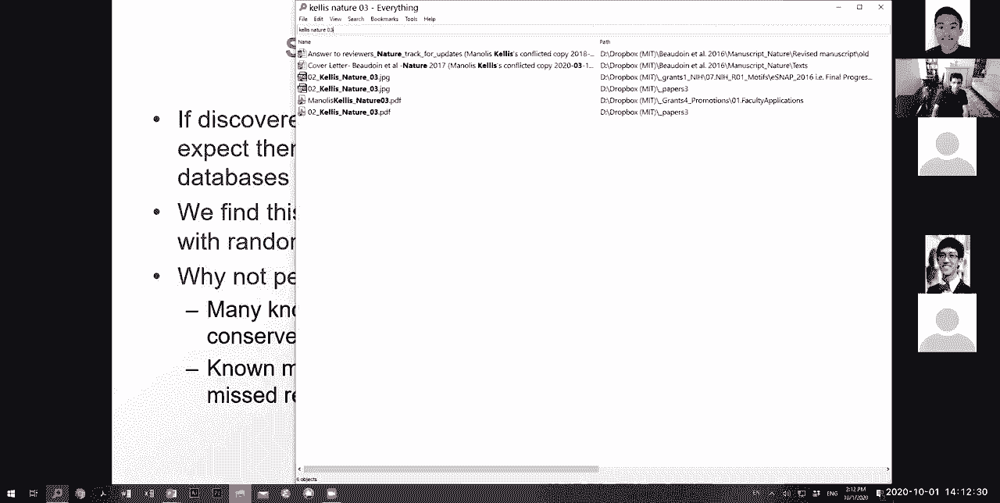
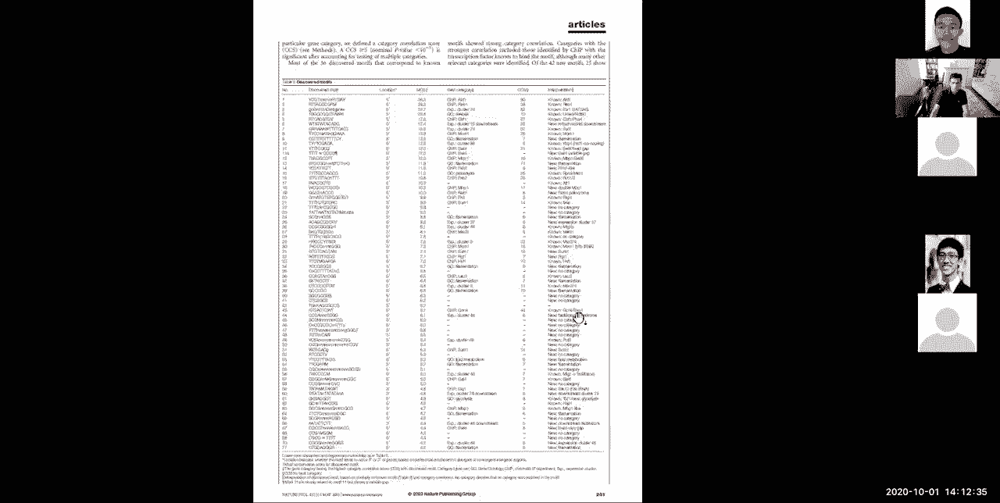
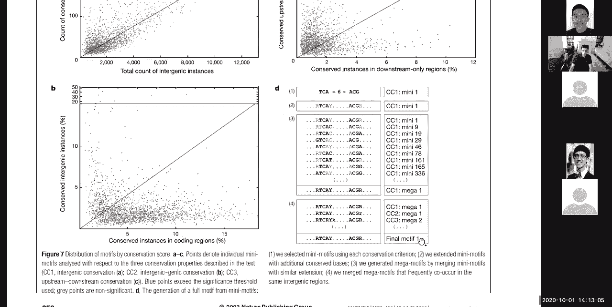
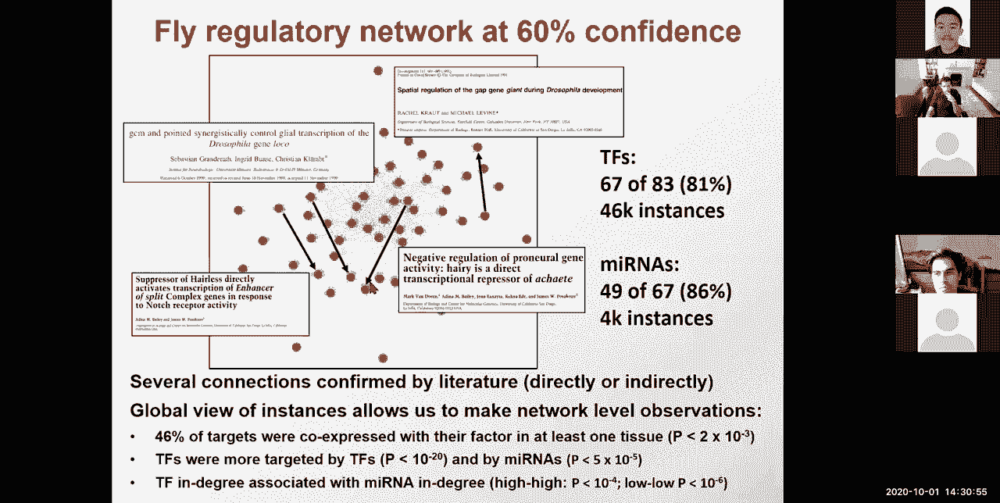

# 10：L10 - 调控基因组学与基序发现 🧬

在本节课中，我们将要学习调控基因组学的核心概念——基序。我们将探讨什么是调控基序，如何从共调控基因集中发现它们，以及如何利用进化特征在全基因组范围内进行从头发现和单个实例识别。最后，我们会介绍如何利用高通量实验从头解析调控区域。

***

## 什么是调控基序？🧩

调控基序是基因调控的基本构建模块。例如，在酵母中代谢半乳糖的GAL1基因，其调控区域包含GAL4启动子，该启动子结合一个回文序列基序。当转录因子结合这些基序时，它们会招募大量机制，最终在基因启动子处启动转录和翻译。

基因根据环境变化开启或关闭。基因组中没有直接的寻址机制，基因内部包含被称为基序的序列标签。专门的蛋白质（即转录因子）识别这些标签。基序发现之所以困难，是因为基序通常很短，有时具有简并性（例如，允许A或T），可以包含任何核苷酸组合，并且可以在目标基因上游或下游的可变距离处发挥作用。

基序无处不在：它们存在于启动子区、增强子区、剪接信号（供体、受体、分支点）以及外显子和内含子内部。此外，3‘ UTR中也存在被microRNA识别的基序。所有这些基序的共同点是：它们是可以在不同位置出现且可能简并的模式。

***

## 如何发现基序？🔍

转录因子利用DNA结合域识别基因组中特定的DNA序列。这种识别发生在闭合的DNA双螺旋上，转录因子与特定残基接触，接触的具体情况决定了基序的形状和特异性。例如，如果一个位置标明“T或C”，则意味着转录因子在该位置喜欢识别T和C共有的原子，这导致了基序的简并性。

我们通常使用基序标识图来可视化和理解基序。基序的序列直接由转录因子的结构决定。这些调控基序在基因调控中至关重要。在全基因组关联研究中，绝大多数与复杂性状相关的遗传变异位于非编码区，它们通常通过破坏这些调控基序来发挥作用。

***

### 基序的表示：位置权重矩阵

基序通常使用位置权重矩阵（PWM）来总结转录因子的结合特异性。PWM告诉我们，在实验确定的结合位点中，每个核苷酸在每个位置出现的频率。

我们可以将基序标识图视为一个生成模型：它概括了产生基序实例的生成过程。标识图中每个位置的高度是信息量的度量，它表示在该位置有多少比特的信息。这直接源于信息论，并假设每个位置独立于其他位置（位置独立性）。

***

## 基序发现的挑战与方法 🧪

基序发现面临三个核心对象的挑战：
1.  **基序**：生成模型。
2.  **靶标**：基序的单个实例。
3.  **调控因子**：结合并识别基序的蛋白质。

根据已知信息的不同，有不同的发现路径：
*   **已知靶标，寻找基序**：在共调控基因或结合区域中寻找富集的模式。
*   **已知基序，寻找靶标**：使用进化特征或序列组成进行全基因组扫描。
*   **已知调控因子，寻找基序**：使用SELEX或蛋白质结合微阵列等实验技术。
*   **已知调控因子，寻找靶标**：使用ChIP-chip或ChIP-seq，或通过扰动实验观察基因表达变化。

本节课我们将重点介绍两种基于区域发现基序的计算方法：期望最大化算法和吉布斯采样。

***

## 方法一：基于共调控基因集的基序发现 🧬

当我们有一组共表达或功能相关的基因时，我们假设驱动它们的是结合在每个基因启动子区的同一个转录因子。计算问题是：给定一组共调控基因，如何在它们的启动子区域找到共同的基序。

一种强大的方法是迭代优化：如果我们知道基序实例的确切起始位置，就很容易通过计数推导出PWM（基序）；反之，如果我们知道PWM，就可以通过扫描序列找到起始位置。当我们两者都不知道时，可以迭代进行估计。

### 期望最大化算法

期望最大化算法是一种迭代方法：
1.  **初始化**：随机猜测一个基序PWM或起始位置。
2.  **E步（期望步）**：给定当前PWM，估计每个序列中基序起始于每个位置的概率（后验概率）。
3.  **M步（最大化步）**：利用E步计算出的加权起始位置，更新PWM（最大似然估计）。
4.  **迭代**：重复E步和M步，直到PWM和起始位置收敛。

**核心公式**：计算序列 *i* 中基序起始于位置 *j* 的后验概率 *z_ij*：
`P(z_ij=1 | 序列, PWM) ∝ P(序列片段 | PWM) * P(起始先验)`

期望最大化算法会收敛到似然函数的一个局部极大值，但它对初始值敏感，可能陷入局部最优。

***

### 吉布斯采样

吉布斯采样是期望最大化的一种随机类比，属于马尔可夫链蒙特卡洛方法。它同样迭代，但在每一步不是使用所有起始位置的加权平均，而是随机抽样一个起始位置。

**步骤**：
1.  随机选择每个序列中的一个起始位置。
2.  随机移除一个序列，用剩余序列的起始位置计算一个临时PWM。
3.  根据这个临时PWM，在移除的序列中抽样一个新的起始位置（概率与匹配得分成正比）。
4.  将该序列与新起始位置放回，重复步骤2-3。

吉布斯采样通过允许“侧向移动”，更不容易陷入局部最优，有时能找到全局更优解。流行的工具如AlignACE和BioProspector就使用了吉布斯采样。

***

上一节我们介绍了在已知共调控基因集的情况下，如何利用期望最大化或吉布斯采样发现基序。接下来，我们将看看另一种不依赖于特定基因集的全基因组方法。

***

## 方法二：基于进化特征的从头基序发现 🌍

这种方法利用比较基因组学。其动机是：单个基序实例在基因组的一个位置可能因偶然或其它功能（如RNA结构）而保守。但真正的调控基序会在基因组多个位置反复出现，并且这些实例会表现出独特的进化特征。

**核心思想**：在全基因组范围内评估基序模式的保守性，而不仅仅是看单个位点。

**早期研究（以酵母GAL4为例）**：
*   发现GAL4基序在基因间区的保守性（13%）远高于具有类似属性的随机控制基序（2%），富集了6倍。
*   相反，GAL4基序在蛋白质编码区内的保守性反而低于控制基序，表明它倾向于不在编码区结合。

**方法流程**：
1.  **枚举种子**：系统性地枚举所有可能的短序列模式（如三核苷酸间隔三核苷酸的模式）。
2.  **评估保守性**：对于每个种子模式，检查它在全基因组多个同源区域是否保守。
3.  **扩展与聚类**：将保守的种子模式向两侧扩展，纳入附近同样保守的核苷酸，形成更长的“超级基序”。然后将相似的超级基序聚类，得到最终的基序集合。
4.  **功能注释**：通过与已知基序数据库比对、基因本体富集分析、基因表达谱关联等方法，推测新发现基序的功能。

这种方法能够完全从头发现一个物种中的调控基序目录，无需预先知道转录因子或共调控基因集。

***

## 识别单个基序实例：进化足迹 👣

现在我们知道了某个转录因子的结合基序（PWM），如何在全基因组中精确找到它的功能结合位点（靶标）？

实验方法（如ChIP-seq）受限于抗体、组织和发育阶段。计算方法可以利用进化信息。

**挑战**：基序实例并非总是完美保守，它们可能发生突变（只要在基序简并性允许范围内）、在附近移动，甚至在部分物种中丢失。

**解决方案：分支长度评分法**
1.  **独立扫描**：在多个物种的基因组中，独立扫描给定的基序PWM，找到所有超过一定阈值的匹配位点。
2.  **构建系统发育树**：对于基因组中的每个同源区域，检查每个物种中是否存在该基序的匹配。
3.  **计算分支长度**：在系统发育树上，对存在基序匹配的分支长度进行求和。这个总分就是该位点的“分支长度评分”（BLS）。BLS越高，说明该基序实例在进化中保守的时间越长。

**处理背景噪声：置信度评分**
不同基序（长短、组成不同）的BLS直接比较没有意义。短基序可能偶然保守。因此，需要将BLS转换为统一的置信度。

**步骤**：
1.  **生成控制基序**：通过对原始基序PWM进行多次“洗牌”（保持核苷酸频率等属性），生成数百个控制基序。
2.  **计算控制基序的BLS分布**：用同样的方法计算所有控制基序在全基因组中的BLS分布，这代表了“偶然保守”的背景噪声水平。
3.  **计算置信度**：对于原始基序的每个BLS值，计算达到该BLS的实例中，有多少比例超过了控制基序的预期数量。置信度 = 1 - 假发现率。

置信度评分提供了一个与基序属性无关的统一指标。利用置信度，我们可以：
*   发现高置信度的基序实例。
*   验证其生物学合理性：例如，高置信度的转录因子基序实例富集在启动子和5‘ UTR，而microRNA基序实例富集在3’ UTR。
*   与实验数据（如ChIP-seq峰）进行对比验证，发现置信度越高的预测位点，与实验数据的重叠富集越强。

通过这种方法，我们可以大规模地鉴定转录因子与其靶基因之间的调控关系，从而构建基因调控网络。

***

## 总结 📚

本节课我们一起学习了调控基因组学的核心——基序。

1.  **基序的定义与重要性**：调控基序是短的、可能简并的DNA序列模式，是转录因子结合的位点，构成了基因调控电路的基础，并与许多疾病相关。
2.  **基序的表示**：使用位置权重矩阵和基序标识图来概括基序的特异性。
3.  **基于共调控基因集的发现**：
    *   **期望最大化算法**：迭代估计基序PWM和起始位置，可能陷入局部最优。
    *   **吉布斯采样**：一种随机采样方法，能更有效地探索解空间，避免局部最优。
4.  **基于进化特征的从头发现**：通过在全基因组范围内评估短序列模式的重复性和保守性，无需先验知识即可发现新的调控基序。
5.  **单个实例的识别**：利用多物种比较基因组学，通过分支长度评分和置信度计算，在全基因组中高精度地预测转录因子的功能结合位点。

这些计算方法为我们理解基因调控的序列基础、解析非编码区遗传变异的机制以及构建基因调控网络提供了强大的工具。