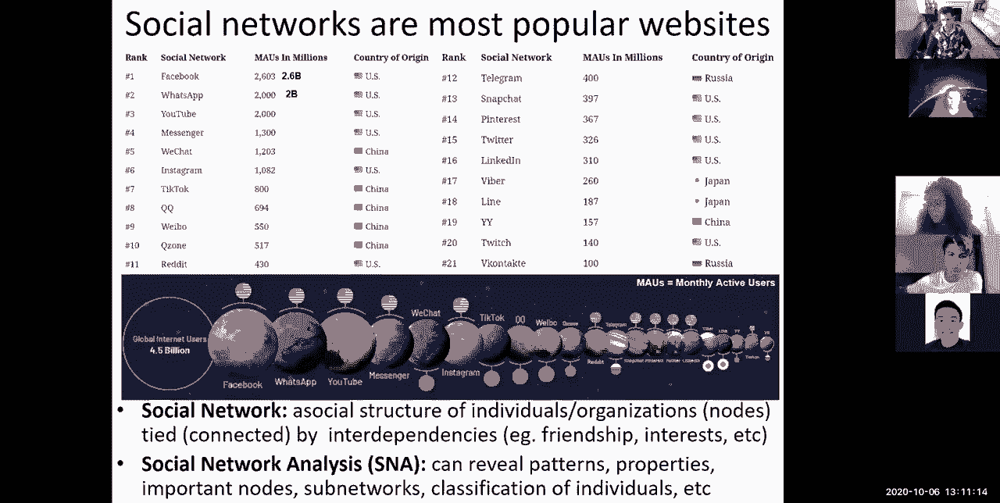
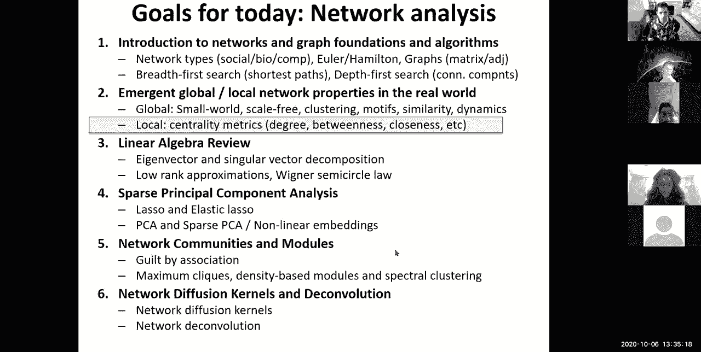
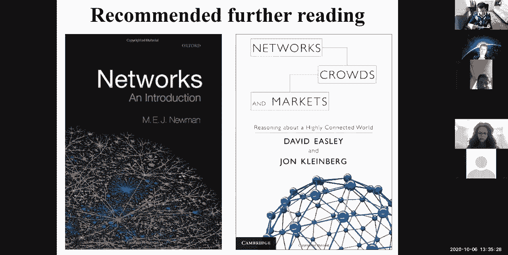
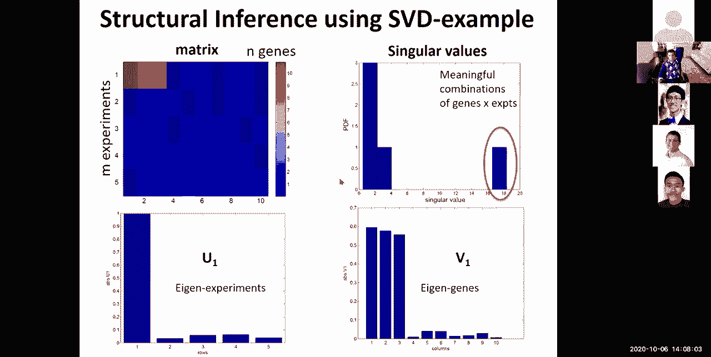
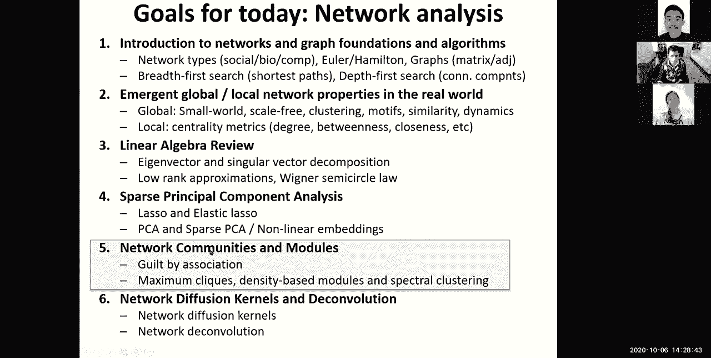
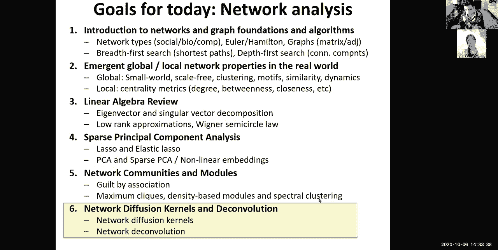

# 11：L11 - 网络分析基础与应用 📚


在本节课中，我们将学习网络分析的基础知识、核心算法及其在生物学等领域的应用。我们将从图论基础开始，探讨网络的不同类型和表示方法，然后深入到网络的全局与局部性质、线性代数在网络分析中的应用，以及社区发现等高级主题。



---

## 🌐 网络与图论基础

网络无处不在，从社交关系到生物调控，都可以用图来抽象表示。一个图由一组**节点**（代表实体）和一组**边**（代表关系）构成。

以下是图的基本类型：
*   **无向图**：边没有方向，关系是对称的。
*   **有向图**：边有方向，关系是非对称的。
*   **加权图**：边带有权重，表示关系的强度。
*   **简单图**：没有自环和多重边。

我们可以用**邻接矩阵**来表示图。对于一个有 `n` 个节点的图，邻接矩阵 `A` 是一个 `n x n` 的矩阵，其中 `A[i][j]` 表示从节点 `i` 到节点 `j` 的边的权重（对于无权重图，通常为1或0）。

```python
# 一个无向无权图的邻接矩阵示例
A = [
    [0, 1, 1, 0],
    [1, 0, 1, 1],
    [1, 1, 0, 0],
    [0, 1, 0, 0]
]
```

节点的**度**是指与其相连的边的数量。在有向图中，分为**入度**（指向该节点的边数）和**出度**（从该节点指出的边数）。

---

## 🔍 基本图算法：广度优先与深度优先搜索

上一节我们介绍了图的表示，本节中我们来看看两种基础的图遍历算法。

**广度优先搜索** 从一个起始节点开始，逐层探索其邻居。它常用于寻找最短路径。
**深度优先搜索** 则沿着一条路径深入探索到底，然后回溯，常用于拓扑排序或寻找连通分量。





以下是两种算法的核心思想对比：
*   **BFS**：使用队列，保证按距离起始点的层次顺序访问节点。
*   **DFS**：使用栈（或递归），尽可能深地探索图的分支。

---

## 🌍 网络的涌现性质

现实世界中的网络，无论属于哪个领域，都展现出一些共同的宏观和微观性质。

**全局性质**包括：
*   **小世界现象**：网络中任意两个节点之间通常存在较短的路径。
*   **无标度特性**：网络中少数节点（枢纽）拥有大量的连接，而大多数节点连接很少。节点度的分布常遵循幂律分布。
*   **聚类系数**：衡量节点的邻居之间也相互连接的概率，反映了网络的局部紧密程度。
*   **网络模体**：在真实网络中反复出现、具有特定功能的小型连接模式。

**局部性质**主要指节点的**中心性**，用于衡量节点的重要性。常见度量包括：
*   **度中心性**：节点的连接数。
*   **介数中心性**：经过该节点的最短路径数量。
*   **接近中心性**：该节点到网络中所有其他节点平均距离的倒数。
*   **特征向量中心性**：一个节点的中心性是其邻居中心性的加权和。

---

## 📊 网络的线性代数视角

我们可以用线性代数的工具来分析和操作网络。邻接矩阵 `A` 本身就是一个线性算子。

将网络视为矩阵后，我们可以分析其**特征值**和**特征向量**。对于一个方阵 `A`，如果存在一个非零向量 `v` 和一个标量 `λ`，使得 `A * v = λ * v` 成立，那么 `v` 就是 `A` 的特征向量，`λ` 是对应的特征值。特征向量指示了网络中的主要“振动模式”或影响力扩散的方向。

对于非方阵或更一般的矩阵，我们使用**奇异值分解**。SVD 将任意矩阵 `M` 分解为三个矩阵的乘积：`M = U * Σ * V^T`。其中 `U` 和 `V` 是正交矩阵，`Σ` 是对角矩阵，其对角线上的值称为奇异值。SVD 是进行**低秩近似**的强大工具，可以用于降维和去噪。

---

## 🎯 降维与稀疏表示

上一节我们介绍了SVD，本节中我们来看看如何利用它进行降维，并引入稀疏性约束。



**主成分分析** 是常用的线性降维方法，它本质上是数据协方差矩阵的特征值分解，寻找方差最大的投影方向。然而，PCA 得到的主成分是所有原始变量的线性组合，通常不稀疏，难以解释。

**稀疏PCA** 通过引入 `L1` 正则化（Lasso）约束，迫使主成分的载荷向量变得稀疏，即只有少数变量具有非零权重。这提高了模型的可解释性。其优化问题可以表述为在重建误差和系数稀疏性之间取得平衡。

除了线性方法，还有**非线性降维**，如 **t-SNE**。t-SNE 专注于保持高维数据点之间的局部邻近关系，将其映射到低维空间（如2D或3D），特别适用于可视化复杂的高维数据集，如单细胞基因表达数据。

---

## 🧩 网络社区发现：谱聚类

网络中的一个核心任务是发现其中紧密连接的子图，即**社区**。**谱聚类** 是一种基于图拉普拉斯矩阵特征向量的有效社区发现方法。

首先，我们定义图的**拉普拉斯矩阵** `L = D - A`，其中 `D` 是度矩阵（对角矩阵），`A` 是邻接矩阵。拉普拉斯矩阵具有一些重要性质，例如所有行和为零，并且是半正定矩阵。

谱聚类的关键步骤是：
1.  计算拉普拉斯矩阵 `L`。
2.  计算 `L` 的前 `k` 个最小特征值对应的特征向量。
3.  将这些特征向量按列排列，形成一个 `n x k` 的矩阵。
4.  将这个矩阵的每一行视为 `k` 维空间中的一个点，使用传统的聚类算法（如K-Means）对这些点进行聚类。

这样，图节点的聚类问题就转化为了特征向量空间中点的聚类问题。拉普拉斯矩阵的第二小特征值对应的特征向量（称为**费德勒向量**）通常给出了图的一个最优二分切割。



---


## 📝 总结




本节课中我们一起学习了网络分析的核心内容。我们从图的基本定义和表示出发，介绍了BFS和DFS等基础算法。然后，我们探讨了现实世界网络的小世界、无标度等涌现性质，以及度量节点重要性的各种中心性指标。接着，我们从线性代数的视角重新审视网络，学习了特征值分解、奇异值分解及其在低秩近似中的应用。在此基础上，我们介绍了带有稀疏约束的PCA和非线性降维方法t-SNE。最后，我们学习了如何使用谱聚类这一基于图拉普拉斯矩阵的强大方法来发现网络中的社区结构。这些工具为理解和分析复杂的生物网络、社交网络等提供了坚实的基础。