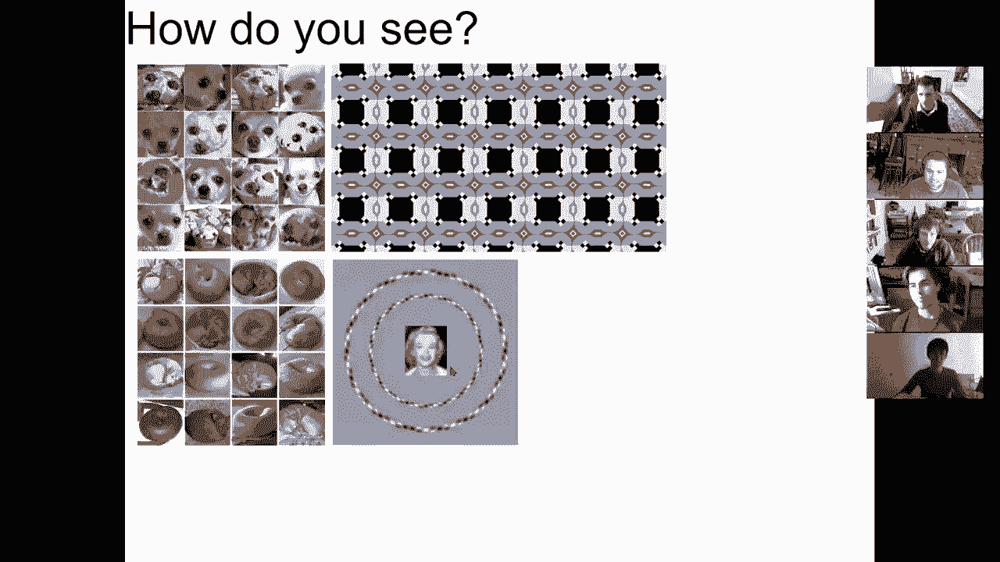
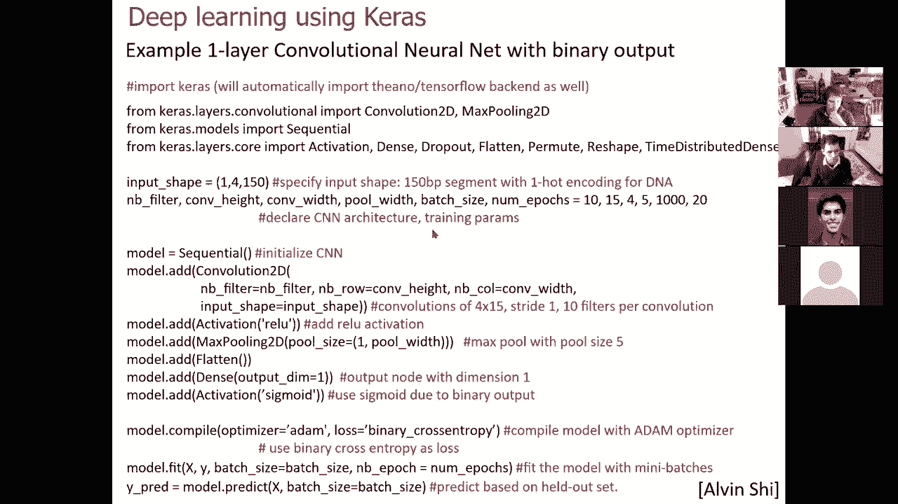
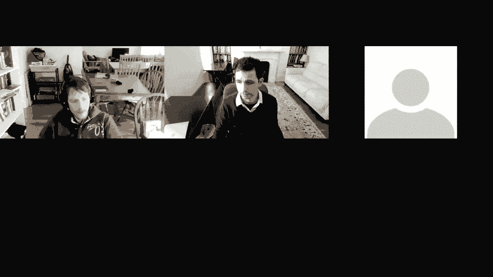

# 12：从基础到基因组学应用 🧠


在本节课中，我们将学习深度学习的基础概念、核心架构及其在基因组学领域的应用。课程内容涵盖从受监督学习到无监督学习，再到现代深度学习架构的演变。

***

## 🧬 课程概述



本节课将介绍深度学习的基本原理，包括受监督学习、无监督学习、卷积神经网络、循环神经网络、迁移学习以及生成对抗网络。我们还将探讨这些技术在调控基因组学中的应用，并提供实用的计算工具和代码示例。

***

## 🧠 受监督学习与神经网络

上一节我们介绍了课程的整体框架，本节中我们来看看受监督学习与神经网络的基础概念。

人类大脑在处理视觉信息时，能够从低级像素中抽象出高级概念，如物体和形状。这种能力启发了早期神经网络的设计。

### 人工神经元与感知机

人工神经元模拟生物神经元，接收多个输入，每个输入乘以一个权重，然后求和。如果总和超过某个阈值，神经元则“激活”并产生输出。

**公式**：
`输出 = 激活函数( Σ (权重_i * 输入_i) )`

### 激活函数

线性函数的表达能力有限。为了学习复杂的非线性关系，我们引入了激活函数。

以下是几种常见的激活函数：

*   **Sigmoid函数**：早期常用，将输入映射到0到1之间，模拟神经元的饱和状态。
*   **Softplus函数**：从0开始平滑过渡到线性区域。
*   **修正线性单元**：目前最常用，在输入小于0时输出为0，大于0时输出等于输入。

### 梯度下降与学习

学习的目标是调整权重，使网络的预测输出尽可能接近真实输出。

**核心思想**：计算预测输出与真实输出之间的误差，然后根据误差相对于每个权重的梯度来更新权重。

**权重更新公式**：
`W_t = W_{t-1} - ε * (∂误差/∂W) + 动量项 + 权重衰减项`

其中：
*   `ε` 是学习率，控制更新步长。
*   `∂误差/∂W` 是误差相对于权重的梯度。
*   动量项利用之前的更新方向来加速收敛并减少震荡。
*   权重衰减项惩罚较大的权重值，防止过拟合。

### 反向传播

反向传播是一种高效计算网络中所有权重梯度的方法。它首先进行前向传播计算输出和误差，然后从输出层向输入层反向传播误差，并利用链式法则计算每个权重的梯度。

### 避免过拟合

神经网络参数众多，容易对训练数据过拟合，导致在新数据上表现不佳。

以下是避免过拟合的几种策略：

*   **划分数据集**：将数据分为训练集、验证集和测试集。用验证集监控模型性能并决定何时停止训练，用测试集进行最终评估。
*   **正则化**：如L1、L2正则化，惩罚大的权重值。
*   **Dropout**：在训练过程中，随机“丢弃”网络中的一部分神经元。这相当于同时训练多个子网络，是一种强大的正则化方法，能防止网络对某些特定神经元过度依赖。

***

## 🔍 无监督学习与深度信念网络

上一节我们介绍了受监督学习，本节中我们来看看如何在没有标签的情况下学习数据的内在表示。

### 受限玻尔兹曼机

受限玻尔兹曼机是一种无监督学习模型，包含一层可见单元和一层隐藏单元。它学习可见单元和隐藏单元之间的联合概率分布，从而发现数据中的特征。

### 深度信念网络

通过堆叠多个RBM，可以构建深度信念网络。较低层的RBM学习低级特征，较高层的RBM基于这些低级特征学习更抽象的特征。

### 学习技巧

*   **模拟退火**：在训练初期引入“噪声”，帮助模型跳出局部最优解；随着训练进行逐渐“降温”，使模型稳定在更好的解上。
*   **吉布斯采样**：一种从RBM中采样的方法，用于学习和推理。
*   **醒眠算法**：交替进行“醒”阶段和“睡”阶段来训练网络。

***

## 🎨 自编码器

自编码器是一种通过“自我重建”来学习数据表示的神经网络。

**核心思想**：将输入数据压缩到一个低维的“瓶颈”层，然后再重建回原始维度。通过最小化重建误差，网络被迫学习输入数据最重要、最具代表性的特征。

自编码器可以用于数据降维、去噪或作为其他任务的预训练步骤。

***

## 🖼️ 现代深度学习架构：卷积神经网络

上一节我们探讨了无监督表示学习，本节中我们来看看专门为图像数据设计的强大架构——卷积神经网络。

CNN的灵感来源于视觉皮层，它通过卷积核在图像上滑动来检测局部特征。

### 核心操作

*   **卷积**：使用一组可学习的滤波器在输入图像上滑动。每个滤波器负责检测一种特定的局部模式。
*   **激活函数**：对卷积结果应用非线性激活函数。
*   **池化**：对局部区域进行下采样，常用最大池化或平均池化。这能提供平移不变性并减少参数数量。

一个典型的CNN由多个“卷积-激活-池化”块堆叠而成，后面连接一个或多个全连接层用于最终分类。

### 关键优势

*   **参数共享**：同一个滤波器在整个图像上使用，极大地减少了参数量。
*   **局部连接**：每个神经元只与输入图像的局部区域连接，这符合图像的空间局部性。
*   **层次化特征**：底层学习边缘、颜色等低级特征，高层组合这些低级特征形成物体部件等高级特征。

### 经典网络演进

从AlexNet、VGGNet到GoogleNet、ResNet，网络层数不断加深。ResNet引入了“残差连接”，允许信息跨层直接传播，有效缓解了深度网络中的梯度消失问题，使得训练成百上千层的网络成为可能。

***

## ⏳ 现代深度学习架构：循环神经网络

上一节我们学习了处理空间数据的CNN，本节中我们来看看处理序列数据的循环神经网络。

RNN专为处理序列数据设计，如文本、语音、时间序列等。其核心思想是网络不仅接收当前输入，还接收上一个时间步的“隐藏状态”，从而拥有记忆能力。

### 长期依赖问题与LSTM

基本RNN难以学习长序列中的长期依赖关系，因为梯度在反向传播时会消失或爆炸。

**长短期记忆网络**通过引入“门”机制来解决这个问题：

*   **遗忘门**：决定从细胞状态中丢弃哪些信息。
*   **输入门**：决定哪些新信息存入细胞状态。
*   **输出门**：基于细胞状态决定输出什么。

LSTM单元能够有选择地保留和传递信息，从而有效地学习长期依赖。

### 双向RNN与架构组合

双向RNN同时从序列的前向和后向处理信息，能获得更丰富的上下文。RNN/LSTM常与CNN组合使用，例如用CNN处理视频的每一帧，再用RNN学习帧之间的时序关系。

***

## 🔄 迁移学习

迁移学习旨在将一个任务上训练好的模型知识，迁移到另一个相关任务上。

**典型做法**：
1.  在一个大型通用数据集上预训练一个深度网络。
2.  移除网络的最后几层。
3.  将预训练网络的其余部分作为新任务的固定特征提取器，或者进行微调。
4.  为新任务添加并训练一个新的输出层。

这种方法在目标领域数据量较少时特别有效。

***

## 🎭 生成对抗网络

GAN由两个相互对抗的网络组成：
*   **生成器**：学习从随机噪声生成逼真的数据。
*   **判别器**：学习区分真实数据和生成器产生的“假”数据。

两个网络在对抗中共同进步：生成器努力生成更逼真的数据以骗过判别器，判别器则努力提高鉴别能力。GAN能生成极其逼真的图像、音频等，也可用于数据增强。

***

## 🧬 深度学习在调控基因组学中的应用

现在，我们将上述工具应用于基因组学领域。

### 序列表示与卷积神经网络

DNA序列可以通过独热编码表示为一个4行（A、C、G、T）的矩阵。将这个矩阵视为一个“图像”，CNN的卷积核就相当于在自动学习DNA上的“基序”。

*   **低级卷积层**：学习类似于转录因子结合位点的简单序列模式。
*   **高级卷积层**：组合简单模式，识别更复杂的调控元件。
*   **全连接层**：基于学习到的特征预测特定生物学事件，如蛋白质结合、染色质可及性等。

### 多任务学习与蛋白质结构预测

可以训练一个网络同时预测多个细胞类型中转录因子的结合，共享的低层特征有助于提升各任务的性能。类似地，可以从蛋白质氨基酸序列预测其三维结构域和功能。

***

## 💻 深度学习计算工具与实践

现在有许多库简化了深度学习的实现：

*   **底层框架**：PyTorch, TensorFlow。它们提供自动微分和GPU加速。
*   **高级API**：Keras。它构建在TensorFlow等之上，提供了更简洁的接口。

以下是一个使用Keras构建简单CNN来预测DNA序列功能的示例代码框架：

```python
import keras
from keras.layers import Conv2D, MaxPooling2D
from keras.models import Sequential
from keras.layers import Activation, Dropout, Flatten, Dense

# 定义模型参数
input_shape = (4, 150, 1) # 4个通道（A,C,G,T），长度150
num_filters = 10
conv_width = 4
pool_width = 5

# 构建模型
model = Sequential()
model.add(Conv2D(num_filters, (conv_width, 4), padding='valid', input_shape=input_shape))
model.add(Activation('relu'))
model.add(MaxPooling2D(pool_size=(pool_width, 1)))
model.add(Flatten())
model.add(Dense(1))
model.add(Activation('sigmoid'))

# 编译模型
model.compile(loss='binary_crossentropy', optimizer='adam')

# 训练模型
# model.fit(X_train, y_train, batch_size=1000, epochs=20, validation_data=(X_val, y_val))

# 进行预测
# predictions = model.predict(X_test)
```

***

## 📚 课程总结

本节课我们一起学习了深度学习的广阔领域：



1.  **神经网络基础**：感知机、激活函数、梯度下降、反向传播以及应对过拟合的技术。
2.  **无监督学习**：深度信念网络和自编码器如何学习数据的内在表示。
3.  **现代架构**：
    *   **卷积神经网络**：用于处理图像和序列等具有空间/局部结构的数据。
    *   **循环神经网络与LSTM**：用于处理时间序列和文本等序列数据。
    *   **迁移学习**：利用预训练模型解决数据有限的新任务。
    *   **生成对抗网络**：用于生成新数据和数据增强。
4.  **基因组学应用**：如何将CNN等模型应用于DNA和蛋白质序列分析，以预测调控功能。
5.  **实践工具**：介绍了PyTorch、TensorFlow和Keras等库，并给出了一个简单的代码示例。




深度学习是一个强大且快速发展的工具集，正在推动从计算机视觉到基因组学等多个领域的进步。