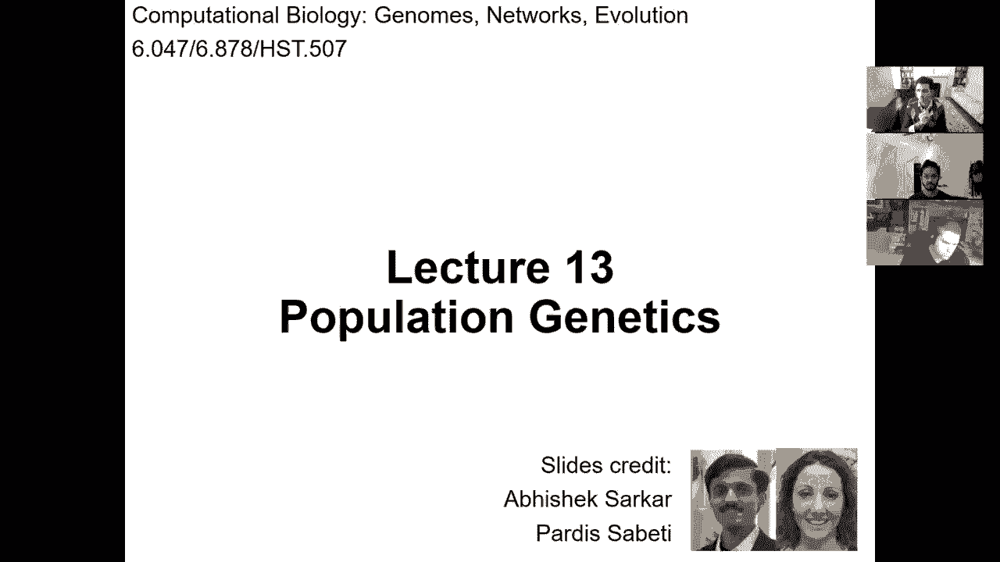
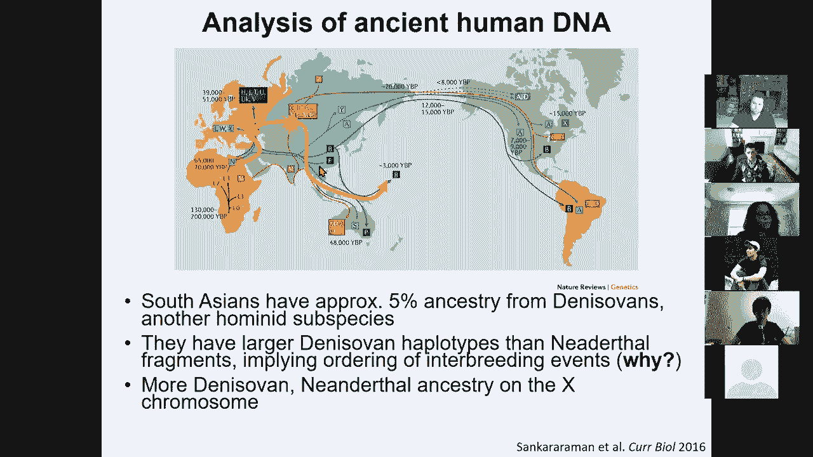

# 13：人类遗传变异与群体差异 🧬

在本节课中，我们将学习群体遗传学的基础知识，重点是人类遗传变异的测量、理解与量化。我们将回顾人类遗传学的历史，探讨不同类型的遗传变异，并学习如何检测和解读这些变异。此外，我们还将了解单倍型、连锁不平衡、基因型填充和定相等核心概念，以及它们如何帮助我们理解人类群体历史和关联研究。

---

## 遗传学历史与基础概念

上一节我们概述了课程内容，本节中我们来看看遗传学思想的发展历程。

遗传的概念早已被理解。人类长期对动植物进行选择性育种，例如将具有攻击性的动物驯化为人类最好的朋友，或将不可食用的类蜀黍培育成今天的主要粮食作物玉米。

*   古希腊时期已有关于物种起源和变化的早期理论。
*   亚里士多德是第一个对物种进行分类的学者。
*   拉马克提出了“用进废退”和获得性遗传的观点，但这缺乏现实基础。

达尔文的理论具有革命性。他提出了物种连续性的概念，认为随机突变是多样性的来源，自然选择在此基础上发挥作用。然而，达尔文的理论并不完整，他仍持有一些融合遗传和泛生论的观点。

与达尔文同时代，孟德尔首次认识到非融合的、离散的遗传单位（基因），以及显性与隐性等位基因的概念。他的独立分配定律揭示了遗传的“数字化”本质。然而，孟德尔的理论被忽视了约50年，因为当时观察到的大多是连续的表型性状，难以与离散遗传的概念调和。

直到20世纪，费希尔等人将孟德尔遗传与连续性状变异结合起来，认识到连续的表型变异可以由多个具有微小效应的孟德尔位点共同解释。

在DNA双螺旋结构被发现之前，理论上的重大飞跃已经发生。摩尔根和他的学生斯特蒂文特通过连锁作图，首次构建了遗传图谱，将基因定位在染色体上。

基于连锁作图的方法，20世纪80年代发生了孟德尔性状作图的革命，可以定位强效应的单基因孟德尔突变。随后，人类基因组测序的完成，以及通过大规模、非亲缘个体的全基因组关联研究，使我们能够发现具有微小效应的常见遗传变异。我们现在认识到，基因对我们的生理和认知有着巨大影响。

---

## 遗传变异的类型与影响

上一节我们回顾了遗传学思想的演进，本节中我们来看看遗传变异的具体形式及其生物学意义。

人类个体间99.9%的DNA是相同的。个体间的所有差异和疾病易感性都存在于剩下的不到0.1%的基因组中。这些变异有多种形式：

*   **单核苷酸多态性**：最常见，约每1000个碱基出现一次。公式表示为：`SNP位置：参考碱基 -> 替代碱基`。
*   **插入与缺失**：约每10,000个核苷酸出现一次。
*   **短串联重复序列**：约每1,000个碱基出现一次。
*   **结构变异/拷贝数变异**：通常大于5000个碱基对，缺失约每百万个碱基出现一次。

SNP的影响取决于其位置。在蛋白质编码区，约三分之一的变异会改变氨基酸，可能严重影响功能。例如，导致镰状细胞贫血的变异（`HBB基因：Glu6Val`）虽然有害，但在疟疾流行地区却被正向选择，因为杂合子个体对疟疾有抵抗力。

其他类型的变异也能导致严重疾病，例如亨廷顿病（CAG重复扩展）和囊性纤维化（CFTR基因缺失）。

---

## 等位基因的分类与频率谱

上一节我们介绍了变异的类型，本节中我们来看看如何描述和分类这些变异。

描述等位基因有多种方式：

*   **参考等位基因 vs. 替代等位基因**：是否与参考基因组序列匹配。
*   **主要等位基因 vs. 次要等位基因**：在群体中的频率高低。
*   **祖先等位基因 vs. 衍生等位基因**：与人类-黑猩猩最近共同祖先的序列比较。
*   **风险等位基因 vs. 保护等位基因**：与疾病关联的方向（依赖于环境）。

根据等位基因频率，可将其分类：

*   **常见等位基因**：频率 > 5%
*   **低频等位基因**：频率 0.5% - 5%
*   **罕见等位基因**：频率 < 0.5%
*   **私有或新生变异**：仅存在于单一个体或部分细胞（体细胞突变）

等位基因的频率与其效应大小通常存在权衡。常见等位基因通常效应微弱，而强效应等位基因通常罕见。这是因为自然选择会清除有害的常见变异。这是一个连续谱，大多数罕见变异效应也微弱，只是我们更容易发现强效应的罕见变异。一个罕见的例外是载脂蛋白E ε4等位基因，它常见且对阿尔茨海默病有强风险效应。

---

## 遗传变异的表示、检测与项目

上一节我们讨论了等位基因的频谱，本节中我们来看看如何表示、存储和检测这些变异。

人类是二倍体生物，每个个体在每个变异位点有两个等位基因（分别来自父母）。这些变异共同存在于作为单位遗传的**单倍型**中。**基因型**告诉我们在一个位点上拥有0、1或2个替代等位基因。从基因型推断单倍型的过程称为**定相**。

检测变异的第一步是对大量个体进行测序以发现变异。将测序读数比对到参考基因组后，需要区分真正的变异与测序错误，这个过程称为**变异检测**。GATK等工具使用生成模型和隐马尔可夫模型来推断最可能的单倍型和基因型。

发现变异后，可以针对已知变异设计更经济的基因分型芯片进行大规模分型。国际人类基因组单体型图计划（HapMap）和千人基因组计划等重大项目系统性地绘制了人类遗传变异图谱。千人基因组计划对全球26个亚群体的2500个低深度全基因组进行了测序，建立了庞大的变异目录和用于定相、填充的统计工具。

数据显示，非洲群体保留了最多的遗传多样性，而非洲以外群体的变异只是非洲多样性的一部分，这支持了“走出非洲”的迁徙模型。

---

## 单倍型、连锁不平衡与重组热点

上一节我们了解了如何检测变异，本节中我们来看看变异在基因组中是如何被共同继承的。

在减数分裂过程中，同源染色体之间会发生**重组**，这是染色体正确分离所必需的。重组并非随机发生，而是集中在特定的**重组热点**。这些热点由PRDM9蛋白结合特定DNA基序所决定，但PRDM9的结合会导致该基序被破坏，从而驱动了PRDM9蛋白及其识别基序的快速协同进化。

由于重组热点稀少，基因组被分割成**单倍型区块**。区块内的变异倾向于共同遗传，这种非随机关联称为**连锁不平衡**。

衡量LD的常用指标包括：

*   **D值**：衡量观察到的单倍型频率与随机组合预期频率的偏差。公式：`D = P(AB) - P(A)P(B)`
*   **D‘值**：D值标准化后的结果，范围在0到1之间。公式：`D' = D / Dmax`
*   **r²值**：两个位点等位基因之间的相关系数平方。公式：`r² = D² / (P(A)P(a)P(B)P(b))`

单倍型区块的存在意味着人类群体中实际存在的单倍型数量远少于理论上所有SNP组合的可能性。因此，我们只需检测每个区块中的少数几个标签SNP，就能推断出整个区块的单倍型信息。这既是祝福（降低成本），也是诅咒（难以精确定位致病变异），因为关联信号往往属于整个单倍型区块。

---

## 基因型填充与定相

上一节我们认识到只需检测部分SNP即可推断单倍型，本节中我们来看看实现这一推断的具体计算方法。

**基因型填充**的目标是根据已测量的部分SNP基因型，推断未测量的SNP基因型。这通常需要先解决**定相**问题，即确定每个等位基因分别来自哪条亲本染色体。

定相可以利用家系信息（如父母基因型）无歧义地解决部分位点。对于无亲缘关系的个体，则需要利用参考单倍型面板和连锁不平衡信息。核心思想是：个体的单倍型可以被视为从参考面板中拷贝片段拼接而成。重组事件对应于拷贝来源的切换。

基于隐马尔可夫模型的方法可以沿基因组滑动窗口，计算从不同参考单倍型拷贝的概率，从而推断出最可能的单倍型路径。一旦单倍型被确定，填充缺失的基因型就变得简单，只需从推断出的单倍型中拷贝相应等位基因即可。

---

## 群体亲缘关系、历史与祖先推断

上一节我们学习了如何推断个体的单倍型，本节中我们来看看如何利用遗传变异理解群体之间的关系和历史。

不同群体的遗传多样性不同。非洲群体拥有最高的遗传多样性，而其他群体由于“走出非洲”过程中的奠基者效应，多样性较低。通过分析基因组中变异位点的分布，可以估算历史上不同时期的**有效群体大小**，揭示群体扩张和瓶颈事件。

对于具有混合祖先的个体，我们可以将其基因组“描绘”成来自不同祖先群体的片段。这可以通过基于条件随机场等模型的程序（如RFMix）实现，该程序利用参考群体的等位基因频率来预测每个局部片段的来源群体。

对基因型矩阵进行**主成分分析**，可以揭示群体的遗传结构。例如，在欧洲样本中，前两个主成分往往对应地理上的南北和东西梯度，反映了历史上的迁徙模式。在关联研究中，这些主成分常作为协变量以控制群体分层造成的假阳性。

**群体间分化指数**用于量化群体间的遗传分化。通过分析线粒体DNA（母系遗传）和Y染色体DNA（父系遗传），可以追溯人类迁徙历史。研究还发现，现代非非洲人群的基因组中含有约2%的尼安德特人DNA，而某些亚洲人群则含有丹尼索瓦人的遗传成分，这证明了古代人类群体间的基因交流。

---

## 总结与展望

本节课中，我们一起学习了群体遗传学的核心内容。我们回顾了人类遗传学的历史，从孟德尔定律到现代全基因组关联研究。我们探讨了不同类型的遗传变异（SNP、Indel、STR、CNV）及其生物学影响，理解了等位基因频率与效应大小的权衡关系。

我们深入研究了单倍型、连锁不平衡和重组热点的生物学基础与计算方法，学习了如何通过基因型填充和定相从部分数据推断完整信息。最后，我们了解了如何利用遗传数据推断群体亲缘关系、历史迁徙事件和个体祖先成分，并认识到主成分分析在控制群体分层中的重要性。

这些关于遗传变异的知识为我们下一节课学习**表型变异**和疾病关联研究打下了坚实的基础。我们将学习如何将遗传变异与疾病、性状联系起来，开展全基因组关联研究，并理解其背后的生物学机制。