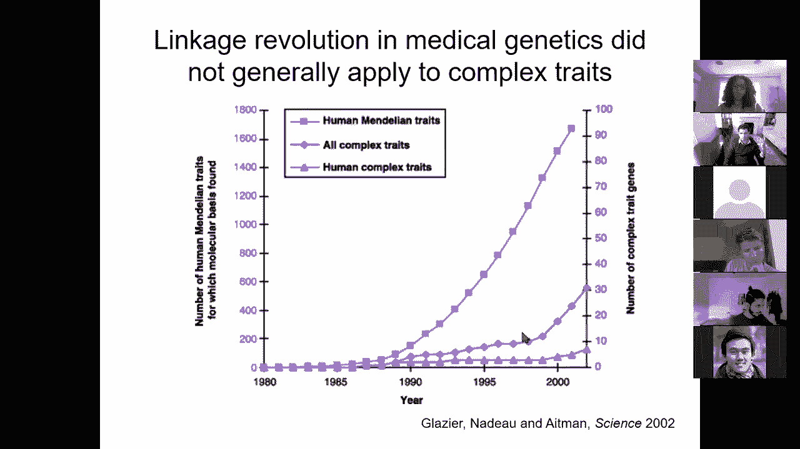
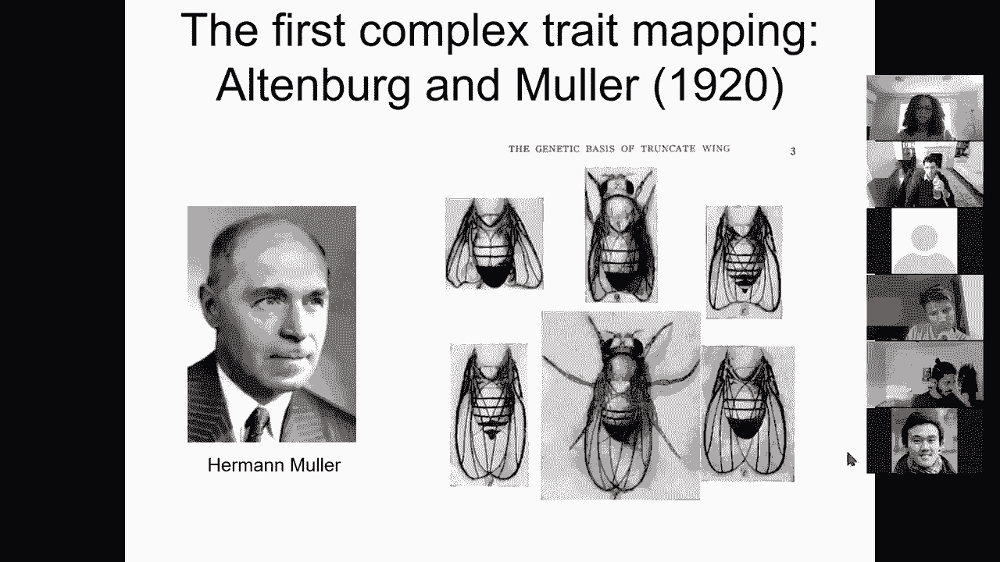
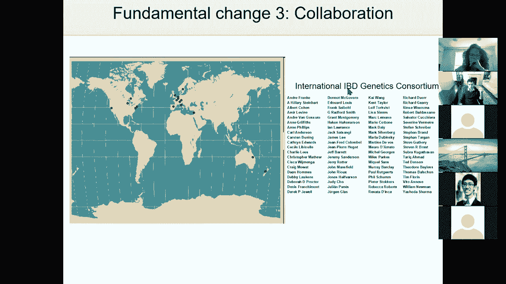
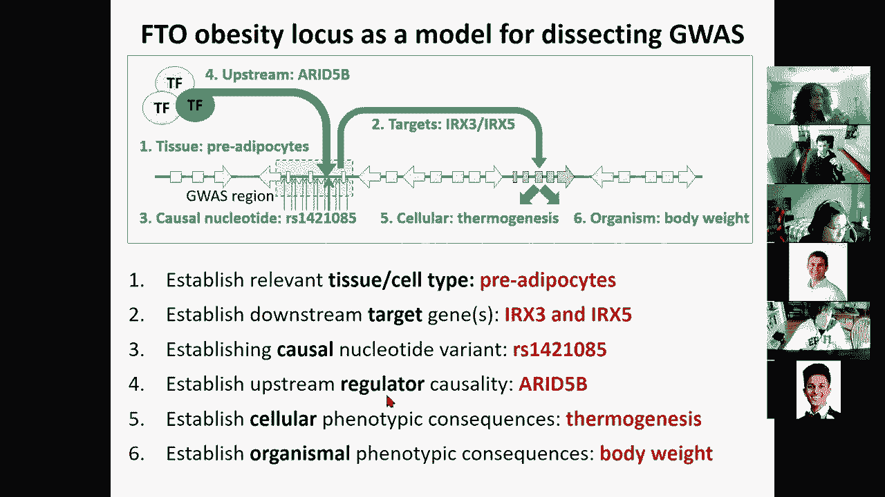

# 14：L14 - GWAS与疾病解析 🧬

在本节课中，我们将学习如何理解遗传变异与疾病之间的关系。我们将从孟德尔遗传学开始，探讨连锁分析如何用于定位疾病基因，然后转向现代遗传学，研究复杂性状和全基因组关联研究。最后，我们将深入探讨如何解释GWAS结果，将遗传位点与疾病机制联系起来，并通过具体案例展示如何从遗传变异走向功能解析。

---

## 🧬 第一部分：孟德尔性状与连锁分析

上一节我们介绍了遗传变异的基础。本节中，我们来看看如何利用孟德尔遗传学的原理，通过家族研究来定位与疾病相关的基因变异。

孟德尔遗传学的核心是认识到存在离散的遗传单位，这些单位的变异是可遗传的，并导致表型差异。它区分了基因型（个体生殖细胞内的遗传信息）和表型（基因型编码的可见特征）。关键概念包括显性与隐性（例如，大写字母代表显性等位基因，小写字母代表隐性等位基因），以及不同性状的独立分配。

然而，孟德尔遇到了“连锁”的概念，即某些性状对并非独立遗传，这违反了他的第二定律（独立分配定律）。原因在于这些基因在染色体上的物理距离不够远，在减数分裂中不易发生交叉互换。连锁强度反映了基因在染色体上的空间距离，这成为了构建遗传图谱的基础。

以下是连锁分析在孟德尔疾病研究中的应用要点：
*   **家族连锁研究**：利用已知的染色体标记（多态性位点），追踪这些标记与疾病状态的共分离现象，从而定位包含致病基因和突变的染色体区域。
*   **定位克隆**：通过连锁分析确定致病基因在染色体上的大致位置后，进一步克隆并鉴定该基因。
*   **适用性**：这种方法在定位高外显率的单基因遗传病（如亨廷顿病、囊性纤维化）方面取得了巨大成功。

---

## 🧬 第二部分：复杂性状与全基因组关联研究

上一节我们介绍了用于单基因病的连锁分析。本节中，我们来看看面对大多数常见疾病和复杂性状时，我们需要不同的方法。

大多数复杂性状并非由单个高外显率变异决定，而是具有极高的多基因性，每个基因的效应很小，并受到环境因素的影响，表现为连续分布。这意味着许多基因各自施加微小的影响，与环境因素结合共同决定个体结果。

进入21世纪初，人类基因组计划的完成、高通量基因分型芯片技术的发展以及大规模国际合作，共同推动了全基因组关联研究时代的到来。

进行GWAS的基本步骤包括严格的质量控制，然后对基因组中的每一个SNP进行统计检验。

核心的统计检验是卡方检验。其基本思想是，比较病例组和对照组中某个等位基因的频率是否存在显著差异。公式可以简化为观察值与期望值偏差的平方和除以期望值：

`χ² = Σ (Oᵢ - Eᵢ)² / Eᵢ`

其中，Oᵢ 是观察到的计数，Eᵢ 是在无效假设（即无关联）下的期望计数。

然而，GWAS面临一个关键挑战：多重假设检验。当对数百万个SNP进行检验时，即使没有真实关联，仅凭偶然性也会产生许多看似显著的结果。为此，领域内设定了严格的“全基因组显著性”阈值（通常为 `p < 5 × 10⁻⁸`），以控制假阳性率。

结果通常以“曼哈顿图”展示，其中每个点代表一个SNP，X轴是染色体位置，Y轴是关联显著性的负对数。显著超越阈值的峰值代表可能的疾病关联位点。

另一个重要工具是QQ图，用于评估观察到的检验统计量分布与期望分布（在无效假设下）的一致性，帮助判断是否存在系统性误差或真实的遗传信号。

---

## 🧬 第三部分：精细定位与多研究整合

上一节我们介绍了如何发现GWAS信号。本节中，我们来看看如何从关联区域 pinpoint 到可能的因果变异，以及如何通过整合多个研究来增强发现能力。

GWAS发现的关联信号通常指向一个染色体区域，其中可能包含多个高度连锁的SNP。精细定位的目标是区分哪些SNP仅仅是“搭便车”（与真正的因果变异连锁），哪些更可能是功能性的。

以下是几种主要的精细定位方法：
*   **基于连锁不平衡**：计算区域内每个SNP与最强关联SNP（lead SNP）之间的连锁不平衡程度（如r²）。通常，与lead SNP高度连锁（r² > 0.8）的SNP被归入同一个可信区间。
*   **惩罚回归模型**：在模型中校正lead SNP的效应后，检查其他SNP是否仍有独立的关联信号（非零的β值）。
*   **后验包含概率**：利用贝叶斯方法，考虑所有SNP之间的连锁结构，计算每个SNP是因果变异的概率，并汇总成可信集合。
*   **跨族群研究**：利用不同人群（如亚洲人、非洲人）中不同的连锁不平衡结构，帮助缩小因果变异的范围。
*   **功能注释优先**：如果发现多个独立关联位点的可信区间都富集某种特定的基因组注释（如胚胎干细胞增强子），那么在新位点中，重叠该注释的SNP更可能被优先视为因果变异。

那么，GWAS发现的位点与之前连锁分析发现的位点有何关系？这主要取决于等位基因的频率和效应大小（比值比）。连锁分析对低频、强效应的风险变异有较好的检测能力，而GWAS则擅长发现常见、效应较弱（无论是风险还是保护作用）的变异。

由于大多数复杂性状涉及大量小效应位点，增加样本量是发现更多关联的关键。通过整合多个独立研究的“荟萃分析”，可以极大地提高统计效能。这在许多疾病（如精神分裂症、2型糖尿病）的研究中都观察到了一个“拐点”：当样本量累积到一定程度后，发现的位点数量急剧增加。

---

## 🧬 第四部分：从遗传位点到疾病机制

上一节我们讨论了如何找到并精细定位关联信号。本节中，我们来看看最大的挑战：如何解释这些非编码区的遗传位点，并阐明其导致疾病的生物学机制。

GWAS的主要目标是揭示疾病的生物学基础，并指导治疗。然而，超过90%的疾病关联位点位于蛋白质编码区之外，这带来了解释上的挑战：目标基因未知、因果变异未知、发挥作用的细胞类型未知、相关通路未知、作用机制未知。

为了克服这些挑战，我们需要综合利用多组学数据：
1.  **表观基因组注释**：利用ENCODE、Roadmap等项目的数据，确定SNP是否落在特定细胞类型的增强子、启动子等调控元件内，从而推断其作用的细胞环境。
2.  **序列 motif 分析**：检查SNP是否破坏或创建了转录因子结合位点的DNA序列模式。
3.  **进化保守性**：分析SNP是否位于跨物种保守的基因组区域，这通常暗示功能重要性。
4.  **系统水平分析**：
    *   **基因集富集分析**：查看关联位点附近的基因是否富集于特定的生物学过程或通路。
    *   **染色质状态富集**：检查关联位点是否在特定细胞类型的活跃染色质区域（如增强子）中富集。
    *   **整合数量性状基因座**：结合表达数量性状基因座数据，寻找遗传变异与基因表达水平的关联，直接提示可能的靶基因。

通过系统性地应用这些工具，我们可以构建从遗传变异到表型的因果链。例如，利用Epigenomics Roadmap数据，可以将数百种性状的GWAS位点与特定细胞类型的增强子活性进行关联，绘制出“疾病-组织”关联图谱。研究发现，身高相关变异富集于胚胎干细胞增强子，免疫疾病富集于免疫细胞增强子，而阿尔茨海默病则意外地富集于免疫细胞（如小胶质细胞）而非神经元的增强子，这提示了该疾病的免疫基础。

---

## 🧬 第五部分：案例研究：解析FTO肥胖位点

上一节我们介绍了系统解析GWAS位点的通用策略。本节中，我们通过一个经典案例——FTO基因座与肥胖的关联，来具体展示如何完成从遗传位点到分子、细胞和生物体表型的完整解析。

FTO基因座是已知与肥胖关联最强的遗传区域，但其中包含89个常见变异，且都不改变蛋白质序列。早期研究曾认为FTO基因本身是靶标，但功能研究未能明确其与肥胖的机制联系。

我们的研究遵循了以下步骤：
1.  **确定相关细胞类型**：利用表观基因组数据，发现风险单倍型位于一个在间充质干细胞（脂肪细胞的前体细胞）中活跃的“超级增强子”内。
2.  **确定靶基因**：结合染色质构象捕获数据（显示基因组三维空间相互作用）和eQTL分析，发现该增强子通过长距离相互作用调控远端（相距60万和120万个碱基）的IRX3和IRX5基因，而非其邻近的FTO基因。
3.  **确定因果核苷酸**：通过进化保守性和转录因子motif分析，锁定了一个将富含AT的序列变为C的特定SNP。该变异破坏了一个抑制性转录因子（ARID5B）的结合位点。
4.  **确定上游调控因子**：证实ARID5B在脂肪前体细胞中高表达，并与该motif结合，共同抑制增强子活性。风险等位基因破坏了这种结合，导致增强子去抑制。
5.  **阐明细胞与生物体表型**：风险等位基因导致IRX3和IRX5表达升高，这抑制了脂肪细胞的“米色化”（产热过程），使其更倾向于储存能量的“白色”脂肪细胞表型。在小鼠中，降低Irx3表达可显著抵抗高脂饮食诱导的肥胖。最后，使用CRISPR基因编辑技术将风险等位基因（C）纠正为保护性等位基因（T），成功恢复了脂肪细胞的产热能力。

这个案例完整地展示了如何整合多种基因组学工具，将一个非编码区的遗传关联，解析为具体的细胞类型、靶基因、因果变异、调控因子和生理表型，为理解和干预复杂疾病提供了范例。

---

## 🎯 总结

在本节课中，我们一起学习了：
1.  **孟德尔遗传与连锁分析**：如何利用家族研究和连锁图谱定位高外显率单基因病的致病基因。
2.  **复杂性状与GWAS基础**：面对多基因、小效应的复杂性状，如何设计并进行全基因组关联研究，包括质量控制、统计检验和多重检验校正。
3.  **结果深化**：如何通过精细定位区分连锁与因果变异，以及如何通过荟萃分析整合多个研究来发现更多位点。
4.  **机制解析**：如何利用表观基因组学、motif分析、eQTL和系统生物学工具，将非编码的GWAS信号转化为对疾病生物学机制的理解，包括确定作用的细胞类型、靶基因和因果变异。
5.  **完整案例**：通过对FTO肥胖位点的深入剖析，展示了从遗传关联到功能机制的全链条研究范式。

通过这门课，我们看到了现代遗传学如何将海量的遗传变异数据与多层次的功能基因组学信息相结合，逐步揭开复杂疾病的神秘面纱，并最终指向新的治疗靶点和干预策略。