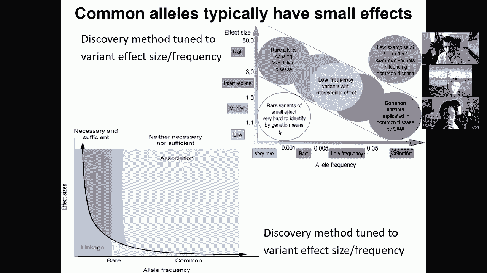
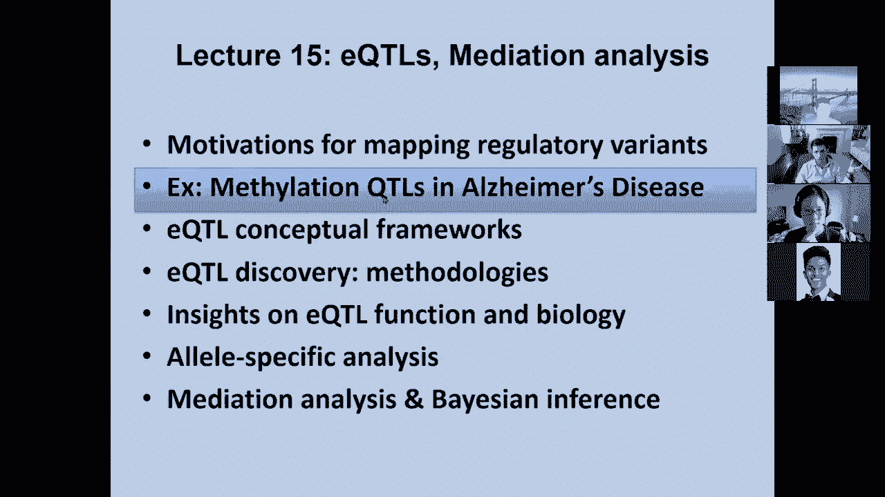
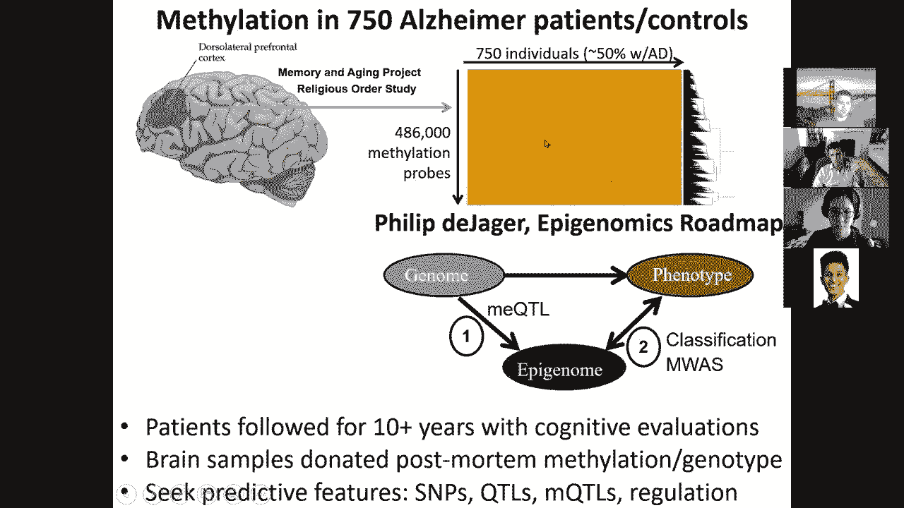
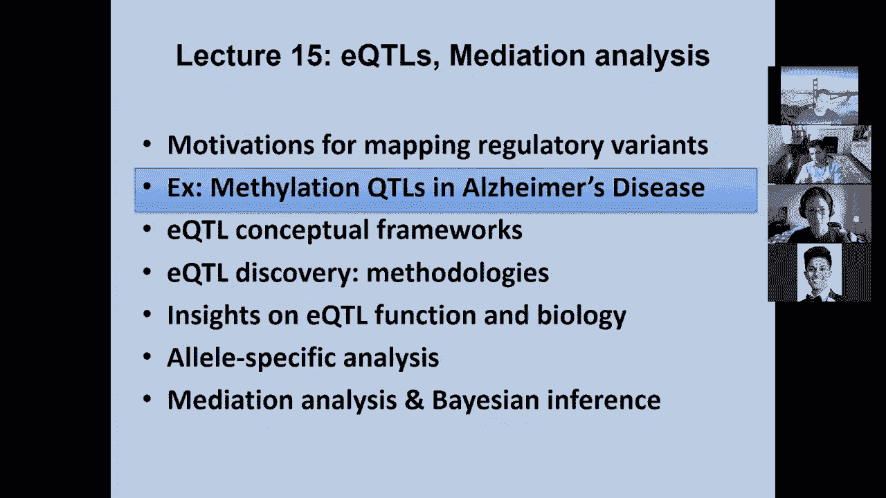
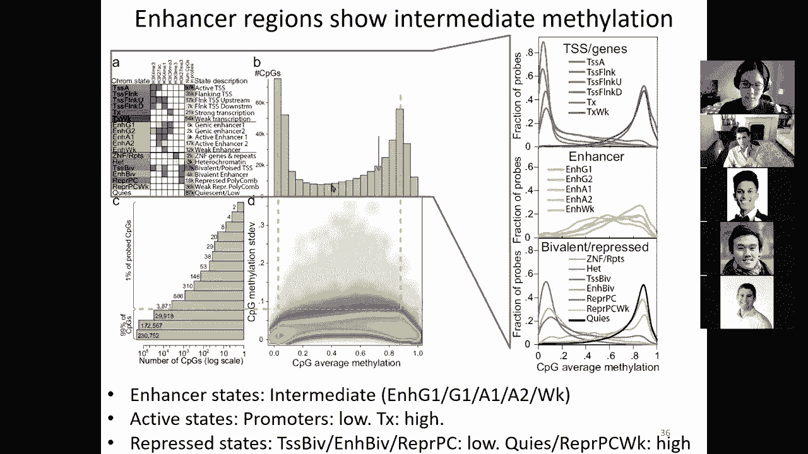
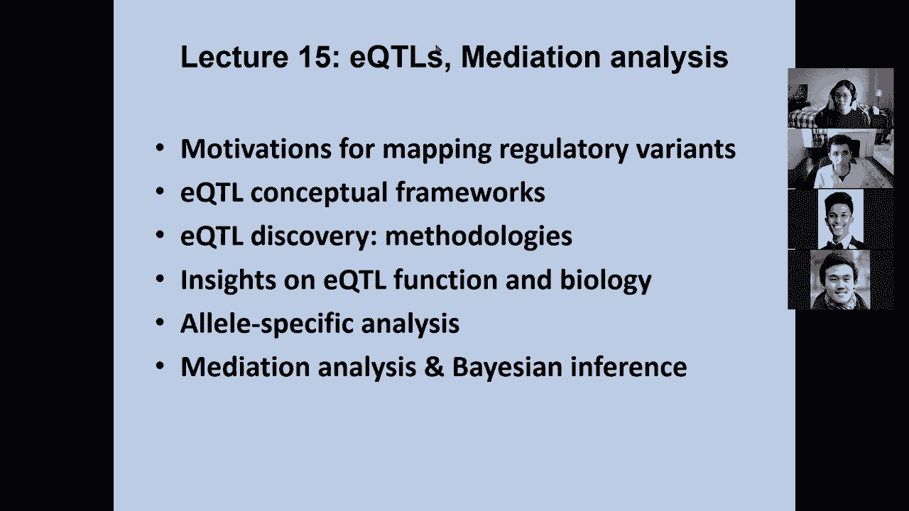

# 15：L15 - eQTLs 表达数量性状位点 🧬

在本节课中，我们将学习表达数量性状位点的概念、动机、方法论及其在疾病研究中的应用。我们将从回顾上一讲内容开始，逐步深入到eQTLs的生物学意义、发现方法以及相关的补充分析技术。

上一讲我们介绍了群体遗传学与疾病作图的基础，包括全基因组关联研究的挑战、连锁不平衡对精细定位的影响，以及利用表观基因组学注释来解析疾病位点功能的方法。本节中，我们将重点探讨分子层面的数量性状，特别是表达数量性状位点。

## 概述：为何研究eQTLs？

数千个遗传位点各自对疾病表型产生微小影响。直接研究这些位点与复杂疾病的关系非常困难，因为单个位点的效应量通常极小。然而，这些遗传变异对中间分子表型（如基因表达水平）的影响可能更强、更易检测。通过研究遗传变异如何影响基因表达，我们可以搭建起连接遗传变异与最终疾病表型的桥梁，从而更有效地发现疾病相关基因和通路。

**核心概念**：eQTL（Expression Quantitative Trait Locus）即表达数量性状位点，指的是一个与基因表达水平这一数量性状相关联的遗传区域。

## 1. eQTLs的动机与概念框架

理解非编码位点的功能回路及其中间表型至关重要。eQTL研究的目标是促进对疾病易感基因的定位，即找到非编码变异的下游靶基因。

基本逻辑是：一个遗传变异影响某个基因的表达水平，而这种表达水平的改变最终导致疾病表型。例如，在之前解析的FTO肥胖相关位点中，风险基因型导致了IRX3和IRX5基因表达的升高，而FTO基因本身的表达并未改变，这提示IRX3和IRX5才是该位点的真正靶基因。

**因果关系方向**：从遗传变异到分子表型（如基因表达、DNA甲基化）的箭头是单向的，因为基因型在个体出生时即已确定。然而，分子表型与疾病表型之间的关联可能是双向的，需要借助特定统计方法（如孟德尔随机化）来推断因果。

## 2. eQTLs的研究案例：阿尔茨海默病中的甲基化QTLs

本节我们通过一个具体案例来了解如何研究分子QTLs。该研究在阿尔茨海默病患者和对照中，检测了大脑多个区域数十万个DNA甲基化位点的水平。

以下是数据处理和发现QTLs的关键步骤：

*   **数据预处理与协变量校正**：首先需要消除对数据有较大影响的全局协变量。这些可能包括实验批次、个体年龄、性别、细胞类型比例等。通过主成分分析等方法识别并校正这些协变量，可以凸显遗传变异的局部效应。
*   **不同染色质状态的甲基化特性**：增强子区域通常呈现中等程度的甲基化水平，并且是变异度最高的染色质状态。相比之下，启动子区域通常低甲基化且变异度很低。
*   **发现甲基化QTLs**：mQTL是指特定CpG位点的甲基化水平与附近基因型之间的关联。研究发现，大多数mQTLs都位于增强子区域，而非启动子区域。
*   **样本量与统计效能**：随着样本量增加，能够发现的QTLs数量增多，可检测到的效应量阈值降低，并且QTLs与靶标之间的距离分布也更广。
*   **等位基因频率的影响**：样本量较小时，只能发现较高频率的变异位点；随着样本量增大，才能发现更多低频变异位点。
*   **与疾病的关联**：研究发现，位于增强子区域的、受遗传控制的甲基化变异，比启动子区域的变异更能预测阿尔茨海默病。这提示增强子可能是遗传变异影响疾病的重要媒介。

## 3. eQTLs的方法学基础

本节我们来看看发现eQTLs的具体方法。基本概念是将基因表达视为数量性状，寻找附近遗传变异与表达水平之间的关联。

**核心分析框架**：通常采用线性回归模型。表达式为：
`表达水平 = β0 + β1 * 基因型 + β2 * 协变量1 + ... + βn * 协变量n + 误差`
我们通过检验回归系数β1是否显著不为零，来判断该遗传位点是否为eQTL。

以下是进行eQTL分析时需要考虑的关键因素：

*   **表达测量与预处理**：使用微阵列或RNA测序技术。需进行标准化，并注意探针可能被SNP干扰的问题。
*   **遗传变异搜索空间**：通常搜索基因转录起始位点上下游一定范围内的变异（如100 kb或1 Mb）。搜索半径影响多重检验负担和统计效能。
*   **协变量校正**：需要校正已知协变量（如年龄、性别、种群结构）以及通过PCA等方法从数据中推断出的未知混杂因素（如批次效应）。
*   **统计效能考量**：基因表达的总体方差、次要等位基因频率阈值等因素都会影响发现eQTL的能力。
*   **参数优化**：可以通过网格搜索等方法，优化MAF阈值、搜索半径、使用的PC数量等参数，以最大化发现的eQTL基因数量。

## 4. eQTLs的生物学洞察

随着研究深入和样本量扩大（如GTEx项目），我们对eQTLs有了更多认识：

*   **普遍性**：eQTLs广泛存在，随着统计效能提升，几乎每个基因都能在某些组织中发现受遗传调控的证据。
*   **位置**：eQTLs通常非常靠近转录起始位点。
*   **组织特异性与共享性**：eQTLs具有一定组织特异性，但大脑不同区域之间、或某些功能相关的组织之间也存在大量共享的eQTLs。
*   **反式eQTLs**：影响转录因子编码基因或其结合亲和力的变异，可以以反式作用方式影响多个靶基因的表达。
*   **助力GWAS发现**：将搜索范围限制在显著的eQTLs区域内，可以大大提高发现疾病相关GWAS位点的能力。

## 5. 等位基因特异性分析：一种补充方法

传统的eQTL分析比较不同个体间的表达差异。等位基因特异性分析则着眼于杂合子个体内部，比较来自父本和母本染色体的等位基因表达比例是否失衡。

这种方法优势在于：
*   它是在同一个体、同一细胞环境下进行比较，消除了个体间混杂因素的影响。
*   可以与传统的eQTL信息结合，进一步提高发现调控变异的统计效能。
*   有助于研究表观等位基因效应，即附近的表观遗传状态如何影响遗传变异的效应。

## 6. 中介分析与贝叶斯方法

最后，我们探讨如何利用中介分析来理解遗传变异影响疾病的路径。核心问题是：一个遗传变异影响疾病，是通过哪些中间表型介导的？

**方法一：基于基因型预测表型**：首先在部分样本中建立遗传变异到中间表型的预测模型，然后利用该模型在全基因组队列中估算每个人的中间表型水平，最后检验估算值与疾病的关联。由于估算值完全由遗传决定，此关联可提示因果方向。

**方法二：基于汇总数据的转录组关联研究**：这是一种更高效的方法。它利用GWAS和eQTL研究的汇总统计数据，通过线性模型的组合，直接推断基因表达对疾病的潜在因果效应，而无需个体层面的基因型数据。

此外，贝叶斯方法在线性回归框架中引入先验分布，有助于：
*   选择相关变量，实现稀疏建模。
*   利用连锁不平衡信息进行精细定位。
*   通过线性混合模型更好地校正种群结构等复杂效应。

## 总结

本节课我们一起学习了表达数量性状位点的核心概念。我们从研究eQTLs的动机出发，回顾了其在解析疾病位点中的应用案例。接着，我们深入探讨了发现eQTLs的方法学框架，包括数据处理、回归模型和参数优化。然后，我们了解了eQTLs的普遍性和生物学特性。最后，我们介绍了两种强大的补充分析技术：等位基因特异性分析可以从个体内部提供调控证据，而中介分析与贝叶斯方法则能帮助我们推断遗传变异影响疾病的因果路径和中间媒介。这些工具共同构成了解析复杂性状遗传架构的强大武器库。