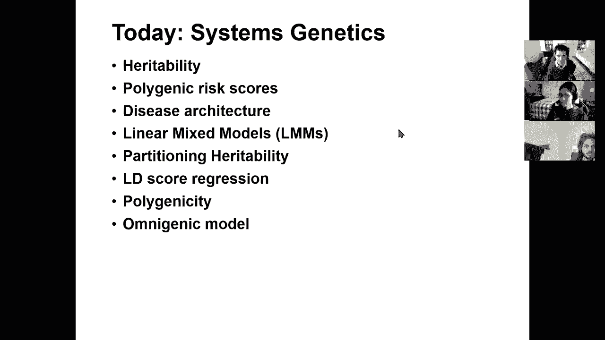

# 16：L16- 系统遗传学与遗传力 🧬

在本节课中，我们将要学习系统遗传学的核心概念，特别是遗传力。我们将探讨如何定义和计算遗传力，如何将表型变异分解为遗传和环境成分，以及如何利用全基因组关联研究（GWAS）数据来估计和划分遗传力。此外，我们还将介绍多基因风险评分、线性混合模型、LD分数回归等关键技术，并探讨复杂性状的遗传结构，包括多基因性和“全基因”模型。

---

## 什么是遗传力？🧬

上一节我们介绍了表型变异与基因型变异的关系。本节中，我们来看看如何量化遗传因素对表型变异的贡献，即遗传力。

我们假设表型（P）是基因型（G）和环境（E）的函数。表型变异（Vp）可以分解为遗传变异（Vg）、环境变异（Ve）以及基因与环境的协方差。为简化模型，我们通常假设基因与环境之间没有交互作用，因此表型变异可以表示为：

**Vp ≈ Vg + Ve**

遗传力（h²）被定义为遗传变异占表型总变异的比例：

**h² = Vg / Vp**

这个比例取决于我们测量表型的精确度。如果测量误差很大，那么归因于环境的变异（Ve）就会增加，从而导致估计的遗传力降低。

---

## 遗传力的划分：狭义与广义

我们讨论了表型变异的总体分解。现在，我们可以进一步将遗传变异（Vg）本身划分为不同的成分。

遗传变异可以进一步分解为：
*   **加性效应（Va）**：多个基因位点效应简单线性相加的贡献。
*   **显性效应（Vd）**：等位基因间非加性互作的贡献。
*   **上位效应（Vi）**：不同基因位点间互作的贡献。

因此，**广义遗传力（H²）** 指的是遗传变异（Vg）占表型总变异的比例，它包含了所有遗传效应：

**H² = Vg / Vp**

而**狭义遗传力（h²）** 则特指加性遗传效应（Va）占表型总变异的比例：

**h² = Va / Vp**

在人类遗传学中，关于加性、显性和互作效应的相对重要性一直存在讨论。

---

## 为什么研究遗传力？🔍

理解了遗传力的定义和划分后，一个自然的问题是：研究遗传力有什么实际意义？

研究遗传力非常重要，原因如下：
*   它允许我们量化遗传与环境对特定性状的相对重要性。
*   它可以揭示性状的**遗传结构**，例如有多少个因果变异、它们的效应大小和等位基因频率分布如何。
*   遗传力是**表型预测**的基础参数，它定义了线性模型理论上最佳的预测性能。
*   在GWAS研究趋于成熟的今天，遗传力帮助我们判断是否已经找到了大部分因果位点，或者是否还存在大量未被发现的微小效应位点。

---

## 从GWAS估计遗传力

我们知道了遗传力的理论定义。那么，如何利用实际的GWAS数据来估计它呢？

在GWAS中，我们估计每个SNP的效应大小（β）。每个SNP所能解释的表型方差取决于其效应大小（β）和次要等位基因频率（MAF, f）：

**方差贡献 ≈ 2 * f * (1 - f) * β²**

将所有SNP的贡献相加，理论上可以得到加性遗传力（h²）的估计值。然而，一个著名的现象是，仅使用达到全基因组显著性水平的SNP所解释的方差，远低于通过双胞胎或家系研究估计的总遗传力。这被称为“**遗传力缺失**”问题。

可能的解释包括：
*   存在成千上万个效应极微小的SNP尚未被GWAS发现。
*   存在未被GWAS标签SNP捕获的稀有变异。
*   存在非加性遗传效应（如显性、互作效应）。

目前的证据更倾向于第一种解释，即存在大量效应微小的SNP共同贡献了“缺失”的遗传力。

---

## 多基因风险评分

既然GWAS发现了许多与性状相关的SNP，我们能否利用它们来预测个体的表型或疾病风险？这就是多基因风险评分的目的。

**多基因风险评分** 是通过累加个体在所有相关SNP位点上的风险等位基因数量（加权以该SNP的效应大小）来计算的一个综合分数：

**PRS = Σ (β_i * G_i)**

其中，β_i 是SNP i的效应大小估计值，G_i 是个体在该SNP位点的基因型剂量（0, 1, 2）。

实际操作中面临挑战：
*   **连锁不平衡**：SNP之间并非独立，直接求和会导致重复计算。
*   **效应估计误差**：对于未达到显著性的SNP，其β估计值噪音很大。

解决方法包括：
*   **SNP剪除**：在高度相关的SNP中只保留一个。
*   **LD调整**：使用主成分分析等方法将SNP空间转换为正交的“特征基因座”空间，以获取独立的效应成分。

研究表明，即使纳入远低于全基因组显著性阈值的SNP，PRS的预测能力仍会持续提升，这进一步支持了复杂性状受大量微小效应SNP影响的模型。

---

## 疾病遗传结构与遗传力划分

多基因风险评分表明许多SNP都有贡献。我们能否更精细地探究遗传力在基因组中的分布？这就需要对遗传力进行划分。

我们可以不计算整个基因组的遗传相关性，而是只针对**特定的SNP子集**（例如特定染色体、特定功能注释区域）来计算。这被称为**遗传力划分**。

例如，按染色体划分遗传力时发现，较长的染色体倾向于解释更多的遗传力，这暗示因果变异在基因组中几乎是均匀分布的，而非集中在少数热点。

更精细的划分可以基于功能注释（如编码区、启动子、增强子）。通过**分层LD分数回归**等方法，我们可以评估不同功能类别对遗传力的贡献。研究发现：
*   与功能相关的区域（如DNA可及性区域、增强子）的遗传力富集程度远高于其基因组占比。
*   与疾病相关的细胞类型中活跃的增强子，其遗传力富集尤为明显。

这种方法仅需GWAS汇总统计数据和一个参考群体的LD矩阵，无需个体基因型数据。

---

## 线性混合模型

为了更准确地估计遗传力并校正样本间的复杂关系，我们需要引入更强大的统计模型：线性混合模型。

标准的线性模型假设样本间独立同分布。然而，在遗传学研究中，样本间可能存在亲缘关系或群体分层，导致假关联。**线性混合模型** 通过引入一个**随机效应**来捕获这些由样本间遗传相似性引起的协方差。

模型可以表示为：

**y = Xβ + u + ε**

其中：
*   y 是表型向量。
*   X 是基因型矩阵。
*   β 是固定效应（SNP效应）。
*   u 是随机效应，服从分布 N(0, σ_g² * K)，K是**亲缘关系矩阵**，衡量个体间的遗传相似性。
*   ε 是残差。

利用**限制性最大似然估计**等方法，我们可以直接估计加性遗传方差σ_g²，而无需估计每个SNP的具体效应β。LMMs能够解释比仅使用显著SNP更多的遗传力，是遗传力估计和校正混淆因素的强大工具。

---

## 多基因性与全基因模型

通过划分遗传力，我们发现许多功能类别在很宽松的P值阈值下仍然富集。这引出了关于性状**多基因性**程度的深刻问题。

对多种疾病的研究表明，与疾病生物学相关的功能注释（如免疫疾病中的免疫增强子，精神疾病中的神经增强子）的富集信号会延伸到成千上万个SNP位点，形成很长的“尾巴”。这意味着有数千个独立的功能性位点集中在相同的通路上。

更令人惊讶的是，几乎所有基因本体论类别在多种疾病的关联基因中都有一定程度的富集。这促使了“**全基因模型**”的提出。该模型认为：
*   存在一个“核心基因”集合，直接与疾病病理相关。
*   存在一个更庞大的“外围基因”集合，它们通过调控网络与核心基因相互作用，间接影响性状。
*   虽然核心基因的富集程度最高，但**大部分遗传力实际上由外围基因贡献**。GWAS早期发现的大多是核心基因，而更大规模的GWAS则不断揭示出外围基因的贡献。

这个模型解释了为什么遗传力如此广泛地分布在基因组中，以及为什么看似不相关的功能类别也会与疾病关联。

---

## 总结 📚

本节课中我们一起学习了系统遗传学的核心——遗传力。我们从定义和计算遗传力开始，探讨了如何将表型变异分解为遗传和环境成分，以及狭义与广义遗传力的区别。我们深入分析了如何从GWAS数据估计遗传力，并探讨了“遗传力缺失”问题。

接着，我们介绍了利用GWAS结果进行**表型预测**的工具——多基因风险评分，以及用于估计和划分遗传力的关键统计模型——**线性混合模型**和**LD分数回归**。这些技术帮助我们理解复杂性状的**遗传结构**，揭示了遗传力在基因组不同功能区域间的分布。

最后，我们探讨了复杂性状的**多基因性**本质，并介绍了最新的“**全基因模型**”。该模型认为，除了直接相关的核心基因外，大量通过调控网络间接作用的外围基因共同贡献了性状的大部分遗传力。这为我们从系统层面理解遗传对复杂性状的影响提供了全新的视角。